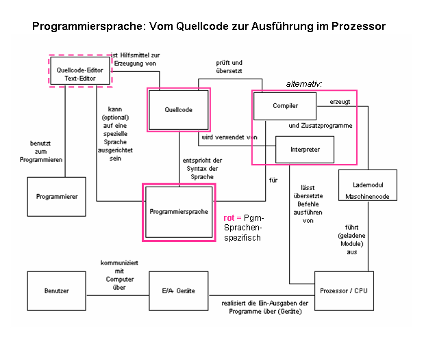

<!--

author:   Sebastian Zug & André Dietrich & Galina Rudolf & Copilot
email:    sebastian.zug@informatik.tu-freiberg.de & andre.dietrich@ovgu.de & Galina.Rudolf@informatik.tu-freiberg.de
version:  1.1.1
language: de
narrator: Deutsch Female

comment: Einführung in die Programmierung für Nicht-Informatiker
logo: ./img/LogoCodeExample.png

import: https://github.com/liascript/CodeRunner
        https://github.com/LiaTemplates/AVR8js/main/README.md#10
        https://raw.githubusercontent.com/TUBAF-IfI-LiaScript/VL_EAVD/master/config.md

-->

[](https://liascript.github.io/course/?https://github.com/TUBAF-IfI-LiaScript/VL_ProzeduraleProgrammierung/blob/master/00_Einfuehrung.md)


# Einführung

| Parameter                 | Kursinformationen                                                                                                                                            |
| ------------------------- | ------------------------------------------------------------------------------------------------------------------------------------------------------------ |
| **Veranstaltung:**        | @config.lecture                                                                                                                                              |
| **Semester**              | @config.semester                                                                                                                                             |
| **Hochschule:**           | `Technische Universität Freiberg`                                                                                                                            |
| **Inhalte:**              | `Vorstellung des Arbeitsprozesses`                                                                                                                           |
| **Link auf Repository: ** | [https://github.com/TUBAF-IfI-LiaScript/VL_EAVD/blob/master/00_Einfuehrung.md](https://github.com/TUBAF-IfI-LiaScript/VL_EAVD/blob/master/00_Einfuehrung.md) |
| **Autoren**               | @author                                                                                                                                                      |


---------------------------------------------------------------------

**Fragen an die heutige Veranstaltung ...**

* Welche Aufgabe erfüllt eine Programmiersprache?
* Erklären Sie die Begriffe Compiler, Editor, Programm, Hochsprache!
* Was passiert beim Kompilieren eines Programmes?
* Warum sind Kommentare von zentraler Bedeutung?
* Worin unterscheiden sich ein konventionelles C++ Programm und eine Anwendung, die mit dem Arduino-Framework geschrieben wurde?

---------------------------------------------------------------------

## Reflexion Ihrer Fragen

                         {{0-1}}
***************************************************************

> Zur Erinnerung ...

<!-- style="width: 40%; display: block; margin-left: auto; margin-right: auto;"-->

> Partizipative Materialentwicklung mit den Informatikern ...

<!-- data-type="none" -->
| Format                   | Informatik Studierende  | Nicht-Informatik Studierende |
|--------------------------|-------------------------|------------------------------|
| Verbesserungsvorschlag   | 0                       | 0                            |
| Fragen                   | 1                       | 0                            |
| generelle Hinweise       | 0                       | 0                            |

***************************************************************

                         {{1-2}}
***************************************************************

> Hat Sie die letztwöchige Vorstellung der Ziele der Lehrveranstaltung überzeugt? 

- [(ja)] Ja, ich gehe davon aus, viel nützliches zu erfahren.
- [(schau'n wir mal)] Ich bin noch nicht sicher. Fragen Sie in einigen Wochen noch mal.
- [(nein)] Nein, ich bin nur hier, weil ich muss.

***************************************************************

## Warum sollten Sie programmieren lernen?

    --{{0}}--
Sie fragen sich vielleicht: "Ich studiere doch gar nicht Informatik - wozu brauche ich das?" Eine berechtigte Frage! Lassen Sie mich Ihnen zeigen, warum Programmierkenntnisse für IHRE Arbeit wertvoll sind.

                           {{0-1}}
********************************************************************************

**Stellen Sie sich folgende Situationen vor:**

* 📊 Sie haben 500 Excel-Dateien mit Messdaten, die Sie alle auswerten müssen
* 🔬 Ihr Experiment muss 1000 mal wiederholt werden - immer mit leicht veränderten Parametern
* 📈 Sie möchten Ihre Versuchsergebnisse professionell visualisieren
* 🤖 Das Experiment soll kontinuierlich Daten erfassen - auch nachts und am Wochenende

> **Frage:** Wie würden Sie diese Aufgaben ohne Programmierung lösen? Wie lange würde das dauern?

********************************************************************************

                           {{1-2}}
********************************************************************************

**Was Programmierung für Sie bedeutet:**

<!-- data-type="none" -->
| Ohne Programmierung                | Mit Programmierung                           |
| ---------------------------------- | -------------------------------------------- |
| 2 Wochen manuelles Kopieren        | 5 Minuten Skript schreiben, dann automatisch |
| Wiederholung = Langeweile + Fehler | Computer macht die Wiederholung fehlerfrei   |
| Begrenzt auf Standard-Tools        | Individuelle Lösungen für Ihre Probleme      |
| Abhängig von anderen               | Selbstständig arbeiten können                |

> **Programmieren ist wie ein Schweizer Taschenmesser für wissenschaftliches Arbeiten!**

> **Programmieren macht einmal arbeit, spart dann aber viel Zeit und Mühe!**

********************************************************************************

--{{1}}--
Viele Aufgaben in Wissenschaft und Technik lassen sich mit ein wenig Programmierkenntnis enorm vereinfachen. Lassen Sie sich nicht abschrecken – Sie müssen kein Profi werden, um große Effekte zu erzielen!

                           {{2-3}}
********************************************************************************

**Das Beste daran:**

* 💪 Sie werden **unabhängiger** in Ihrer wissenschaftlichen Arbeit
* ⚡ Sie **sparen Zeit** bei repetitiven Aufgaben
* 🎯 Sie können **präziser** arbeiten (Computer machen keine Tippfehler)
* 🚀 Sie erschließen sich **neue Möglichkeiten** für Ihre Forschung

> _"Ich kann jetzt in 10 Minuten auswerten, wofür ich früher einen Tag gebraucht habe!"_ - Studentin der Geowissenschaften nach diesem Kurs

********************************************************************************

### Und wie "erkläre" ich dem Computer, was ich will?

    --{{0}}--
Warum können wir Computer nicht einfach in unserer Alltagssprache programmieren? Warum brauchen wir überhaupt Programmiersprachen wie C++ oder Python? Die Antwort liegt in der fundamentalen Funktionsweise von Computern ... und der unterschiedlichen Natur von menschlicher und maschineller Kommunikation.


                        {{0-1}}
********************************************************

**Warum versteht der Computer keine natürliche Sprache?**

> _"Computer, erhöhe bitte die Temperatur etwas!"_

Was bedeutet "etwas"? 1 Grad? 5 Grad? 10 Grad? Und wie schnell? Sofort oder graduell?

********************************************************

                        {{1-2}}
********************************************************

**Das Problem mit natürlicher Sprache:**

* 🤔 **Mehrdeutigkeit**: "Erhöhe etwas" kann vieles bedeuten
* 💭 **Kontext**: "Es ist kalt" → Mensch versteht: "Heizung aufdrehen" | Computer: "???"
* 🎭 **Interpretation**: "Das ist ja toll!" kann Lob oder Sarcasmus sein
* 🌍 **Implizites Wissen**: Wir setzen voraus, dass andere verstehen, was wir meinen.

**Computer hingegen:**

* ⚙️ Verarbeiten **nur exakte Anweisungen** (Nullen und Einsen)
* 🤖 Haben **kein Weltwissen** oder Erfahrung
* 📏 Brauchen **präzise Definitionen** für jeden Schritt
* ❌ Können **nicht raten oder interpretieren**

> **Computer sind wie ein extrem pedantischer Bürokrat, der JEDE Anweisung wörtlich nimmt und nichts zwischen den Zeilen liest!**

********************************************************

                        {{2-3}}
********************************************************

Programme sind daher Anweisungslisten, die vom Menschen erdacht, auf einem Rechner zur
Ausführung kommen. Eine zentrale Hürde ist dabei die Kluft zwischen menschlicher
Vorstellungskraft, die **implizite Annahmen und Erfahrungen** einschließt, und der
**"stupiden" Abarbeitung von Befehlsfolgen** in einem Rechner.


Programmiersprachen sind ein Kompromiss zwischen:

* 👨‍💻 **Menschlicher Lesbarkeit** → Wir können sie (einigermaßen) verstehen
* 🤖 **Maschineller Eindeutigkeit** → Computer können sie exakt ausführen

**Beispiel:**

<!-- data-type="none" -->
| Natürliche Sprache            | Programmiersprache               | Maschinensprache        |
| ----------------------------- | -------------------------------- | ----------------------- |
| "Erhöhe die Temperatur etwas" | `temperature = temperature + 2;` | `01011010 11001001 ...` |
| Mehrdeutig                    | Präzise                          | Für Menschen unlesbar   |
| Flexibel                      | Strukturiert                     | Direkt ausführbar       |

********************************************************

###  Wie arbeitet ein Rechner eigentlich?

      --{{0}}--
Die Intel 4004 war der erste kommerziell erhältliche Mikroprozessor (1971). Er konnte einfache Rechenoperationen ausführen, hatte ein eigenes Steuerwerk, ein Rechenwerk (ALU), Register und einen Speicherzugriff – alles auf einem einzigen Chip. Das nachfolgende Bild zeigt die grundlegenden Komponenten und deren Zusammenspiel: Steuerwerk, Rechenwerk, Register und Busse. Er konnte übrigens nur 4-Bit Zahlen verarbeiten!

                     {{0-1}}
****************************************************

Beispiel: Intel 4004-Architektur (1971)


<!-- style="width: 80%; display: block; margin-left: auto; margin-right: auto;"-->

> Jeder Rechner hat einen spezifischen Satz von Befehlen, die durch "0" und "1" ausgedrückt werden, die er überhaupt abarbeiten kann. Man spricht vom sogenannten _Instruction Set_.

Speicherauszug den Intel 4004:

<!-- data-type="none" -->
| Adresse | Speicherinhalt | OpCode    | Mnemonik | Bedeutung                            |
| :------ | :------------- | :-------- | :------- | ------------------------------------ |
| 0010    | `1101 0101`    | 1101 DDDD | LD $5    | Lade den Wert 5 in die Recheneinheit |
| 0012    | `1111 0010`    | 1111 0010 | IAC      | erhöhe den Wert um 1                 |

****************************************************

   --{{1}}--
Maschinencode lässt sich nicht zwischen verschiedenen Rechnerarchitekturen übertragen. Jede CPU-Familie hat ihr eigenes Instruction Set, das festlegt, welche Befehle sie versteht und wie diese kodiert sind. Ein Programm, das für eine Architektur geschrieben wurde, funktioniert daher nicht automatisch auf einer anderen.

                     {{1-2}}
****************************************************

Möchte man so Programme schreiben?

**Vorteil:** 

+ ggf. sehr effizienter Code (Größe, Ausführungsdauer), der gut auf die Hardware abgestimmt ist

**Nachteile:**

* systemspezifische Realisierung
* geringer Abstraktionsgrad, bereits einfache Konstrukte benötigen viele Codezeilen
* weitgehende semantische Analysen möglich

****************************************************

###  Begrifflichkeiten

Um das Verständnis für diesen Vorgang zu entwickeln werden zunächst die Vorgänge
in einem Rechner bei der Abarbeitung von Programmen beleuchtet, um dann die
Realisierung eines Programmes mit C++ zu adressieren.

<!-- width="60%" -->


| Begriff                | Erklärung                                                                                                       |
| ---------------------- | --------------------------------------------------------------------------------------------------------------- |
| **Compiler**           | Übersetzt den Quellcode (Sourcecode) einer Programmiersprache in Maschinensprache oder eine andere Zielsprache. |
| **Sourcecode**         | Der vom Menschen geschriebene Programmtext in einer Programmiersprache.                                         |
| **Editor**             | Programm zum Schreiben und Bearbeiten von Sourcecode.                                                           |
| **Programmiersprache** | Formale Sprache mit festgelegter Syntax und Semantik, um Computerprogramme zu formulieren.                      |
| **Interpreter**        | Führt den Sourcecode Zeile für Zeile direkt aus, ohne ihn vorher zu übersetzen.                                 |


### Einordnung von C und C++

> **imperative (befehlsorientierte) Programmiersprachen**: Ein Programm
> besteht aus einer Folge von Befehlen an den Computer. Das Programm
> beschreibt den Lösungsweg für ein Problem (C, Python, Java, LabView,
> Matlab, ...).
>
> **deklarative Programiersprachen**: Ein Programm beschreibt die
> allgemeinen Eigenschaften von Objekten und ihre Beziehungen
> untereinander. Das Programm beschreibt zunächst nur das Wissen zur Lösung
> des Problems (Prolog, Haskal, SQL, ...).

**Fakten zu C++:**

- Entwickelt ab 1979 von Bjarne Stroustrup (AT&T Bell Labs)
- Erweiterung von C um objektorientierte Programmierung
- Sehr weit verbreitet in Technik, Wissenschaft, Spieleentwicklung und Embedded Systems
- Kompiliert zu sehr effizientem Maschinencode (hohe Performance)
- Unterstützt prozedurale, objektorientierte und generische Programmierung
- Wird von vielen modernen Compilern (z.B. GCC, Clang, MSVC) unterstützt
- Standardisiert (ISO C++), aktuell C++23/26

## Erstes C++ Programm

--{{0}}--
Keine Angst vor dem ersten Programm! Sie müssen nicht alles sofort verstehen – wichtig ist, dass Sie sehen, wie ein vollständiges Programm aussieht und wie einfach der Einstieg sein kann.


### "Hello World"

```cpp                     HelloWorld.c
// That's my first C program
// Karl Klammer, Oct. 2022

#include <iostream>

int main() {
  std::cout << "Hello World!\n";
  return 0;
}
```
@LIA.eval(`["main.cpp"]`, `g++ main.cpp -o a.out`, `./a.out`)

| Zeile | Bedeutung                                                                                                            |
| :---- | :------------------------------------------------------------------------------------------------------------------- |
| 1 - 2 | Kommentar (wird vom Präprozessor entfernt)                                                                           |
| 4     | Voraussetzung für das Einbinden von Befehlen der Standardbibliothek hier `std:cout` (wird für die Ausgabe gebraucht) |
| 6     | Einsprungstelle für den Beginn des Programmes                                                                        |
| 6 - 9 | Ausführungsblock der `main`-Funktion                                                                                 |
| 7     | Anwendung eines Operators `<<` hier zur Ausgabe auf dem Bildschirm                                                   |
| 8     | Definition eines Rückgabewertes für das Betriebssystem                                                               |

        --{{0-1}}--
Die Arduino-Programme haben eine etwas andere Struktur als konventionelle C++ Programme. Das liegt daran, dass das Arduino-Framework bestimmte Funktionen und Abläufe vorgibt, um die Programmierung von Mikrocontrollern zu erleichtern. Es gibt zwei Hauptfunktionen, die in jedem Arduino-Sketch definiert werden müssen: `setup()` und `loop()` - was die grundsätzlichen Nutzungsmuster wiederspiegelt.

                 {{1-2}}
*********************************************************************

> **Halt!** Unsere C++ Arduino Programme sahen doch ganz anders aus?

<div>
<wokwi-led color="red" pin="13" port="B"></wokwi-led>
</div>

```cpp ArduinoExample.cpp
void setup() {
  pinMode(LED_BUILTIN, OUTPUT);
}

void loop() {
  digitalWrite(LED_BUILTIN, HIGH);
  delay(1000);
  digitalWrite(LED_BUILTIN, LOW);
  delay(1000);
}
```
@AVR8js.sketch

*********************************************************************

                 {{2-3}}
*********************************************************************

> **Noch mal Halt!** Das klappt ja offenbar alles im Browserfenster, aber wenn ich ein Programm auf meinem Rechner kompilieren möchte, was ist dann zu tuen?

*********************************************************************

### Ein Wort zu den Formalien

```cpp                     HelloWorld.cpp
// Karl Klammer
// Print Hello World drei mal

#include <iostream>

int main() {
  int zahl;
  for (zahl=0; zahl<3;  zahl++){
	    std::cout << "Hello World!\n";
  }
	return 0;
}
```
@LIA.eval(`["main.cpp"]`, `g++ main.cpp -o a.out`, `./a.out`)


```cpp                     BadHelloWorld.cpp
#include <iostream>
int main() {int zahl; for (zahl=0; zahl<3;  zahl++){ std::cout << "Hello World!\n";} return 0;}
```
@LIA.eval(`["main.cpp"]`, `g++ main.cpp -o a.out`, `./a.out`)

    {{1}}
* Das *systematische Einrücken* verbessert die Lesbarkeit und senkt damit die
  Fehleranfälligkeit Ihres Codes!
* Wählen sie *selbsterklärende Variablen- und Funktionsnamen*!
* Nutzen Sie ein *Versionsmanagmentsystem*, wenn Sie ihren Code entwickeln!
* Kommentieren Sie Ihr Vorgehen trotz "Good code is self-documenting"

### Gute Kommentare

     --{{0}}--
Kommentare sind für Menschen gedacht, die den Code lesen und verstehen müssen. Sie helfen dabei, den Zweck und die Funktionsweise von Codeabschnitten zu erklären, insbesondere wenn dieser komplex oder nicht sofort verständlich ist. Das bezieht auch Sie selbst mit ein :-)

*1. Kommentare als Pseudocode*

```cpp
/* loop backwards through all elements returned by the server
(they should be processed chronologically)*/
for (i = (numElementsReturned - 1); i >= 0; i--){
    /* process each element's data */
    updatePattern(i, returnedElements[i]);
}
```

*2. Kommentare zur Datei*

```cpp
// This is the mars rover control application
//
// Karl Klammer, Oct. 2018
// Version 109.1.12

int main() {...}
```

*3. Beschreibung eines Algorithmus*

```cpp
/**
 * @brief Computes an approximation of pi.
 *
 * The approximation is calculated using
 * pi/6 = 1/2 + (1/2 x 3/4) 1/5 (1/2)^3  + (1/2 x 3/4 x 5/6) 1/7 (1/2)^5 + …
 *
 * @param n Number of terms in the sum series.
 *
 * @return the approximate valuen of pi OR zero on error
 */
double approx_pi(int n);
```

In realen Projekten werden Sie für diese Aufgaben Dokumentationstools verwenden,
die die Generierung von Webseite, Handbüchern auf der Basis eigener
Schlüsselworte in den Kommentaren unterstützen ->
[doxygen](http://fnch.users.sourceforge.net/doxygen_c.html).

*4. Debugging*

```cpp
int main() {
  ...
  preProcessedData = filter1(rawData);
  // printf('Filter1 finished ... \n');
  // printf('Output %d \n', preProcessedData);
  result=complexCalculation(preProcessedData);
  ...
}
```

### Schlechte Kommentare

     --{{0}}--
Schlechte Kommentare können mehr schaden als nützen. Sie können den Code unübersichtlich machen, falsche Informationen vermitteln oder einfach nur Zeit verschwenden.

*1. Überkommentierung von Code*

```cpp
x = x + 1;  /* increment the value of x */
std::cout << "Hello World!\n"; // displays Hello world
```

> _... over-commenting your code can be as bad as under-commenting it!_

Quelle: [C Code Style Guidelines](https://www.cs.swarthmore.edu/~newhall/unixhelp/c_codestyle.html)

*2. "Merkwürdige Kommentare"*

``` JavaScript
// When I wrote this, only God and I understood what I was doing
// Now, God only knows
```

``` JavaScript
// sometimes I believe compiler ignores all my comments
```

``` JavaScript
// Magic. Do not touch.
```

``` JavaScript
// I am not responsible of this code.

try {

} catch(e) {

} finally {
  // should never happen
}
```

[Sammlung von Kommentaren](https://fuzzzyblog.blogspot.com/2014/09/40-most-funny-code-comments.html)

### Was tun, wenn es schief geht?

     --{{0}}--
Auch erfahrene Programmierer machen Fehler. Das ist normal und gehört zum Lernprozess dazu. Wichtig ist, dass Sie lernen, wie Sie mit Fehlern umgehen und sie beheben können. Gehen Sie systematisch vor und lassen Sie sich nicht entmutigen! Sofern der Compiler Fehlermeldungen ausgibt, sind diese Ihr bester Freund.


```cpp                     ErroneousHelloWorld.cpp
// Karl Klammer
// Print Hello World drei mal

#include <iostream>

int main() {
  for (zahl=0; zahl<3;  zahl++){
	    std::cout << "Hello World! "
  }
	return 0;

```
@LIA.eval(`["main.cpp"]`, `g++ main.cpp -Wall -o a.out`, `./a.out`)

Methodisches Vorgehen:

* ** RUHE BEWAHREN **
* Lesen der Fehlermeldung
* Verstehen der Fehlermeldung / Aufstellen von Hypothesen
* Systematische Evaluation der Thesen
* Seien Sie im Austausch mit anderen (Kommilitonen, Forenbesucher, KI usw.) konkret.

### Compilerfehlermeldungen

**Beispiel 1**

```cpp                     Error.cpp
#include <iostream>

int mani() {
  std::cout << "Hello World!";
  return 0;
}
```
@LIA.evalWithDebug(`["main.cpp"]`, `g++ main.cpp -o a.out`, `./a.out`)

**Beispiel 2**

```cpp                     Error.cpp
#include <iostream>

int main()
  std::cout << "Hello World!";
  return 0;
}
```
@LIA.evalWithDebug(`["main.cpp"]`, `g++ main.cpp -o a.out`, `./a.out`)

> Manchmal muss man sehr genau hinschauen, um zu verstehen, warum ein Programm nicht funktioniert. Versuchen Sie es!

```cpp                     ErroneousHelloWorld.cpp
#include <iostream>

imt main() {
	std::cout << "Hello World!'';
	std::cout << "Wo liegt der Fehler?";
	return 0;
}
```
@LIA.evalWithDebug(`["main.cpp"]`, `g++ main.cpp -o a.out`, `./a.out`)


### Und wenn das Kompilieren gut geht?

     --{{0}}--
Logische Fehler kann der Compiler nicht erkennen. Wenn Ihr Programm also ohne
Fehlermeldungen kompiliert, bedeutet es noch nicht, dass es auch korrekt ist. Vielmehr müssen wir nun durch Testen und Debuggen sicherstellen, dass das Programm das tut, was wir erwarten.

... dann bedeutet es noch immer nicht, dass Ihr Programm wie erwartet
funktioniert.

```cpp                     ErroneousHelloWorld.cpp
#include <iostream>

int main() {
  int a[5] = {1, 2, 3, 4, 5};
  int b[5] = {2, 2, 2, 2, 2};
  int result = 0;

  // Achtung: Der letzte Index (4) wird nicht adressiert!
  for (int i = 0; i < 4; i++) {
    result += a[i] * b[i];
  }

  std::cout << "Skalarprodukt: " << result << std::endl;
  return 0;
}
```
@LIA.eval(`["main.cpp"]`, `g++ main.cpp -o a.out`, `./a.out`)

$$
\vec{a} = \begin{pmatrix} 1 \\ 2 \\ 3 \\ 4 \\ 5 \end{pmatrix}, \quad
\vec{b} = \begin{pmatrix} 2 \\ 2 \\ 2 \\ 2 \\ 2 \end{pmatrix}
$$

// Skalarprodukt korrekt berechnet:
$$
\vec{a} \cdot \vec{b} = 1 \cdot 2 + 2 \cdot 2 + 3 \cdot 2 + 4 \cdot 2 + 5 \cdot 2 = 30
$$
// Fehlerhafte Berechnung (letztes Element fehlt):
$$
\vec{a} \cdot \vec{b} \neq 1 \cdot 2 + 2 \cdot 2 + 3 \cdot 2 + 4 \cdot 2 = 20
$$
// Unsere Schleife hört zu früh auf!

> **Hinweis:** Die Arrays werden wir in einer der kommenden Veranstaltungen im Detail besprechen.

## Warum dann C++?

     --{{0}}--
C++ ist eine weit verbreitete Programmiersprache, die in vielen Bereichen der Softwareentwicklung eingesetzt wird. Sie bietet eine gute Balance zwischen Leistung, Flexibilität und Kontrolle über Systemressourcen. C++ ermöglicht sowohl prozedurale als auch objektorientierte Programmierung, was es Entwicklern erlaubt, komplexe Anwendungen zu erstellen. Python im Unterschied ist eine interpretierte Sprache, die für ihre Einfachheit und Lesbarkeit bekannt ist. Python eignet sich hervorragend für schnelle Prototypenentwicklung, Datenanalyse und wissenschaftliches Rechnen. Es hat eine umfangreiche Standardbibliothek und viele Drittanbieter-Pakete, die die Entwicklung beschleunigen können. Merke, es gibt nicht die "beste" Programmiersprache – die Wahl hängt immer von den spezifischen Anforderungen und Zielen eines Projekts ab.

Zwei Varianten der Umsetzung ... C++ vs. Python

```cpp                     HelloWorld.cpp
#include <iostream>

int main() {
  char zahl;
  for (int zahl=0; zahl<3; zahl++){
    std::cout << "Hello World! " << zahl << "\n";
  }
	return 0;
}
```
@LIA.eval(`["main.cpp"]`, `g++ main.cpp -o a.out`, `./a.out`)

```python
for i in range(3):
  print("Hallo World!", i)
```
@LIA.eval(`["main.py"]`, `python3 -m compileall .`, `python3 main.py`)

## Beispiele der Woche

                      {{0-1}}
********************************************************************************************

**Gültiger C++ Code**

> **Umfrage:** Welche Ausgabe erwarten Sie für folgendes Code-Schnippselchen?

- [(`Hello World5`)] `Hello World7`
- [(`Hello World11`)] `Hello World11`
- [(`Hello World 11!`)] `Hello World 11!`
- [(`Hello World 11 !`)] `Hello World 11 !`
- [(`Hello World 5 !`)] `Hello World 5 !`


```cpp                     Output.cpp
#include <iostream>

int main() {
  int i = 5;
  int j = 4;
  i = i + j + 2;
	std::cout << "Hello World ";
  std::cout << i << "!\n";
	return 0;
}
```
@LIA.eval(`["main.cpp"]`, `g++ main.cpp -o a.out`, `./a.out`)

********************************************************************************************

                      {{1-2}}
********************************************************************************************

**Algorithmisches Denken**

> **Aufgabe:** Ändern Sie den Code so ab, dass das die LED zwei mal mit 1 Hz blinkt und dann ausgeschaltet bleibt.

<div>
<wokwi-led color="red" pin="13" port="B"></wokwi-led>
</div>

```cpp BuggyCode.cpp
void setup() {
  pinMode(LED_BUILTIN, OUTPUT);
}

void loop() {
  digitalWrite(LED_BUILTIN, HIGH);
  delay(1000);
  digitalWrite(LED_BUILTIN, LOW);
  delay(1000);
}
```
@AVR8js.sketch

********************************************************************************************

## Quiz

--{{0}}--
Testen Sie Ihr Wissen! Die folgenden Fragen helfen Ihnen, die wichtigsten Konzepte noch einmal zu reflektieren.

Einbinden von Bibliotheken
=====================================

> Wie müssen Bibliotheken in C++ eingebunden werden?

- [( )] using iostream
- [( )] import iostream
- [(X)] #include \<iostream>

Kommentare 
=====================================

> Sind diese Kommentare angebracht?

```cpp
#include <iostream>                 // I always forget this xD

int main() {                        // main-function
  char zahl;                        // I have homework due tomorrow :(
  for (zahl=250; zahl<256; zahl++){ // I really have no idea what this even does but whatever... LOL
	    std::cout << "Hello World!";  // Prints "Hello World!" in console
  }
	return 0;
}
```

- [( )] Ja
- [(X)] Nein

Konventionen und Formalien
=====================================

> Wählen Sie alle Programme aus, die den üblichen Formalien entsprechen.

```cpp                    1.cpp
#include <iostream>
int main() {int a = 0; std::cout << "Hello World!" << a; return 0;}
```

```cpp                    2.cpp
#include <iostream>

int main() {
  int a = 0;
	std::cout << "Hello World!" << a;
	return 0;
}
```

```cpp                    3.cpp
#include  	                 <iostream>

int main()     {
  int               a      =            0;
	std::cout    <<                  "Hello World!"     <<  a    ;
	return            0           ;
                                                                              }
```

- [[ ]] 1.cpp
- [[X]] 2.cpp
- [[ ]] 3.cpp
