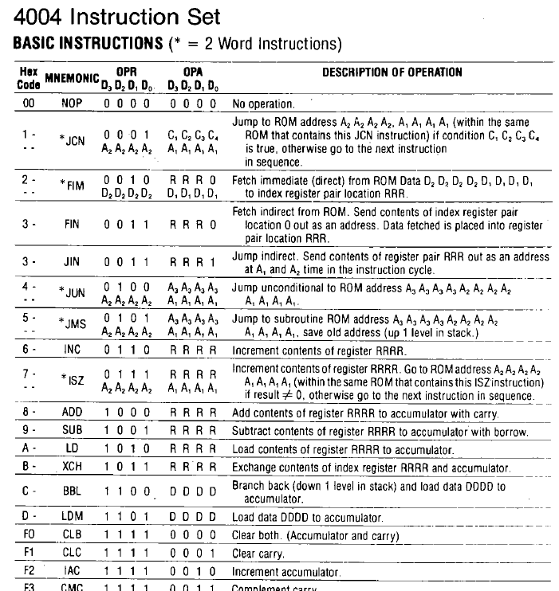
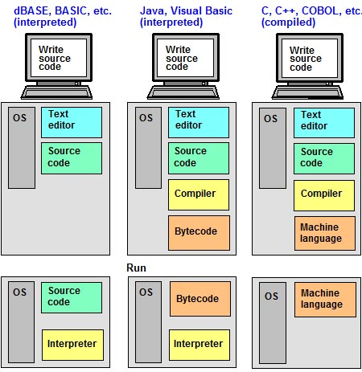
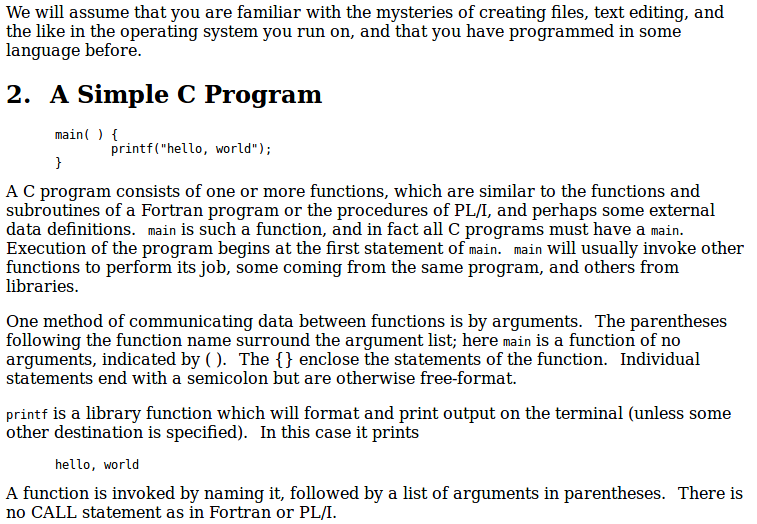
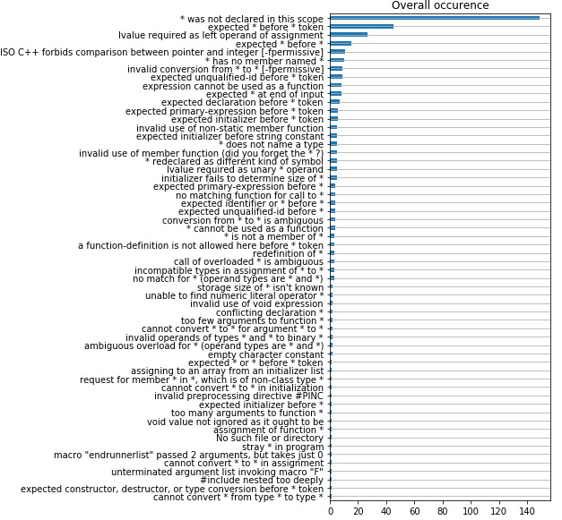
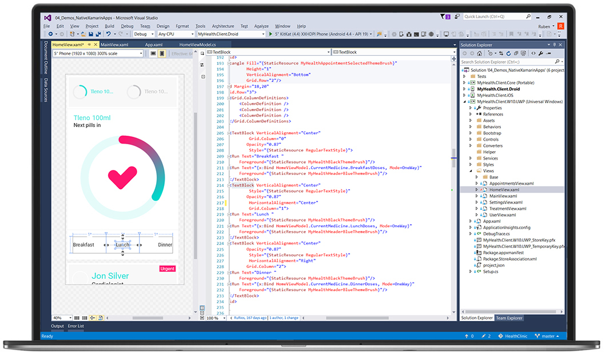
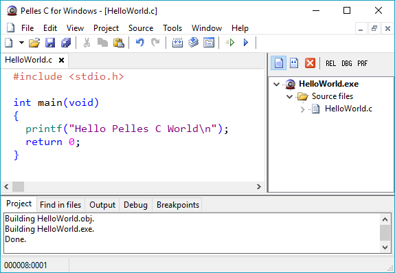

<!--

author:   Sebastian Zug & André Dietrich
email:    zug@ovgu.de   & andre.dietrich@ovgu.de
version:  0.0.1
language: de
narrator: Deutsch Female

comment:  This is a very simple comment.
          Multiline is also okay.

translation: English   translation/english.md

script:   https://felixhao28.github.io/JSCPP/dist/JSCPP.es5.min.js

@JSCPP
<script>
  try {
    var output = "";
    JSCPP.run(`@0`, `@1`, {stdio: {write: s => { output += s.replace(/\n/g, "<br>");}}});
    output;
  } catch (msg) {
    var error = new LiaError(msg, 1);
    var log = msg.match(/(.*)\nline (\d+) \(column (\d+)\):.*\n.*\n(.*)/);
    var info = log[1] + " " + log[4];

    if (info.length > 80)
      info = info.substring(0,76) + "..."

    error.add_detail(0, info, "error", log[2]-1, log[3]);

    throw error;
  }
</script>
@end

-->


# Vorlesung I - Einführung

**Fragen an die heutige Veranstaltung ... **

* Wie wird ein textuelles Programm in einen ausführbaren Code transformiert?
* Was bedeutet der Begriff Hochsprache, was verbirgt ist ein Assembler?
* Woraus ergibt sich die Aktualität der Sprache C?
* Welche Eigenschaften grenzt C von anderen Programmiersprachen ab?
* Welche Aufgabe hat ein Compiler?
* Wordurch definieren sich verschiedene "Geschmacksrichtungen" im Entwicklungsprozess?

## 1. Grundlegendes

Programme sind Anweisungslisten, die vom Menschen erdacht, auf einem Rechner zur
Ausführung kommen. Eine zentrale Hürde ist dabei die Kluft zwischen menschlicher
Vorstellungskraft und Logik, die **implizite Annahmen und Erfahrungen** einschließt
und der **"stupiden" Abarbeitung von Befehlsfolgen** in einem Recher.

Programmiersprachen bemühen sich diese Lücke zu schließen und werden dabei von
einer Vielzahl von Tools begleitet, diesen **Transformationsprozess** unterstützen
sollen.

Um das Verständnis für diesen Vorgang zu entwickeln werden zunächst die Vorgänge
in einem Rechner bei der Abarbeitung von Programmen beleuchtet, um dann die
Realisierung eines Programmes mit C zu adressieren.

<!-- width="100%" -->

[^1]: Programmiervorgang und Begriffe (Quelle: https://commons.wikimedia.org/wiki/File:Programmiersprache_Umfeld.png (Autor VÖRBY))

### Wie arbeitet ein Rechner eigentlich?

Beispiel: Intel 4004 Architektur (1971) [^1]

<!--style="width: 80%"-->

[^1]: Wikipedia Eintrag Intel 4004 (Autor Appaloosa)

### Was heißt das "Maschinensprache"?

Jeder Rechner hat einen spezifischen Satz von Befehlen, die durch "0" und "1"
ausgedrückt werden, die er überhaupt abarbeiten kann.

Speicherauszug den Intel 4004:

    {{0-1}}
| Adresse | Speicherinhalt |
|:--------|:---------------|
| 0010    | 1101 0101      |
| 0012    | 1111 0010      |

    {{1}}
| Adresse | Speicherinhalt | OpCode     | Mneomonik |
|:--------|:---------------|:-----------|:----------|
| 0010    | 1101 0101      | 1101 DDDD  | LD $5     |
| 0012    | 1111 0010      | 1111 0010  | IAC       |

Unterstützung für die Interpretation aus dem Nutzerhandbuch, das das Instruction set beschreibt[^1]:

<!-- width="100%" -->

[^1]: Intel 4004 Assembler (Quelle: http://e4004.szyc.org/asm.html)

### Aber möchte man so umfangreiche Programme schreiben?

Vorteil - ggf. sehr effizienter Code (Größe, Ausführungsdauer), der gut auf die Hardware abgestimmt ist

Nachteile

* systemspezifische Realisierung
* geringer Abstraktionsgrad, bereits einfache Konstrukte benötigen viele Codezeilen
* weitgehende semantische Analysen möglich

Beispiel

<pre>
  <code style="font-family: Monospace">
  Assembler Code                 Fortran

  .START ST                      A:=2;
  ST: MOV R1, #2                 FOR I:=1 TO 20 LOOP
      MOV R2, #1                      A:=A*I;
  M1: CMP R2, #20                END LOOP;
      BGT M2                     PRINT(A);
      MUL R1, R2
      INI R2
      JMP M1
  M2: JSR PRINT
  .END
  </code>
</pre>

    {{1}}
> Eine höhere Programmiersprache ist eine Programmiersprache zur Abfassung eines
> Computerprogramms, die in **Abstraktion und Komplexität** von der Ebene der
> Maschinensprachen deutlich entfernt ist. ... Die Befehle müssen durch
> **Interpreter oder Compiler** in Maschinensprache übersetzt werden.

### Compiliervorgang

> Ein **Compiler** (auch Kompiler; von englisch für zusammentragen bzw. lateinisch
> compilare ‚aufhäufen‘) ist ein Computerprogramm, das Quellcodes einer bestimmten
> Programmiersprache in eine Form übersetzt, die von einem Computer (direkter)
> ausgeführt werden kann.

Stufen des Compile-Vorganges[^1]:

<!-- width="80%" -->

[^1]: Abbildung Stufen der Compilierung (Quelle: https://medium.com/@vietkieutie/what-happens-when-you-type-gcc-main-c-2a136896ade3)

## 2. Warum also C?

**Warum gibt es nicht eine höhere Programmiersprache, die für alle Anwendungen gleichermaßen herangezogen werden kann?**

+ unterschiedliche Plattformen (Betriebssystem, Rechnerarchitektur)

    *Windows Laptop vs. Steuergerät vs. Grafikkarte*
+ unterschiedliche Anwendungen

    *Website vs. PKW Spurerkennung vs. Datenbankabfrage*
+ unterschiedliche Randbedingungen

    *Echtzeitfähigkeit, Sicherheitsanforderungen*

**Und wie finde ich die Sprache die für mein Problem geeignet ist?**

+ Analyse der Anforderungen
+ Analyse der Fähigkeiten einzelner Sprachen
+ Analyse der Features möglicher Bibliotheken oder Frameworks
+ Analyse des Einarbeitungsaufwandes
+ (Kosten für die Tool-Chain)

[https://www.heise.de/ct/ausgabe/2015-18-Die-passende-Programmiersprache-finden-2767703.html](https://www.heise.de/ct/ausgabe/2015-18-Die-passende-Programmiersprache-finden-2767703.html)

### Relevanz von C im vergleich mit anderen Programiersprachen

Relevanz laut Tiobe Index (Oktober 2018)

<!-- width="80%" -->

TIOBE Index (Quelle: https://www.informatik-aktuell.de/aktuelle-meldungen/2018/juli/ranking-der-programmiersprachen-java-wieder-ganz-vorne.html)


### Heutige Anwendung

* Eingebettete Systeme -> Siehe Beispiel
* Programmierung von Betriebssystemen
* Anwendungsentwicklung -> Java Virtual Maschine (JVM)

<!-- width="70%" -->

Quelle: Alan Freedman, Irma Morrison [https://www.computerlanguage.com/results.php?definition=interpreter](https://www.computerlanguage.com/results.php?definition=interpreter)


### Historische Einordnung

Zielrichtung ... Entwicklung eines Betriebssystems in den *AT&T Bell Laboratories* Anfang 1970

<!-- width="40%" --> [Ken Thompson](https://de.wikipedia.org/wiki/Ken_Thompson) und [Dennis Ritchie](https://de.wikipedia.org/wiki/Dennis_Ritchie) [^2]

<!-- width="40%" --> [Brian_Kernighan](https://de.wikipedia.org/wiki/Brian_Kernighan) [^3]

[^2]: Foto Thompson und Ritchie (Quelle: http://www.catb.org/~esr/jargon/html/U/Unix.html)

[^2]: Foto Kernighan (Quelle: http://www.catb.org/~esr/jargon/html/U/Unix.html)

| Version    | Spezifikation                                    |
|:-----------|:-------------------------------------------------|
| K&R C      | Definition über das Buch "The C Programming Language"|
| ANSI C (C89) | Standard des American National Standards Institute (ANSI)  |
| C99        |  Übernahme von Features aus C++, Erweiterung Standardbibliothek, Ergänzung Präprozessor Makros  |
| C11        |   "                                                 |
| C18        |   "                                                |

Die Veranstaltung baut auf dem C11 (ISO/IEC 9899:2011) Standard auf.

```cpp
#if defined(__STDC_VERSION__) && __STDC_VERSION__ >= 201112L
 // C11 kompatibler Quellcode.
#endif
```

### Eigenschaften von C

* Adressiert Hochsprachenaspekte und Hardwarenähe -> Hohe Geschwindigkeit bei geringer Programmgröße

* Imperative Programmiersprache
{{1}}
> + **imperative (befehlsorientierte) Programmiersprachen** : Ein Programm besteht aus einer Folge von Befehlen an den Computer. Das Programm beschreibt den Lösungsweg für ein Problem (C, Python, Java, LabView, Matlab, ...).
+ **deklarative Programiersprachen** : Ein Programm beschreibt die allgemeinen Eigenschaften von Objekten und  ihre Beziehungen untereinander. Das Programm beschreibt    zunächst nur das Wissen zur Lösung des Problems (Prolog, Haskal, SQL, ...).


* Wenige Schlüsselwörter als Sprachumfang
{{2}}
> **Schlüsselwort** Reserviertes Wort, das der Compiler verwendet, um ein Programm zu parsen (z.B. if, def oder while). Schlüsselwörter dürfen nicht als Name für eine Variable gewählt werden

* Große Mächtigkeit
{{3}}
> Je höher und komfortabler die Sprache, desto mehr ist der Programmierer daran gebunden, die in ihr vorgesehenen Wege zu beschreiten.

## 3. Erstes C Programm

<!-- width="90%" --> [Brian_Kernighan, Programming in C:  A Tutorial  1974](http://www.lysator.liu.se/c/bwk-tutor.html#simple-c)

### "Hello World"

```cpp                     smallestCProgram.c
int main() {   // <- Öffnende Klammer eines Blockes
	return 0;    // <- Befehl endet mit Semikolon
}              // <- Schließende Klammer eines Blockes
```
@JSCPP(@input, )


```cpp                     HelloWorld.c
// That's my first c program
// Karl Klammer, Oct. 2018

#include<stdio.h>

int main() {     // alternativ "int main(void)"
	printf("Hello World");
	return 0;
}
```
@JSCPP(@input, )

| Zeile | Bedeutung |
|:------|:---------------|
| 1 - 2 | Kommentar (wird vom Präprozessor entfernt) |
| 4     | Voraussetzung für das Einbinden von Befehlen der Standardbibliothek hier printf()       |
| 6     | Einsprungstelle für den Beginn des Programmes |
| 6 - 9 | Ausführungsblock der main-Funktion         |
| 7     | Anwendung einer Funktion ... name(Parameterliste) ... hier zur Ausgabe auf dem Bildschirm|
| 8     | Definition eines Rückgabewertes für das Betriebssystem|


### Ein Wort zu den Formalien

```cpp                     HelloWorld.c
// Karl Klammer
// Print Hello World drei mal

#include<stdio.h>

int main() {
  int zahl;
  for (zahl=0; zahl<3;  zahl++){
	    printf("Hello World! ");
  }
	return 0;
}
```
@JSCPP(@input, )

```cpp                     BadHelloWorld.c
#include<stdio.h> int main() {int zahl; for (zahl=0; zahl<3;  zahl++){
printf("Hello World!"); } return 0;}
```
@JSCPP(@input, )
{{1}}
* Das *systematische Einrücken* verbessert die Lesbarkeit und senkt damit die Fehleranfälligkeit Ihres Codes!
* Wählen sie *selbsterklärende Variablen- und Funktionsnamen*!
* Nutzen Sie ein *Versionsmanagmentsystem*, wenn Sie ihren Code entwickeln!
* Kommentieren Sie Ihr Vorgehen trotz "Good code is self-documenting."

### Gute Kommentare

*1. Kommentare als Pseudocode*

```cpp
/* loop backwards through all elements returned by the server
(they should be processed chronologically)*/
for (i = (numElementsReturned - 1); i >= 0; i--){
    /* process each element's data */
    updatePattern(i, returnedElements[i]);
}
```

*2. Kommentare zur Datei*

```cpp
// This is the mars rover control application
//
// Karl Klammer, Oct. 2018
// Version 109.1.12

int main(){...}
```

*3. Beschreibung eines Algorithmus*

```cpp
/* Function:  approx_pi
 * --------------------
 * computes an approximation of pi using:
 *    pi/6 = 1/2 + (1/2 x 3/4) 1/5 (1/2)^3  + (1/2 x 3/4 x 5/6) 1/7 (1/2)^5 +
 *
 *  n: number of terms in the series to sum
 *
 *  returns: the approximate value of pi obtained by suming the first n terms
 *           in the above series
 *           returns zero on error (if n is non-positive)
 */

 double approx_pi(int n);
```

In realen Projekten werden Sie für diese Aufgaben Dokumentationstools verwenden,
die die Generierung von Webseite, Handbüchern auf der Basis eigener
Schlüsselworte in den Kommentaren unterstützen ->
[doxygen](http://fnch.users.sourceforge.net/doxygen_c.html).

*4. Debugging*

```cpp
int main(){
  ...
  preProcessedData = filter1(rawData);
  // printf('Filter1 finished ... \n');
  // printf('Output %d \n', preProcessedData);
  result=complexCalculation(preProcessedData);
  ...
}
```

### Schlechte Kommentare

*1. Überkommentierung von Code*

```cpp
x = x + 1;  /* increment the value of x */
printf("Hello World\\n"); // displays Hello world
```
"... over-commenting your code can be as bad as under-commenting it"[^1]

[^1]: C Code Style Guidelines (Quelle: https://www.cs.swarthmore.edu/~newhall/unixhelp/c_codestyle.html)

*2. "Merkwürdige Kommentare"*

```cpp
//When I wrote this, only God and I understood what I was doing
//Now, God only knows

// sometimes I believe compiler ignores all my comments

// Magic. Do not touch.

// I am not responsible of this code.

try {

}
finally { // should never happen }

```
[Sammlung von Kommentaren](https://fuzzzyblog.blogspot.com/2014/09/40-most-funny-code-comments.html)

### Was tuen, wenn es schief geht?

```cpp                     ErroneousHelloWorld.c
#include<stdio.h>

int main() {
  for (zahl=0; zahl<3;  zahl++){
	    printf("Hello World ! ")
  }
	return 0;
}
```
@JSCPP(@input, )

Methodisches Vorgehen:
* ** RUHE BEWAHREN **
* Lesen der Fehlermeldung
* Verstehen der Fehlermeldung / Aufstellen von Hypothesen
* Systematische Evaluation der Thesen
* Seien Sie im Austausch mit anderen (Kommilitonen, Forenbesucher, usw.) konkret.

### Compilermessages

**Beispiel 1**

```cpp                     Error.c
#include<stdio.h>

int main() {
    printf("Hello World")
    return 0;
}
```

<pre>
  <code style="font-family: Monospace">
  ▶ gcc errors.c
  errors.c: In function ‘main’:
  errors.c:8:5: error: expected ‘;’ before ‘return’
       return 0;
  </code>
</pre>

**Beispiel 2**

```cpp                     Error.c
#include<stdio.h>

int main()
    printf("Hello World");
    return 0;
}
```

<pre>
  <code style="font-family: Monospace">
  ▶ gcc errors.c
  errors.c: In function ‘main’:
  errors.c:4:5: error: expected declaration specifiers before ‘printf’
       printf("Hello World");
       ^
  errors.c:5:5: error: expected declaration specifiers before ‘return’
       return 0;
       ^
  errors.c:6:1: error: expected declaration specifiers before ‘}’ token
   }
   ^
  errors.c:6:1: error: expected ‘{’ at end of input
  </code>
</pre>

ABER ...

<!-- width="90%" -->

Übersicht zu Compilernachrichten und Interpretationshilfe unter
[http://aop.cs.cornell.edu/errors/index.html](http://aop.cs.cornell.edu/errors/index.html)


### Und wenn das Kompilieren gut geht?

... dann bedeutet es noch immer nicht, dass Ihr Programm wie erwartet funktioniert.

```cpp                     ErroneousHelloWorld.c
#include<stdio.h>

int main() {
  char zahl;
  for (zahl=250; zahl<256;  zahl++){
	    printf("Hello World !");
  }
	return 0;
}
```
@JSCPP(@input, )

## 4. Werkzeuge

**Vim oder Eclipse?**

*In the end, you want something that's going to make you the most productive. Whether that's Notepad or Vim or Sublime or something else is up to the user and the tasks required at the time.* [Forenbeitrag]

<!-- width="90%" -->

>  Eine integrierte Entwicklungsumgebung (Abkürzung IDE, von englisch integrated development environment) ist eine Sammlung von Computerprogrammen, mit denen die Aufgaben der Softwareentwicklung möglichst ohne Medienbrüche bearbeitet werden können.

### Arbeitsumgebung

* Arbeiten mit der LiaScript-Umgebung
* Online-Compiler und Ausführungsumgebungen für C

     https://www.onlinegdb.com/online_c_compiler
     https://www.learn-c.org/en/Welcome

* Lokale Tool-Chain auf dem eigenen Rechner (Pelles C)

<!-- width="90%" -->


## Ausblick

```cpp                     GoodBy.c
#include<stdio.h>

int main() {
  printf("... bis zum nächsten mal!");
	return 0;
}
```
@JSCPP(@input, )
