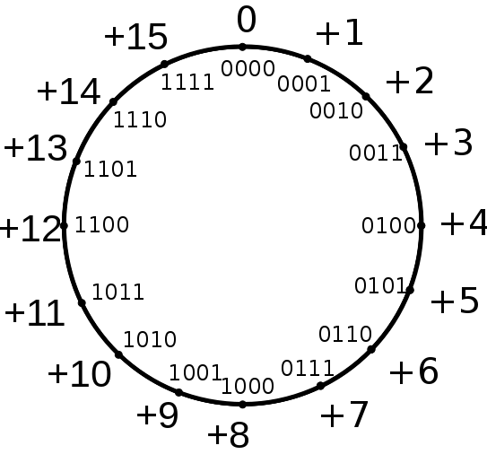

<!--

author:   Sebastian Zug & André Dietrich & Galina Rudolf & Copilot & Ebby & Anna
email:    sebastian.zug@informatik.tu-freiberg.de & andre.dietrich@ovgu.de & Galina.Rudolf@informatik.tu-freiberg.de
version:  1.0.6
language: de
narrator: Deutsch Female

comment: Einführung in die Programmierung für Nicht-Informatiker
logo: ./img/LogoCodeExample.png

import: https://github.com/liascript/CodeRunner
        https://raw.githubusercontent.com/TUBAF-IfI-LiaScript/VL_EAVD/master/config.md

link:     style.css

-->

[](https://liascript.github.io/course/?https://github.com/TUBAF-IfI-LiaScript/VL_ProzeduraleProgrammierung/blob/master/01_EingabeAusgabeDatentypen.md)

# Grundlagen der Sprache C++

| Parameter                 | Kursinformationen                                                                                                                                                                      |
| ------------------------- | -------------------------------------------------------------------------------------------------------------------------------------------------------------------------------------- |
| **Veranstaltung:**        | @config.lecture                                                                                                                                                                        |
| **Semester**              | @config.semester                                                                                                                                                                       |
| **Hochschule:**           | `Technische Universität Freiberg`                                                                                                                                                      |
| **Inhalte:**              | `Ein- und Ausgabe / Variablen`                                                                                                                                                         |
| **Link auf Repository: ** | [https://github.com/TUBAF-IfI-LiaScript/VL_EAVD/blob/master/01_EingabeAusgabeDatentypen.md](https://github.com/TUBAF-IfI-LiaScript/VL_EAVD/blob/master/01_EingabeAusgabeDatentypen.md) |
| **Autoren**               | @author                                                                                                                                                                                |


---------------------------------------------------------------------

**Fragen an die heutige Veranstaltung ...**

* Durch welche Parameter ist eine Variable definiert?
* Erklären Sie die Begriffe Deklaration, Definition und Initialisierung im
  Hinblick auf eine Variable!
* Worin unterscheidet sich die Zahldarstellung von ganzen Zahlen (`int`) von den
  Gleitkommazahlen (`float`).
* Welche Datentypen kennt die Sprache C++?
* Erläutern Sie für `char` und `int` welche maximalen und minimalen Zahlenwerte
  sich damit angeben lassen.
* Ist `printf` ein Schlüsselwort der Programmiersprache C++?
* Welche Beschränkung hat `getchar`

---------------------------------------------------------------------

## Reflexion Ihrer Fragen / Rückmeldungen


                         {{0-1}}
***************************************************************

> Zur Erinnerung ... Wettstreit zur partizipativen Materialentwicklung mit den Informatikern ...

<section class="flex-container">

<!-- class="flex-child" style="min-width: 250px;" -->


<div class="flex-child" style="min-width: 250px;">

<!-- data-type="none" -->
| Format                   | Informatik Studierende  | Nicht-Informatik Studierende |
|--------------------------|-------------------------|------------------------------|
| Verbesserungsvorschlag   | 0                       | 0                            |
| Fragen                   | 1                       | 0                            |
| generelle Hinweise       | 0                       | 0                            |

</div>

</section>

***************************************************************

                         {{1-2}}
***************************************************************

> Gab es Schwierigkeiten beim Anlauf der Übungen?

***************************************************************

## Variablen

                                    {{0-1}}
******************************************************************

> **Vorwarnung:** Man kann Variablen nicht ohne Ausgaben und Ausgaben nicht ohne
>Variablen erklären. Deshalb wird im folgenden immer wieder auf einzelne Aspekte
> vorgegriffen. Nach der Vorlesung sollte sich dann aber ein Gesamtbild ergeben.

Lassen sie uns den Rechner als Rechner benutzen ... und die Lösungen einer quadratischen Gleichung bestimmen:

$$
y=3x^2 + 4x + 8
$$

```cpp                     QuadraticEquation.cpp
#include <iostream>

int main() {
  // Variante 1 - ganz schlecht
  std::cout << "f(" << 5 << ") = " << 3 * 5 * 5 + 4 * 5 + 8 << "\n";

  // Variante 2 - Nutzung von Variablen
  int x = 5;
  std::cout << "f(" << x << ") = " << 3 * x * x + 4 * x + 8 << "\n";
  return 0;
}
```
@LIA.eval(`["main.cpp"]`, `g++ -Wall main.cpp -o a.out`, `./a.out`)

__Unbefriedigende Lösung, jede neue Berechnung muss in den Source-Code integriert und dieser dann kompiliert werden. Ein Taschenrechner wäre die bessere Lösung!__

******************************************************************

                                    {{1-2}}
******************************************************************

Ein Programm manipuliert Daten, die in Variablen organisiert werden.

> Eine Variable ist ein **abstrakter Behälter** für Inhalte, welche im Verlauf eines Rechenprozesses benutzt werden. Im Normalfall wird eine Variable im Quelltext durch einen Namen bezeichnet, der die Adresse im Speicher repräsentiert. Alle Variablen müssen vor Gebrauch vereinbart werden.

Kennzeichen einer Variable:

1. Name (Bezeichner)
2. Datentyp (wie `int`, `float`, etc.)
3. Wert (der gespeicherte Inhalt)
4. Adresse (Position im Speicher)
5. Gültigkeitsraum (Scope)
6. Attribute/Qualifizierer (wie `const`, `volatile`, etc.)

Die ersten fünf Kennzeichen definieren die grundlegende Struktur einer Variable, während die Attribute zusätzliche Eigenschaften und Verhaltensweisen festlegen.

******************************************************************

                                  {{2}}
******************************************************************

Betrachten wir die verschiedenen Kennzeichen am Beispiel der mathematischen Konstante `e`:

```cpp                     VariableAnatomy.cpp
#include <iostream>

int main() {
  // Attribut
  // |    Datentyp
  // |    |    Name  
  // |    |    |        
  // v    v    v     Wert
  const double e = 2.71828182845905;  // Die Eulersche Zahl

  std::cout << "Der Wert von e lautet " << e << "\n";
  std::cout << "Die Adresse von e lautet " << &e << "\n";
  
  return 0;
}
```
@LIA.eval(`["main.cpp"]`, `g++ -Wall main.cpp -o a.out`, `./a.out`)

Dieses Beispiel demonstriert alle sechs Kennzeichen einer Variable:

* Jede Variable braucht einen **Namen** als Bezeichner
* Der **Datentyp** bestimmt die Interpretation der Bits im Speicher
* Der aktuelle **Wert** wird im Speicher abgelegt
* Die **Adresse** zeigt die Position im Speicher (variiert bei jedem Programmlauf)
* Der **Gültigkeitsraum** definiert, wo auf die Variable zugegriffen werden kann
* **Attribute** wie `const` legen zusätzliche Eigenschaften fest

******************************************************************

### Zulässige Variablennamen

Der Name kann Zeichen, Ziffern und den Unterstrich enthalten. Dabei ist zu
beachten:

* Das erste Zeichen muss ein Buchstabe sein, der Unterstrich ist auch möglich.
* C++ betrachte Groß- und Kleinschreibung - `Zahl` und `zahl` sind also
  unterschiedliche Variablennamen.
* [Schlüsselworte](https://en.cppreference.com/w/cpp/keywords.html) (`class`, `for`, `return`, etc.) sind als Namen unzulässig.

| Name            | Zulässigkeit                                   |
|:----------------|:-----------------------------------------------|
| `gcc`           | erlaubt                                        |
| `a234a_xwd3`    | erlaubt                                        |
| `speed_m_per_s` | erlaubt                                        |
| `double`        | nicht zulässig (Schlüsselwort)                 |
| `robot.speed`   | nicht zulässig (`.` im Namen)                  |
| `3thName`       | nicht zulässig (Ziffer als erstes Zeichen)     |
| `x y`           | nicht zulässig (Leerzeichen im Variablennamen) |

> Vergeben Sie die Variablennamen mit Sorgfalt. Für jemanden der Ihren Code liest, sind diese wichtige Informationsquellen!
> [Link](https://wiki.c2.com/?BadVariableNames)

                                  {{1}}
******************************************************************

Neben der Namensgebung selbst unterstützt auch eine entsprechende [Notationen](https://en.wikipedia.org/wiki/Naming_convention_(programming%29#Examples_of_multiple-word_identifier_formats) die Lesbarkeit. In Programmen sollte ein Format konsistent verwendet werden.

| Bezeichnung            | denkbare Variablennamen                            |
|:-----------------------|:---------------------------------------------------|
| CamelCase (upperCamel) | `YouLikeCamelCase`, `HumanDetectionSuccessfull`    |
| (lowerCamel)           | `youLikeCamelCase`, `humanDetectionSuccessfull`    |
| underscores            | `I_hate_Camel_Case`, `human_detection_successfull` |

In der Vergangenheit wurden die Konventionen (zum Beispiel durch Microsoft "Ungarische Notation") verpflichtend durchgesetzt. Heute dienen eher die generellen Richtlinien des Clean Code in Bezug auf die Namensgebung.

******************************************************************

### Datentypen

Welche Informationen lassen sich mit Blick auf einen Speicherauszug im Hinblick
auf die Daten extrahieren?

{{0-1}}
<!-- data-type="none" style="table-layout: fixed; max-width:300px;"-->
| Adresse | Speicherinhalt |
|         | binär          |
| 0010    | 0000 1100      |
| 0011    | 1111 1101      |
| 0012    | 0001 0000      |
| 0013    | 1000 0000      |

{{1-2}}
<!-- data-type="none" style="table-layout: fixed; max-width:450px;"-->
| Adresse | Speicherinhalt | Zahlenwert |
|         |                |  (Byte)    |
| 0010    | 0000 1100      | 12         |
| 0011    | 1111 1101      | 253 (-3)   |
| 0012    | 0001 0000      | 16         |
| 0013    | 1000 0000      | 128 (-128) |

{{2}}
<!-- data-type="none" style="table-layout: fixed; max-width:750px;"-->
| Adresse | Speicherinhalt | Zahlenwert | Zahlenwert | Zahlenwert   |
|         |                |  (Byte)    | (2 Byte)   | (4 Byte)     |
| 0010    | 0000 1100      | 12         |            |              |
| 0011    | 1111 1101      | 253 (-3)   | 3325       |              |
| 0012    | 0001 0000      | 16         |            |              |
| 0013    | 1000 0000      | 128 (-128) | 4224       | 217911424    |


{{3}}
Der dargestellte Speicherauszug kann aber auch eine Kommazahl (Floating Point)
umfassen und repräsentiert dann den Wert `3.8990753E-31`

{{4}}
Folglich bedarf es eines expliziten Wissens um den Charakter der Zahl, um eine
korrekte Interpretation zu ermöglichen. Dabei erfolgt die Einteilung nach:

{{4}}
* Wertebereichen (größte und kleinste Zahl)
* ggf. vorzeichenbehaftet Zahlen
* ggf. gebrochene Werte

#### Ganze Zahlen, `char` und `bool`

Ganzzahlen sind Zahlen ohne Nachkommastellen mit und ohne Vorzeichen. In C/C++ gibt
es folgende Typen für Ganzzahlen:

<!-- data-type="none" -->
| Schlüsselwort   | Benutzung                     | Mindestgröße       |
|:----------------|:------------------------------|:-------------------|
| `char`          | 1 Byte bzw. 1 Zeichen         | 1 Byte (min/max)   |
| `short int`     | Ganzahl (ggf. mit Vorzeichen) | 2 Byte             |
| `int`           | Ganzahl (ggf. mit Vorzeichen) | "natürliche Größe" |
| `long int`      | Ganzahl (ggf. mit Vorzeichen) |                    |
| `long long int` | Ganzahl (ggf. mit Vorzeichen) |                    |
| `bool`          | boolsche Variable             | 1 Byte             |

``` cpp
signed char <= short <= int <= long <= long long
```

Die Wertebereiche hängen von der Architektur ab. Hier ein Vergleich zwischen einem 8-Bit Mikrocontroller (z.B. Arduino) und einem modernen PC (64-Bit):

<!-- data-type="none" -->
| Datentyp        | 8-Bit Mikrocontroller      | Moderner PC (64-Bit)                | Anmerkung                 |
| :-------------- | :------------------------- | :---------------------------------- | :------------------------ |
| `char`          | -128 bis 127 oder          | -128 bis 127 oder                   | Vorzeichen ist            |
|                 | 0 bis 255                  | 0 bis 255                           | systemabhängig!           |
| `signed char`   | -128 bis 127               | -128 bis 127                        | Immer 1 Byte              |
| `unsigned char` | 0 bis 255                  | 0 bis 255                           | Immer 1 Byte              |
| `short`         | -32768 bis 32767           | -32768 bis 32767                    | Immer 2 Byte              |
| `int`           | -32768 bis 32767  (2 Byte) | -2147483648 bis 2147483647 (4 Byte) | Unterschied! 2 vs. 4 Byte |

> 💡 **Wichtig:** Der Datentyp `int` passt sich der "natürlichen Wortgröße" der Architektur an:
> * Auf 8-Bit/16-Bit Systemen: 2 Byte
> * Auf 32-Bit/64-Bit Systemen: 4 Byte
>
> Dies ist einer der Gründe, warum Programme nicht immer 1:1 zwischen verschiedenen Systemen übertragbar sind!

Wenn die Typenspezifikationen (`long` oder `short`) vorhanden sind kann auf die
`int` Typangabe verzichtet werden.

```cpp
short int a; // entspricht short a;
long int b;  // äquivalent zu long b;
```

Standardmäßig wird von vorzeichenbehafteten Zahlenwerten ausgegangen. Somit wird
das Schlüsselwort `signed` eigentlich nicht benötigt.

```cpp
int a;  //  signed int a;
unsigned long long int b;
```

#### Sonderfall `char` - Ein Typ, zwei Gesichter

Der Datentyp `char` ist ein interessanter Sonderfall: Er kann sowohl für einzelne Zeichen (Buchstaben, Symbole) als auch für kleine Zahlen verwendet werden. Das macht ihn vielseitig, aber manchmal auch verwirrend.

> **Achtung:** Anders als bei einigen anderen Programmiersprachen unterscheidet
> C/C++ zwischen den verschiedenen Anführungsstrichen.

```cpp                     CharExample.cpp
#include <iostream>

int main() {
    // 1. char als Zeichen
    char buchstabe = 'M';         // Speichert das Zeichen 'M'
    char symbol = '*';            // Speichert ein Symbol
    char ziffer = '5';            // Speichert die Ziffer '5' (nicht die Zahl 5!)
    
    // 2. char als kleine Zahl
    char zahlenwert = 77;         // Speichert die Zahl 77
    
    // 3. Vorsicht bei char als Zahl ohne Vorzeichen-Spezifikation
    char zahl = 200;                       // Achtung: Implementierungsabhängig !!!
    signed char sicher_negativ = 200;      // Wird definitiv als -56 interpretiert
    unsigned char sicher_positiv = 200;    // Wird definitiv als 200 interpretiert
    
    std::cout << zahlenwert << " als Zeichen: " << zahlenwert << "\n";
    std::cout << "'" << zahlenwert << "' als Zahl: " << (int)zahlenwert << "\n";

    return 0;
}
```
@LIA.eval(`["main.cpp"]`, `g++ -Wall main.cpp -o a.out`, `./a.out`)

Was passiert hier?

1. Ein `char` speichert intern immer eine Zahl (0 bis 255 oder -128 bis 127)
2. Bei der Ausgabe wird diese Zahl entweder:

   * als Zeichen interpretiert (normale Ausgabe)
   * als Zahl angezeigt (mit `(int)` Umwandlung)

3. Eingabe kann erfolgen durch:

   * Zeichen in Anführungszeichen: `'A'`, `'+'`, `'5'`
   * Direkte Zahlenwerte: `65` (= 'A'), `43` (= '+'), `53` (= '5')

> 💡 **Tipp:** Die ASCII-Tabelle zeigt, welche Zahl welchem Zeichen entspricht.
> Zum Beispiel ist 'A' = 65, 'a' = 97, '0' = 48

<!-- data-type="none" -->
| Dezimal | Binär     | Symbol | Bedeutung/Beispiel   |
| :------ | :-------- | :----- | :------------------- |
| 32      | 0010 0000 | `␣`    | Leerzeichen          |
| 48      | 0011 0000 | `0`    | Ziffer Null          |
| 65      | 0100 0001 | `A`    | Großbuchstabe A      |
| 77      | 0100 1101 | `M`    | Großbuchstabe M      |
| 97      | 0110 0001 | `a`    | Kleinbuchstabe a     |
| 10      | 0000 1010 | `\n`   | Neue Zeile (newline) |
| 9       | 0000 1001 | `\t`   | Tabulator            |
| 42      | 0010 1010 | `*`    | Sternchen            |
| 33      | 0010 0001 | `!`    | Ausrufezeichen       |
| 63      | 0011 1111 | `?`    | Fragezeichen         |

> 💡 Die ASCII-Tabelle ist clever aufgebaut:
> * Ziffern liegen fortlaufend von 48 (‚0') bis 57 (‚9')
> * Großbuchstaben liegen fortlaufend von 65 (‚A') bis 90 (‚Z')
> * Kleinbuchstaben liegen fortlaufend von 97 (‚a') bis 122 (‚z')
> * Die Differenz zwischen Groß- und Kleinbuchstaben ist immer 32!

```cpp                     BoolExample.cpp
#include <iostream>

int main() {
  char sign_1 = 'T';  // =  1001101 (ASCII Zeichensatz)
  char sign_2 = 85;   // =  1010101
  char sign_3 = '\n';  // Neue Zeile

  std::cout << sign_1 << sign_2 << " FREIBERG" << sign_3;

  return 0;
}
```
@LIA.eval(`["main.c"]`, `g++ -Wall main.c -o a.out`, `./a.out`)

> **Achtung**: Die Kodierung von Zeichen ist nicht auf ASCII beschränkt. Es gibt auch andere Zeichencodierungen wie UTF-8, die eine größere Anzahl von Zeichen unterstützen.

#### Sonderfall `bool`
Auf die Variablen von Datentyp `bool` können Werte `true` (1) und `false` (0)
gespeichert werden. Eine implizite Umwandlung der ganzen Zahlen zu den Werten 0 und 1 ist ebenfalls möglich.

```cpp                     BoolExample.cpp
#include <iostream>

int main() {
  bool a = true;
  bool b = false;
  bool c = 45;      // ungleich 0 -> true

  // Numerische Ausgabe (Standard)
  std::cout << "Numerische Darstellung:\n";
  std::cout << "a = " << a << ", b = " << b << ", c = " << c << "\n\n";
  
  // Textuelle Ausgabe mit boolalpha
  std::cout << std::boolalpha;
  std::cout << "Textuelle Darstellung (mit boolalpha):\n";
  std::cout << "a = " << a << ", b = " << b << ", c = " << c << "\n";

  return 0;
}
```
@LIA.eval(`["main.c"]`, `g++ -Wall main.c -o a.out`, `./a.out`)

Sinnvoll sind boolsche Variablen insbesondere im Kontext von logischen
Ausdrücken. Diese werden zum späteren Zeitpunkt eingeführt.

> `boolalpha` ermöglicht die textuelle Ausgabe von booleschen Werten als "true" oder "false".

#### Architekturspezifische Ausprägung (Integer Datentypen)

Der Operator `sizeof` gibt Auskunft über die Größe eines Datentyps oder einer
Variablen in Byte.

```cpp                     sizeof.cpp
#include <iostream>

int main(void) {
  int x;
  std::cout << "x umfasst " << sizeof(x) << " Byte.\n";
  return 0;
}
```
@LIA.eval(`["main.cpp"]`, `g++ -Wall main.cpp -o a.out`, `./a.out`)


```cpp                     sizeof_example.c
#include <iostream>
#include <limits.h>   /* INT_MIN und INT_MAX */

int main(void) {
  std::cout << "int size: " << sizeof(int) << " Byte\n";
  std::cout << "Wertebereich von " << INT_MIN << " bis " << INT_MAX << "\n";
  std::cout << "char size : " << sizeof(char) << " Byte\n";
  std::cout << "Wertebereich von " << CHAR_MIN << " bis " << CHAR_MAX << "\n";
  return 0;
}
```
@LIA.eval(`["main.cpp"]`, `g++ -Wall main.cpp -o a.out`, `./a.out`)


{{1}}
Die implementierungspezifische Werte, wie die Grenzen des Wertebereichs der
ganzzahlinen Datentypen sind in `limits.h` definiert, z.B.

{{1}}
<!-- data-type="none" style="table-layout: fixed; max-width:600px;"-->
| Makro    | Wert                 |
|:---------|:---------------------|
| CHAR_MIN | -128                 |
| CHAR_MAX | +127                 |
| SHRT_MIN | -32768               |
| SHRT_MAX | +32767               |
| INT_MIN  | -2147483648          |
| INT_MAX  | +2147483647          |
| LONG_MIN | -9223372036854775808 |
| LONG_MAX | +9223372036854775807 |

> Warum muss ich soetwas wissen? 

#### Was passiert bei der Überschreitung des Wertebereiches

                        {{0-1}}
******************************************************************


> Der Arithmetische Überlauf (Integer Overflow) tritt auf, wenn das Ergebnis einer Berechnung den gültigen Zahlenbereich eines Datentyps überschreitet.

<section class="flex-container">

<!-- class="flex-child" style="min-width: 250px;" -->


<!-- class="flex-child" style="min-width: 250px;"-->


</section>

Quelle: [Arithmetischer Überlauf (Autor: WissensDürster)](https://de.wikipedia.org/wiki/Arithmetischer_%C3%9Cberlauf#/media/File:4Bi-2Komplement.svg)

> 💡 _Das ist wie bei einem Kilometerzähler: Wenn man rückwärts fährt und bei 0 ist, springt er auf 99999._

******************************************************************

                        {{1-2}}
******************************************************************

Ein berühmtes Beispiel dafür ist der "Nuclear Gandhi"-Bug aus dem Spiel Civilization:

```cpp                     GandhiBitwise.cpp
#include <iostream>
#include <bitset>

int main() {
    unsigned char aggression = 1;
    
    std::cout << "Gandhis Startwert (1):\n";
    std::cout << "Bits:  " << std::bitset<8>(aggression) << "\n";
    std::cout << "Wert:  " << (int)aggression << "\n\n";
    
    // Wenn eine Zivilisation die Demokratie einführte, sank der Wert um 2
    std::cout << "Demokratie wird eingeführt (-2 Aggression)...\n";
    aggression = aggression - 2;

    // Bei 1 - 2 passiert folgendes auf Bitebene:
    //   00000001    (1)
    // - 00000010    (2)
    // = 11111111    (255, weil unsigned! sonst -1)
    
    std::cout << "Nach Demokratie (1-2):\n";
    std::cout << "Bits:  " << std::bitset<8>(aggression) << "\n";
    std::cout << "Wert:  " << (int)aggression << "\n";
    
    return 0;
}
```
@LIA.eval(`["main.cpp"]`, `g++ -Wall main.cpp -o a.out`, `./a.out`)

Die Erklärung auf Bit-Ebene:

* Ein `unsigned char` verwendet 8 Bits (1 Byte)
* Der Wert 1 wird als `00000001` gespeichert
* Bei der Subtraktion von 2 (`00000010`) würde theoretisch -1 entstehen
* Da es aber keine negativen Zahlen bei `unsigned` gibt, "springt" der Wert auf `11111111`
* `11111111` entspricht dem Wert 255 (höchstmöglicher 8-Bit Wert)

Resultat: Der friedlichste Anführer wurde zum nuklear bewaffneten Kriegstreiber! 😅

Solche Überläufe können in der Praxis zu schwerwiegenden Problemen führen:

* Fehlerhafte Berechnungen
* Sicherheitslücken
* Unerwartetes Programmverhalten

******************************************************************

#### Fließkommazahlen

                        {{0-1}}
******************************************************************

Fließkommazahlen sind Zahlen mit Nachkommastellen (reelle Zahlen).
Im Gegensatz zu Ganzzahlen gibt es bei den Fließkommazahlen keinen Unterschied
zwischen vorzeichenbehafteten und vorzeichenlosen Zahlen. In C/C++ sind immer
alle Fließkommazahlen vorzeichenbehaftet.

In C/C++ gibt es zur Darstellung reeller Zahlen folgende Typen:

<!-- data-type="none" style="table-layout: fixed; max-width:500px;"-->
| Schlüsselwort | Mindestgröße            |
|:--------------|:------------------------|
| `float`       | 4 Byte                  |
| `double`      | 8 Byte                  |
| `long double` | je nach Implementierung |

```
float <= double <=  long double
```

Gleitpunktzahlen werden halb logarithmisch dargestellt. Die Darstellung basiert
auf die Zerlegung in drei Teile: ein Vorzeichen, eine Mantisse und einen
Exponenten zur Basis 2.

Zur Darstellung von Fließkommazahlen sagt der C/C++-Standard nichts aus. Zur
konkreten Realisierung ist die Headerdatei `float.h` auszuwerten.

<!-- data-type="none" style="table-layout: fixed; max-width:800px;"-->
|                        | `float`           | `double`                 |
|:-----------------------|:------------------|--------------------------|
| kleinste positive Zahl | 1.1754943508e-38  | 2.2250738585072014E-308  |
| Wertebereich           | ±3.4028234664e+38 | ±1.7976931348623157E+308 |


******************************************************************

                        {{1-2}}
******************************************************************

> Seien Sie vorsichtig beim Vermischen unterschiedlicher Fließkommatypen (`float` und `double`), da dies zu unerwarteten Ergebnissen führen kann.

{{1}}
```cpp                     float_precision.cpp
#include <iostream>
#include<float.h>

int main(void) {
  std::cout << "float Genauigkeit  :" << FLT_DIG << " \n";
  std::cout << "double Genauigkeit :" << DBL_DIG << " \n";
  float x = 0.1;
  if (x == 0.1) {   // <- das ist ein double "0.1"
  //if (x == 0.1f) {   // <- das ist ein float "0.1"
    std::cout << "Gleich\n";
  }else{
    std::cout << "Ungleich\n";
  }
  return 0;
}
```
@LIA.eval(`["main.cpp"]`, `g++ -Wall main.cpp -o a.out`, `./a.out`)


******************************************************************

                        {{2-3}}
******************************************************************

> **Achtung:** Fließkommazahlen bringen einen weiteren Faktor mit
>  - die Unsicherheit

Potenzen von 2 (zum Beispiel $2^{-3}=0.125$) können im Unterschied zu `0.1`
präzise im Speicher abgebildet werden. Können Sie das erklären?

Hier ein Beispiel, das die Ungenauigkeit bei der Darstellung von 0.1 zeigt:

```cpp                     FloatPrecision.cpp
#include <iostream>
#include <iomanip>

int main() {
    float sum = 0.0f;
    
    // Addiere zehnmal 0.1
    std::cout << std::fixed << std::setprecision(20);
    std::cout << "Erwartete Werte vs. tatsächliche Werte:\n\n";
    
    for(int i = 1; i <= 10; i++) {
        sum += 0.1f;      
    }
    
    // Vergleich mit 1.0 zeigt das Problem
    std::cout << "Ist:      " << sum << "\n\n";
   
    return 0;
}
```
@LIA.eval(`["main.cpp"]`, `g++ -Wall main.cpp -o a.out`, `./a.out`)

Der Grund dafür ist, dass 0.1 im Binärsystem eine unendliche Folge ist:
$0.1_{10} = 0.00011001100110011..._2$

Diese Zahl kann nicht exakt in einem `float` oder `double` gespeichert werden, während Zweierpotenzen wie 0.125 ($0.001_2$) eine endliche Darstellung haben. Probieren Sie es im obigen Beispiel aus, indem Sie 0.125 anstelle von 0.1 verwenden.

******************************************************************

#### Datentyp `void`

`void` wird als „unvollständiger Typ“ bezeichnet,
umfasst eine leere Wertemenge und wird überall dort verwendet, wo kein
Wert vorhanden oder benötigt wird.

Anwendungsbeispiele:

* Rückgabewert einer Funktion
* Parameter einer Funktion
* anonymer Zeigertyp `void*`

```cpp
int main(void) {
  //Anweisungen
  return 0;
}
```

```cpp
void funktion(void) {
  //Anweisungen
}
```

### Wertspezifikation

In C++ gibt es verschiedene Möglichkeiten, Zahlen zu schreiben. Hier sind die wichtigsten Schreibweisen für __dezimale__ Zahlen, die Sie kennen sollten:

1. **Normale Ganzzahlen:**

   ```cpp
   int a = 42;        // Positive Ganzzahl
   int b = -42;       // Negative Ganzzahl
   int c = 011;       // !!! Oktale Schreibweise (entspricht 9 im Dezimalsystem)
   ```

2. **Kommazahlen:**

   ```cpp
   double d1 = 3.14;      // Normale Schreibweise
   double d2 = 0.234;     // Mit führender Null
   double d3 = 123.0e-2;  // Wissenschaftliche Notation (= 1.23)
   float  f1 = 1.23f;     // Als float (durch 'f' am Ende)
   ```

3. **Große Zahlen lesbarer machen:**

   ```cpp
   // Seit C++14: Zifferngruppierung mit Unterstrich
   int million = 1'000'000;  // Besser lesbar als 1000000
   ```

> **Merke:** Die Endung `f` bei Kommazahlen ist wichtig! Ohne sie interpretiert 
> C++ die Zahl als `double`, was zu Genauigkeitsverlusten führen kann.

Ein praktisches Beispiel:

```cpp                     NumberFormats.cpp
#include <iostream>

int main() {
    // Gängige Schreibweisen für verschiedene Anwendungen
    double preis = 19.99;              // Preisangabe
    float  temp = 36.5f;               // Temperatur
    int    anzahl = 1'000'000;         // Große Zahl
    double mikro = 0.000001;           // Sehr kleine Zahl
    double mikro2 = 1.0e-6;            // Gleicher Wert, andere Schreibweise
    
    std::cout << "Preis: " << preis << " EUR\n";
    std::cout << "Temperatur: " << temp << " °C\n";
    std::cout << "Anzahl: " << anzahl << "\n";
    std::cout << "Mikrometer: " << mikro << " m\n";
    std::cout << "Wissenschaftlich: " << mikro2 << " m\n";
    
    return 0;
}
```
@LIA.eval(`["main.cpp"]`, `g++ -Wall main.cpp -o a.out`, `./a.out`)

### Adressen

> **Merke:** Einige Anweisungen in C/C++ verwenden Adressen von
> Variablen.

Jeder Variable in C++ wird eine bestimmten Position im Hauptspeicher
zugeordnet. Diese Position nennt man Speicheradresse. Solange eine Variable
gültig ist, bleibt sie an dieser Stelle im Speicher. Um einen Zugriff auf die
Adresse einer Variablen zu erlangen, kann man den Operator `&` nutzen.

```cpp                     Pointer.cpp
#include <iostream>

int main(void) {
  int x = 020;
  std::cout << &x << "\n";
  return 0;
}
```
@LIA.eval(`["main.cpp"]`, `g++ -Wall main.cpp -o a.out`, `./a.out`)

> **Hinweis:** Die Ausgabe der Adresse erfolgt in der Regel im Hexadezimalformat.
> Mit Adressen werden wir uns im Zusammenhang mit Arrays und Zeigern intensiv beschäftigen.

### Sichtbarkeit und Lebensdauer von Variablen

**Lokale Variablen**

Variablen *leben* innerhalb einer Funktion, einer Schleife oder einfach nur
innerhalb eines durch geschwungene Klammern begrenzten Blocks von Anweisungen
von der Stelle ihrer Definition bis zum Ende des Blocks.
Beachten Sie, dass die Variable vor der ersten Benutzung vereinbart werden muss.

Wird eine Variable/Konstante z. B. im Kopf einer Schleife vereinbart, gehört sie
zu dem Block, in dem auch der Code der Schleife steht.
Folgender Codeausschnitt soll das verdeutlichen:

```cpp                           visibility.cpp
#include <iostream>

int main(void) {
  int v = 1;
  int w = 5;
  {
    int v;
    v = 2;
    std::cout << v << "\n";
    std::cout << w << "\n";
  }
  std::cout << v << "\n";
  return 0;
}
```
@LIA.eval(`["main.cpp"]`, `g++ -Wall main.cpp -o a.out`, `./a.out`)

**Globale Variablen**

Muss eine Variable immer innerhalb von `main` definiert werden? Nein, allerdings
sollten globale Variablen vermieden werden.

```cpp                           visibility.cpp
#include <iostream>

int v = 1; /*globale Variable*/

int main(void) {
  //int v = 5;
  std::cout << v << "\n";
  std::cout << ::v << "\n"; // Zugriff auf die globale Variable
  return 0;
}
```
@LIA.eval(`["main.cpp"]`, `g++ -Wall main.cpp -o a.out`, `./a.out`)

Sichtbarkeit und Lebensdauer spielen beim Definieren neuer Funktionen eine
wesentliche Rolle und werden in einer weiteren Vorlesung in diesem
Zusammenhang nochmals behandelt.

### Definition vs. Deklaration vs. Initialisierung

... oder andere Frage, wie kommen Name, Datentyp, Adresse usw. zusammen?

> Deklaration ist nur die Vergabe eines Namens und eines Typs für die Variable.
> Definition ist die Reservierung des Speicherplatzes. Initialisierung ist die
> Zuweisung eines ersten Wertes.


> **Merke:** Jede Definition ist gleichzeitig eine Deklaration aber nicht
> umgekehrt!

```cpp                     DeclarationVSDefinition.cpp
extern int a;      // Deklaration
int i;             // Definition + Deklaration
int a,b,c;
int i = 5;         // Definition + Deklaration + Initialisierung
```

Das Schlüsselwort `extern` in obigem Beispiel besagt, dass die Definition der
Variablen `a` irgendwo in einem anderen Modul des Programms liegt. So deklariert
man Variablen, die später beim Binden (Linken) aufgelöst werden. Da in diesem
Fall kein Speicherplatz reserviert wurde, handelt es sich um keine Definition.

### Typische Fehler

**Fehlende Initialisierung**

```cpp                     MissingInitialisation.cpp
#include <iostream>

int main(void) {
  int x = 5;
  std::cout << "x=" << x << "\n";
  int y;     // <- Fehlende Initialisierung
  std::cout << "y=" << y << "\n";
  return 0;
}
```
@LIA.evalWithDebug(`["main.cpp"]`, `g++ -Wall main.cpp -o a.out`, `./a.out`)

{{1}}
**Redeklaration**

{{1}}
```cpp                     Redeclaration.cpp
#include <iostream>

int main(void) {
  int x;
  int x;
  return 0;
}
```
@LIA.eval(`["main.cpp"]`, `g++ -Wall main.cpp -o a.out`, `./a.out`)


{{2}}
**Falsche Zahlenliterale**

{{2}}
```cpp                     wrong_float.cpp
#include <iostream>

int main(void) {
  float a = 1,5;   /* FALSCH  */
  float b = 1.5;   /* RICHTIG */
  return 0;
}
```
@LIA.eval(`["main.cpp"]`, `g++ -Wall main.cpp -o a.out`, `./a.out`)


{{3}}
**Was passiert wenn der Wert zu groß ist?**

{{3}}
```cpp                     TooLarge.cpp
#include <iostream>

int main(void) {
  short a;
  // 65535 ist die größte Zahl, die in 2 Byte passt
  a = 65535 + 2;
  std::cout << "Schaun wir mal ... " << a << "\n";
  return 0;
}
```
@LIA.evalWithDebug(`["main.cpp"]`, `g++ -Wall main.cpp -o a.out`, `./a.out`)

## Ein- und Ausgabe

Ausgabefunktionen wurden bisher genutzt, um den Status unserer Programme zu
dokumentieren. Nun soll dieser Mechanismus systematisiert und erweitert werden.

<!--
style=" width: 100%;
        max-width: 600px;
        min-width: 400px;
        display: block;
        margin-left: auto;
        margin-right: auto;"
-->
Quelle: [EVA-Prinzip (Autor:  Deadlyhappen)](https://de.wikipedia.org/wiki/EVA-Prinzip#/media/File:EVA-Prinzip.svg)

Für Ein- und Ausgabe stellt C++ das Konzept der Streams bereit, dass nicht nur
für elementare Datentypen gilt, sondern auch auf die neu definierten Datentypen
(Klassen) erweitert werden kann. Unter einem Stream wird eine Folge von Bytes verstanden.

Als Standard werden verwendet:

+ `std::cin` für die Standardeingabe (Tastatur),
+ `std::cout` für die Standardausgabe (Console) und
+ `std::cerr` für die Standardfehlerausgabe (Console)

> **Achtung:** Das `std::` ist ein zusätzlicher Indikator für eine bestimmte Implementierung, ein sogenannter Namespace. Um sicherzustellen, dass eine spezifische Funktion, Datentyp etc. genutzt wird stellt man diese Bezeichnung dem verwendenten Element zuvor. Mit `using namespace std;` kann man die permanente Nennung umgehen.

Stream-Objekte  werden durch
`#include <iostream>`
bekannt gegeben. Definiert werden sie als Komponente der Standard Template Library (STL) im Namensraum `std`.

Mit Namensräumen können Deklarationen und Definitionen unter einem Namen zusammengefasst und gegen andere Namen abgegrenzt werden.

```cpp   iostream.cpp
#include <iostream>

int main(void) {
  char hanna[] = "Hanna";
  char anna[] = "Anna";
  std::cout << "C++ stream: " << "Hallo "<< hanna << ", " << anna << "\n";
  return 0;
}
```
@LIA.evalWithDebug(`["main.cpp"]`, `g++ -Wall main.cpp -o a.out`, `./a.out`)

### Ausgabe

Der Ausgabeoperator ` << ` formt automatisch die Werte der Variablen in die Textdarstellung der benötigten Weite um.
Der Rückgabewert des Operators ist selbst ein Stream-Objekt (Referenz), so dass ein weiterer Ausgabeoperator darauf angewendet werden kann. Damit ist die Hintereinanderschaltung
von Ausgabeoperatoren möglich.

```cpp
std::cout << 55 << "55" << 55.5 << true << "\n";
```

Welche Formatierungmöglichkeiten bietet der Ausgabeoperator noch?

Mit Hilfe von in `<iomanip>` definierten [Manipulatoren](https://en.cppreference.com/w/cpp/io/manip.html) können besondere Ausgabeformatierungen erreicht werden.

| Manipulator           | Bedeutung                                                     |
| :-------------------- | :------------------------------------------------------------ |
| `setbase(int B)`      | Basis 8, 10 oder 16 definieren                                |
| `setfill(char c)`     | Füllzeichen festlegen                                         |
| `setprecision(int n)` | Flieskommaprezession                                          |
| `setw(int w)`         | Breite setzen                                                 |
| `std::fixed`          | Dezimaldarstellung (ohne wissenschaftliches Format) erzwingen |


```cpp        manipulatoren1.c
#include <iostream>
#include <iomanip>

int main() {
  std::cout << std::setbase(16) << std::fixed << 55 << "\n";
  std::cout << std::setbase(10) << std::fixed << 55 << "\n";
  return 0;
}
```
@LIA.eval(`["main.cpp"]`, `g++ -Wall main.cpp -o a.out`, `./a.out`)

> **Achtung:** Die Manipulatoren wirken auf alle daruf folgenden Ausgaben.

#### Feldbreite

Die Feldbreite definiert die Anzahl der nutzbaren Zeichen, sofern diese nicht
einen größeren Platz beanspruchen.

Der Manipulator `right` sorgt im Beispiel für eine rechtsbündige Ausrichtung der Ausgabe,
wegen `setw(5)` ist die Ausgabe fünf Zeichen breit, wegen `setfill('0')` werden
nicht benutzte Stellen mit dem Zeichen 0 aufgefüllt, `endl` bewirkt die Ausgabe eines Zeilenumbruchs.

```cpp                             manipulatoren2.c
#include <iostream>
#include <iomanip>
int main() {
  std::cout << std::right << std::setw(5) << 55 << "\n";
  std::cout << std::right << std::setfill('0') << std::setw(5) << 55 << "\n";
  std::cout << std::left << std::fixed << std::setw(15) << 0.00000002352352 << "\n";
  return 0;
}
```
@LIA.eval(`["main.cpp"]`, `g++ -Wall main.cpp -o a.out`, `./a.out`)

#### Genauigkeit

```cpp   genauigkeit.cpp
#include <iostream>
#include <iomanip>
#include <math.h>

int main() {
  for (int i = 12; i > 1; i -= 3) {
    std::cout << std::setprecision(i) << std::fixed << M_PI << "\n";
  }
}
```
@LIA.eval(`["main.cpp"]`, `g++ -Wall main.cpp -o a.out`, `./a.out`)

#### Escape-Sequenzen

| Sequenz | Bedeutung             |
|:--------|:----------------------|
| `\n`    | newline               |
| `\b`    | backspace             |
| `\r`    | carriage return       |
| `\t`    | horizontal tab        |
| `\\ `   | backslash             |
| `\'`    | single quotation mark |
| `\"`    | double quotation mark |

```cpp  esc_sequences.c
#include <iostream>

int main() {
  std::cout << "123456789\r";
  std::cout << "ABCD\n\n";
  std::cout << "Vorname \t Name \t\t Alter \n";
  std::cout << "Andreas \t Mustermann\t 42 \n\n";
  std::cout << "Manchmal braucht man auch ein \"\\\"\n";
  return 0;
}
```
@LIA.eval(`["main.cpp"]`, `g++ -Wall main.cpp -o a.out`, `./a.out`)

### Eingabe

Für die Eingabe stellt iostream den Eingabeoperator `>>` zur Verfügung.
Der Rückgabewert des Operators ist ebenfalls eine Referenz auf ein Stream-Objekt (Referenz), so dass
auch hier eine Hintereinanderschaltung von Operatoren möglich ist.

```cpp    istream.cpp
#include <iostream>

int main()
{
  char b;
  float a;
  int i;
  std::cout << "Bitte Werte eingeben [char float int] : ";
  std::cin >> b >> a >> i;
  std::cout << "char - " << b << " float - " << a << " int - " << i << "\n";
  return 0;
}
```
@LIA.eval(`["main.cpp"]`, `g++ -Wall main.cpp -o a.out`, `./a.out`)

### Beispiel der Woche

Implementieren Sie einen programmierbaren Taschenrechner für quadaratische Funktionen.

```cpp                     QuadraticEquation.cpp
#include <iostream>

int main() {
  // Variante 3 - verglichen mit dem Anfang der Vorlesung 
  int x;
  std::cin >> x;
  std::cout << "f(" << x << ") = " << 3 * x * x + 4 * x + 8 << "\n";
  return 0;
}
```
@LIA.eval(`["main.cpp"]`, `g++ -Wall main.cpp -o a.out`, `./a.out`)

## Quiz

Variablennamen
================

> Welche dieser Variablennamen sind grundsätzlich zulässig?
- [[X]] geschwindigkeit
- [[X]] hasjdLASJdssa
- [[X]] speed
- [[ ]] speed of robot
- [[X]] sp33d
- [[ ]] 99Speed
- [[X]] speed\_of\_triangle
- [[X]] _speed
- [[ ]] speed.forwards
- [[ ]] int
- [[X]] speedOfRobot
- [[?]] Variablennamen dürfen nicht mit Zahlen beginnen.
- [[?]] Variablennamen dürfen mit Unterstrichen beginnen.
- [[?]] Variablennamen dürfen keine Schlüsselwörter sein.
- [[?]] Variablennamen dürfen keine Punkte oder Leerzeichen enthalten.

Datentypen
================

> Ordnen Sie die Datentypen die korrekten Zahlentypen zu.
- [[Ganzzahl] (Fließkommazahl)]
- [    (X)           ( )      ]  int
- [    ( )           (X)      ]  float
- [    ( )           (X)      ]  double
- [    (X)           ( )      ]  bool
- [    (X)           ( )      ]  char

Boolean
================

> Welche Werte können `bool`-Variablen zugewiesen werden?

    [(X)] 0 und 1
    [( )] 0 bis 1

Fließkommazahlen
================

> Welche dieser Zahlen kann präzise im Speicher abgebildet werden?
- [( )] 0.3
- [(X)] 0.125
- [( )] 0.111
- [( )] 0.783
- [( )] 0.420
- [[?]] Die Zahl muss eine Zweierpotenz sein.

Adressen
================

> Mit welchem Symbol kann auf die Speicheradresse einer Variable zugegriffen werden?
  [[&]]

Globale und lokale Variablen
================

> Wählen Sie aus, welche Variablen global und welche lokal sind.

```cpp
#include <iostream>

int w = 5;

int main(void)
{
  int v = 1;
  {
    int v;
    v = 2;
    std::cout << v << "\n";
    std::cout << w << "\n";
  }
  std::cout << v << "\n";
  return 0;
}
```

- [(Global) (Lokal)]
- [    ( )           (X)      ]  v
- [    (X)           ( )      ]  w

Definition, Deklaration und Initialisierung
================

> Wählen Sie aus in welchen Fällen eine Deklaration, Definition oder Initialisierung vorliegt.

- [[Deklaration] [Definition] [Initialisierung] ]
- [    [X]           [X]              [ ]       ]  int i;
- [    [X]           [X]              [X]       ]  int i = 99;
- [    [X]           [X]              [ ]       ]  double d;

Escape-Sequenzen
================

> Wie lautet die Escape-Sequenz für BACKSPACE?
[[\b]]
[[?]] Backspace löscht das letzte Symbol vor dem Cursor und funktioniert wie die Rücktaste auf der Tastatur.

> Wie lautet die Escape-Sequenz für NEWLINE?
[[\n]]
[[?]] Newline sorgt für einen Zeilenumbruch.

> Wie lautet die Escape-Sequenz für HORIZONTAL TAB?
[[\t]]
[[?]] Horizontal tab fügt einen Tab in der Zeile ein und funktioniert wie das Tabulatorzeichen.

> Wie lautet die Escape-Sequenz für SINGLE QUOTATION MARK?
[[\']]
[[?]] Single quotation mark fügt einfache Anführungszeichen (') ein.

> Wie lautet die Escape-Sequenz für DOUBLE QUOTATION MARK?
[[\"]]
[[?]] Double quotation mark fügt doppelte Anführungszeichen (") ein.

> Wie lautet die Escape-Sequenz für CARRIAGE RETURN?
[[\r]]
[[?]] Carriage return setzt den Cursor an den Anfang der Ausgabezeile zurück und ermöglicht das Überschreiben von Text.
