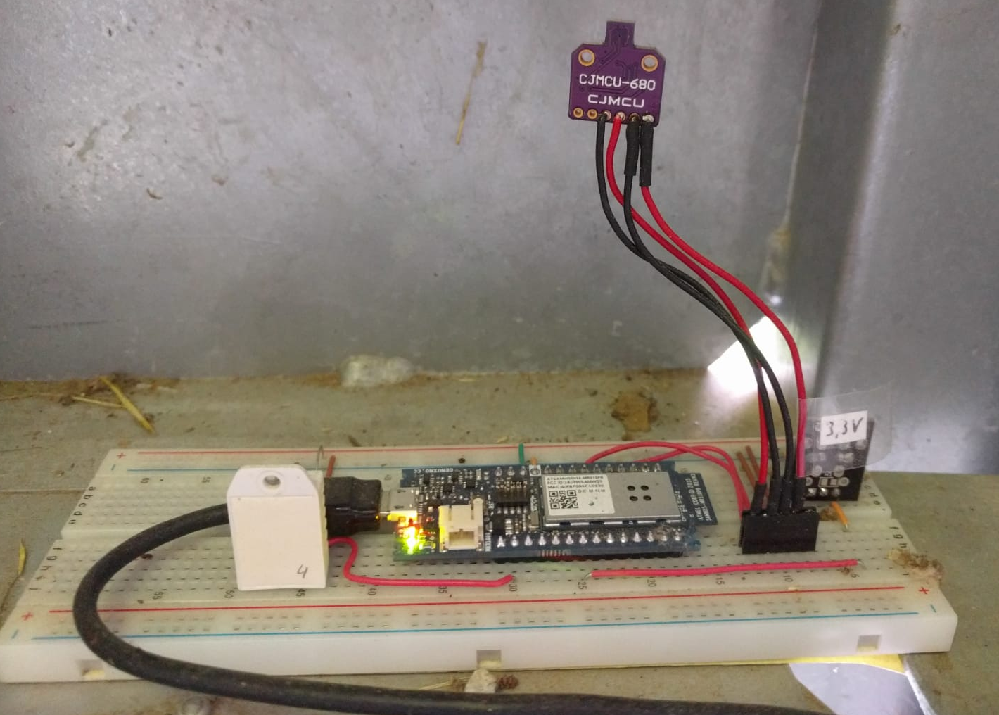

<!--

author:   Sebastian Zug & Bernhard Jung
email:    sebastian.zug@informatik.tu-freiberg.de & bernhard.jung@informatik.tu-freiberg.de
version:  2.0.0
language: de
narrator: Deutsch Female

comment:  Vom Problem zum Programm: Drei Auswertungen mit der Tabellenkalkulation zeigen, wo Handarbeit endet und Algorithmen beginnen.

logo:     ./images/Readme/Wetterstation.png

import:   https://raw.githubusercontent.com/TUBAF-IfI-LiaScript/VL_EAVD/master/config.md

@style
.flex-container {
    display: flex;
    flex-wrap: wrap;
    align-items: stretch;
    gap: 20px;
}

.flex-child {
    flex: 1;
    min-width: 280px;
}
@end

-->

[](https://liascript.github.io/course/?https://github.com/TUBAF-IfI-LiaScript/VL_EAVD/blob/master/01_VomProblemZumProgramm.md)

# Vom Problem zum Programm

| Parameter                | Kursinformationen                                                                                                                                              |
| ------------------------ | -------------------------------------------------------------------------------------------------------------------------------------------------------------- |
| **Veranstaltung:**       | @config.lecture                                                                                                                                                |
| **Semester**             | @config.semester                                                                                                                                               |
| **Hochschule:**          | `Technische Universität Freiberg`                                                                                                                              |
| **Inhalte:**             | `Tabellenkalkulation an ihren Grenzen, Algorithmusbegriff, vom Algorithmus zum Programm`                                                                       |
| **Link auf Repository:** | [https://github.com/TUBAF-IfI-LiaScript/VL_EAVD/blob/master/01_VomProblemZumProgramm.md](https://github.com/TUBAF-IfI-LiaScript/VL_EAVD/blob/master/01_VomProblemZumProgramm.md) |
| **Autoren**              | @author                                                                                                                                                        |

--------------------------------------------------------------------------------

**Leitfrage:** _Wo hört die Tabellenkalkulation auf?_

**Fragen an die heutige Veranstaltung ...**

* Welche Auswertungen lassen sich bequem mit einer Tabellenkalkulation erledigen — und welche nicht?
* Was genau macht eine Auswertung "mühsam"?
* Was ist ein Algorithmus, und welche Eigenschaften muss er haben?
* Warum brauchen wir für Algorithmen eine eigene Sprache?

> **Bringen Sie heute einen Laptop mit einer Tabellenkalkulation mit** — LibreOffice Calc, Excel oder Google Sheets, egal welche.

--------------------------------------------------------------------------------

## Unser Datensatz

    --{{0}}--
Heute lernen Sie den Datensatz kennen, der uns durch das ganze Semester begleitet: die Klimamessreihe vom Fichtelberg.

<!-- style="width: 60%;" -->

Der Deutsche Wetterdienst (DWD) betreibt auf dem **Fichtelberg** (1213 m, höchster Berg Sachsens) eine Wetterstation. Seit dem 1. August 1890 wird dort jeden Tag gemessen. Die Daten sind frei verfügbar.

<!-- data-type="none" -->
| Datei                                             | Inhalt                                              | Zeilen  |
| :------------------------------------------------ | :-------------------------------------------------- | ------: |
| `data/fichtelberg/fichtelberg_2024.csv`           | ein Jahr, aufbereitet: Datum, Mittel, Minimum, Maximum | 366     |
| `data/fichtelberg/produkt_klima_tag_…_01358.txt`  | alle Tage seit 1890, so wie der DWD sie liefert     | 47.595  |

> Quelle: Deutscher Wetterdienst, [Climate Data Center](https://opendata.dwd.de/climate_environment/CDC/observations_germany/climate/daily/kl/historical/), Station 01358, Lizenz [CC BY 4.0](https://creativecommons.org/licenses/by/4.0/).

## Drei Aufgaben

    --{{0}}--
Wir lösen heute drei Aufgaben mit der Tabellenkalkulation. Achten Sie darauf, wie sich Ihr Aufwand von Aufgabe zu Aufgabe verändert — darum geht es eigentlich.

Wir lösen heute drei Aufgaben — ohne eine Zeile Code. Notieren Sie sich bei jeder Aufgabe:

1. Wie lange haben Sie gebraucht?
2. Welche Schritte haben Sie **von Hand** ausgeführt?
3. Wie sicher sind Sie, dass Ihr Ergebnis stimmt?

> Die Antworten auf diese drei Fragen sind am Ende wichtiger als die Ergebnisse selbst.

### Aufgabe 1: Ein Jahr auf dem Fichtelberg

                                     {{0-1}}
*******************************************************************************

Öffnen Sie `fichtelberg_2024.csv` in Ihrer Tabellenkalkulation.

```text fichtelberg_2024.csv
Datum;Tagesmittel;Minimum;Maximum
2024-01-01;-1,2;-1,9;-0,7
2024-01-02;-0,5;-2,4;2,6
2024-01-03;1,6;0,1;2,5
...
```

**a)** Wie hoch war die mittlere Temperatur im Jahr 2024?

**b)** An wie vielen Tagen gab es Frost? Ein **Frosttag** ist ein Tag, an dem das _Minimum_ unter 0 °C lag.

*******************************************************************************

                                     {{1}}
*******************************************************************************

**Lösung**

```text
a)  =MITTELWERT(B2:B367)          →   6,26 °C
b)  =ZÄHLENWENN(C2:C367;"<0")     →   127 Tage
```

Die mittlere Temperatur im Jahr 2024 betrug [[ 1,2 °C | 4,1 °C | (6,3 °C) | 9,8 °C ]].

> **Leicht.** Eine Datei, saubere Spalten, eine Formel pro Frage. Genau dafür wurden Tabellenkalkulationen gebaut.

*******************************************************************************

### Aufgabe 2: Der Personenzähler

                                     {{0-1}}
*******************************************************************************

Erinnern Sie sich an den Personenzähler aus der letzten Vorlesung? Der Sensor an der Hörsaaltür hat folgendes Protokoll geschrieben:

```text data.csv
16:14:28.164 -> Person counted. Total = 66
16:14:28.421 -> Person entered monitoring zone
16:14:29.869 -> Person counted. Total = 67
16:14:29.933 -> Person entered monitoring zone
16:14:32.770 -> Person counted. Total = 68
16:14:32.834 -> Person entered monitoring zone
16:14:33.027 -> Person entered monitoring zone
...
16:40:57.771 -> Person counted. Total = 79
```

Die Vorlesung beginnt um 16:15 Uhr.

**a)** Wie viele Personen sind **nach** Vorlesungsbeginn gekommen?

**b)** In welcher Minute kamen die meisten?

Die vollständige Datei finden Sie unter `examples/00_Einfuehrungsbeispiele/Python Code/data.csv`.

*******************************************************************************

                                     {{1}}
*******************************************************************************

**Was dabei zu tun ist**

1. Datei importieren — aber mit welchem Trennzeichen? Es gibt keins.
2. Die Zeilen mit `Person entered` herausfiltern, sie sind hier ohne Bedeutung.
3. Uhrzeit und Zählerstand aus dem Text herausschneiden (`LINKS`, `TEIL`, `FINDEN`, ...).
4. Den Text `16:15:07.925` in eine Uhrzeit umwandeln, mit der man vergleichen kann.
5. Minuten bilden und zählen.

Nach Vorlesungsbeginn kamen noch [[9]] Personen.
[[?]] Zählen Sie nur die Zeilen mit `Person counted`, deren Uhrzeit ab 16:15 liegt.
***
Die Zählerstände 71 bis 79 liegen nach 16:15 Uhr — das sind 9 Personen. Ob das stimmt, ist eine andere Frage: Achten Sie auf die vielen `entered`-Zeilen ohne anschließendes `counted`.
***

> **Mühsam.** Die eigentliche Frage ist einfach. Der Aufwand steckt darin, die Daten in eine Form zu bringen, mit der die Tabellenkalkulation umgehen kann.
>
> Und morgen liefert der Sensor die nächste Datei. Dann beginnt alles von vorn.

*******************************************************************************

### Aufgabe 3: 135 Jahre Frost

                                     {{0-1}}
*******************************************************************************

Jetzt die Datei, wie der DWD sie tatsächlich liefert:

```text produkt_klima_tag_18900801_20251231_01358.txt
STATIONS_ID;MESS_DATUM;QN_3;  FX;  FM;QN_4; RSK;RSKF; SDK;SHK_TAG;  NM; VPM;  PM; TMK; UPM; TXK; TNK; TGK;eor
       1358;18900801;-999;-999;-999;    1;   0.0;   0;-999;-999;   2.0;  13.2;    -999;   15.6;   67.00;   19.6;   10.0;-999;eor
       1358;18900802;-999;-999;-999;    1;  19.8;   1;-999;-999;   4.3;  13.5;    -999;   17.4;   61.00;   22.5;   10.8;-999;eor
...
```

**Aufgabe:** Wie hat sich die Zahl der Frosttage pro Jahr seit 1890 entwickelt?

*******************************************************************************

                                     {{1}}
*******************************************************************************

**Worüber Sie dabei stolpern**

* 47.595 Zeilen und 19 Spalten, von denen Sie zwei brauchen
* Dezimalpunkt statt Dezimalkomma — je nach Einstellung wird aus `-0.5` der 5. Januar
* `-999` steht für "nicht gemessen" und ist sicher kein Frost
* Das Datum `18900801` ist eine Zahl, kein Datum. Das Jahr steckt in den ersten vier Ziffern.
* 1890 beginnt im August, zwischen 1910 und 1915 fehlen fast fünf Jahre
* Danach: 135 Jahre, für jedes eine eigene `ZÄHLENWENNS`-Formel

> **Praktisch aussichtslos** — zumindest, wenn das Ergebnis stimmen soll. Und wenn Ihre Betreuerin danach fragt, wie es auf der Zugspitze aussieht, fangen Sie wieder von vorn an.

*******************************************************************************

## Was ist hier passiert?

    --{{0}}--
Schauen wir uns an, woran es gelegen hat. Die Fragen selbst waren nicht schwieriger geworden — Aufgabe 3 fragt eigentlich dasselbe wie Aufgabe 1b.

                                     {{0-1}}
*******************************************************************************

Vergleichen Sie Aufgabe 1b und Aufgabe 3. Die **Frage** ist dieselbe: _Wie viele Tage lag das Minimum unter 0 °C?_ Geändert haben sich nur die Umstände:

<!-- data-type="none" -->
| Was sich ändert                | Aufgabe 1          | Aufgabe 2         | Aufgabe 3               |
| :----------------------------- | :----------------- | :---------------- | :---------------------- |
| Datenmenge                     | 366 Zeilen         | 37 Zeilen         | 47.595 Zeilen           |
| Format                         | sauber             | Freitext          | Rohformat mit Fehlwerten |
| Wie oft dieselbe Rechnung      | einmal             | einmal pro Minute | einmal pro Jahr (135×)  |
| Wiederholbar mit neuen Daten?  | ja                 | nein              | nein                    |

*******************************************************************************

                                     {{1}}
*******************************************************************************

Was in Aufgabe 2 und 3 fehlte, war jemand, der **dieselben Schritte beliebig oft, fehlerfrei und ohne Murren** ausführt:

``` text
Für jedes Jahr von 1890 bis 2025:
    Setze den Zähler auf 0.
    Für jeden Tag dieses Jahres:
        Wenn das Minimum gemessen wurde und unter 0 °C liegt:
            Erhöhe den Zähler um 1.
    Notiere Jahr und Zähler.
```

Diese Handlungsvorschrift ist unabhängig davon, ob es um 7 oder 47.595 Tage geht. Genau so etwas nennt man einen **Algorithmus**.

*******************************************************************************

## Algorithmen

    --{{0}}--
Algorithmen sind nichts Exotisches. Sie folgen jeden Tag welchen — beim Kochen, beim Zusammenbauen eines Regals, bei einer Laboranleitung.

> Ein **Algorithmus** ist eine eindeutige Handlungsvorschrift zur Lösung eines Problems, die aus endlich vielen, wohldefinierten Einzelschritten besteht.

Algorithmen begegnen Ihnen ständig: ein Kochrezept, eine Aufbauanleitung, eine Versuchsvorschrift im Labor. Damit ein **Rechner** sie ausführen kann, müssen sie aber strenge Anforderungen erfüllen:

<!-- data-type="none" -->
| Eigenschaft        | Bedeutung                                               | Verletzt durch ...                          |
| :----------------- | :------------------------------------------------------ | :------------------------------------------ |
| **Eindeutigkeit**  | Jeder Schritt lässt genau eine Auslegung zu             | "Gib etwas Salz dazu"                        |
| **Ausführbarkeit** | Jeder Schritt kann tatsächlich ausgeführt werden         | "Nimm den wärmsten Tag der Zukunft"          |
| **Endlichkeit**    | Die Beschreibung hat endlich viele Schritte             | "Und so weiter ..."                         |
| **Terminierung**   | Die Ausführung endet nach endlich vielen Schritten       | "Wiederhole, bis es nicht mehr friert"       |

### Warum der Rechner keine Alltagssprache versteht

                                     {{0-1}}
*******************************************************************************

> _"Zähl mal die kalten Tage."_

Was ist "kalt"? Unter 0 °C? Unter 5 °C? Das Tagesmittel oder das Minimum? Und was ist mit den Tagen, an denen gar nicht gemessen wurde?

Ein Mensch fragt nach oder entscheidet nach Gefühl. Ein Rechner kann beides nicht:

* Er hat **kein Weltwissen** und keine Erfahrung.
* Er **rät nicht** und liest nicht zwischen den Zeilen.
* Er führt **exakt** das aus, was dasteht — auch wenn es Unsinn ist.

*******************************************************************************

                                     {{1}}
*******************************************************************************

Programmiersprachen sind deshalb ein Kompromiss:

<!-- data-type="none" -->
| Alltagssprache             | Programmiersprache      | Maschinensprache          |
| :------------------------- | :---------------------- | :------------------------ |
| "Zähl die kalten Tage"     | `if minimum < 0:`       | `01011010 11001001 ...`   |
| mehrdeutig                 | eindeutig               | eindeutig                 |
| für Menschen leicht        | für Menschen lesbar     | für Menschen unlesbar     |
| für Rechner unbrauchbar    | für Rechner übersetzbar | für Rechner direkt ausführbar |

> Eine Programmiersprache ist **die Sprache, in der man einen Algorithmus so aufschreibt, dass sowohl Menschen als auch Rechner ihn verstehen.**

*******************************************************************************

### Algorithmen darstellen

    --{{0}}--
Bevor wir eine Programmiersprache verwenden, gibt es zwei Zwischenschritte, die Ihnen beim Planen helfen: Pseudocode und Ablaufdiagramme.

Bevor man programmiert, hilft es, den Algorithmus aufzuschreiben — noch ohne sich um die Regeln einer Sprache zu kümmern.

<div class="flex-container">
<div class="flex-child">

**Pseudocode**

``` text
Setze frosttage auf 0.
Für jedes Minimum in der Liste:
    Wenn Minimum < 0:
        Erhöhe frosttage um 1.
Gib frosttage aus.
```

</div>
<div class="flex-child">

**Ablaufdiagramm**

``` ascii
        ( Start )
            |
            v
   +-----------------+
   | frosttage = 0   |
   +-----------------+
            |
            v
     .-------------.   nein
    < noch ein Tag? >-----------.
     '-------------'            |
            | ja                v
            v            +-------------+
     .-------------.     | Ausgabe:    |
    < Minimum < 0 ? >    | frosttage   |
     '-------------'     +-------------+
      | ja       | nein         |
      v          |              v
 +-----------+   |          ( Ende )
 | frosttage |   |
 |  + 1      |   |
 +-----------+   |
      |          |
      '----+-----'
           | zurück zur Frage "noch ein Tag?"
```

</div>
</div>

> In zwei Wochen schreiben Sie genau diesen Algorithmus in Python. Er wird **fünf Zeilen** lang sein.

### Kontrollfragen

Welche Eigenschaft eines Algorithmus verletzt die Anweisung _"Addiere alle Temperaturen, die ungefähr gleich sind"_?

[( )] Endlichkeit
[(X)] Eindeutigkeit
[( )] Terminierung
[( )] Ausführbarkeit
***
"Ungefähr gleich" lässt verschiedene Auslegungen zu: 0,1 °C Unterschied? 1 °C? Ein Rechner braucht eine exakte Grenze.
***

Welche der folgenden Anweisungen sind als Schritt eines Algorithmus für einen Rechner geeignet?

[[X]] Wenn das Minimum kleiner als 0 °C ist, erhöhe den Zähler um 1.
[[ ]] Lass die unplausiblen Werte weg.
[[X]] Wenn der Wert -999 ist, überspringe die Zeile.
[[ ]] Nimm die wichtigsten Spalten.
***
"Unplausibel" und "wichtig" sind Urteile, die der Rechner nicht fällen kann. Man muss sie in eine **prüfbare Regel** übersetzen — etwa "Werte unter -50 °C oder über 50 °C".
***

Ordnen Sie die drei Aufgaben von heute zu:

[ [lohnt sich nicht] [lohnt sich] ]
[        (X)            ( )      ] Aufgabe 1: Jahresmittel aus einer sauberen Datei, einmalig
[        ( )            (X)      ] Aufgabe 2: Sensorprotokoll, jeden Tag eine neue Datei
[        ( )            (X)      ] Aufgabe 3: 135 Jahre im Rohformat, später weitere Stationen

## Wann lohnt sich ein Programm?

    --{{0}}--
Wir wollen Ihnen die Tabellenkalkulation nicht ausreden. Sie ist für viele Aufgaben genau das richtige Werkzeug. Es geht darum, zu erkennen, wann sie es nicht mehr ist.

Die Tabellenkalkulation ist ein hervorragendes Werkzeug. Ein Programm lohnt sich, wenn mindestens eines davon zutrifft:

<!-- data-type="none" -->
| Merkmal                      | Beispiel                                                       |
| :--------------------------- | :------------------------------------------------------------- |
| **Viele Daten**              | 47.595 Zeilen, oder 500 Dateien                                |
| **Sperrige Formate**         | Sensorprotokolle, Rohdaten mit Fehlwerten, gemischte Einheiten |
| **Wiederholung**             | jede Woche neue Messdaten, dieselbe Auswertung                 |
| **Nachvollziehbarkeit**      | Jemand anderes soll prüfen können, was genau Sie gerechnet haben |

> Der letzte Punkt wird oft unterschätzt. Eine Tabelle mit 135 von Hand angepassten Formeln kann niemand prüfen — ein Programm von zehn Zeilen schon.

### Ein Blick voraus

                                     {{0-1}}
*******************************************************************************

So sieht die Lösung von Aufgabe 3 in Vorlesung 12 aus:

```python
import pandas as pd
df = pd.read_csv("produkt_klima_tag_18900801_20251231_01358.txt", sep=";", skipinitialspace=True, na_values=-999)
df["Jahr"] = df["MESS_DATUM"] // 10000
print((df["TNK"] < 0).groupby(df["Jahr"]).sum())
```

Vier Zeilen. Sie müssen heute noch keine davon verstehen.

*******************************************************************************

                                     {{1}}
*******************************************************************************

Und das Ergebnis, gemittelt über die vollständig gemessenen Jahre jedes Jahrzehnts:

<!-- data-type="barchart" data-title="Mittlere Zahl der Frosttage pro Jahr, Fichtelberg" data-xlabel="Jahrzehnt" data-ylabel="Frosttage" -->
| Jahrzehnt | Frosttage |
| :-------- | --------: |
| 1890er    |     177.6 |
| 1900er    |     189.8 |
| 1910er    |     186.5 |
| 1920er    |     182.6 |
| 1930er    |     178.4 |
| 1940er    |     174.4 |
| 1950er    |     179.1 |
| 1960er    |     169.4 |
| 1970er    |     175.3 |
| 1980er    |     169.4 |
| 1990er    |     165.9 |
| 2000er    |     156.6 |
| 2010er    |     154.2 |
| 2020er    |     140.0 |

> Rund 50 Frosttage weniger als vor hundert Jahren. Bevor wir so etwas behaupten, werden wir aber prüfen müssen, ob die Zahlen das tragen — was ist mit den Lücken, und stand das Thermometer immer an derselben Stelle? Dazu mehr in Vorlesung 14.

*******************************************************************************

## Nächste Woche

In der nächsten Vorlesung schreiben Sie Ihre ersten Python-Anweisungen — im Browser, ohne Installation. Wahlweise als **Blöcke** zum Zusammenschieben oder als **Text** zum Tippen.

**Zur Vorbereitung**

- [ ] Versuchen Sie, Aufgabe 2 vollständig zu lösen. Notieren Sie, wo Sie hängen geblieben sind.
- [ ] Beschreiben Sie in Pseudocode, wie man den **wärmsten Tag** in `fichtelberg_2024.csv` findet — ohne die Funktion `MAX` zu benutzen.
- [ ] Überlegen Sie: Welche Auswertung aus Ihrem Fach würden Sie gern automatisieren?
