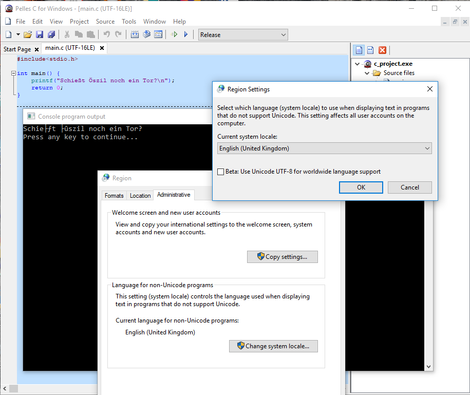

<!--

author:   Sebastian Zug & André Dietrich
email:    zug@ovgu.de   & andre.dietrich@ovgu.de
version:  0.0.1
language: de
narrator: Deutsch Female

comment:  This is a very simple comment.
          Multiline is also okay.

translation: English   translation/english.md

script:   https://felixhao28.github.io/JSCPP/dist/JSCPP.es5.min.js

@JSCPP
<script>
  try {
    var output = "";
    JSCPP.run(`@0`, `@1`, {stdio: {write: s => { output += s.replace(/\n/g, "<br>");}}});
    output;
  } catch (msg) {
    var error = new LiaError(msg, 1);
    var log = msg.match(/(.*)\nline (\d+) \(column (\d+)\):.*\n.*\n(.*)/);
    var info = log[1] + " " + log[4];

    if (info.length > 80)
      info = info.substring(0,76) + "..."

    error.add_detail(0, info, "error", log[2]-1, log[3]);

    throw error;
  }
</script>
@end

-->

# Vorlesung II - Grundlagen der Sprache C

**Fragen an die heutige Veranstaltung ...**

+ Durch welche Parameter ist eine Variable definiert?
+ Erklären Sie die Begriffe Deklaration, Definition und Initialisierung im Hinblick auf eine Variable!
+ Worin unterscheidet sich die Zahldarstellung von ganzen Zahlen (`int`) von den Gleitkommazahlen (`float`).
+ Welche Datentypen kennt die Sprache C?
+ Erläutern Sie für `char` und `int` welche maximalen und minimalen Zahlenwerte sich damit angeben lassen.
+ ...

Vorwarnung: Man kann Variablen nicht ohne Ausgaben und Ausgaben nicht ohne Variablen erklären. Deshalb wird im folgenden immer wieder auf einzelne Aspekte vorgegriffen. Nach der Vorlesung sollte sich dann aber ein Gesamtbild ergeben.

## 0. Zeichensätze

Sie können in einem C-Programm folgende Zeichen verwenden:

+ Dezimalziffern

  `0 1 2 3 4 5 6 7 8 9`

+ Buchstaben des englischen Alphabets

  `A B C D E F G H I J K L M N O P Q R S T U V W X Y Z a b c d e f g h i j k l m n o p q r s t u v w x y z`


+ Grafiksymbole

   `!"%&/()[]{}\?='#+*~-_.:,`

   ```cpp                     ErroneousHelloWorld.c
   #include <stdio.h>

   int main() {
   	printf("Einen schönen Tag für Sie!");
   	return 0;
   }
   ```
   @JSCPP(@input, )

<!-- width="80%" -->


## 1. Variablen

"Ein Rechner ist eigentlich ziemlich dumm, dass aber viele Millionen mal pro Sekunde" [Zitat - Quelle gesucht!]

```cpp                     Calculator.c
#include<stdio.h>

int main() {
  printf("%d",43 + 17);
	return 0;
}
```
@JSCPP(@input, )

Unbefriedigenden Lösung, jede neue Berechnung muss in den Source-Code integriert und dieser dann kompiliert werden. Ein Taschenrechner wäre die bessere Lösung!

```cpp                     QuadraticEquation.c
#include<stdio.h>

int main() {
  int x;
  x = 5;
  printf("f(%d) = %d ",x, 3*x*x + 4*x + 8);
  x = 9;
  printf("f(%d) = %d ",x, 3*x*x + 4*x + 8);
	return 0;
}
```
@JSCPP(@input, )

Ein Programm manipuliert Daten, die in Variablen organisiert werden.

Eine Variable ist somit ein **abstrakter Behälter** für Inhalte, welche im Verlauf eines Rechenprozesses benutzt werden. Im Normalfall wird eine Variable im Quelltext durch einen Namen bezeichnet, der die Adresse im Speicher repräsentiert.

Kennzeichen einer Variable:

+ Name
+ Datentyp
+ Wert
+ Adresse
+ Gültigkeitraum


### Zulässige Variablennamen

Der Name kann Zeichen, Ziffern und den Unterstrich enthalten. Dabei ist zu beachten:

+ Das erste Zeichen muss ein Buchstabe sein, der Unterstrich ist auch möglich.
+ C betrachte Groß- und Kleinschreibung - `Zahl` und `zahl` sind also unterschiedliche Variablentypen
+ Schlüsselworte sind als Namen unzulässig.

| Name    | Zulässigkeit           |
|:--------|:-----------------------|
| gcc     | erlaubt                 |
| a234a_xwd3| erlaubt   |
| speed\_m\_per\_s | erlaubt |
| double  | nicht zulässig (Schlüsselwort) |
| robot.speed | nicht zulässig (`.` im Namen) |
| 3thName | nicht zulässig (Ziffer als erstes Zeichen)|
| x y     | nicht zulässig (Leerzeichen im Variablennamen) |

Das ganze kann dann noch in entsprechenden Notationen verpackt werden, um einem Wildwuchs an Bezeichnern vorzubeugen.

| Bezeichnung   | denkbare Variablennamen           |
|:--------------|:-----------------------|
| CamelCase     | `youLikeCamelCase`, `humanDetectionSuccessfull`  |
| underscores   | `I\_hate\_Camel\_Case`, `human\_detection\_successfull`   |

Eine Konvention geht noch einen Schritt weiter und verknüpft Datentypen (an erster Stelle) und Funktion mit dem Namen (hier abgewandelte *ungarische Notation*).

|Präfix 	|Datentyp 	        |Beispiel|
|:--------|:------------------|:-----|
|n 	|Integer| 	nSize|
|b 	|Boolean |	bBusy|
|sz |	null-terminierter String 	|szLastName|
|p 	|Zeiger |	pMemory|
|a 	|Array 	|aCounter|
|ch |	char 	|chName|
|dw |	Double Word, 32 Bit, unsigned |	dwNumber|
|w 	|Word, 16 Bit, unsigned |	wNumber|

*“Encoding the type of a function into the name (so-called Hungarian notation) is brain damaged – the compiler knows the types anyway and can check those, and it only confuses the programmer.”* [Linus Torvalds]

### Datentypen

#### Zahlendarstellung im Rechner

{{0-1}}
| Adresse | Speicherinhalt |
|         | binär          |
| 0010    | 0000 1100      |
| 0011    | 1111 1101      |
| 0012    | 0001 0000      |
| 0013    | 1000 0000      |

{{1-2}}
| Adresse | Speicherinhalt | Zahlenwert |
|         |                |  (Byte)    |
| 0010    | 0000 1100      | 13         |
| 0011    | 1111 1101      | 253 (-125) |
| 0012    | 0001 0000      | 16         |
| 0013    | 1000 0000      | 128 (-128) |

{{2}}
| Adresse | Speicherinhalt | Zahlenwert | Zahlenwert | Zahlenwert   |
|         |                |  (Byte)    | (2 Byte)   | (4 Byte)     |
| 0010    | 0000 1100      | 13         |            |              |
| 0011    | 1111 1101      | 253 (-125) | 3325       |              |
| 0012    | 0001 0000      | 16         |            |              |
| 0013    | 1000 0000      | 128 (-128) | 4224       | 217911424    |

{{3}}
Der dargestellte Speicherauszug kann aber auch eine Kommazahl (Floating Point) umfassen und repräsentiert dann den Wert `3.8990753E-31`

#### Generische Datentypen

Die Zahlendarstellung im Rechner lässt also sich klassifizieren nach:

+ Wertebereichen (größte und kleinste Zahl)
+ ggf. vorzeichenbehaftet Zahlen
+ ggf. gebrochene Werte

Ganzzahlen sind Zahlen ohne Nachkommastellen mit und ohne Vorzeichen. In C gibt es folgende Typen für Ganzzahlen:

| Schlüsselwort  | Bezeichnung   | Benutzung                    | Mindestgröße |
|:---------------|:--------------|:-----------------------------|:-------------|
| char           | character     | 1 Byte bzw. 1 Zeichen        | 1 Byte       |
| short int      | integer       | ganzzahliger Wert            | 2 Byte       |
| int            | integer       | ganzzahliger Wert            | 1 Byte       |
| long int       | integer       | ganzzahliger Wert            | 1 Byte       |
| long long int  | integer       | ganzzahliger Wert, ab C99    | 1 Byte       |

Wenn die Typ-Spezifizierer (`long` oder `short`) vorhanden sind kann auf die `int` Typangabe verzichtet werden.

```cpp
short int a; // entspricht short a;
long int b;  // äquivalent zu long b;
}
```

Standardmäßig wird von vorzeichenbehafteten Zahlenwerten ausgegangen. Somit wird das Schlüsselwort `signed` eigentliche nicht benötigt

```cpp
int a;  //  signed int a;
unsigned long long int b;
```

```cpp                     sizeof_int.c
#include <stdio.h>
#include <limits.h>   /* INT_MIN und INT_MAX */

int main(void) {
   printf("int Größe : %d Byte\n", sizeof( int ) );
   printf("Wertebereich von %d bis %d\n", INT_MIN, INT_MAX);
   return 0;
}
```
@JSCPP(@input, )


▶ python showResults.py
32Bit
               duration_mean
optimization            -O0      -O1     -O2     -O3     -Os
data_type
uint16_t              2.5420  2.0590  0.6690  2.1165  1.9745
uint32_t              2.2150  1.9505  0.6695  1.7030  1.9810
unsigned int          2.2295  1.9400  0.6675  1.6970  1.9725
unsigned long         2.2245  1.9400  0.6800  1.6955  1.9910
unsigned short        2.5360  2.0575  0.6720  2.1210  1.9835

64Bit
               duration_mean
optimization            -O0      -O1     -O2     -O3     -Os
data_type
uint16_t              2.5555  2.0705  0.6880  2.1185  1.9725
uint32_t              2.2245  1.9455  0.6695  1.7065  1.9855
unsigned int          2.2105  1.9395  0.6700  1.6985  1.9650
unsigned long         2.5350  2.0500  0.6685  2.1080  1.9930
unsigned short        2.5455  2.0660  0.7205  2.1055  1.9735


```cpp                     QuadraticEquation.c
#include <stdio.h>

int main()
{
  int x;
  printf("Test %d Byte.", (unsigned int)sizeof(int));
  return 0;
}
```
@JSCPP(@input, )


### Werte

Zahlenliterale

### Adressen


### Globale Variablentypen

Muss eine Variable immer innerhalb von `main` definiert werden?

```cpp                     MissingInitialisation.c
#include<stdio.h>

int a = 1;

void foo() {
  printf("a=%d ", a);
}

int main() {
  printf("a=%d ", a);
  foo();
	return 0;
}
```
@JSCPP(@input, )


### Definition vs. Deklaration vs. Initialisierung

... oder andere Frage, wie kommen Name, Datentyp, Adresse usw. zusammen?

> Deklaration ist nur die Vergabe eines Namens und eines Typs für die Variable. Definition ist die Reservierung des Speicherplatzes. Initialisierung ist die Zuweisung eines ersten Wertes.

**Merke:**  Jede Definition ist gleichzeitig eine Deklaration aber nicht umgekehrt!

```cpp                     DeclarationVSDefinition.c
int i;             // Definition + Deklaration
int a,b,c;
float x, int y;    // Compilerfehler! "Typenreinheit" wird vorausgesetzt
extern int a;      // Deklaration
i = 5;             // Initialisierung
```
--{{0}}--
Das Schlüsselwort extern in obigem Beispiel besagt, dass die Definition der Variablen a irgendwo in einem anderen Modul des Programms liegt. So deklariert man Variablen, die später beim Binden (Linken) aufgelöst werden. Da in diesem Fall kein Speicherplatz reserviert wurde, handelt es sich um keine Definition.

### Typische Fehler

```cpp                     MissingInitialisation.c
#include<stdio.h>

void foo() {
  int a;     // <- Fehlende Initialisierung dynamische Variable
  printf("a=%d ", a);
}

int main() {
  int x = 5;
  printf("x=%d ", x);
  int y;     // <- Fehlende Initialisierung statische Variable
  printf("y=%d ", y);
  foo();
	return 0;
}
```
@JSCPP(@input, )

--{{0}}--
Der C++, der für diese Webseite zum Einsatz kommt initialisiert offenbar alle Werte mit 0 führen Sie dieses Beispiel aber einmal mit einem richtigen Compiler aus.

```cpp                     Redeclaration.c
#include<stdio.h>

int main() {
  int x;
  int x;
  return 0;
}
```

<pre class="lia-code-stdout" style="font-size: 11px;">
▶ gcc -W doubleDeclaration.c

doubleDeclaration.c: In function ‘main’:
doubleDeclaration.c:5:7: error: redeclaration of ‘x’ with no linkage
   int x;
       ^
doubleDeclaration.c:4:7: note: previous declaration of ‘x’ was here
   int x;
</pre>


## 2. Ein- und Ausgabe


## Ausblick

```cpp                     GoodBy.c
#include<stdio.h>

int main() {
  printf("... bis zum naechsten mal!");
	return 0;
}
```
@JSCPP(@input, )
