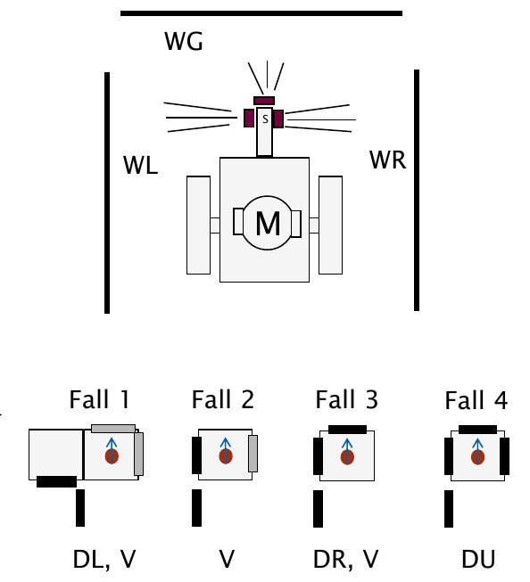

<!--

author:   Sebastian Zug & André Dietrich & Galina Rudolf
email:    sebastian.zug@informatik.tu-freiberg.de & andre.dietrich@ovgu.de & Galina.Rudolf@informatik.tu-freiberg.de
version:  1.0.2
language: de
narrator: Deutsch Female

comment: Einführung in die Programmierung für Nicht-Informatiker
logo: ./img/LogoCodeExample.png

import: https://github.com/liascript/CodeRunner
        https://github.com/LiaTemplates/AVR8js/main/README.md#10


-->

[](https://liascript.github.io/course/?https://github.com/TUBAF-IfI-LiaScript/VL_ProzeduraleProgrammierung/blob/master/02_OperatorenKontrollstrukturen.md)

# Operatoren & Kontrollstrukturen

| Parameter                 | Kursinformationen                                                                                                                                                                                    |
|---------------------------|------------------------------------------------------------------------------------------------------------------------------------------------------------------------------------------------------|
| **Veranstaltung:**        | `Einführung in das wissenschaftliche Programmieren`                                                                                                                                                  |
| **Semester**              | `Wintersemester 2022/23`                                                                                                                                                                             |
| **Hochschule:**           | `Technische Universität Freiberg`                                                                                                                                                                    |
| **Inhalte:**              | `Operatoren / Kontrollstrukturen`                                                                                                                                                                    |
| **Link auf Repository: ** | [https://github.com/TUBAF-IfI-LiaScript/VL_ProzeduraleProgrammierung/blob/master/02_OperatorenKontrollstrukturen.md](https://github.com/TUBAF-IfI-LiaScript/VL_ProzeduraleProgrammierung/blob/master/02_OperatorenKontrollstrukturen.md) |
| **Autoren**               | @author                                                                                                                                                                                              |


---------------------------------------------------------------------

**Fragen an die heutige Veranstaltung ...**

* Wonach lassen sich Operatoren unterscheiden?
* Welche unterschiedliche Bedeutung haben `x++` und `++x`?
* Erläutern Sie den Begriff unärer, binärer und tertiärer Operator.
* Unterscheiden Sie Zuweisung und Anweisung.
* Wie lassen sich Kontrollflüsse grafisch darstellen?
* Welche Konfigurationen erlaubt die `for`-Schleife?
* In welchen Funktionen (Verzweigungen, Schleifen) ist Ihnen das Schlüsselwort
  `break` bekannt?
* Worin liegt der zentrale Unterschied der `while` und `do-while` Schleife?
* Recherchieren Sie Beispiele, in denen `goto`-Anweisungen Bugs generierten.

---------------------------------------------------------------------


## Operatoren 

Unterscheidungsmerkmale
=============================

> Ein Ausdruck ist eine Kombination aus Variablen, Konstanten, Operatoren und
> Rückgabewerten von Funktionen. Die Auswertung eines Ausdrucks ergibt einen
> Wert.

       {{0-1}}
******************************************************************************

**Zahl der beteiligten Operationen**

Man unterscheidet in der Sprache C/C++ *unäre*, *binäre* und *ternäre* Operatoren

<!-- data-type="none" -->
| Operator           | Operanden | Beispiel                | Anwendung              |
|:-------------------|:---------:|:------------------------|------------------------|
| Unäre Operatoren   |     1     | `&` Adressoperator      | `sizeof(b);`           |
|                    |           | `sizeof` Größenoperator | `b=-a;`                |
| Binäre Operatoren  |     2     | `+`, `-`, `%`           | `b=a-2;`               |
| Ternäre Operatoren |     3     | `?` Bedingungsoperator  | `b=(3 > 4 ? 0 : 1 ); ` |

Es gibt auch Operatoren, die, je nachdem wo sie stehen, entweder unär oder binär
sind. Ein Beispiel dafür ist der `-`-Operator.

******************************************************************************

       {{1-2}}
******************************************************************************

**Position**

Des Weiteren wird unterschieden, welche Position der Operator einnimmt:

- *Infix* – der Operator steht zwischen den Operanden.
- *Präfix* – der Operator steht vor den Operanden.
- *Postfix* – der Operator steht hinter den Operanden.

`+` und `-` können alle drei Rollen einnehmen:

```cpp
a = b + c; // Infix
a = -b;    // Präfix
a = b++;   // Postfix
```
******************************************************************************

       {{2-3}}
******************************************************************************

**Funktion des Operators**

* Zuweisung
* Arithmetische Operatoren
* Logische Operatoren
* Bit-Operationen
* Bedingungsoperator

Weitere Unterscheidungsmerkmale ergeben sich zum Beispiel aus der [Assoziativität der Operatoren](https://de.wikipedia.org/wiki/Operatorassoziativit%C3%A4t).

> __Achtung:__ Die nachvollgende Aufzählung erhebt nicht den Anspruch auf Vollständigkeit! Es werden bei weitem nicht alle Varianten der Operatoren dargestellt - vielmehr liegt der Fokus auf den für die Erreichung der didaktischen Ziele notwendigen Grundlagen.

******************************************************************************

### Zuweisungsoperator

Der Zuweisungsoperator `=` ist von seiner mathematischen Bedeutung zu trennen -
einer Variablen wird ein Wert zugeordnet. Damit macht dann auch `x=x+1` Sinn.

```cpp                     zuweisung.cpp
#include <iostream>
using namespace std;

int main() {
   int zahl1 = 10;
   int zahl2 = 20;
   int ergeb = 0;
   // Zuweisung des Ausdrucks 'zahl1 + zahl2'
   ergeb = zahl1 + zahl2;

   cout<<zahl1<<" + "<<zahl2<<" = "<<ergeb<<"\n";
   return 0;
}
```
@LIA.evalWithDebug(`["main.cpp"]`, `g++ -Wall main.cpp -o a.out`, `./a.out`)

> **Achtung:** Verwechseln Sie nicht den Zuweisungsoperator `=` mit dem
> Vergleichsoperator `==`. Der Compiler kann die Fehlerhaftigkeit kaum erkennen
> und generiert Code, der ein entsprechendes Fehlverhalten zeigt.

### Inkrement und Dekrement

Mit den `++` und `--` -Operatoren kann ein L-Wert um eins erhöht bzw. um
eins vermindert werden. Man bezeichnet die Erhöhung um eins auch als Inkrement,
die Verminderung um eins als Dekrement. Ein Inkrement einer Variable `x`
entspricht `x = x + 1`, ein Dekrement einer Variable `x` entspricht `x = x - 1`.

```cpp                            IncrementDecrement.cpp
#include <iostream>
using namespace std;

int main(){
  int x, result;
  x = 5;
  result = 2 * ++x;   // Gebrauch als Präfix
  cout<<"x="<<x<<" und result="<<result<<"\n";
  result = 2 * x++;   // Gebrauch als Postfix
  cout<<"x="<<x<<" und result="<<result<<"\n";
  return 0;
}
```
@LIA.eval(`["main.cpp"]`, `g++ -Wall main.cpp -o a.out`, `./a.out`)


### Arithmetische Operatoren

| Operator | Bedeutung                    | Ganzzahlen | Gleitkommazahlen |
|:--------:|:-----------------------------|:-----------|:-----------------|
|   `+`    | Addition                     | x          | x                |
|   `-`    | Subtraktion                  | x          | x                |
|   `*`    | Multiplikation               | x          | x                |
|   `/`    | Division                     | x          | x                |
|   `%`    | Modulo (Rest einer Division) | x          |                  |

{{1}}
> **Achtung:** Divisionsoperationen werden für Ganzzahlen und Gleitkommazahlen
> unterschiedlich realisiert.

{{1}}
* Wenn zwei Ganzzahlen wie z. B. $4/3$ dividiert werden, erhalten wir das
  Ergebnis 1 zurück, der nicht ganzzahlige Anteil der Lösung bleibt
  unbeachtet.
* Für Fließkommazahlen wird die Division wie erwartet realisiert.

{{1}}
```cpp                                  division.cpp
#include <iostream>
using namespace std;

int main(){
  int timestamp, minuten;

  timestamp = 345; //[s]
  cout<<"Zeitstempel "<<timestamp<<" [s]\n";
  minuten=timestamp/60;
  cout<<timestamp<<" [s] entsprechen "<<minuten<<" Minuten\n";
  return 0;
}
```
@LIA.eval(`["main.cpp"]`, `g++ -Wall main.cpp -o a.out`, `./a.out`)

{{2}}
> Die Modulo Operation generiert den Rest einer Divisionsoperation bei ganzen Zahlen.

{{2}}
```cpp                                  moduloExample.cpp
#include <iostream>
using namespace std;

int main(){
  int timestamp, sekunden, minuten;

  timestamp = 345; //[s]
  cout<<"Zeitstempel "<<timestamp<<" [s]\n";
  minuten=timestamp/60;
  sekunden=timestamp%60;
  cout<<"Besser lesbar = "<<minuten<<" min. "<<sekunden<<" sek.\n";
  return 0;
}
```
@LIA.eval(`["main.cpp"]`, `g++ -Wall main.cpp -o a.out`, `./a.out`)

### Vergleichsoperatoren

Kern der Logik sind Aussagen, die wahr oder falsch sein können.


| Operation | Bedeutung           |
|:---------:|:--------------------|
|    `<`    | kleiner als         |
|    `>`    | größer als          |
|   `<=`    | kleiner oder gleich |
|   `>=`    | größer oder gleich  |
|   `==`    | gleich              |
|   `!=`    | ungleich            |

```cpp                                       LogicOperators.cpp
#include <iostream>
using namespace std;

int main(){
  int x = 15;
  cout<<"x = "<<x<<" \n";
  cout<<boolalpha<<"Aussage x > 5 ist "<< (x>5) << " \n";
  cout<<boolalpha<<"Aussage x == 5 ist "<< (x==-15) << " \n";
  return 0;
}
```
@LIA.evalWithDebug(`["main.cpp"]`, `g++ -Wall main.cpp -o a.out`, `./a.out`)

> **Merke:** Der Rückgabewert einer Vergleichsoperation ist `bool`. Dabei bedeutet
> `false` eine ungültige und `true` eine gültige Aussage. Vor 1993 wurde ein logischer Datentyp in C++ durch
> `int` simuliert. Aus der Gründen der Kompatibilität wird `bool` überall,
> wo wie hier nicht ausdrücklich `bool` verlangt wird in `int` (Werte `0` und `1`) umgewandelt.

> Mit dem `boolalpha` Parameter kann man `cout` überreden zumindest `true` und `false` auszugeben.

### Logische Operatoren

    {{0-1}}
********************************************************************************

Und wie lassen sich logische Aussagen verknüpfen? Nehmen wir an, dass wir aus den Messdaten zweier Sensoren ein Alarmsignal generieren wollen. Nur wenn die Temperatur _und_ die Luftfeuchte in einem bestimmten Fenster liegen, soll dies nicht  passieren.

| Operation | Bedeutung |
|:---------:|:----------|
|   `&&`    | UND       |
|   `||`    | ODER      |
|    `!`    | NICHT     |

Das ODER wird durch senkrechte Striche repräsentiert (Altgr+`<` Taste) und nicht durch große `I`!

Nehmen wir an, sie wollen Messdaten evaluieren. Ihr Sensor funktioniert nur dann wenn die Temperatur ein Wert zwischen -10 und -20 Grad annimmt und die Luftfeuchte zwischen 40 bis 60 Prozent beträgt.

```cpp                                       Logic.cpp
#include <iostream>
using namespace std;

int main(){
  float Temperatur = -30;     // Das sind unsere Probewerte
  float Feuchte = 65;

  // Vergleichsoperationen und Logische Operationen
  bool TempErgebnis = ....    // Hier sind Sie gefragt!

  // Ausgabe
  if ... {
    cout<<"Die Messwerte kannst Du vergessen!";
  }
  return 0;
}
```
@LIA.eval(`["main.cpp"]`, `g++ -Wall main.cpp -o a.out`, `./a.out`)
********************************************************************************

Anmerkung: C++ bietet für logische Operatoren und Bit-Operatoren Synonyme  `and`, `or`, `xor`.
Die Synonyme sind Schlüsselwörter, wenn Compiler-Einstellungen /permissive- oder /Za (Spracherweiterungen deaktivieren) angegeben werden. Sie sind keine Schlüsselwörter, wenn Microsoft-Erweiterungen aktiviert sind. Die Verwendung der Synonyme kann die Lesbarkeit deutlich erhöhen.

### `sizeof` - Operator

Der Operator `sizeof` ermittelt die Größe eines Datentyps (in Byte) zur
Kompiliertzeit.

* `sizeof` ist keine Funktion, sondern ein Operator.
* `sizeof` wird häufig zur dynamischen Speicherreservierung verwendet.

```cpp      sizeof.cpp
#include <iostream>
using namespace std;

int main(){
  double wert=0.0;
  cout<<sizeof(0)<<" "<<sizeof(double)<<" "<<sizeof(wert);
return 0;
}
```
@LIA.eval(`["main.cpp"]`, `g++ -Wall main.cpp -o a.out`, `./a.out`)


## Vorrangregeln

Konsequenterweise bildet auch die Programmiersprache C/C++ eigene Vorrangregeln ab,
die grundlegende mathematische Definitionen "Punktrechnung vor Strichrechnung"
realisieren. Die Liste der unterschiedlichen Operatoren macht aber weitere
Festlegungen notwendig.

**Prioritäten**

In welcher Reihung erfolgt beispielsweise die Abarbeitung des folgenden
Ausdruckes?

```cpp
 c = sizeof(x) + ++a / 3;
```

Für jeden Operator wurde eine Priorität definiert, die die Reihung der
Ausführung regelt.

[Liste der Vorrangregeln](https://de.wikibooks.org/wiki/C-Programmierung:_Liste_der_Operatoren_nach_Priorit%C3%A4t)

Im Beispiel bedeutet dies:

```cpp
c = sizeof(x) + ++a  / 3;
//    |       |  |   |
//    |       |  |   |--- Priorität 13
//    |       |  |--- Priorität 14
//    |       |--- Priorität 12
//    |--- Priorität 14

c = (sizeof(x)) + ((++a) / 3);
```
{{1}}
**Assoziativität**

{{1}}
Für Operatoren mit der gleichen Priorität ist für die Reihenfolge der Auswertung die Assoziativität das zweite Kriterium.

{{1}}
```cpp
a = 4 / 2 / 2;

// von rechts nach links (FALSCH)
// 4 / (2 / 2)   // ergibt 4

// von links nach rechts ausgewertet
// (4 / 2) / 2   // ergibt 1
```

> **Merke:** Setzen Sie Klammern, um alle Zweifel auszuräumen


## ... und mal praktisch

Folgender Code nutzt die heute besprochenen Operatoren um die Eingaben von zwei
Buttons auf eine LED abzubilden. Nur wenn beide Taster gedrückt werden, beleuchte das rote Licht für 3 Sekunden.

<div>
  <wokwi-pushbutton color="green" pin="10" ></wokwi-pushbutton>
  <wokwi-led        color="red"   pin="13"></wokwi-led>
  <wokwi-pushbutton color="red"   pin="11" ></wokwi-pushbutton>
  <span id="simulation-time"></span>
</div>

```cpp    ButtonSynch.cpp
const int button_A_pin = 10;
const int button_B_pin = 11;
const int led_pin = 13;

int buttonAState;
int buttonBState;

void setup(){
  pinMode(button_A_pin, INPUT);
  pinMode(button_B_pin, INPUT);
  pinMode(led_pin, OUTPUT);
  Serial.begin(9600);
 }

void loop() {
  Serial.println("Wait one second for A ");
  delay(1000);
  buttonAState = digitalRead(button_A_pin);
  Serial.println ("... and for B");
  delay(1000);
  buttonBState = digitalRead(button_B_pin);

  if ( buttonAState && buttonBState){
    digitalWrite(led_pin, HIGH);
    delay(3000);
  }
  else
  {
    digitalWrite(led_pin, LOW);
  }
}
```
@AVR8js.sketch

#### Logische Operatoren

> Wofür steht der logische Operator `&&`?
[[und]]
<script>
let input = "@input".trim().toLowerCase()

input == "und" || input == "UND" || input == "Und"
</script>

> Wofür steht der logische Operator `||`?
[[oder]]
<script>
let input = "@input".trim().toLowerCase()

input == "oder" || input == "ODER" || input == "Oder"
</script>

> Wofür steht der logische Operator `!`?
[[nicht]]
<script>
let input = "@input".trim().toLowerCase()

input == "nicht" || input == "NICHT" || input == "Nicht"
</script>


# Kontrollfluss

Bisher haben wir Programme entworfen, die eine sequenzielle Abfolge von
Anweisungen enthielt.


Diese Einschränkung wollen wir nun mit Hilfe weiterer Anweisungen überwinden:

1. **Verzweigungen (Selektion)**: In Abhängigkeit von einer Bedingung wird der
   Programmfluss an unterschiedlichen Stellen fortgesetzt.

   Beispiel: Wenn bei einer Flächenberechnung ein Ergebnis kleiner Null
   generiert wird, erfolgt eine Fehlerausgabe. Sonst wird im Programm
   fortgefahren.

2. **Schleifen (Iteration)**: Ein Anweisungsblock wird so oft wiederholt, bis
   eine Abbruchbedingung erfüllt wird.

   Beispiel: Ein Datensatz wird durchlaufen um die Gesamtsumme einer Spalte zu
   bestimmen. Wenn der letzte Eintrag erreicht ist, wird der Durchlauf
   abgebrochen und das Ergebnis ausgegeben.

3. Des Weiteren verfügt C/C++ über **Sprünge**: die Programmausführung wird mit Hilfe von Sprungmarken an einer anderen Position fortgesetzt. Formal sind sie jedoch nicht notwendig. Statt die nächste Anweisung auszuführen, wird (zunächst) an eine ganz andere Stelle im Code gesprungen.

### Verzweigungen

Verzweigungen entfalten mehrere mögliche Pfade für die Ausführung des Programms.

")<!-- width="60%" -->

#### `if`-Anweisungen

Im einfachsten Fall enthält die `if`-Anweisung eine einzelne bedingte
Anweisung oder einen Anweisungsblock. Sie kann mit `else` um eine Alternative
erweitert werden.

Zum Anweisungsblock werden die Anweisungen mit geschweiften Klammern (`{` und
`}`) zusammengefasst.

```cpp
if(Bedingung) Anweisung;  // <- Einzelne Anweisung

if(Bedingung){            // <- Beginn Anweisungsblock
   Anweisung;
   Anweisung;
}                         // <- Ende Anweisungsblock
```

       {{1}}
************************************************************************

Optional kann eine alternative Anweisung angegeben werden, wenn die Bedingung
nicht erfüllt wird:

```cpp
if(Bedingung){
  Anweisung;
}else{
  Anweisung;
}
```

Mehrere Fälle können verschachtelt abgefragt werden:


```cpp
if(Bedingung)
  Anweisung;
else
  if(Bedingung)
    Anweisung;
  else
    Anweisung;
    Anweisung;     //!!!
```

> **Merke**: An diesem Beispiel wird deutlich, dass die Klammern für die
> Zuordnung elementar wichtig sind. Die letzte Anweisung gehört NICHT zum zweiten
> `else` Zweig und auch nicht zum ersten. Diese Anweisung wird immer ausgeführt!

************************************************************************

       {{2}}
************************************************************************
**Weitere Beispiele für Bedingungen**

Die Bedingungen können als logische UND arithmetische Ausdrücke
formuliert werden.

| Ausdruck      | Bedeutung        |
|---------------|------------------|
| `if (a != 0)`     | $a\neq 0$ |
| `if (a == 0)`     | $a = 0$ |
| `if (!(a <= b))`  | $\overline{(a \leq b)}$ oder $a > b$ |
| `if (a != b)`     | $a\neq b$ |
| `if (a || b)` | $a>0$ oder $b>0$ |

************************************************************************

        {{3}}
************************************************************************

**Mögliche Fehlerquellen**

1. Zuweisungs- statt Vergleichsoperator in der Bedingung (kein Compilerfehler)
2. Bedingung ohne Klammern (Compilerfehler)
3. `;` hinter der Bedingung (kein Compilerfehler)
4. Multiple Anweisungen ohne Anweisungsblock
5. Komplexität der Statements

************************************************************************

#### Beispiel

Nehmen wir an, dass wir einen kleinen Roboter aus einem Labyrinth fahren lassen
wollen. Dazu gehen wir davon aus, dass er bereits an einer Wand steht. Dieser soll er mit der "Linke-Hand-Regel" folgen. Dabei wird von einem einfach zusammenhängenden Labyrith ausgegangen.

Die nachfolgende Grafik illustriert den Aufbau des Roboters und die vier möglichen Konfigurationen des Labyrinths, nachdem ein neues Feld betreten wurde.

<!--
style=" width: 80%;
        max-width: 600px;
        min-width: 400px;
        display: block;
        margin-left: auto;
        margin-right: auto;"
-->

| Fall | Bedeutung                                                                                                                         |
|------|-----------------------------------------------------------------------------------------------------------------------------------|
| 1.   | Die Wand knickt nach links weg. Unabhängig von WG und WR folgt der Robter diesem Verlauf.                                         |
| 2.   | Der Roboter folgt der linksseitigen Wand.                                                                                         |
| 3.   | Die Wand blockiert die Fahrt. Der Roboter dreht sich nach rechts, damit liegt diese Wandelement nun wieder zu seiner linken Hand. |
| 4.   | Der Roboter folgt dem Verlauf nach einer Drehung um 180 Grad.                                                                     |

<!-- data-type="none" -->
| WL | WG | WR | Fall | Verhalten                |
|:---|:---|:---|------|:-------------------------|
| 0  | 0  | 0  | 1    | Drehung Links, Vorwärts  |
| 0  | 0  | 1  | 1    | Drehung Links, Vorwärts  |
| 0  | 1  | 0  | 1    | Drehung Links, Vorwärts  |
| 0  | 1  | 1  | 1    | Drehung Links, Vorwärts  |
| 1  | 0  | 0  | 2    | Vorwärts                 |
| 1  | 0  | 1  | 2    | Vorwärts                 |
| 1  | 1  | 0  | 3    | Drehung Rechts, Vorwärts |
| 1  | 1  | 1  | 4    | Drehung 180 Grad         |


```cpp                     IfExample.c
#include <iostream>
using namespace std;

int main(){
  int WL, WG, WR;
  WL = 0; WG = 1; WR =1;
  if (!WL)                         // Fall 1
    cout<<"Drehung Links\n";
  if ((WL) && (!WG))                // Fall 2
      cout<<"Vorwärts\n";
  if ((WL) && (WG) && (!WR))         // Fall 3
    cout<<"Drehung Rechts\n";
  if ((WL) && (WG) && (WR))          // Fall 4
    cout<<"Drehung 180 Grad\n";
	return 0;
}
```
@LIA.eval(`["main.cpp"]`, `g++ -Wall main.cpp -o a.out`, `./a.out`)

> Sehen Sie mögliche Vereinfachungen des Codes?**


#### Zwischenfrage

```cpp                     Test.cpp
#include <iostream>
using namespace std;

int main()
{
    int Punkte = 45;
    int Zusatzpunkte = 15;
    if (Punkte + Zusatzpunkte >= 50)
    {
       cout<<"Test ist bestanden!\n";
       if (Zusatzpunkte >= 15)
       {
          cout<<"Alle Zusatzpunkte geholt!\n";
       }else{
           if(Zusatzpunkte > 8) {
               cout<<"Respektable Leistung\n";
           }
       }
    }else{
       cout<<"Leider durchgefallen!\n";
    }
    return 0;
}
```
@LIA.eval(`["main.cpp"]`, `g++ -Wall main.cpp -o a.out`, `./a.out`)

- [(`Test ist bestanden`)] `Test ist bestanden`
- [(`Alle Zusatzpunkte geholt`)] `Alle Zusatzpunkte geholt`
- [(`Leider durchgefallen!`)] `Leider durchgefallen!`
- [(`Test ist bestanden!+Alle Zusatzpunkte geholt!`)] `Test ist bestanden!+Alle Zusatzpunkte geholt!`
- [(`Test ist bestanden!+Respektable Leistung`)] `Test ist bestanden!+Respektable Leistung`

#### `switch`-Anweisungen

> [*Too many ifs - I think I switch* ](http://www.peacesoftware.de/ckurs7.html)
>
> Berndt Wischnewski

Eine übersichtlichere Art der Verzweigung für viele, sich ausschließende
Bedingungen wird durch die `switch`-Anweisung bereitgestellt. Sie wird in der
Regel verwendet, wenn eine oder einige unter vielen Bedingungen ausgewählt
werden sollen. Das Ergebnis der "expression"-Auswertung soll eine Ganzzahl
(oder `char`-Wert) sein. Stimmt es mit einem "const_expr"-Wert
überein, wird die Ausführung an dem entsprechenden `case`-Zweig fortgesetzt.
Trifft keine der Bedingungen zu, wird der `default`-Fall aktiviert.

```cpp
switch(expression)
 {
   case const-expr: Anweisung break;
   case const-expr:
      Anweisungen
      break;
   case const-expr: Anweisungen break;
   default: Anweisungen
 }
```

{{1}}
```cpp                     SwitchExample.cpp
#include <iostream>
using namespace std;

int main() {
  int a=50, b=60;
  char op;
  cout<<"Bitte Operator definieren (+,-,*,/): ";
  cin>>op;

  switch(op) {
    case '+':
      cout<<a<<" + "<<b<<" = "<<a+b<<" \n";
      break;
    case '-':
      cout<<a<<" - "<<b<<" = "<<a-b<<" \n";
      break;
    case '*':
      cout<<a<<" * "<<b<<" = "<<a*b<<" \n";
      break;
    case '/':
      cout<<a<<" / "<<b<<" = "<<a/b<<" \n";
      break;
    default:
      cout<<op<<"? kein Rechenoperator \n";
  }
  return 0;
}
```
@LIA.eval(`["main.cpp"]`, `g++ -Wall main.cpp -o a.out`, `./a.out`)


{{2}}
Im Unterschied zu einer `if`-Abfrage wird in den unterschiedlichen Fällen immer
nur auf Gleichheit geprüft! Eine abgefragte Konstante darf zudem nur einmal
abgefragt werden und muss ganzzahlig oder `char` sein.

{{2}}
```cpp
// Fehlerhafte case Blöcke
switch(x)
{
   case x < 100: // das ist ein Fehler
     y = 1000;
  break;

  case 100.1: // das ist genauso falsch
     y = 5000;
     z = 3000;
  break;
}
```

{{3}}
Und wozu brauche ich das `break`? Ohne das `break` am Ende eines Falls werden
alle darauf folgenden Fälle bis zum Ende des `switch` oder dem nächsten `break`
zwingend ausgeführt.

{{3}}
```cpp                     SwitchBreak.cpp
#include <iostream>
using namespace std;

int main() {
  int a=5;

  switch(a) {
    case 5:   // Multiple Konstanten
    case 6:
    case 7:
      cout<<"Der Wert liegt zwischen 4 und 8\n";
    case 3:
      cout<<"Der Wert ist 3 \n";
      break;
    case 0:
      cout<<"Der Wert ist 0 \n";
    default: cout<<"Wert in keiner Kategorie\n";}

  return 0;
}
```
@LIA.eval(`["main.cpp"]`, `g++ -Wall main.cpp -o a.out`, `./a.out`)

{{4}}
Unter Ausnutzung von `break` können Kategorien definiert werden, die aufeinander
aufbauen und dann übergreifend "aktiviert" werden.

{{4}}
```cpp                     CharClassification.cpp
#include <iostream>
using namespace std;

int main() {
  char ch;
  cout<<"Geben Sie ein Zeichen ein :  ";
  cin>>ch;

  switch(ch)
  {
      case 'a':
      case 'A':
      case 'e':
      case 'E':
      case 'i':
      case 'I':
      case 'o':
      case 'O':
      case 'u':
      case 'U':
          cout<<"\n\n"<<ch<<" ist ein Vokal.\n\n";
          break;
      default:
          cout<<ch<<" ist ein Konsonant.\n\n";
  }
  return 0;
}
```
@LIA.eval(`["main.c"]`, `gcc -Wall main.c -o a.out`, `./a.out`)


### Schleifen

Schleifen dienen der Wiederholung von Anweisungsblöcken – dem sogenannten
Schleifenrumpf oder Schleifenkörper – solange die Schleifenbedingung als
Laufbedingung gültig bleibt bzw. als Abbruchbedingung nicht eintritt. Schleifen,
deren Schleifenbedingung immer zur Fortsetzung führt oder die keine
Schleifenbedingung haben, sind *Endlosschleifen*.

Schleifen können verschachtelt werden, d.h. innerhalb eines Schleifenkörpers
können weitere Schleifen erzeugt und ausgeführt werden. Zur Beschleunigung des
Programmablaufs werden Schleifen oft durch den Compiler entrollt (*Enrollment*).

Grafisch lassen sich die wichtigsten Formen in mit der Nassi-Shneiderman
Diagrammen wie folgt darstellen:

* Iterationssymbol

<!--
style="width: 80%; min-width: 420px; max-width: 720px;"
-->
```ascii
   +---------------------------------------------------------------------+
   |                                                                     |
   |  zähle [Variable] von [Startwert] bis [Endwert], mit [Schrittweite] |
   | +-------------------------------------------------------------------+
   | |                                                                   |
   | |  Anweisungsblock 1                                                |
   +-+-------------------------------------------------------------------+     .
```

* Wiederholungsstruktur mit vorausgehender Bedingungsprüfung

<!--
style="width: 80%; min-width: 420px; max-width: 720px;"
-->
```ascii
   +--------------------------+
   |                          |
   |  solange Bedingung wahr  |
   | +------------------------+
   | |                        |
   | |  Anweisungsblock 1     |
   +-+------------------------+                                                .
```

* Wiederholungsstruktur mit nachfolgender Bedingungsprüfung

<!--
style="width: 80%; min-width: 420px; max-width: 720px;"
-->
```ascii
   +-+------------------------+
   | |                        |
   | |  Anweisungsblock 1     |
   | +------------------------+
   |                          |
   |   solange Bedingung wahr |
   +--------------------------+                                                .
```

Die Programmiersprache C/C++ kennt diese drei Formen über die Schleifenkonstrukte
`for`, `while` und `do while`.

#### `for`-Schleife

Der Parametersatz der `for`-Schleife besteht aus zwei Anweisungsblöcken und einer
Bedingung, die durch Semikolons getrennt werden. Mit diesen wird ein
**Schleifenzähler** initiert, dessen
Manipulation spezifiziert und das Abbruchkriterium festgelegt. Häufig wird die
Variable mit jedem Durchgang inkrementiert oder dekrementiert, um dann anhand
eines Ausdrucks evaluiert zu werden. Es wird überprüft, ob die Schleife
fortgesetzt oder abgebrochen werden soll. Letzterer Fall tritt ein, wenn dieser
den Wert false (falsch) annimmt.

```cpp
// generisches Format der for-Schleife
for(Initialisierung; Bedingung; Reinitialisierung) {
   // Anweisungen
}

// for-Schleife als Endlosschleife
for(;;){
   // Anweisungen
}
```

```cpp                     ForLoopExample.cpp
#include <iostream>
using namespace std;

int main(){
	int i;
  for (i = 1; i<10; i++)
    cout<<i<<" ";

  cout<<"\nNach der Schleife hat i den Wert "<<i<<"\n";
	return 0;
}
```
@LIA.eval(`["main.cpp"]`, `g++ -Wall main.cpp -o a.out`, `./a.out`)


{{1}}
**Beliebte Fehlerquellen**

{{1}}
* Semikolon hinter der schließenden Klammer von `for`
* Kommas anstatt Semikolons zwischen den Parametern von `for`
* fehlerhafte Konfiguration von Zählschleifen
* Nichtberücksichtigung der Tatsache, dass die Zählvariable nach dem Ende der
  Schleife über dem Abbruchkriterium liegt

{{1}}
```cpp                     SemicolonAfterFor.cpp
#include <iostream>
using namespace std;

int main(){
  int i;
  for (i = 1; i<10; i++);
    cout<<i<<" ";

  cout<<"Das ging jetzt aber sehr schnell ... \n"<<i;
  return 0;
}
```
@LIA.eval(`["main.c"]`, `gcc -Wall main.c -o a.out`, `./a.out`)


#### `while`-Schleife

Während bei der `for`-Schleife auf ein n-maliges Durchlaufen Anweisungsfolge
konfiguriert wird, definiert die `while`-Schleife nur eine Bedingung für den
Fortführung/Abbruch.

```cpp
// generisches Format der while-Schleife
while (Bedingung)
  Anweisungen;

while (Bedingung){
    Anweisungen;
    Anweisungen;
}
```

```cpp                     count_plus.cpp
#include <iostream>
using namespace std;

int main(){
  char c;
  int zaehler = 0;
  cout<<"Pluszeichenzähler - zum Beenden \"_\" [Enter]\n";
  cin>>c;
  while(c != '_')
  {
    if(c == '+')
      zaehler++;
      cin>>c;
  }
  cout<<"Anzahl der Pluszeichen: "<<zaehler<<"\n";
  return 0;
}
```
@LIA.eval(`["main.cpp"]`, `g++ -Wall main.cpp -o a.out`, `./a.out`)

{{1}}
Dabei soll erwähnt werden, dass eine `while`-Schleife eine `for`-Schleife
ersetzen kann.

{{1}}
```cpp
// generisches Format der while-Schleife
i = 0;
while (i<10){
   // Anweisungen;
   i++;
}

for (i=0; i<10; i++){
   // Anweisungen;
}
```

#### `do-while`-Schleife

Im Gegensatz zur `while`-Schleife führt die `do-while`-Schleife die Überprüfung
des Abbruchkriteriums erst am Schleifenende aus.

```cpp
// generisches Format der while-Schleife
do
   Anweisung;
 while (Bedingung);
```

Welche Konsequenz hat das? Die `do-while`-Schleife wird in jedem Fall einmal
ausgeführt.

{{1}}
```cpp                     count_plus.cpp
#include <iostream>
using namespace std;

int main(){
  char c;
  int zaehler = 0;
  cout<<"Pluszeichenzähler - zum Beenden \"_\" [Enter]\n";
  do
  {
    cin>>c;
    if(c == '+')
      zaehler++;
  }while(c != '_');
  cout<<"Anzahl der Pluszeichen: "<<zaehler<<"\n";
  return 0;
}
```
@LIA.eval(`["main.cpp"]`, `g++ -Wall main.cpp -o a.out`, `./a.out`)

### Kontrolliertes Verlassen der Anweisungen

Bei allen drei Arten der Schleifen kann zum vorzeitigen Verlassen der Schleife
 `break` benutzt werden. Damit wird aber nur die unmittelbar umgebende Schleife
 beendet!

```cpp                     breakForLoop.cpp
#include <iostream>
using namespace std;

int main(){
	int i;
  for (i = 1; i<10; i++){
      if (i == 5) break;
      cout<<i<<" ";
  }
  cout<<"\nUnd vorbei ... i ist jetzt "<<i<<"\n";
	return 0;
}
```
@LIA.eval(`["main.cpp"]`, `g++ -Wall main.cpp -o a.out`, `./a.out`)

{{1}}
Eine weitere wichtige Eingriffsmöglichkeit für Schleifenkonstrukte bietet
`continue`. Damit wird nicht die Schleife insgesamt, sondern nur der aktuelle
Durchgang gestoppt.

{{1}}
```cpp                     continueForLoop.cpp
#include <iostream>
using namespace std;

int main(){
	int i;
  for (i = -5; i<6; i++){
      if (i == 0) continue;
      cout<<12. / i<<"\n";
  }
	return 0;
}
```
@LIA.eval(`["main.cpp"]`, `g++ -Wall main.cpp -o a.out`, `./a.out`)

{{2}}
Durch `return`- Anweisung wird das Verlassen einer Funktion veranlasst (genaues
in der Vorlesung zu Funktionen).

## Beispiel des Tages

Das Codebeispiel des Tages führt die Berechnung eines sogenannten magischen
Quadrates vor.

Das Lösungsbeispiel stammt von der Webseite https://rosettacode.org, die für das
Problem [magic square](https://rosettacode.org/wiki/Magic_squares_of_odd_order#C) und
viele andere "Standardprobleme" Lösungen in unterschiedlichen Sprachen präsentiert.
Sehr lesenswerte Sammlung!

```cpp                     magicSquare.cpp
#include <iostream>
using namespace std;

int f(int n, int x, int y)
{
  return (x + y*2 + 1) % n;
}

int main() {
  int i, j, n;

  //Input must be odd and not less than 3.
  n = 5;
  if (n < 3 || (n % 2) == 0) return 2;

  for (i = 0; i < n; i++) {
    for (j = 0; j < n; j++){
      cout<<f(n, n - j - 1, i)*n + f(n, j, i) + 1<<"\t";
      //fflush(stdout);
    }
    cout<<"\n";
  }
  cout<<"\nMagic Constant: "<<(n*n+1)/2*n<<".\n";

  return 0;
}
```
@LIA.eval(`["main.cpp"]`, `g++ -Wall main.cpp -o a.out`, `./a.out`)

# Quiz
## Operatoren

> Ordnen Sie die Operatoren den richtigen Bezeichnungen zu.
- [(Unär)           (Binär)       (Ternär)]
- [    (X)           ( )            ( )   ]  `b=-a;`
- [    ( )           (X)            ( )   ]  `b=a-1;`
- [    (X)           ( )            ( )   ]  `sizeof()`
- [    ( )           ( )            (X)   ]  `?`
- [    ( )           (X)            ( )   ]  `+`
- [    ( )           (X)            ( )   ]  `%`

{{1}}
> Ordnen Sie die Operatoren den richtigen Bezeichnungen zu.
- [(Infix)           (Präfix)       (Postfix) ]
- [    (X)           ( )            ( )       ]  `a=b+c;`
- [    ( )           (X)            ( )       ]  `a=++b;`
- [    ( )           ( )            (X)       ]  `a=b++;`
- [    (X)           ( )            ( )       ]  `a=a%3;`
- [    ( )           (X)            ( )       ]  `a=&b;`

### Zuweisungs- und Vergleichsoperatoren
> Ordnen Sie die Operatoren den richtigen Bezeichnungen zu.
- [(Zuweisungsoperator)           (Vergleichsoperator)]
- [    ( )                         (X)                ]  `>=`
- [    ( )                         (X)                ]  `<=`
- [    ( )                         (X)                ]  `==`
- [    ( )                         (X)                ]  `<`
- [    ( )                         (X)                ]  `>`
- [    (X)                         ( )                ]  `=`
- [    ( )                         (X)                ]  `!=`

### Inkrement und Dekrement
> Verkürzen Sie `x=x+1;` möglichst weit.
[[x++;]]
[[?]] `++` wird benutzt um Variablen zu Inkrementieren.
[[?]] `;` nicht vergessen.
<script>
let input = "@input".trim().toLowerCase()

input == "x++;" || input == "++x;"
</script>

> Verkürzen Sie `x=x-1;` möglichst weit.
[[x--;]]
[[?]] `-` wird benutzt um Variablen zu Dekrementieren.
[[?]] `;` nicht vergessen.
<script>
let input = "@input".trim().toLowerCase()

input == "x--;" || input == "--x;"
</script>

### Arithmetische Operatoren
> Welche dieser Operatoren können **nur** mit Ganzzahlen verwendet werden?
[[ ]] `+`
[[ ]] `/`
[[ ]] `-`
[[X]] `%`
[[ ]] `*`

## Verzweigungen
### `if`-Anweisungen
> Was gibt dieses Programm aus?
```cpp
#include <iostream>
using namespace std;

int main(){
	int a = 44;
  int b = 3;

  if(a == 44 && a == b){
    cout << "1234";
  }
  else{
    if(a >= b || a == 10){
      cout << "5678";
    }
    else{
      cout << "9";
    }
  }
	return 0;
}
```
[[5678]]

### `switch`-Anweisungen
> Für welche Zahlen ist eine `switch`-Anweisung geeignet?
[(X)] Ganzzahlen
[( )] Gleitkommazahlen


> Was gibt dieses Programm aus?
```cpp
#include <iostream>
using namespace std;

int main(){
  int b = 6;
	int a = b;

  switch(a) {
    case 4:
      cout << "4";
      break;
    case 5:
    case 6:
    case 7:
      cout << "5 bis 7";
    case 3:
      cout << "3";
      break;
    case 0:
      cout << "0";
    default: cout<<"Keine Kategorie!";}
	return 0;
}
```
[[5 bis 7]]

> Was gibt dieses Programm aus?
```cpp
#include <iostream>
using namespace std;

int main(){
  int b = 9;
	int a = b;

  switch(a) {
    case 4:
      cout << "4";
      break;
    case 5:
    case 6:
    case 7:
      cout << "5 bis 7";
    case 3:
      cout << "3";
      break;
    case 0:
      cout << "0";
    default: cout<<"Keine Kategorie!";}
	return 0;
}
```
[[Keine Kategorie!]]

## Schleifen

> Welche Art von Schleife ist hier dargestellt?
``` ascii
.-----------------------------------------------------------------------.
|                                                                       |
|  solange Bedingung wahr                                               |
|                                                                       |
|                                                                       |
|           .-----------------------------------------------------------.
|           |                                                           |
|           |       Anweisungsblock 1                                   |
|           |                                                           |
|           |                                                           |
'-----------'-----------------------------------------------------------'
```
[( )] `for`-Schleife
[(X)] `while`-Schleife
[( )] `do-while`-Schleife

{{1}}
> Welche Art von Schleife ist hier dargestellt?
{{1}}
``` ascii
.-----------------------------------------------------------------------.
|                                                                       |
|  zähle [Variable] von [Startwert] bis [Endwert] mit [Schrittweite]    |
|                                                                       |
|                                                                       |
|           .-----------------------------------------------------------.
|           |                                                           |
|           |       Anweisungsblock 1                                   |
|           |                                                           |
|           |                                                           |
'-----------'-----------------------------------------------------------'
```
{{1}}
[(X)] `for`-Schleife
[( )] `while`-Schleife
[( )] `do-while`-Schleife

{{2}}
> Welche Art von Schleife ist hier dargestellt?
{{2}}
``` ascii
.-----------.-----------------------------------------------------------.
|           |                                                           |
|           |       Anweisungsblock 1                                   |
|           |                                                           |
|           |                                                           |
|           '-----------------------------------------------------------.
|                                                                       |
|                                                                       |
|  solange Bedingung wahr                                               |
|                                                                       |
'-----------------------------------------------------------------------'
```
{{2}}
[( )] `for`-Schleife
[( )] `while`-Schleife
[(X)] `do-while`-Schleife

### `for`-Schleife

> Kopieren Sie das `for (i = [_____]; i < [_____]; [_____])` in die Antwort und ersetzen Sie `[_____]`, dass die Zahlen 4 bis 15 nacheinander in aufsteigender Reihenfolge ausgegeben werden.
```cpp
#include <iostream>
using namespace std;

int main(){
	int i;
  for (i = [_____]; i < [_____]; [_____])
    cout << i << endl;

	return 0;
}
```
[[for (i = 4; i < 16; i++)]]

> Welchen Wert hat `i` nach der Schleife?
[[16]]

### `while`-Schleife

> Wie lautet die Ausgabe dieses Programms?
```cpp
#include <iostream>
using namespace std;

int main(){
	int i = 16;
  while (i > 4)
  {
    i = i / 2;
    cout << i << " ";
  }

  cout << "ende";
	return 0;
}
```
[[8 4 ende]]

{{1}}
> Welcher Wert wird für die Variable `zaehler` ausgegeben wenn folgende Eingaben einzeln getätigt werden? `X` `X` `A` `X` `Y` `X` `Y`
{{1}}
```cpp
#include <iostream>
using namespace std;

int main(){
  char c;
  int zaehler = 0;
  cin >> c;
  while(c != 'Y')
  {
    if(c == 'X')
      zaehler++;
      cin >> c;
  }
  cout << zaehler;
  return 0;
}
```
{{1}}
[[3]]

### `do-while`-Schleife

> Wie lautet die Ausgabe dieses Programms?
```cpp
#include <iostream>
using namespace std;

int main(){
	int i = 16;
  do {
    i = i / 2;
    cout << i << " ";
  } while (i < 4);

  cout << "ende";
	return 0;
}
```
[[8 ende]]

## Kontrolliertes Verlassen von Anweisungen

> Wie lautet die Ausgabe dieses Programms?
```cpp                     breakForLoop.cpp
#include <iostream>
using namespace std;

int main(){
	int i;
  for (i = 1; i<10; i++){
      if (i > 5) break;
      cout<<i<<" ";
  }
  cout<<"ende";
	return 0;
}
```
[[1 2 3 4 5 ende]]
[[?]] `break` sorgt für der Abbruch der Schleife.

{{1}}
> Wie lautet die Ausgabe dieses Programms?
{{1}}
```cpp                     breakForLoop.cpp
#include <iostream>
using namespace std;

int main(){
	int i;
  for (i = 1; i<10; i++){
      if (i < 5) continue;
      cout<<i<<" ";
  }
  cout<<"ende";
	return 0;
}
```
{{1}}
[[5 6 7 8 9 ende]]
[[?]] `continue` sorgt dafür, dass dieser Durchlauf der Schleife übersprungen wird.
