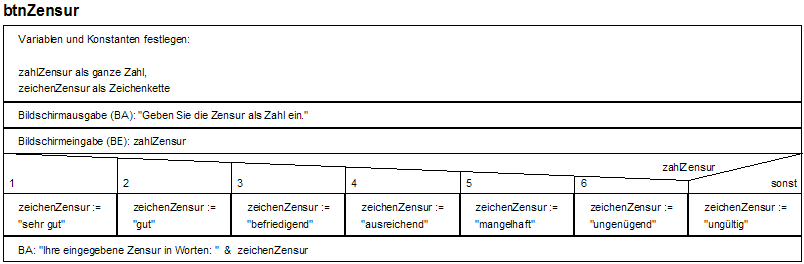

<!--

author:   Sebastian Zug & André Dietrich
email:    zug@ovgu.de   & andre.dietrich@ovgu.de
version:  0.0.1
language: de
narrator: Deutsch Female

script:   https://felixhao28.github.io/JSCPP/dist/JSCPP.es5.min.js

@JSCPP.__eval
<script>
  try {
    var output = "";
    JSCPP.run(`@0`, `@1`, {stdio: {write: s => { output += s }}});
    output;
  } catch (msg) {
    var error = new LiaError(msg, 1);

    try {
        var log = msg.match(/(.*)\nline (\d+) \(column (\d+)\):.*\n.*\n(.*)/);
        var info = log[1] + " " + log[4];

        if (info.length > 80)
          info = info.substring(0,76) + "..."

        error.add_detail(0, info, "error", log[2]-1, log[3]);
    } catch(e) {}

    throw error;
    }
</script>
@end


@JSCPP.eval: @JSCPP.__eval(@input, )

@JSCPP.eval_input: @JSCPP.__eval(@input,`@input(1)`)

@output: <pre class="lia-code-stdout">@0</pre>


-->

# Vorlesung IV - Kontrollstrukturen

**Fragen an die heutige Veranstaltung ...**

* Welche Fallstricke lauern bei expliziter und impliziter Typumwandlung?
* Wann sollte man eine explizite Umwandlung vornehmen?
* Wie lassen sich Kontrollflüsse grafisch darstellen?
* Welche Konfigurationen erlaubt die `for`-Schleife?
* In welchen Funktionen (Verzweigungen, Schleifen) ist Ihnen das Schlüsselwort
  `break` bekannt?
* Worin liegt der zentrale Unterschied der `while` und `do-while` Schleife?
* Recherchieren Sie Beispiele, in denen `goto`-Anweisungen Bugs generierten.

--------------------------------------------
Link auf die aktuelle Vorlesung im Versionsmanagementsystem GitHub

https://github.com/liaScript/CCourse/blob/master/04_Kontrollstrukturen.md

------------------------------------------------

**Wie weit sind wir schon gekommen?**

ANSI C (C89)/ Schlüsselwörter:

| Standard    |                |          |            |          |            |
|:------------|:---------------|:---------|:-----------|:---------|:-----------|
| **C89/C90** | auto           | `double` | `int`      | struct   | break      |
|             | else           | `long`   | switch     | case     | enum       |
|             | register       | typedef  | `char`     | extern   | return     |
|             | union          | const    | `float`    | `short`  | `unsigned` |
|             | continue       | for      | `signed`   | `void`   | default    |
|             | goto           | `sizeof` | volatile   | do       | if         |
|             | static         | while    |            |          |            |
| **C99**     | `_Bool`          | _Complex | _Imaginary | inline   | restrict   |
| **C11**     | _Alignas       | _Alignof | _Atomic    | _Generic | _Noreturn  |
|             |_Static\_assert | \_Thread\_local | |   |          |            |

Standardbibliotheken

| Name         | Bestandteil | Funktionen                           |
|:-------------|:------------|:-------------------------------------|
| `<stdio.h>`  |             | Input/output (`printf`)              |
| `<stdint.h>` | (seit C99)  | Integer Datentypen mit fester Breite |
| `<float.h>`  |             | Parameter der Floatwerte             |
| `<limits.h>` |             | Größe der Basistypen                 |

https://en.cppreference.com/w/c/header


## 1. Cast-Operatoren

> *Casting* beschreibt die Konvertierung eines Datentypen in einen anderen. Dies
> kann entweder automatisch durch den Compiler vorgenommen oder durch den
> Programmierer angefordert werden.

Im erstgenannten Fall spricht man von

* impliziten Datentypumwandlung, im zweiten von
* expliziter Typumwandlung.

Es wird bei Methoden vorausgesetzt, dass der Compiler eine Typumwandlung auch
wirklich unterstützt. Eine Typumwandlung kann einschränkend oder erweiternd
sein!

### Implizite Datentypumwandlung

Operanden dürfen in C einen Variablen mit unterschiedlichen Datentyp verknüpfen.
Die implizite Typumwandlung generiert einen gemeinsamen Datentyp, der in einer
Rangfolge am weitesten oben steht. Das Ergebnis ist ebenfalls von diesem Typ.

1. `char` -> `short` -> `int` -> `long` -> `long long` / `float` -> `double` -> `long double`
2. Die Rangfolge bei ganzzahligen Typen ist unabhängig vom Vorzeichen.
3. Standarddatentypen haben einen höheren Rang als erweiterte Ganzzahl-Typen aus
   `<stdint.h>` wie `int_least32_t`, obwohl beide die gleiche Breite besitzen.

Dabei sind einschränkende Konvertierungskonfigurationen kritisch zu sehen:

* Bei der Umwandlung von höherwertigen Datentypen in niederwertigere Datentypen
  kann es zu Informationsverlust kommen.
* Der Verleich von `signed`- und `unsigned`-Typen kann falsch sein. So kann
  beispielsweise `-1 > 1U` wahr sein.

```cpp                     NumberFormats.c
#include <stdio.h>

int main()
{
  int i = -1;
  unsigned int limit = 200;

  if ( i < limit )
    printf(" i < limit \n");
  return 0;
}
```
@JSCPP.eval


* Die Division zweier `int`-Werte gibt immer nur einen Ganzzahlanteil zurück.
  Hier findet keine automatische Konvertierung in eine Gleitpunktzahl statt.
* die Umwandlung eines negativen Wertes in einen Typ ohne Vorzeichen
+ Bei der Umwandlung von ganz großen Zahlen (beispielsweise `long long`) in
  einen Gleitpunkttyp kann es passieren, dass die Genauigkeit nicht mehr
  ausreicht, um die Zahl genau darzustellen.

**Vermischen von Ganzzahl und Gleitkommawerten**

> 6.3.1.4 Real floating and integer - When a finite value of real floating type
> is converted to an integer type other than `_Bool`, the fractional part is
> discarded (i.e., the value is truncated toward zero). If the value of the
> integral part cannot be represented by the integer type, the behavior is
> undefined.
>
> __C99 Standard__

```cpp                     NumberFormats.c
#include <stdio.h>

int main()
{
  float f=3.14;
  int i=f;
  printf("float value = %f / Integer-Anteil %d \n", f, i);
  return 0;
}
```
@JSCPP.eval

Die Headerdatei `<fenv.h>` definiert verschiedene Einstellungen für das Rechnen
mit Gleitpunktzahlen. Unter anderem können Sie das Rundungsverhalten von
Gleitpunkt-Arithmetiken über entsprechende Makros anpassen.

> **Achtung:** Implizite Typumwandlung bergen erhebliche Risiken in sich!

```cpp                     Overflow.c
#include <stdio.h>

int main()
{
  float f = -3.14;
  unsigned int i = f;
  printf("float value = %f / Integer-Anteil %d \n", f, i);
  printf("float value = %f / Integer-Anteil %u \n", f, i);
  return 0;
}
```

``` bash @output
▶ ./a.out
float value = -3.140000 / Integer-Anteil -3
float value = -3.140000 / Integer-Anteil 4294967293
```

### Explizite Datentypumwandlung

Anders als bei der impliziten Typumwandlung bei der expliziten Typumwandlung der
Zieldatentyp konkret im Code angegeben.

```c
(Zieltyp) ausdruck;
```

```cpp                    VolumeSphere.c
#include <stdio.h>

int main()
{
  int i = 3;
  int j = 4;
  printf("int i / int j   = %d \n", i / j);
  printf("float(i / j)    = %f \n", (float)(i / j));
  printf("float i / int j = %f \n", (float) i / j);
  return 0;
}
```
@JSCPP.eval

## 2. Kontrollfluß

Bisher haben wir Programme entworfen, die eine sequenzielle Abfolge von
Anweisungen enthielt.

<!-- style="width: 80%; max-width: 260px; display: block; margin-left: auto; margin-right: auto;" -->
````
  ┏━━━━━━━━━━━━━━┓
  ┃ Anweisung  1 ┃
  ┣━━━━━━━━━━━━━━┫
  ┃ Anweisung  2 ┃
  ┣━━━━━━━━━━━━━━┫
  ┃ Anweisung ...┃
  ┣━━━━━━━━━━━━━━┫
  ┃ Anweisung  n ┃  
  ┗━━━━━━━━━━━━━━┛
````

Diese Einschränkung wollen wir nun in 3 Formen überwinden:

1. **Verzweigungen**: In Abhängigkeit von einer Bedingung wird der Programmfluß
   an unterschiedlichen Stellen fortgesetzt.

   Beispiel: Wenn bei einer Flächenberechnung ein Ergebnis kleiner Null
   generiert wird, erfolgt eine Fehlerausgabe. Sonst wird im Programm
   fortgefahren.

2. **Schleifen (Iteration)**: Ein Anweisungsblock wird so oft wiederholt, bis
   eine Abbruchbedingung erfüllt wird.

   Beispiel: Ein Datensatz wird durchlaufen um die Gesamtsumme einer Spalte zu
   bestimmen. Wenn der letzte Eintrag erreicht ist, wird der Durchlauf
   abgebrochen und das Ergebnis ausgegeben.

3. **Sprünge**: Die Programmausführung wird mithilfe von Sprungmarken an einer
   anderen Position fortgesetzt.

   Beispiel: Statt die nächste Anweisung auszuführen wird (zunächst) an eine
   ganz andere Stelle im Code gesprungen.

### Verzweigungen

Verzweigungen entfalten mehrere mögliche Pfade für die Ausführung des Programms.
__EINE__ Möglichkeit der Strukturierung für diese spezifische Zuordnung der
Anweisung zu bestimmten Bedingungen sind Nassi-Shneidermann Diagramme
[Link](https://de.wikipedia.org/wiki/Nassi-Shneiderman-Diagramm) gemäß DIN
66261.

---

Beispiel für eine mehrstufige Verzweigung (`if`)

<!-- style="width: 300px;" -->[^1]

---

Beispiel für eine mehrfache Verzweigung (`switch`)

<!-- width="900px" -->[^1]

[^1]: Nassi-Shneidermann Diagramme (Quelle:
      https://de.wikipedia.org/wiki/Nassi-Shneiderman-Diagramm#/media/File:LineareAnw.png
      (Autor Renzsorf))

#### `if`-Anweisungen

Im einfachsten Fall definiert die `if`-Anweisung eine einzelne bedingte
Anweisung oder einen Anweisungsblock. Sie kann mit `else` um eine Alternative
erweitert werden.

```c
if(Bedingung) Anweisung;  // <- Einzelne Anweisung

if(Bedingung){            // <- Beginn Anweisungsblock
   Anweisung;
   Anweisung;
}                         // <- Ende Anweisungsblock
```

Optional kann eine alternative Anweisung angegeben werden, wenn die Bedingung
nicht erfüllt wird:

```c
if(Bedingung)
  Anweisung;
else
  Anweisung;
```

Mehrere Fälle können verschachtelt abgefragt werden:

```c
if(Bedingung)
  Anweisung;
else
  if(Bedingung)
    Anweisung;
  else
    Anweisung;
```

```cpp                     IfExample.c
#include <stdio.h>

int main(){
	char c = 5;
  if (c == 5)
    printf("Die Aussage ist wahr.\n");
  else if ((c < 10) && (c > 0))
    printf("Auch diese Aussage ist wahr!\n");
	return 0;
}
```
@JSCPP.eval

**Weitere Beispiele für Bedingungen**

Die Bedingungen können als logische UND artithmetische Operationen / Vergleiche
formuliert werden.

| Ausdruck     | Bedeutung                                       |
|--------------|-------------------------------------------------|
| `if (a)`     | `if (a != 0)`                                   |
| `if (!a)`    | `if (a == 0)`                                   |
| `if (a > b)` | `if (!(a <= b))`                                |
| `if ((a-b))` | `ìf (a != b)`                                   |
| `if (a & b)` | $a>0$, $b>0$, mindestens ein $i$ mit $a_i==b_i$ |

**Mögliche Fehlerquellen**

1. Zuweisungs- statt Vergleichsoperator in der Bedingung (kein Compilerfehler)
2. Bedingung ohne Klammern (Compilerfehler)
3. `;` hinter der Bedingung (kein Compilerfehler)
4. Multiple Anweisungen ohne Anweisungsblock
5. Komplexität der Statements

**Beispiel**

<!-- width="100%" -->

| WL  | WG  | WR  | Verhalten                  |
|:----|:----|:----|:---------------------------|
| 0   | 0   | 0   | Vorwärts                   |
| 0   | 0   | 1   | Vorwärts                   |
| 0   | 1   | 0   | Drehung Links, Vorwärts    |
| 0   | 1   | 1   | Drehung Links, Vorwärts    |
| 1   | 0   | 0   | Drehung 180 Grad, Vorwärts |
| 1   | 0   | 1   | Vorwärts                   |
| 1   | 1   | 0   | Drehung 180 Grad, Vorwärts |
| 1   | 1   | 1   | Drehung 180 Grad, Vorwärts |


```cpp                     IfExample.c
#include <stdio.h>

int main(){
  int WL, WG, WR;
  WL = 1; WG = 0; WR =1;
  if (((!WL) & (WG) & (!WR)) || ((!WL) & (WG) & (WR)))
    printf("Drehung Links\n");
  if (((WL) & (!WG) & (!WR)) || ((WL) & (WG) & (!WR)) || ((WL) & (WG) & (!WR)))
    printf("Drehung 180 Grad\n");
  printf("Vorwaerts\n");
	return 0;
}
```
@JSCPP.eval

**Sehen Sie mögliche Vereinfachungen des Codes?**

#### `switch`-Anweisungen

*"Too many ifs - I think I switch"* [^1](http://www.peacesoftware.de/ckurs7.html)

Eine übersichtlichere Art der Verzweigung für viele, sich ausschließende
Bedingungen wird durch die `switch`-Anweisung bereitgestellt. Sie wird in der
Regel verwendet, wenn eine unter vielen Bedingungen ausgewählt werden soll.
Trifft keine der Bedingungen zu, wird der `default`-Fall aktiviert.

```c
switch(Variable)
 {
   case const-expr: Anweisung break;
   case const-expr:
      Anweisungen
      break;
   case const-expr: Anweisungen break;
   default: Anweisungen
 }
```

```cpp                     SwitchExample.c
#include <stdio.h>

int main() {
  int a=50, b=60;
  char operator;
  printf("Bitte Operator definieren (+,-,*,/): ");
  operator = getchar();

  switch(operator) {
    case '+':
      printf("%d + %d = %d \n",a ,b ,a+b);
      break;
    case '-':
      printf("%d - %d = %d \n", a, b, a-b);
      break;
    case '*':
      printf("%d * %d = %d \n", a, b, a*b);
      break;
    case '/':
      printf("%d / %d = %d \n", a, b, a/b);
      break;
    default:
      printf("%c? kein Rechenoperator \n", operator);
  }

  return 0;
}
```
``` text                  stdin
+
```
@JSCPP.eval_input

Im Unterschied zu einer `if`-Abfrage wird in den unterschiedlichen Fällen immer
nur auf Gleichheit geprüft! Eine abgefragte Konstante darf zudem nur einmal
abgefragt werden.


```cpp
// Fehlerhafte case Blöcke
switch(x)
{
   case x < 100: // das ist ein Fehler
     y = 1000;
  break;

  case x > 100: // das ist genauso falsch
     y = 5000;
     z = 3000;
  break;
}
```

Und wozu brauche ich das `break`? Ohne das `break` am Ende eines Falls werden
alle darauf folgenden Fälle bis zum Ende des `switch` oder dem nächsten `break`
zwingend ausgeführt.

```cpp                     SwitchBreak.c
#include <stdio.h>

int main() {
  int a=5;

  switch(a) {
    case 5:   // Multiple Konstanten
    case 6:
    case 7:   
      printf("Der Wert liegt zwischen 4 und 8\n");
    case 3:
      printf("Der Wert ist 3 \n");
      break;
    case 0:
      printf("Der Wert ist 0 \n");
    default: printf("Wert in keiner Kategorie\n");}

  return 0;
}
```
@JSCPP.eval

Unter Ausnutzung von `break` können Kategorien definiert werden, die aufeinander aufbauen. dann übergreifend "aktiviert" werden.

```cpp                     MovementDetection.c
#include <stdio.h>

// Bewegung im Schlafzimmer - dort Licht an und im Bad;
// Bewegung im Flur - dort Licht an und im Wohnzimmer;

int main() {
  char room    = 'S';  // Schafzimmer

  printf("Licht an im/in ... ");
  switch(room) {
    case 'S': printf("Schlafzimmer \n");
    case 'B': printf("Bad \n");
              break;
    case 'F': printf("Flur \n");
    case 'W': printf("Wohnzimmer \n");
              break;
    case 'K': printf("Kueche \n");
              break;
    default:  printf("Fehler!\n");}

  return 0;
}
```
@JSCPP.eval


### Schleifen

Schleifen dienen der Wiederholung von Anweisungsblöcken – dem sogenannten
Schleifenrumpf oder Schleifenkörper –, solange die Schleifenbedingung als
Laufbedingung gültig bleibt bzw. als Abbruchbedingung nicht eintritt. Schleifen,
deren Schleifenbedingung immer zur Fortsetzung führt oder die keine
Schleifenbedingung haben, sind *Endlosschleifen*.

Schleifen können verschachtelt werden. Eine innerhalb eines Schleifenkörpers
können weitere Schleifen erzeugt und ausgeführt werden. Zur Beschleunigung des
Programmablaufs werden Schleifen oft durch den Compiler entrollt (*Enrollment*).

Grafisch lassen sich die wichtigsten Formen in mit der Nassi-Shneiderman
Diagrammen wie folgt darstellen:

* Iterationssymbol

  ````
    __________________________________________________________________
   |                                                                  |
   |  zähle [Variable] von [Startwert] bis [Endwert], Schrittweite 1  |
   |  ________________________________________________________________|
   | |                                                                |
   | |  Anweisungsblock 1                                             |
   |_|________________________________________________________________|
  ````

* Wiederholungsstruktur mit vorausgehender Bedingungsprüfung

  ````
    __________________________                                         
   |                          |
   |  solange Bedingung wahr  |
   |  ________________________|
   | |                        |
   | |  Anweisungsblock 1     |
   |_|________________________|
  ````

* Wiederholungsstruktur mit nachfolgender Bedingungsprüfung

  ````
    __________________________                                         
   | |                        |
   | |  Anweisungsblock 1     |
   | |________________________|
   |                          |
   |   solange Bedingung wahr |
   |__________________________|
  ````


Die Programmiersprache C kennt diese drei Formen über die Schleifenkonstrukte
`for`, `while`, `do while`.


#### `for`-Schleife

Der Parametersatz der `for`-Schleife besteht aus maximal 2 Anweisungen und einer
Bedingungen. Mit diesen wird ein  **Schleifenzähler** initiert, dessn
Manipulation spezifiziert und das Abbruchkriterium festgelegt. Häufig wird die
Variable mit jedem Durchgang inkrementiert oder dekrementiert, um dann anahd des
zweiten Ausdruck evaluiert zu werden. Es wird überprüft, ob die Schleife
fortgesetzt oder abgebrochen werden soll. Letzterer Fall tritt ein, wenn dieser
den Wert 0 annimmt – also der Ausdruck false (falsch) ist.

```c
// generisches Format der for-Schleife
for(Initialisierung; Bedingung; Reinitialisierung) {
   // Anweisungen
}

// for-Schleife als Endlosschleife
for(;;){
   // Anweisungen
}
```

```cpp                     magicSquare.c
#include <stdio.h>

int main(){
	int i;
  for (i = 1; i<=10; i++)
    printf("%d ", i);

  printf("\nNach der Schleife hat i den Wert %d\n" ,i);
	return 0;
}
```
@JSCPP.eval

**Beliebte Fehlerquellen**

* Semikolon hinter der schließenden Klammner von `for`
* Kommas anstatt Semikolon zwischen den Parametern von `for`
* fehlerhafte Konfiguration von Zählschleifen
* vergessen, dass die Zählvariable nach dem Ende der Schleife über dem
  Abbruchkriterium liegt.

```cpp                     SemicolonAfterFor.c
#include <stdio.h>

int main(){
  int i;
  for (i = 1; i<10; i++);
    printf("%d ", i);

  printf("Das ging jetzt aber sehr schnell ... \n %d" ,i);
  return 0;
}
```
@JSCPP.eval

#### `while`-Schleife

Während bei der `for`-Schleife auf ein n-maliges Durchlaufen Anweisungsfolge
konfiguriert wird, definiert die `while`-Schleife nur ein Bedingung für den
Fortführung/Abbruch.

```c
// generisches Format der while-Schleife
while (Bedingung)
  Anweisungen;

while (Bedingung){
    Anweisungen;
    Anweisungen;
}
```

```cpp                     count_spaces.c
#include <stdio.h>

int main(){
  int c;
  int zaehler = 0;
  printf("Leerzeichenzähler - zum Beenden \"_\" [Enter]\n");
  while((c = getchar()) != '_')
  {
    if(c == ' ')
      zaehler++;
  }
  printf("Anzahl der Leerzeichen: %d\n", zaehler);
  return 0;}

```

``` text @output
▶ ./a.out
Leerzeichenzähler - zum Beenden "_" + [Enter]
TU Bergakademie Freiberg,
Prozedurale Programmierung_
Anzahl der Leerzeichen: 3
```

Dabei sollte erwähnt werden, dass eine `while`-Schleife eine `for`-Schleife
ersetzen kann.

```cpp
// generisches Format der while-Schleife
i = 0;
while (i<10){
   // Anweisungen;
   i++;
}

for (i==0; i<10; i++){
   // Anweisungen;
}
```

#### `do-while`-Schleife

Im Gegensatz zur `while`-Schleife führt die `do-while`-Schleife die Überprüfung
des Abbruchkriteriums erst am Schleifenende aus.

```cpp
// generisches Format der while-Schleife
do
   Anweisung;
 while (Bedingung);
```

Welche Konsequenz hat das? Die `do-while`-Schleife wird in jedem Fall einmal
ausgeführt.


```cpp                     GetChar.c
#include <stdio.h>

int main(){
	char auswahl;
	printf("Naechster Menuepunkt? ");
  printf("-1- Auswahl1\n");
  printf("-2- Auswahl2\n");
  printf("-3- Auswahl3\n");
  printf("-4- Programmende \n\n");
  printf("\n\n Ihre Auswahl: ");

  do {
     scanf("%d", &auswahl);
     switch(auswahl) {
        case 1  : printf("\n Das war Auswahl 1 \n"); break;
        case 2  : printf("\n Das war Auswahl 2 \n"); break;
        case 3  : printf("\n Das war Auswahl 3 \n"); break;
        case 4  : printf("\n Programmende \n"); break;
        default : printf("\n Unbekannte Auswahl \n");
     }
  } while(auswahl!=4);
	return 0;
}
```

#### Kontrollierte Sprünge aus Schleifen

Zum vorzeitigen Verlassen der Schleife kann in allen drei Fällen `break` benutzt
werden. Damit wird aber nur die unmittelbar umgebende Schleife beendet!

```cpp                     breakForLoop.c
#include <stdio.h>

int main(){
	int i;
  for (i = 1; i<10; i++){
      if (i == 5) break;
      printf("%d ", i);
  }
  printf("\nUnd vorbei ... i ist jetzt %d\n" ,i);
	return 0;
}
```
@JSCPP.eval

Eine weitere wichtige Eingriffsmöglichkeit für Schleifenkonstrukte bietet
`continue`. Damit wird nicht die Schleife insgesamt, sondern nur der aktuelle
Ausführung gestoppt.

```cpp                     continueForLoop.c
#include <stdio.h>

int main(){
	int i;
  for (i = -5; i<6; i++){
      if (i == 0) continue;
      printf("%5.1f \n", 12. / i);
  }
	return 0;
}
```
@JSCPP.eval

### GoTo or not GoTo?

`Goto` erlaubt es Sprungmarken (Labels) zu definieren und bei der Anweisung, die
diese referenziert die Ausführung fortzusetzen. Konsequenterweise ist damit aber
eine nahezu beliebige Auflösung der Ordnung des Codes möglich.

> Use of `goto` statement is highly discouraged in any programming language
> because it makes difficult to trace the control flow of a program, making the
> program hard to understand and hard to modify. Any program that uses a `goto`
> can be rewritten to avoid them.

```cpp                     gotoExample.c
#include <stdio.h>

int main(){
	int i;
  label:
       printf("%d ", i);
       i++;
       if (i <= 10) goto label;
	return 0;
}
```
@JSCPP.eval

Ein wichtiger Fehler, der häufig immer mit goto in Verbindung gebracht wird, hat
aber eigentlich nichts damit zu tun
[Apple-SSL Bug](http://www.spiegel.de/netzwelt/web/goto-fail-apples-furchtbarer-fehler-a-955154.html)


## Beispiel des Tages

Das Codebeispiel des Tages führt die Berechnung eines sogenannten magischen
Quadrates vor.

Das Lösungsbeispiel stammt von der Webseite https://rosettacode.org die für das
konkrete Problem
[Link](https://rosettacode.org/wiki/Magic_squares_of_odd_order#C) und viele
andere "Standardprobleme" Lösungen in unterschiedlichen Sprachen präsentiert.
Sehr lesenswerte Sammlung!

```cpp                     magicSquare.c
#include <stdio.h>

int f(int n, int x, int y)
{
  return (x + y*2 + 1)%n;
}

int main() {
  int i, j, n;

  //Input must be odd and not less than 3.
  n = 7;
  if (n < 3 || (n % 2) == 0) return 2;

  for (i = 0; i < n; i++) {
    for (j = 0; j < n; j++)
      printf("% 4d", f(n, n - j - 1, i)*n + f(n, j, i) + 1);
    putchar('\n');
  }
  printf("\n Magic Constant: %d.\n", (n*n+1)/2*n);

  return 0;
}
```
@JSCPP.eval
