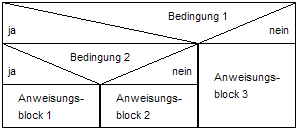
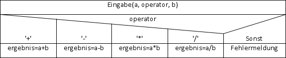

<!--

author:   Sebastian Zug & André Dietrich & Galina Rudolf
email:    sebastian.zug@informatik.tu-freiberg.de & andre.dietrich@ovgu.de & Galina.Rudolf@informatik.tu-freiberg.de
version:  0.0.1
language: de
narrator: Deutsch Female

import: https://raw.githubusercontent.com/liaScript/rextester_template/master/README.md
-->

# Vorlesung IV - Kontrollstrukturen

**Fragen an die heutige Veranstaltung ...**

* Welche Fallstricke lauern bei expliziter und impliziter Typumwandlung?
* Wann sollte man eine explizite Umwandlung vornehmen?
* Wie lassen sich Kontrollflüsse grafisch darstellen?
* Welche Konfigurationen erlaubt die `for`-Schleife?
* In welchen Funktionen (Verzweigungen, Schleifen) ist Ihnen das Schlüsselwort
  `break` bekannt?
* Worin liegt der zentrale Unterschied der `while` und `do-while` Schleife?
* Recherchieren Sie Beispiele, in denen `goto`-Anweisungen Bugs generierten.

--------------------------------------------
Hier geht es zur interaktiven Version des Kurses [LiaScript](https://liascript.github.io/course/?https://raw.githubusercontent.com/SebastianZug/CCourse/master/04_Kontrollstrukturen.md#1)

----------------------------------------------------------------------
{{1}}
**Wie weit sind wir schon gekommen?**

{{1}}
ANSI C (C89)/ Schlüsselwörter:

{{1}}
| Standard    |                |          |            |          |            |
|:------------|:---------------|:---------|:-----------|:---------|:-----------|
| **C89/C90** | `auto`         | `double` | `int`      | struct   | break      |
|             | else           | `long`   | switch     | case     | enum       |
|             | `register`     | typedef  | `char`     | `extern` | return     |
|             | union          | `const`  | `float`    | `short`  | `unsigned` |
|             | continue       | for      | `signed`   | `void`   | default    |
|             | goto           | `sizeof` | `volatile` | do       | if         |
|             | `static`       | while    |            |          |            |
| **C99**     | `_Bool`        | _Complex | _Imaginary | inline   | restrict   |
| **C11**     | _Alignas       | _Alignof | _Atomic    | _Generic | _Noreturn  |
|             |_Static\_assert | \_Thread\_local | |   |          |            |

{{1}}
Standardbibliotheken

{{1}}
| Name         | Bestandteil | Funktionen                           |
|:-------------|:------------|:-------------------------------------|
| `<stdio.h>`  |             | Input/output                         |
| `<stdint.h>` | (seit C99)  | Integer Datentypen mit fester Breite |
| `<float.h>`  |             | Parameter der Floatwerte             |
| `<limits.h>` |             | Größe der Basistypen                 |

    {{1}}
[C standard library header files](https://en.cppreference.com/w/c/header)


## 1. Cast-Operatoren

> *Casting* beschreibt die Konvertierung eines Datentypen in einen anderen. Dies
> kann entweder automatisch durch den Compiler vorgenommen oder durch den
> Programmierer angefordert werden.

Im erst genannten Fall spricht man von

* impliziten Typumwandlung, im zweiten von
* expliziter Typumwandlung.

Es wird bei Methoden vorausgesetzt, dass der Compiler eine Typumwandlung auch
wirklich unterstützt. Eine Typumwandlung kann einschränkend oder erweiternd
sein!

### Implizite Datentypumwandlung

Operanden dürfen in C eine Variable mit unterschiedlichen Datentyp verknüpfen.
Die implizite Typumwandlung generiert einen gemeinsamen Datentyp, der in einer
Rangfolge am weitesten oben steht. Das Ergebnis ist ebenfalls von diesem Typ.

1. `char` -> `short` -> `int` -> `long` -> `long long` / `float` -> `double` -> `long double`
2. Die Rangfolge bei ganzzahligen Typen ist unabhängig vom Vorzeichen.
3. Standarddatentypen haben einen höheren Rang als erweiterte Ganzzahl-Typen aus
   `<stdint.h>` wie `int_least32_t`, obwohl beide die gleiche Breite besitzen.

Dabei sind einschränkende Konvertierungskonfigurationen kritisch zu sehen:

* Bei der Umwandlung von höherwertigen Datentypen in niederwertigere Datentypen
  kann es zu Informationsverlust kommen.
* Der Verleich von `signed`- und `unsigned`-Typen kann zum falschen Ergebnis
  führen. So kann beispielsweise `-1 > 1U` wahr sein.

```cpp                     NumberFormats.c
#include <stdio.h>

int main()
{
  int i = -1;
  unsigned int limit = 200;

  if ( i > limit )
    printf(" i > limit \n");  
  return 0;
}
```
@Rextester.C


{{1}}
**Konvertierung zu `_Bool`**

{{1}}
> *6.3.1.2  When any scalar value is converted to _Bool, the result is 0 if the*
> *value compares equal to 0; otherwise, the result is 1*
>
> C99 Standard

{{1}}
**Konvertierung zum `int`-Typ**

{{1}}
Beim Konvertieren des Wertes von einem in das andere `int`-Typ

{{1}}
* bleibt der Wert unverändert, wenn die Darstellung im Zieltyp möglich ist,
* anderenfalls ist das Ergebnis implementierungabhängig bzw. führt zu einer
  Fehlermeldung

{{2}}
**Vermischen von Ganzzahl und Gleitkommawerten**

{{2}}
* Die Division zweier `int`-Werte gibt immer nur einen Ganzzahlanteil zurück.
  Hier findet keine automatische Konvertierung in eine Gleitpunktzahl statt.
* Bei der Umwandlung von ganz großen Zahlen (beispielsweise `long long`) in
  einen Gleitpunkttyp kann es passieren, dass die Zahl nicht mehr darzustellbar ist.

{{2}}
> *6.3.1.4 Real floating and integer - When a finite value of real floating type*
> *is converted to an integer type other than `_Bool`, the fractional part is*
> *discarded (i.e., the value is truncated toward zero). If the value of the*
> *integral part cannot be represented by the integer type, the behavior is*
> *undefined.*
>
> C99 Standard

{{2}}
```cpp                     NumberFormats.c
#include <stdio.h>

int main()
{
  float f=3.14;
  int i=f;
  printf("float value = %f / Integer-Anteil %d \n", f, i);
  return 0;
}
```
@Rextester.C

{{3}}
> **Achtung:** Implizite Typumwandlungen bergen erhebliche Risiken in sich!

{{3}}
```cpp                     Overflow.c
#include <stdio.h>

int main()
{
  float f = -3.14;
  unsigned int i = f;
  printf("float value = %f / Integer-Anteil %u \n", f, i);
  printf("float value = %f / Integer-Anteil %d \n", f, i);
  return 0;
}
```
@Rextester.C

<!-- float value = -3.140000 / Integer-Anteil -3 -->
<!-- float value = -3.140000 / Integer-Anteil 4294967293  -->


{{3}}
Die Headerdatei `<fenv.h>` definiert verschiedene Einstellungen für das Rechnen
mit Gleitpunktzahlen. Unter anderem können Sie das Rundungsverhalten von
Gleitpunkt-Arithmetiken über entsprechende Makros anpassen.


### Explizite Datentypumwandlung

Anders als bei der impliziten Typumwandlung wird bei der expliziten
Typumwandlung der Zieldatentyp konkret im Code angegeben.

```c
(Zieltyp) ausdruck;
```

```cpp                    VolumeSphere.c
#include <stdio.h>

int main()
{
  int i = 3;
  int j = 4;
  printf("int i / int j   = %d \n", i / j);
  printf("float(i / j)    = %f \n", (float)(i / j));
  printf("float i / int j = %f \n", (float) i / j);
  return 0;
}
```
@Rextester.C

Im Beispiel wird in der ersten `printf`-Anweisung das Ergebnis der ganzzahlegen
Division `i/j` in `float` konvertiert, in der zweiten `printf`-Anweisung die
Variable `i`.

## 2. Kontrollfluss

Bisher haben wir Programme entworfen, die eine sequenzielle Abfolge von
Anweisungen enthielt.

<!-- style="width: 100%; max-width: 460px; display: block; margin-left: auto; margin-right: auto;" -->
````ascii
  +---------------+   
  | Anweisung  1  |   |
  +---------------+   |
  | Anweisung  2  |   |
  +---------------+   |  Sequenz der Abarbeitung
  | Anweisung ... |   |
  +---------------+   |
  | Anweisung  n  |   V
  +---------------+   
````

Diese Einschränkung wollen wir nun mit Hilfe weiterer Anweisungen überwinden:

1. **Verzweigungen (Selektion)**: In Abhängigkeit von einer Bedingung wird der
   Programmfluss an unterschiedlichen Stellen fortgesetzt.

   Beispiel: Wenn bei einer Flächenberechnung ein Ergebnis kleiner Null
   generiert wird, erfolgt eine Fehlerausgabe. Sonst wird im Programm
   fortgefahren.

2. **Schleifen (Iteration)**: Ein Anweisungsblock wird so oft wiederholt, bis
   eine Abbruchbedingung erfüllt wird.

   Beispiel: Ein Datensatz wird durchlaufen um die Gesamtsumme einer Spalte zu
   bestimmen. Wenn der letzte Eintrag erreicht ist, wird der Durchlauf
   abgebrochen und das Ergebnis ausgegeben.


Des Weiteren verfügt C über **Sprünge**: die Programmausführung wird mit Hilfe
von Sprungmarken an einer anderen Position fortgesetzt. Formal sind sie jedoch
nicht notwendig.

Beispiel: Statt die nächste Anweisung auszuführen, wird (zunächst) an eine ganz
andere Stelle im Code gesprungen.

### Verzweigungen

Verzweigungen entfalten mehrere mögliche Pfade für die Ausführung des Programms.
**EINE** Möglichkeit der Strukturierung für diese spezifische Zuordnung der
Anweisung zu bestimmten Bedingungen sind [Nassi-Shneidermann Diagramme](https://de.wikipedia.org/wiki/Nassi-Shneiderman-Diagramm) gemäß DIN
66261.

---

Beispiel für eine mehrstufige Verzweigung (`if`)

<!--
style=" width: 60%;
        max-width: 400px;
        min-width: 200px;
        display: block;
        margin-left: auto;
        margin-right: auto;"
-->

---

Beispiel für eine mehrfache Verzweigung (`switch`)

<!--
style=" width: 100%;
        max-width: 700px;
        min-width: 400px;
        display: block;
        margin-left: auto;
        margin-right: auto;"
-->

---


<!--- Kommentar? img/Nassi_switch.png --->


Quelle: [Nassi-Shneiderman-Diagramm (Autor Renzsorf)](https://de.wikipedia.org/wiki/Nassi-Shneiderman-Diagramm)

#### `if`-Anweisungen

Im einfachsten Fall enthält die `if`-Anweisung eine einzelne bedingte
Anweisung oder einen Anweisungsblock. Sie kann mit `else` um eine Alternative
erweitert werden.

Zum Anweisungsblock werden die Anweisungen mit geschweiften Klammern (`{` und
`}`) zusammengefasst.

```c
if(Bedingung) Anweisung;  // <- Einzelne Anweisung

if(Bedingung){            // <- Beginn Anweisungsblock
   Anweisung;
   Anweisung;
}                         // <- Ende Anweisungsblock
```

Optional kann eine alternative Anweisung angegeben werden, wenn die Bedingung
nicht erfüllt wird:

```c
if(Bedingung){
  Anweisung;
}else{
  Anweisung;
}
```

{{1}}
Mehrere Fälle können verschachtelt abgefragt werden:

{{1}}
```c
if(Bedingung)
  Anweisung;
else
  if(Bedingung)
    Anweisung;
  else
    Anweisung;
    Anweisung;     //!!!
```
{{1}}
> **Merke**: An diesem Beispiel wird deutlich, dass die Klammern für die
> Zuordnung elementar wichtig sind. Die letzte Anweisung gehört NICHT zum zweite
> `else` Zweig sondern zum ersten!

{{1}}
```cpp                     IfExample.c
#include <stdio.h>

int main(){
	char c = 5;
  if (c == 5)
    printf("Die Aussage ist wahr.\n");
  else if ((c < 10) && (c > 0))
    printf("Auch diese Aussage ist wahr!\n");
	return 0;
}
```
@Rextester.C

{{2}}
**Weitere Beispiele für Bedingungen**

{{2}}
Die Bedingungen können als logische UND arithmetische Ausdrücke
formuliert werden.

{{2}}
| Ausdruck     | Bedeutung                                       |
|--------------|-------------------------------------------------|
| `if (a)`     | `if (a != 0)`                                   |
| `if (!a)`    | `if (a == 0)`                                   |
| `if (a > b)` | `if (!(a <= b))`                                |
| `if ((a-b))` | `ìf (a != b)`                                   |
| `if (a & b)` | a>0, b>0, mindestens ein $i$ mit $a_i==b_i$ |

{{3}}
**Mögliche Fehlerquellen**

{{3}}
1. Zuweisungs- statt Vergleichsoperator in der Bedingung (kein Compilerfehler)
2. Bedingung ohne Klammern (Compilerfehler)
3. `;` hinter der Bedingung (kein Compilerfehler)
4. Multiple Anweisungen ohne Anweisungsblock
5. Komplexität der Statements

{{4}}
**Beispiel**

{{4}}
Nehmen wir an, dass wir einen kleinen Roboter aus einem Labyrinth fahren lassen
wollen. Dazu gehen wir davon aus, dass er bereits an einer Wand steht. Dieser soll er mit der "Linke-Hand-Regel" folgen. Dabei wird von einem einfach zusammenhängenden Labyrith ausgegangen.

{{4}}
Die nachfolgende Grafik illustriert den Aufbau des Roboters und die vier möglichen Konfigurationen des Labyrinths, nachdem ein neues Feld betreten wurde.

{{4}}
<!--
style=" width: 80%;
        max-width: 600px;
        min-width: 400px;
        display: block;
        margin-left: auto;
        margin-right: auto;"
-->

{{4}}
| Fall | Bedeutung                                                                                                                         |
| ---- | --------------------------------------------------------------------------------------------------------------------------------- |
| 1.   | Die Wand knickt nach links weg. Unabhängig von WG und WR folgt der Robter diesem Verlauf.                                         |
| 2.   | Der Roboter folgt der linksseitigen Wand.                                                                                         |
| 3.   | Die Wand blockiert die Fahrt. Der Roboter dreht sich nach rechts, damit liegt diese Wandelement nun wieder zu seiner linken Hand. |
| 4.   | Der Roboter folgt dem Verlauf nach einer Drehung um 180 Grad.                                                                     |


{{4}}
| WL  | WG  | WR  | Fall | Verhalten                  |
|:--- |:--- |:--- | ---- |:-------------------------- |
| 0   | 0   | 0   | 1    | Drehung Links, Vorwärts    |
| 0   | 0   | 1   | 1    | Drehung Links, Vorwärts    |
| 0   | 1   | 0   | 1    | Drehung Links, Vorwärts    |
| 0   | 1   | 1   | 1    | Drehung Links, Vorwärts    |
| 1   | 0   | 0   | 2    | Vorwärts                   |
| 1   | 0   | 1   | 2    | Vorwärts                   |
| 1   | 1   | 0   | 3    | Drehung Rechts, Vorwärts   |
| 1   | 1   | 1   | 4    | Drehung 180 Grad           |

{{5}}
```cpp                     IfExample.c
#include <stdio.h>

int main(){
  int WL, WG, WR;
  WL = 0; WG = 1; WR =1;
  if (!WL)                         // Fall 1
    printf("Drehung Links\n");     
  if ((WL) & (WG) & (!WR))         // Fall 3
    printf("Drehung Rechts\n");    
  if ((WL) & (WG) & (WR))          // Fall 4
    printf("Drehung 180 Grad\n");
  if (!((WL) & (WG) & (WR)))       // !Fall 4
    printf("Vorwaerts\n");
	return 0;
}
```
@Rextester.C

{{5}}
**Sehen Sie mögliche Vereinfachungen des Codes?**

#### Zwischenfrage

```cpp                     Test.c
#include <stdio.h>

int main()
{
    int Punkte = 45;
    int Zusatzpunkte = 15;
    if (Punkte + Zusatzpunkte >= 50)
    {
       printf("Test ist bestanden!\n");
       if (Zusatzpunkte >= 15)
       {
          printf("Alle Zusatzpunkte geholt!\n");
       }else{
           if(Zusatzpunkte > 8) {
               printf("Respektable Leistung\n");
           }
       }
    }else{
       printf("Leider durchgefallen!\n");
    }
    return 0;
}
```
@Rextester.C

<div style='position: relative; padding-bottom: 56.25%; padding-top: 35px; height: 0; overflow: hidden;'><iframe sandbox='allow-scripts allow-same-origin allow-presentation' allowfullscreen='true' allowtransparency='true' frameborder='0' height='315' src='https://www.mentimeter.com/embed/087d7e8b2cfccc0d25e0310c176628a7/783b516b2d62' style='position: absolute; top: 0; left: 0; width: 100%; height: 100%;' width='420'></iframe></div>


#### `switch`-Anweisungen

> [*Too many ifs - I think I switch* ](http://www.peacesoftware.de/ckurs7.html)
>
> Berndt Wischnewski

Eine übersichtlichere Art der Verzweigung für viele, sich ausschließende
Bedingungen wird durch die `switch`-Anweisung bereitgestellt. Sie wird in der
Regel verwendet, wenn eine oder einige unter vielen Bedingungen ausgewählt
werden sollen. Das Ergebnis der "expression"-Auswertung soll eine Ganzzahl
(oder `char`-Wert) sein. Stimmt es mit einem "const_expr"-Wert
überein, wird die Ausführung an dem entsprechenden `case`-Zweig fortgesetzt.
Trifft keine der Bedingungen zu, wird der `default`-Fall aktiviert.

```c
switch(expression)
 {
   case const-expr: Anweisung break;
   case const-expr:
      Anweisungen
      break;
   case const-expr: Anweisungen break;
   default: Anweisungen
 }
```

{{1}}
```cpp                     SwitchExample.c
#include <stdio.h>

int main() {
  int a=50, b=60;
  char operator;
  printf("Bitte Operator definieren (+,-,*,/): ");
  operator = getchar();

  switch(operator) {
    case '+':
      printf("%d + %d = %d \n",a ,b ,a+b);
      break;
    case '-':
      printf("%d - %d = %d \n", a, b, a-b);
      break;
    case '*':
      printf("%d * %d = %d \n", a, b, a*b);
      break;
    case '/':
      printf("%d / %d = %d \n", a, b, a/b);
      break;
    default:
      printf("%c? kein Rechenoperator \n", operator);
  }

  return 0;
}
```
``` text                  stdin
+
```
@Rextester.C(false,`@input(1)`)


{{2}}
Im Unterschied zu einer `if`-Abfrage wird in den unterschiedlichen Fällen immer
nur auf Gleichheit geprüft! Eine abgefragte Konstante darf zudem nur einmal
abgefragt werden und muss ganzzahlig oder `char` sein.

{{2}}
```cpp
// Fehlerhafte case Blöcke
switch(x)
{
   case x < 100: // das ist ein Fehler
     y = 1000;
  break;

  case 100.1: // das ist genauso falsch
     y = 5000;
     z = 3000;
  break;
}
```

{{3}}
Und wozu brauche ich das `break`? Ohne das `break` am Ende eines Falls werden
alle darauf folgenden Fälle bis zum Ende des `switch` oder dem nächsten `break`
zwingend ausgeführt.

{{3}}
```cpp                     SwitchBreak.c
#include <stdio.h>

int main() {
  int a=5;

  switch(a) {
    case 5:   // Multiple Konstanten
    case 6:
    case 7:   
      printf("Der Wert liegt zwischen 4 und 8\n");
    case 3:
      printf("Der Wert ist 3 \n");
      break;
    case 0:
      printf("Der Wert ist 0 \n");
    default: printf("Wert in keiner Kategorie\n");}

  return 0;
}
```
@Rextester.C

{{4}}
Unter Ausnutzung von `break` können Kategorien definiert werden, die aufeinander
aufbauen und dann übergreifend "aktiviert" werden.

{{4}}
```cpp                     MovementDetection.c
#include <stdio.h>

// Bewegung im Schlafzimmer - dort Licht an und im Bad;
// Bewegung im Flur - dort Licht an und im Wohnzimmer;

int main() {
  char room    = 'S';  // Schafzimmer

  printf("Licht an im/in ... ");
  switch(room) {
    case 'S': printf("Schlafzimmer \n");
    case 'B': printf("Bad \n");
              break;
    case 'F': printf("Flur \n");
    case 'W': printf("Wohnzimmer \n");
              break;
    case 'K': printf("Kueche \n");
              break;
    default:  printf("Fehler!\n");}

  return 0;
}
```
@Rextester.C


### Schleifen

Schleifen dienen der Wiederholung von Anweisungsblöcken – dem sogenannten
Schleifenrumpf oder Schleifenkörper – solange die Schleifenbedingung als
Laufbedingung gültig bleibt bzw. als Abbruchbedingung nicht eintritt. Schleifen,
deren Schleifenbedingung immer zur Fortsetzung führt oder die keine
Schleifenbedingung haben, sind *Endlosschleifen*.

Schleifen können verschachtelt werden, d.h. innerhalb eines Schleifenkörpers
können weitere Schleifen erzeugt und ausgeführt werden. Zur Beschleunigung des
Programmablaufs werden Schleifen oft durch den Compiler entrollt (*Enrollment*).

Grafisch lassen sich die wichtigsten Formen in mit der Nassi-Shneiderman
Diagrammen wie folgt darstellen:

* Iterationssymbol

  ````
    _____________________________________________________________________
   |                                                                     |
   |  zähle [Variable] von [Startwert] bis [Endwert], mit [Schrittweite] |
   |  ___________________________________________________________________|
   | |                                                                   |
   | |  Anweisungsblock 1                                                |
   |_|___________________________________________________________________|
  ````

* Wiederholungsstruktur mit vorausgehender Bedingungsprüfung

  ````
    __________________________                                         
   |                          |
   |  solange Bedingung wahr  |
   |  ________________________|
   | |                        |
   | |  Anweisungsblock 1     |
   |_|________________________|
  ````

* Wiederholungsstruktur mit nachfolgender Bedingungsprüfung

  ````
    __________________________                                         
   | |                        |
   | |  Anweisungsblock 1     |
   | |________________________|
   |                          |
   |   solange Bedingung wahr |
   |__________________________|
  ````


Die Programmiersprache C kennt diese drei Formen über die Schleifenkonstrukte
`for`, `while` und `do while`.


#### `for`-Schleife

Der Parametersatz der `for`-Schleife besteht aus zwei Anweisungsblöcken und einer
Bedingung, die durch Semikolons getrennt werden. Mit diesen wird ein  
**Schleifenzähler** initiert, dessen
Manipulation spezifiziert und das Abbruchkriterium festgelegt. Häufig wird die
Variable mit jedem Durchgang inkrementiert oder dekrementiert, um dann anhand
eines Ausdrucks evaluiert zu werden. Es wird überprüft, ob die Schleife
fortgesetzt oder abgebrochen werden soll. Letzterer Fall tritt ein, wenn dieser
den Wert 0 annimmt – also der Ausdruck false (falsch) ist.

```c
// generisches Format der for-Schleife
for(Initialisierung; Bedingung; Reinitialisierung) {
   // Anweisungen
}

// for-Schleife als Endlosschleife
for(;;){
   // Anweisungen
}
```

```cpp                     ForLoopExample.c
#include <stdio.h>

int main(){
	int i;
  for (i = 1; i<=10; i++)
    printf("%d ", i);

  printf("\nNach der Schleife hat i den Wert %d\n" ,i);
	return 0;
}
```
@Rextester.C

<iframe width="800" height="500" frameborder="0" src="http://pythontutor.com/iframe-embed.html#code=%23include%20%3Cstdio.h%3E%0A%0Aint%20main%28%29%7B%0A%20%20%20%20int%20i%3B%0A%20%20for%20%28i%20%3D%201%3B%20i%3C10%3B%20i%2B%2B%29%0A%20%20%20%20printf%28%22%25d%20%22,%20i%29%3B%0A%0A%20%20printf%28%22%5CnNach%20der%20Schleife%20hat%20i%20den%20Wert%20%25d%5Cn%22%20,i%29%3B%0A%20%20%20%20return%200%3B%0A%7D&codeDivHeight=400&codeDivWidth=350&curInstr=0&origin=opt-frontend.js&py=cpp&rawInputLstJSON=%5B%5D"> </iframe>


{{1}}
**Beliebte Fehlerquellen**

{{1}}
* Semikolon hinter der schließenden Klammer von `for`
* Kommas anstatt Semikolons zwischen den Parametern von `for`
* fehlerhafte Konfiguration von Zählschleifen
* Nichtberücksichtigung der Tatsache, dass die Zählvariable nach dem Ende der
  Schleife über dem Abbruchkriterium liegt

{{1}}
```cpp                     SemicolonAfterFor.c
#include <stdio.h>

int main(){
  int i;
  for (i = 1; i<10; i++);
    printf("%d ", i);

  printf("Das ging jetzt aber sehr schnell ... \n %d" ,i);
  return 0;
}
```
@Rextester.C

Im Projektordner gibt ist ein Programmcode, der für einen Arduino eine Balkenanzeige auf der Basis von If-Statements implmentiert. Prüfen Sie, in wie weit Sie hier durch eine Loop eine Vereinfachung des Codes realisieren können.

#### `while`-Schleife

Während bei der `for`-Schleife auf ein n-maliges Durchlaufen Anweisungsfolge
konfiguriert wird, definiert die `while`-Schleife nur eine Bedingung für den
Fortführung/Abbruch.

```c
// generisches Format der while-Schleife
while (Bedingung)
  Anweisungen;

while (Bedingung){
    Anweisungen;
    Anweisungen;
}
```

```cpp                     count_spaces.c
#include <stdio.h>

int main(){
  int c;
  int zaehler = 0;
  printf("Leerzeichenzähler - zum Beenden \"_\" [Enter]\n");
  while((c = getchar()) != '_')
  {
    if(c == ' ')
      zaehler++;
  }
  printf("Anzahl der Leerzeichen: %d\n", zaehler);
  return 0;}

```

``` text @output
▶ ./a.out
Leerzeichenzähler - zum Beenden "_" + [Enter]
TU Bergakademie Freiberg,
Prozedurale Programmierung_
Anzahl der Leerzeichen: 3
```

{{1}}
Dabei soll erwähnt werden, dass eine `while`-Schleife eine `for`-Schleife
ersetzen kann.

{{1}}
```cpp
// generisches Format der while-Schleife
i = 0;
while (i<10){
   // Anweisungen;
   i++;
}

for (i=0; i<10; i++){
   // Anweisungen;
}
```

#### `do-while`-Schleife

Im Gegensatz zur `while`-Schleife führt die `do-while`-Schleife die Überprüfung
des Abbruchkriteriums erst am Schleifenende aus.

```cpp
// generisches Format der while-Schleife
do
   Anweisung;
 while (Bedingung);
```

Welche Konsequenz hat das? Die `do-while`-Schleife wird in jedem Fall einmal
ausgeführt.

{{1}}
```cpp                     GetChar.c
#include <stdio.h>

int main(){
	char auswahl;
	printf("Naechster Menuepunkt? ");
  printf("-1- Auswahl1\n");
  printf("-2- Auswahl2\n");
  printf("-3- Auswahl3\n");
  printf("-4- Programmende \n\n");
  printf("\n\n Ihre Auswahl: ");

  do {
     scanf("%d", &auswahl);
     switch(auswahl) {
        case 1  : printf("\n Das war Auswahl 1 \n"); break;
        case 2  : printf("\n Das war Auswahl 2 \n"); break;
        case 3  : printf("\n Das war Auswahl 3 \n"); break;
        case 4  : printf("\n Programmende \n"); break;
        default : printf("\n Unbekannte Auswahl \n");
     }
  } while(auswahl!=4);
	return 0;
}
```

### Kontrolliertes Verlassen der Anweisungen

Bei allen drei Arten der Schleifen kann zum vorzeitigen Verlassen der Schleife
 `break` benutzt werden. Damit wird aber nur die unmittelbar umgebende Schleife
 beendet!

```cpp                     breakForLoop.c
#include <stdio.h>

int main(){
	int i;
  for (i = 1; i<10; i++){
      if (i == 5) break;
      printf("%d ", i);
  }
  printf("\nUnd vorbei ... i ist jetzt %d\n" ,i);
	return 0;
}
```
@Rextester.C

{{1}}
Eine weitere wichtige Eingriffsmöglichkeit für Schleifenkonstrukte bietet
`continue`. Damit wird nicht die Schleife insgesamt, sondern nur der aktuelle
Durchgang gestoppt.

{{1}}
```cpp                     continueForLoop.c
#include <stdio.h>

int main(){
	int i;
  for (i = -5; i<6; i++){
      if (i == 0) continue;
      printf("%5.1f \n", 12. / i);
  }
	return 0;
}
```
@Rextester.C

{{2}}
Durch `return`- Anweisung wird das Verlassen einer Funktion veranlasst (genaues
in der Vorlesung zu Funktionen).

### GoTo or not GoTo?

`Goto` erlaubt es Sprungmarken (Labels) zu definieren und bei der Anweisung, die
diese referenziert, die Ausführung fortzusetzen. Konsequenterweise ist damit aber
eine nahezu beliebige Auflösung der Ordnung des Codes möglich.

>  *Use of `goto` statement is highly discouraged in any programming language*
>  *because it makes difficult to trace the control flow of a program, making*
>  *the program hard to understand and hard to modify. Any program that uses a*
> * `goto` can be rewritten to avoid them.*
>
> [Tutorialspoint](https://www.tutorialspoint.com/cprogramming/c_goto_statement.html)

```cpp                     gotoExample.c
#include <stdio.h>

int main(){
	int i;
  label:
       printf("%d ", i);
       i++;
       if (i <= 10) goto label;
	return 0;
}
```
@Rextester.C

Ein wichtiger Fehler, der häufig immer mit goto in Verbindung gebracht wird, hat
aber eigentlich nichts damit zu tun
[Apple-SSL Bug](http://www.spiegel.de/netzwelt/web/goto-fail-apples-furchtbarer-fehler-a-955154.html)


## Darstellung von Algorithmen

* Nassi-Shneiderman-Diagramme
* [Flußdiagramme](https://de.wikipedia.org/wiki/Programmablaufplan)

[Beispiel eines Flussdiagramms (Autor: Erik Streb)](https://de.wikipedia.org/wiki/Programmablaufplan#/media/File:Flowchart_de.svg)

<!--
style="width: 80%;
       max-width: 330px;
       display: block;
       margin-left: auto;
       margin-right: auto;" -->

## Beispiel des Tages

Das Codebeispiel des Tages führt die Berechnung eines sogenannten magischen
Quadrates vor.

Das Lösungsbeispiel stammt von der Webseite https://rosettacode.org, die für das
Problem
["magic square"](https://rosettacode.org/wiki/Magic_squares_of_odd_order#C) und
viele andere "Standardprobleme" Lösungen in unterschiedlichen Sprachen präsentiert.
Sehr lesenswerte Sammlung!

```cpp                     magicSquare.c
#include <stdio.h>

int f(int n, int x, int y)
{
  return (x + y*2 + 1)%n;
}

int main() {
  int i, j, n;

  //Input must be odd and not less than 3.
  n = 7;
  if (n < 3 || (n % 2) == 0) return 2;

  for (i = 0; i < n; i++) {
    for (j = 0; j < n; j++)
      printf("% 4d", f(n, n - j - 1, i)*n + f(n, j, i) + 1);
    putchar('\n');
  }
  printf("\n Magic Constant: %d.\n", (n*n+1)/2*n);

  return 0;
}
```
@Rextester.C
