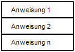

<!--

author:   Sebastian Zug & André Dietrich
email:    zug@ovgu.de   & andre.dietrich@ovgu.de
version:  0.0.1
language: de
narrator: Deutsch Female

comment:  This is a very simple comment.
          Multiline is also okay.

translation: English   translation/english.md

script:   https://felixhao28.github.io/JSCPP/dist/JSCPP.es5.min.js

@JSCPP
<script>
  try {
    var output = "";
    JSCPP.run(`@0`, `@1`, {stdio: {write: s => { output += s;}}});
    output;
  } catch (msg) {
    console.log(msg);
    var error = new LiaError(msg, 1);

    try {
        var log = msg.match(/(.*)\nline (\d+) \(column (\d+)\):.*\n.*\n(.*)/);
        var info = log[1] + " " + log[4];

        if (info.length > 80)
          info = info.substring(0,76) + "..."

        error.add_detail(0, info, "error", log[2]-1, log[3]);
    } catch(e) {}

    throw error;
  }
</script>
@end

-->

# Vorlesung III - Operatoren

**Fragen an die heutige Veranstaltung ...**

+ ???

---------------------------------------------------------------------
Link auf die aktuelle Vorlesung im Versionsmanagementsystem GitHub

https://github.com/liaScript/CCourse/blob/master/04_Kontrollstrukturen.md

---------------------------------------------------------------------

**Wie weit sind wir schon gekommen?**

ANSI C (C89)/ Schlüsselwörter:

|Standard   |            |            |            |             |            |             |
|:----------|:-----------|:-----------|:-----------|:------------|:-----------|:------------|
| C89/C90    | auto | <span style="color:blue">double</span> | <span style="color:blue">int</span> | struct | break|
|           | else  | <span style="color:blue">long</span> | switch | case | enum |
|           | register | typedef | <span style="color:blue">char</span> | extern | return |
|           | union | const | <span style="color:blue">float</span> | <span style="color:blue">short</span> | <span style="color:blue">unsigned</span>  |
|           | continue | for | <span style="color:blue">signed</span> | <span style="color:blue">void</span> | default |
|           | goto | <span style="color:blue">sizeof</span> | volatile | do | if |
|           | static |  while|
| C99  | _Bool | _Complex | _Imaginary | inline | restrict |
| C11  | _Alignas | _Alignof | _Atomic | _Generic |  _Noreturn|
|      |_Static\_assert | \_Thread\_local|

Standardbibliotheken

|Name       | Bestandteil| Funktionen                           |
|:----------|:-----------|:-------------------------------------|
|<stdio.h> 	|            | Input/output (printf)                |
|<stdint.h> |(seit C99)  | Integer Datentypen mit fester Breite |
|<float.h> 	|            | Parameter der Floatwerte             |
|<limits.h> |            | Größe der Basistypen                 |

https://en.cppreference.com/w/c/header

---------------------------------------------------------------------

## 1. Cast-Operatoren

> *Casting* beschreibt die Konvertierung eines Datentypen in einen anderen. Dies kann entweder automatisch durch den Compiler vorgenommen oder durch den Programmierer angefordert werden.

Im erstegenannten Fall spricht man von

+ impliziten Datentypumwandlung im zweiten von
+ expliziter Typumwandlung.

Es wird bei Methoden vorausgesetzt, dass der
Compiler eine Typumwandlung auch wirklich unterstützt. Eine Typumwandlung kann einschränkend oder erweiternd sein!

### Implizite Datentypumwandlung

Operanden dürfen in C einen Variablen mit unterschiedlichen Datentyp verknüpfen. Die implizite Typumwandlung generiert einen gemeinsamen Datentyp, der in einer Rangfolge am weitesten oben steht. Das Ergebnis ist ebenfalls von diesem Typ.

1. char -> short -> int -> long -> long long / float -> double -> long double
2. Die Rangfolge bei ganzzahligen Typen ist unabhängig vom Vorzeichen.
3. Standarddatentypen haben einen höheren Rang als  erweiterte Ganzzahl-Typen aus <stdint.h> wie `int_least32_t`, obwohl beide die gleiche Breite besitzen.

Dabei sind einschränkende Konvertierungskonfigurationen kritisch zu sehen:

+ Bei der Umwandlung von höherwertigen Datentypen in niederwertigere Datentypen kann es zu Informationsverlust kommen.

+ Der Verleich von signed- und unsigned-Typen kann falsch sein. So kann beispielsweise -1 > 1U wahr sein.

+ Die Division zweiter int-Werte gibt immer nur einen Ganzzahlanteil zurück. Hier findet keine automatische Konvertierung in eine Gleitpunktzahl statt.

+ die Umwandlung eines negativen Wertes in einen Typ ohne Vorzeichen

+ Bei der Umwandlung von ganz großen Zahlen (beispielsweise long long) in einen Gleitpunkttyp kann es passieren, dass die Genauigkeit nicht mehr ausreicht, um die Zahl genau darzustellen.

**Vermischen von Ganzzahl und Gleitkommawerten**

*6.3.1.4 Real floating and integer - When a finite value of real floating type is converted to an integer type other than _Bool, the fractional part is discarded (i.e., the value is truncated toward zero). If the value of the integral part cannot be represented by the integer type, the behavior is undefined.* \[C99 Standard\]

```cpp                     NumberFormats.c
#include <stdio.h>

int main()
{
  float f=3.14;
  int i=f;
  printf("float value = %f / Integer-Anteil %d \n", f, i);
  return 0;
}
```
@JSCPP(@input, )

Die Headerdatei <fenv.h> definiert verschiedene Einstellungen für das Rechnen mit Gleitpunktzahlen. Unter anderem können Sie das Rundungsverhalten von Gleitpunkt-Arithmetiken über entsprechende Makros anpassen.

**Achtung:** Implizite Typumwandlung bergen erhebliche Risiken in sich!

```cpp                     Overflow.c
#include <stdio.h>

int main()
{
  float f = -3.14;
  unsigned int i = f;
  printf("float value = %f / Integer-Anteil %d \n", f, i);
  printf("float value = %f / Integer-Anteil %u \n", f, i);
  return 0;
}
```

<pre class="lia-code-stdout">
▶ ./a.out
float value = -3.140000 / Integer-Anteil -3
float value = -3.140000 / Integer-Anteil 4294967293
</pre>

### Explizite Datentypumwandlung

Anders als bei der impliziten Typumwandlung bei der expliziten Typumwandlung der Zieldatentyp konkret im Code angegeben.

```cpp
(Zieltyp) ausdruck;
```

```cpp                    VolumeSphere.c
#include <stdio.h>

int main()
{
  int i = 3;
  int j = 4;
  printf("int i / int j   = %d \n", i / j);
  printf("float(i / j)    = %f \n", (float)(i / j));
  printf("float i / int j = %f \n", (float) i / j);
  return 0;
}
```
@JSCPP(@input, )

## 2. Kontrollfluß

Bisher haben wir Programme entworfen, die eine sequenzielle Abfolge von Anweisungen enthielt.

<!-- width="50%" -->[^1]

[^1]: Nassi-Shneidermann Diagramme (Quelle: https://de.wikipedia.org/wiki/Nassi-Shneiderman-Diagramm#/media/File:LineareAnw.png (Autor Renzsorf))

Diese Einschränkung wollen wir nun in 3 Formen überwinden:

1. **Verzweigungen**: In Abhängigkeit von einer Bedingung wird der Programmfluß an unterschiedlichen Stellen fortgesetzt.

    Beispiel: Wenn bei einer Flächenberechnung ein Ergebnis kleiner Null generiert wird, erfolgt eine Fehlerausgabe. Sonst wird im Programm fortgefahren.

2. **Schleifen (Iteration)**: Ein Anweisungsblock wird so oft wiederholt, bis eine Abbruchbedingung erfüllt wird.

    Beispiel: Ein Datensatz wird durchlaufen um die Gesamtsumme einer Spalte zu bestimmen. Wenn der letzte Eintrag erreicht ist, wird der Durchlauf abgebrochen und das Ergebnis ausgegeben.

3. **Sprünge**: Die Programmausführung wird mithilfe von Sprungmarken an einer anderen Position fortgesetzt.

    Beispiel: Statt die nächste Anweisung auszuführen wird (zunächst) an eine ganz andere Stelle im Code gesprungen.

### Verzweigungen

```cpp
if(Bedingung) Anweisung;  // <- Einzelne Anweisung

if(Bedingung){            // <- Anweisungsblock
   Anweisung;
   Anweisung;
}
```

Optional kann eine alternative Anweisung angegeben werden, wenn die Bedingung nicht erfüllt wird:

```cpp
if(Bedingung)
  Anweisung;
else
  Anweisung;
```

Mehrere Fälle können verschachtelt abgefragt werden:

```cpp
if(Bedingung)
  Anweisung;
else
  if(Bedingung)
    Anweisung;
  else
    Anweisung;
```

```cpp                     IfExample.c
#include <stdio.h>

int main(){
	char c = 5;
  if (c == 5)
    printf("Die Aussage ist wahr.\n");
  else if ((c < 10) && (c > 0))
    printf("Auch diese Aussage ist wahr!\n");
	return 0;
}
```
@JSCPP(@input, )

**Mögliche Fehlerquellen**

1. Zuweisungs- statt Vergleichsoperator in der Bedingung (kein Compilerfehler)
2. Bedingung ohne Klammern (Compilerfehler)
3. `;` hinter der Bedingung (kein Compilerfehler)
4. Multiple Anweisungen ohne Anweisungsblock
5. Komplexität der Statements

Strukturierung der möglicherweise sehr komplexen mehrfachen Verzweigungen anhand DIN 66261.

<!-- width="100%" -->[^1]

[^1]: Nassi-Shneidermann Diagramme (Quelle: https://de.wikipedia.org/wiki/Nassi-Shneiderman-Diagramm#/media/File:LineareAnw.png (Autor Renzsorf))

**Beispiel**

<!-- width="100%" -->

| WL  | WG  | WR  | Verhalten                  |
|:----|:----|:----|:---------------------------|
| 0   | 0   | 0   | Vorwärts                   |
| 0   | 0   | 1   | Vorwärts                   |
| 0   | 1   | 0   | Drehung Links, Vorwärts    |
| 0   | 1   | 1   | Drehung Links, Vorwärts    |
| 1   | 0   | 0   | Drehung 180 Grad, Vorwärts |
| 1   | 0   | 1   | Vorwärts                   |
| 1   | 1   | 0   | Drehung 180 Grad, Vorwärts |
| 1   | 1   | 1   | Drehung 180 Grad, Vorwärts |

```cpp                     IfExample.c
#include <stdio.h>

#include <stdio.h>

int main(){
	int WL, WG, WR;
  WL = 1; WG = 0; WR =1;
  if (((!WL) & (WG) & (!WR)) || ((!WL) & (WG) & (WR)))
    printf("Drehung Links\n");
  if (((WL) & (!WG) & (!WR)) || ((WL) & (WG) & (!WR)) || ((WL) & (WG) & (!WR)))
    printf("Drehung 180 Grad\n");
  printf("Vorwaerts\n");
	return 0;
}
```
@JSCPP(@input, )

**Sehen Sie mögliche Vereinfachungen des Codes?**


## Beispiel des Tages

Das Codebeispiel

```cpp                     printbinaries.c
#include<stdio.h>

void int2binOutput(int n) {
  int i;
  for(i= (sizeof n) * 8 -1; i>=0; i--) {
      if ((n >> i) & 1)
          printf("1");
      else
          printf("0");
      if (i % 8 == 0)
          printf(" ");
  }
  printf("\n");
}

int main(){
  int x = 254;
  int2binOutput(x);
  return 0;
}
```
@JSCPP(@input, )
