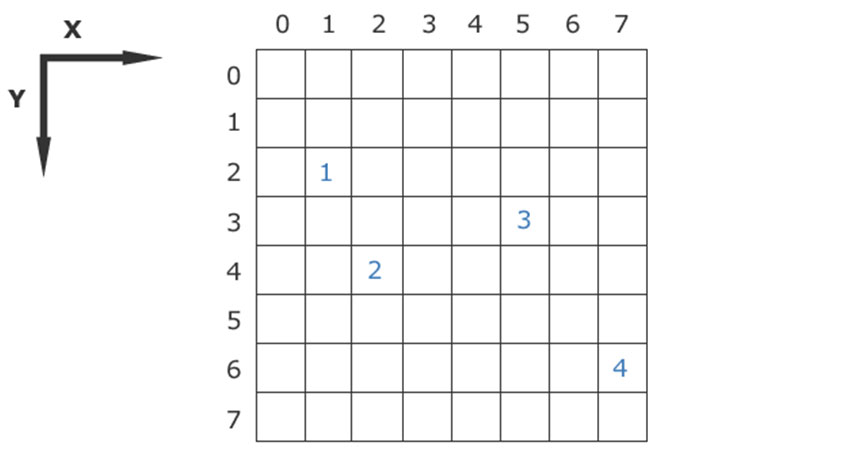

<!--

author:   Sebastian Zug & André Dietrich & Galina Rudolf
email:    sebastian.zug@informatik.tu-freiberg.de & andre.dietrich@ovgu.de & Galina.Rudolf@informatik.tu-freiberg.de
version:  1.0.2
language: de
narrator: Deutsch Female

comment: Einführung in die Programmierung für Nicht-Informatiker
logo: ./img/LogoCodeExample.png

import: https://github.com/liascript/CodeRunner
        https://github.com/LiaTemplates/AVR8js/main/README.md#10
        https://raw.githubusercontent.com/liascript-templates/plantUML/master/README.md

-->

# Zeiger und Arrays

Die interaktive Version des Kurses ist unter diesem [Link](https://liascript.github.io/course/?https://raw.githubusercontent.com/SebastianZug/VL_ProzeduraleProgrammierung/master/04_ZeigerUndArrays.md#1) zu finden.

**Wie weit waren wir gekommen?**

<div>
  <wokwi-pushbutton color="green" pin="2"  port="D"></wokwi-pushbutton>
  <wokwi-led color="red"   pin="13" port="B" label="13"></wokwi-led>
</div>

```cpp       ButtonLogic.cpp
//#include "iso646.h"

void setup() {
  Serial.begin(115200);
  pinMode(2, INPUT);
  pinMode(13, OUTPUT);
}

void loop() {
  bool a = digitalRead(2);
  if (a){
    for (int i = 0; i<3; i++){
      digitalWrite(13, HIGH);
      delay(250);
      digitalWrite(13, LOW);
      delay(250);
    }
  }
}
```
@AVR8js.sketch

**Inhalt der heutigen Veranstaltung**

* Verwendung von Adresszeigern in C
* Anwendung von Adresszeigern bei der Arbeit mit Arrays

**Fragen an die heutige Veranstaltung ...**

* Erklären Sie die Idee des Zeigers in der Programmiersprache C.
* Welche Vorteile ergeben sich, wenn eine Variable nicht mit dem gti Wert
  sondern über die Adresse übergeben wird?
* Welche Funktion hat der Adressoperator `&`?
* Welche Gefahr besteht bei der Initialisierung von Zeigern?
* Was ist ein `NULL`-Zeiger und wozu wird er verwendet?
* Wie gibt man die Adresse, auf die ein Zeiger gerichtet ist, mit `printf` aus?
* Erläutern Sie die mehrfache Nutzung von `*` im Zusammenhang mit der Arbeit
  von Zeigern.
* In welchem Kontext ist die Typisierung von Zeigern von Bedeutung?

## Grundkonzept Zeiger

Bisher umfassten unserer Variablen als Datencontainer Zahlen oder Buchstaben.
Das Konzept des Zeigers (englisch Pointer) erweitert das Spektrum der Inhalte
auf Adressen.

An dieser Adresse können entweder Daten, wie Variablen oder Objekte, aber auch
Programmcodes (Anweisungen) stehen. Durch Dereferenzierung des Zeigers ist es
möglich, auf die Daten oder den Code zuzugreifen.

<!--
style=" width: 70%;
        max-width: 400x;
        min-width: 400px;
        display: block;
        margin-left: auto;
        margin-right: auto;"
-->
```ascii
  Variablen-     Speicher-      Inhalt
  name           addresse
                                +----------+
                 0000           |          |
                                +----------+
                 0001           |          |
                                +----------+
  a   ------>    0002       +---| 00001007 |
                          z |   +----------+
                 0003     e |   |          |
                          i |   +----------+
                 ....     g |   |          |
                          t |   +----------+
                 1005       |   |          |
                          a |   +----------+
                 1006     u |   |          |
                          f |   +----------+
  b   ------>    1007    <--+   | 01101101 |
                                +----------+
                 1008           |          |
                                +----------+
                 ....           |          |                                   .
```


Welche Vorteile ergeben sich aus der Nutzung von Zeigern, bzw. welche
Programmiertechniken lassen sich realisieren:
* dynamische Verwaltung von Speicherbereichen,
* Übergabe von Datenobjekte an Funktionen via "call-by-reference",
* Übergabe von Funktionen als Argumente an andere Funktionen,
* Umsetzung rekursiver Datenstrukturen wie Listen und Bäume.

> Der Vollständigkeit halber sei erwähnt, dass C anders als C++ keine Referenzen im eigentlichen Sinne kennt. Hier ist die Übergabe der Adresse einer Variablen als Parameter gemeint und nicht das Konstrukt "Reference".

### Definition von Zeigern

Die Definition eines Zeigers besteht aus dem Datentyp des Zeigers und dem
gewünschten Zeigernamen. Der Datentyp eines Zeigers besteht wiederum aus dem
Datentyp des Werts auf den gezeigt wird sowie aus einem Asterisk. Ein Datentyp
eines Zeigers wäre also z. B. `double*`.

```c
/* kann eine Adresse aufnehmen, die auf einen Wert vom Typ Integer zeigt */
int* zeiger1;
/* das Leerzeichen kann sich vor oder nach dem Stern befinden */
float *zeiger2;
/* ebenfalls möglich */
char * zeiger3;
/* Definition von zwei Zeigern */
int *zeiger4, *zeiger5;
/* Definition eines Zeigers und einer Variablen vom Typ Integer */
int *zeiger6, ganzzahl;
```


### Initialisierung

> **Merke:** Zeiger müssen vor der Verwendung initialisiert werden.

Der Zeiger kann initialisiert werden durch die Zuweisung:
* der Adresse einer Variable, wobei die Adresse mit Hilfe des Adressoperators
  `&` ermittelt wird,
* eines Arrays (folgt gleich im zweiten Teil der Vorlesung),
* eines weiteren Zeigers oder
* des Wertes von `NULL`.

```c                      PointerExamples.c
#include <stdio.h>
#include <stdlib.h>

int main(void)
{
  int a = 0;
  int * ptr_a = &a;       /* mit Adressoperator */

  int feld[10];
  int * ptr_feld = feld;  /* mit Array */

  int * ptr_b = ptr_a;    /* mit weiterem Zeiger */

  int * ptr_Null = NULL;  /* mit NULL */

  printf("Pointer ptr_a    %p\n", ptr_a);
  printf("Pointer ptr_feld %p\n", ptr_feld);
  printf("Pointer ptr_b    %p\n", ptr_b);
  printf("Pointer ptr_Null %p\n", ptr_Null);
  return EXIT_SUCCESS;
}
```
@LIA.eval(`["main.c"]`, `gcc -Wall main.c -o a.out`, `./a.out`)


{{1}}
Die konkrete Zuordnung einer Variablen im Speicher wird durch den Compiler und
das Betriebssystem bestimmt. Entsprechend kann die Adresse einer Variablen nicht
durch den Programmierer festgelegt werden. Ohne Manipulationen ist die Adresse
einer Variablen über die gesamte Laufzeit des Programms unveränderlich, ist aber
bei mehrmaligen Programmstarts unterschiedlich.

{{1}}
Ausgaben von Pointer erfolgen mit `printf("%p", ptr)`, es wird dann eine
hexadezimale Adresse ausgegeben.

{{1}}
Zeiger können mit dem "Wert" `NULL` als ungültig markiert werden. Eine
Dereferenzierung führt dann meistens zu einem Laufzeitfehler nebst
Programmabbruch. NULL ist ein Macro und wird in mehreren Header-Dateien
definiert (mindestens in `stddef.h`). Die Definition ist vom Standard
implementierungsabhängig vorgegeben und vom Compilerhersteller passend
implementiert, z. B.

{{1}}
```c
#define NULL 0
#define NULL 0L
#define NULL (void *) 0
```

{{2}}
Und umgekehrt, wie erhalten wir den Wert, auf den der Pointer zeigt? Hierfür
benötigen wir den *Inhaltsoperator* `*`.

{{2}}
```c                   DereferencingPointers.c
#include <stdio.h>
#include <stdlib.h>

int main(void)
{
  int a = 15;
  int * ptr_a = &a;
  printf("Wert von a                     %d\n", a);
  printf("Pointer ptr_a                  %p\n", ptr_a);
  printf("Wert hinter dem Pointer ptr_a  %d\n", *ptr_a);
  *ptr_a = 10;
  printf("Wert von a                     %d\n", a);
  printf("Wert hinter dem Pointer ptr_a  %d\n", *ptr_a);
  return EXIT_SUCCESS;
}
```
@LIA.eval(`["main.c"]`, `gcc -Wall main.c -o a.out`, `./a.out`)

{{2}}
<iframe width="800" height="500" frameborder="0" src="http://pythontutor.com/iframe-embed.html#code=%23include%20%3Cstdio.h%3E%0A%23include%20%3Cstdlib.h%3E%0A%0Aint%20main%28void%29%0A%7B%0A%20%20int%20a%20%3D%2015%3B%0A%20%20int%20*%20ptr_a%20%3D%20%26a%3B%0A%20%20printf%28%22Wert%20von%20a%20%20%20%20%20%20%20%20%20%20%20%20%20%20%20%20%20%20%20%20%20%25d%5Cn%22,%20a%29%3B%0A%20%20printf%28%22Pointer%20ptr_a%20%20%20%20%20%20%20%20%20%20%20%20%20%20%20%20%20%20%25p%5Cn%22,%20ptr_a%29%3B%0A%20%20printf%28%22Wert%20hinter%20dem%20Pointer%20ptr_a%20%20%25d%5Cn%22,%20*ptr_a%29%3B%0A%20%20*ptr_a%20%3D%2010%3B%0A%20%20printf%28%22Wert%20von%20a%20%20%20%20%20%20%20%20%20%20%20%20%20%20%20%20%20%20%20%20%20%25d%5Cn%22,%20a%29%3B%0A%20%20printf%28%22Wert%20hinter%20dem%20Pointer%20ptr_a%20%20%25d%5Cn%22,%20*ptr_a%29%3B%0A%20%20return%20EXIT_SUCCESS%3B%0A%7D&codeDivHeight=400&codeDivWidth=350&cumulative=false&curInstr=0&heapPrimitives=nevernest&origin=opt-frontend.js&py=c&rawInputLstJSON=%5B%5D&textReferences=false"> </iframe>

### Fehlerquellen

Fehlender Adressoperator bei der Zuweisung

```c               PointerFailuresI.c
#include <stdio.h>
#include <stdlib.h>

int main(void)
{
  int a = 5;
  int * ptr_a;
  ptr_a = a;
  printf("Pointer ptr_a                  %p\n", ptr_a);
  printf("Wert hinter dem Pointer ptr_a  %d\n", *ptr_a);
  return EXIT_SUCCESS;
}
```
@LIA.evalWithDebug(`["main.c"]`, `gcc -Wall main.c -o a.out`, `./a.out`)

{{1}}
Fehlender Dereferenzierungsoperator beim Zugriff

{{1}}
```c          PointerFailuresII.c
#include <stdio.h>
#include <stdlib.h>

int main(void)
{
  int a = 5;
  int * ptr_a = &a;
  printf("Pointer ptr_a                  %p\n", (void*)ptr_a);
  printf("Wert hinter dem Pointer ptr_a  %d\n", ptr_a);

  return EXIT_SUCCESS;
}
```
@LIA.eval(`["main.c"]`, `gcc -Wall main.c -o a.out`, `./a.out`)

{{2}}
Uninitialierte Pointer zeigen "irgendwo ins nirgendwo"!

{{2}}
```c                  PointerFailuresIII.c
#include <stdio.h>
#include <stdlib.h>

int main(void)
{
  int * ptr_a;
  *ptr_a = 10;
  // korrekte Initalisierung
  // int * ptr_a = NULL;
  // Prüfung auf gültige Adresse
  // if (ptr_a != NULL) *ptr_a = 10;
  printf("Pointer ptr_a                  %p\n", ptr_a);
  printf("Wert hinter dem Pointer ptr_a  %d\n", *ptr_a);
  return EXIT_SUCCESS;
}
```
@LIA.evalWithDebug(`["main.c"]`, `gcc -Wall main.c -o a.out`, `./a.out`)


## Arrays

Bisher umfassten unsere Variablen einzelne Skalare. Arrays erweitern das
Spektrum um Folgen von Werten, die in n-Dimensionen aufgestellt werden können.
Array ist eine geordnete Folge von Werten des gleichen Datyps.
Die Deklaration erfolgt in folgender Anweisung:

```text
Datentyp Variablenname[Anzahl_der_Elemente];
```

```cpp
int a[6];
```

| `a[0]` | `a[1]` | `a[2]` | `a[3]` | `a[4]` | `a[5]` |


```text
Datentyp Variablenname[Anzahl_der_Elemente_Dim0][Anzahl_der_Elemente_Dim1];
```

```cpp
int a[3][5];
```

| `a[0][0]` | `a[0][1]` | `a[0][2]` | `a[0][3]` | `a[0][4]` |
| `a[1][0]` | `a[1][1]` | `a[1][2]` | `a[1][3]` | `a[1][4]` |
| `a[2][0]` | `a[2][1]` | `a[2][2]` | `a[2][3]` | `a[2][4]` |

> **Achtung 1:** Im hier beschriebenen Format muss zum Zeitpunkt der Übersetzung
> die Größe des Arrays (Anzahl\_der\_Elemente) bekannt sein.

> **Achtung 2:** Der Variablenname steht nunmehr nicht für einen Wert sondern
> für die Speicheradresse (Pointer) des ersten Feldes!

### Deklaration, Definition, Initialisierung, Zugriff

Initialisierung und genereller Zugriff auf die einzelnen Elemente des Arrays
sind über einen Index möglich.

```cpp                     ArrayExample.c
#include <stdio.h>

int main(void) {
  int a[3];       // Array aus 3 int Werten
  a[0] = -2;
  a[1] = 5;
  a[2] = 99;
  for (int i=0; i<3; i++)
    printf("%d ", a[i]);
  printf("\nNur zur Info %ld", sizeof(a));
  printf("\nZahl der Elemente %ld", sizeof(a) / sizeof(int));
  printf("\nAnwendung des Adressoperators auf das Array %d", *a);
  return 0;
  }
```
@LIA.eval(`["main.c"]`, `gcc -Wall main.c -o a.out`, `./a.out`)

<iframe width="800" height="500" frameborder="0" src="http://pythontutor.com/iframe-embed.html#code=%23include%20%3Cstdio.h%3E%0A%0Aint%20main%28void%29%20%7B%0A%20%20int%20a%5B3%5D%3B%20%20%20%20%20%20%20//%20Array%20aus%203%20int%20Werten%0A%20%20a%5B0%5D%20%3D%20-2%3B%0A%20%20a%5B1%5D%20%3D%205%3B%0A%20%20a%5B2%5D%20%3D%2099%3B%0A%20%20for%20%28int%20i%3D0%3B%20i%3C3%3B%20i%2B%2B%29%0A%20%20%20%20printf%28%22%25d%20%22,%20a%5Bi%5D%29%3B%0A%20%20printf%28%22%5CnNur%20zur%20Info%20%25ld%22,%20sizeof%28a%29%29%3B%0A%20%20printf%28%22%5CnZahl%20der%20Elemente%20%25ld%22,%20sizeof%28a%29%20/%20sizeof%28int%29%29%3B%0A%20%20printf%28%22%5CnAnwendung%20des%20Adressoperators%20auf%20das%20Array%20%25d%22,%20*a%29%3B%0A%20%20return%200%3B%0A%7D&codeDivHeight=400&codeDivWidth=350&cumulative=false&curInstr=0&heapPrimitives=nevernest&origin=opt-frontend.js&py=c&rawInputLstJSON=%5B%5D&textReferences=false"> </iframe>


{{1}}
Wie können Arrays noch initialisiert werden:

{{1}}
+ vollständig (alle Elemente werden mit einem spezifischen Wert belegt)
+ anteilig (einzelne Elemente werden mit spezfischen Werten gefüllt, der rest mit 0)

{{1}}
```cpp                     ArrayExample.c
#include <stdio.h>

int main(void) {
  int a[] = {5, 2, 2, 5, 6};
  float b[5] = {1.0};
  int c[5] = {[2] = 5, [1] = 2, [4] = 9}; // ISO C99
  for (int i=0; i<5; i++){
    printf("%5d %f %5d\n", a[i], b[i], c[i]);
  }
  return 0;
}
```
@LIA.eval(`["main.c"]`, `gcc -Wall main.c -o a.out`, `./a.out`)

{{2}}
Und wie bestimme ich den erforderlichen Speicherbedarf bzw. die Größe des
Arrays?

{{2}}
```cpp                     ArrayExample.c
#include <stdio.h>

int main(void) {
  int a[3];
  printf("\nNur zur Speicherplatz [Byte] %ld", sizeof(a));
  printf("\nZahl der Elemente %ld\n", sizeof(a)/sizeof(int));
  return 0;
}
```
@LIA.eval(`["main.c"]`, `gcc -Wall main.c -o a.out`, `./a.out`)

### Fehlerquelle Nummer 1 - out of range

```cpp                     ArrayExample.c
#include <stdio.h>

int main(void) {
  int a[] = {-2, 5, 99};
  for (int i=0; i<=3; i++)
    printf("%d ", a[i]);
  return 0;
  }
```
@LIA.eval(`["main.c"]`, `gcc -Wall main.c -o a.out`, `./a.out`)


### Anwendung eines eindimesionalen Arrays

Schreiben Sie ein Programm, das zwei Vektoren miteinander vergleicht. Warum ist
die intuitive Lösung `a == b` nicht korrekt, wenn `a` und `b` arrays sind?

```cpp                     ArrayExample.c
#include <stdio.h>

int main(void) {
  int a[] = {0, 1, 2, 4, 3, 5, 6, 7, 8, 9};
  int b[10];
  for (int i=0; i<10; i++)
    b[i]=i;
  for (int i=0; i<10; i++)
    if (a[i]!=b[i])
      printf("An Stelle %d unterscheiden sich die Vektoren \n", i);
  return 0;
  }
```
@LIA.eval(`["main.c"]`, `gcc -Wall main.c -o a.out`, `./a.out`)

Welche Verbesserungsmöglichkeiten sehen Sie bei dem Programm?

### Mehrdimensionale Arrays

Deklaration:

```cpp
int Matrix[4][5];    /* Zweidimensional - 4 Zeilen x 5 Spalten */
```

Deklaration mit einer sofortigen Initialisierung aller bzw. einiger Elemente:

```cpp
int Matrix[4][5] = { {1,2,3,4,5},
                     {6,7,8,9,10},
                     {11,12,13,14,15},
                     {16,17,18,19,20}};

int Matrix[4][4] = { {1,},
                     {1,1},
                     {1,1,1},
                     {1,1,1,1}};

int Matrix[4][4] = {1,2,3,4,5,6,7,8};
```

{{1}}
Initialisierung eines n-dimensionalen Arrays:

{{1}}
<!--
style=" width: 60%;
        max-width: 800px;
        min-width: 400px;
        display: block;
        margin-left: auto;
        margin-right: auto;"
-->

{{2}}
```cpp                          nDimArray.c
#include <stdio.h>

int main(void) {
  // Initiallisierung
  int brett[8][8] = {0};
  // Zuweisung
  brett[2][1] = 1;
  brett[4][2] = 2;
  brett[3][5] = 3;
  brett[6][7] = 4;
  // Ausgabe
  int i, j;
  // Schleife fuer Zeilen, Y-Achse
  for(i=0; i<8; i++) {
  	// Schleife fuer Spalten, X-Achse
  	for(j=0; j<8; j++) {
  		printf("%d ", brett[i][j]);
  	}
  	printf("\n");
  }
  return 0;
}
```


{{2}}
Quelle: [C-Kurs](http://www.c-howto.de/tutorial/arrays-felder/zweidimensionale-felder/)

### Anwendung eines zweidimesionalen Arrays

Elementwese Addition zweier Matrizen

```cpp       Addition.c
#include <stdio.h>

int main(void)
{
  int A[2][3]={{1,2,3},{4,5,6}};
  int B[2][3]={{10,20,30},{40,50,60}};
	int C[2][3];
	int i,j;
	for (i=0;i<2;i++)
		for (j=0;j<3;j++)
			C[i][j]=A[i][j]+B[i][j];
	for (i=0;i<2;i++)
	{
		for (j=0;j<3;j++)
			printf("%d\t",C[i][j]);
		printf("\n");
	}
    return 0;
}
```
@LIA.eval(`["main.c"]`, `gcc -Wall main.c -o a.out`, `./a.out`)

[Multiplikation zweier Matrizen](https://www.codewithc.com/c-program-for-gauss-elimination-method/)


### Strings/Zeichenketten

Folgen von Zeichen, die sogenannten *Strings* werden in C durch Arrays mit
Elementen vom Datentyp `char` repräsentiert. Die Zeichenfolgen werden mit
`\0` abgeschlossen.

```cpp                                         stringarray.c
#include <stdio.h>

int main(void) {
  printf("Diese Form eines Strings haben wir bereits mehrfach benutzt!\n");
  //////////////////////////////////////////////////////////////////////////////

  char a[] = "Ich bin ein char Array!";  // Der Compiler fügt das \0 automatisch ein!
  if (a[23] == '\0'){
    printf("char Array Abschluss in a gefunden!");
  }

  printf("->%s<-\n", a);
  const char b[] = { 'H', 'a', 'l', 'l', 'o', ' ',
                     'F', 'r', 'e', 'i', 'b', 'e', 'r', 'g', '\0' };
  printf("->%s<-\n", b);
  const char c[] = "Noch eine \0Moeglichkeit";
  printf("->%s<-\n", c);
  char d[] = { 80, 114, 111, 122, 80, 114, 111, 103, 32, 50, 48,  50, 48,  0  };
  printf("->%s<-\n", d);
  return 0;
}
```
@LIA.eval(`["main.c"]`, `gcc -Wall main.c -o a.out`, `./a.out`)

{{1}}
Wie kopiere ich die Inhalte in einem Array?

{{1}}
```cpp                     arrayInitVsAssignment.c
#include <stdio.h>
#include <string.h>       // notwendig für strcpy

int main(void) {
  char a[] = "012345678901234567890123456789";
  strcpy(a, "Das ist ein neuer Text");
  printf("%s\n",a);
  return 0;
}
```
@LIA.eval(`["main.c"]`, `gcc -Wall main.c -o a.out`, `./a.out`)


### Anwendung von Zeichenketten

Schreiben Sie ein Programm, dass in einem Text groß geschriebene Buchstaben
durch klein geschriebene ersetzt und umgekehrt.

<!--
style=" width: 60%;
        max-width: 800px;
        min-width: 400px;
        display: block;
        margin-left: auto;
        margin-right: auto;"
-->

Da Variablen des Datentyps `char` genau ein Byte benötigen, liefert `sizeof`-Operator im folgenden Beispiel die Anzahl der Elemente des Arrays.


```cpp                     ArrayExample.c
#include <stdio.h>

int main() {
  char a[] = "Das ist ein beispielhafter Text.";
  char b[sizeof a];
  for (int i=0; i< sizeof a; i++){
    b[i] = a[i];
    if ((a[i]>=65) && (a[i]<=90))
        b[i] = a[i] + 32;
    if ((a[i]>=97) && (a[i]<=122))
        b[i] = a[i] - 32;
  }
  printf("%s\n", a);
  printf("%s\n", b);
  return 0;
}
```
@LIA.eval(`["main.c"]`, `gcc -Wall main.c -o a.out`, `./a.out`)


### Fehlerquellen

Bitte unterscheiden Sie die Initialisierungsphase von normalen Zuweisungen,
bei denen Sie nur auf einzelne Elemente zugreifen können.

```cpp                     arrayInitVsAssignment.c
#include <stdio.h>
#include <string.h>       // notwendig für strcpy

int main(void) {
  char a[] = "Das ist der Originaltext";
  a = "Das ist ein neuer Text";  // Compiler Error
  //strcpy(a, "Das ist ein neuer Text");
  a[0]='X';
  printf("%s\n",a);
  return 0;
}
```
@LIA.eval(`["main.c"]`, `gcc -Wall main.c -o a.out`, `./a.out`)


Auf die umfangreiche Funktionssammlung der `string.h` zur Manipulation von
Strings wird in einer folgenden Vorlesung eingegangen.


## Zeigerarithmetik

     {{0-1}}
*******************************************************************

Zeiger können manipuliert werden, um variabel auf Inhalte im Speicher zuzugreifen.
Wie groß ist aber eigentlich ein Zeiger und warum muss er typisiert werden?

```c                   MathWithPointer.c
#include <stdio.h>
#include <stdlib.h>

int main(void) {
  char   *v;
  int    *w;
  float  *x;
  double *y;
  void   *z;

  printf("char\t int\t float\t double\t void\n");
  printf("%lu\t %lu\t %lu\t %lu\t %lu \n",
      sizeof(v),sizeof(w), sizeof(x), sizeof(y), sizeof(z));
  printf("%lu\t %lu\t %lu\t %lu\t %lu \n",
      sizeof(*v),sizeof(*w), sizeof(*x), sizeof(*y), sizeof(*z));
   return EXIT_SUCCESS;
}
```
@LIA.eval(`["main.c"]`, `gcc -Wall main.c -o a.out`, `./a.out`)

Die Zeigerarithmetik erlaubt:

* Ganzzahl-Additionen
* Ganzzahl-Substraktionen
* Inkrementierungen `ptr_i--;`
* Dekrementierungen `ptr_i++;`

Der Compiler wertet dabei den Typ der Variablen aus und inkrementiert bzw.
dekrementiert die Adresse entsprechend.

```c     PointerAdresses.c
#include <stdio.h>
#include <stdlib.h>

int main(void)
{
  int a[] = {0,1,2,3,4,5};
  int *ptr_a = a;
  printf("Pointer ptr_a               %p\n", ptr_a);
  int *ptr_b;
  ptr_b = ptr_a + 1;
  ptr_b ++;
  printf("Pointer ptr_b               %p\n", ptr_b);
  printf("Differenz ptr_b -  ptr_a    %ld\n", (long)(ptr_b - ptr_a));
  printf("Differenz ptr_b -  ptr_a    %ld\n", (long)ptr_b - (long)ptr_a);

  printf("Wert hinter Pointer ptr_b   '%d'\n", *ptr_b);

  return EXIT_SUCCESS;
}
```
@LIA.eval(`["main.c"]`, `gcc -Wall main.c -o a.out`, `./a.out`)

*******************************************************************

     {{1-2}}
*******************************************************************

Was bedeutet das im Umkehrschluss? Eine falsche Deklaration bewirkt ein
falsches "Bewegungsmuster" über dem Speicher.

```c               WrongMath.c
#include <stdio.h>
#include <stdlib.h>

int main(void)
{
  int a[] = {6,7,8,9};
  char * ptr_a = a;
  for (int i=0; i<sizeof(a)/sizeof(int)*4; i++){
      printf("ptr_a %p -> ", ptr_a);
      printf("%d\n", *ptr_a);
      ptr_a++;
  }
  return EXIT_SUCCESS;
}
```
@LIA.eval(`["main.c"]`, `gcc -Wall main.c -o a.out`, `./a.out`)

*******************************************************************

     {{2-3}}
*******************************************************************

Pointer können natürlich nicht nur manipuliert sondern auch verglichen werden.
Dabei sei noch mal darauf verwiesen, dass dabei die Adressen und nicht die
Werte evaluiert werden.

```c                  PointerComp.c
#include <stdio.h>
#include <stdlib.h>

int main(void)
{
  int a[] = {6,7,6,9};
  int * ptr_a = a;
  int * ptr_b = &a[2];
  printf("ptr_a %p -> %d \n", (void*)ptr_a, *ptr_a);
  printf("ptr_b %p -> %d \n", (void*)ptr_b, *ptr_b);
  if (*ptr_a == *ptr_b) printf("Werte sind gleich!\n");
  // Im Unterschied dazu
  if (ptr_a == ptr_b) printf("Adressen sind gleich!\n");
  else printf("Adressen sind ungleich!\n");
  ptr_a += 2;
  printf("Nun zeigt ptr_a auf %p\n", (void*)ptr_a);
  if (ptr_a == ptr_b) printf("Jetzt sind die Adressen gleich!\n");
  else printf("Adressen sind ungleich!\n");
  return EXIT_SUCCESS;
}
```
@LIA.eval(`["main.c"]`, `gcc -Wall main.c -o a.out`, `./a.out`)

*******************************************************************

## Beispiel der Woche

Gegeben ist ein Array, dass eine sortierte Reihung von Ganzzahlen umfasst.
Geben Sie alle Paare von Einträgen zurück, die in der Summe 18 ergeben.

Die intuitive Lösung entwirft einen kreuzweisen Vergleich aller sinnvollen Kombinationen
der $n$ Einträge im Array. Dafür müssen wir $(n-1)^2 /2$ Kombinationen bilden.

|     | 1   | 2   | 5   | 7   | 9   | 10  | 12  | 13  | 16  | 17  | 18  | 21  | 25  |
| --- | --- | --- | --- | --- | --- | --- | --- | --- | --- | --- | --- | --- | --- |
| 1   | x   |     |     |     |     |     |     |     |     | 18  |     |     |     |
| 2   | x   | x   |     |     |     |     |     |     | 18  |     |     |     |     |
| 5   | x   | x   | x   |     |     |     |     | 18  |     |     |     |     |     |
| 7   | x   | x   | x   | x   |     |     |     |     |     |     |     |     |     |
| 9   | x   | x   | x   | x   | x   |     |     |     |     |     |     |     |     |
| 10  | x   | x   | x   | x   | x   | x   |     |     |     |     |     |     |     |
| 12  | x   | x   | x   | x   | x   | x   | x   |     |     |     |     |     |     |
| 13  | x   | x   | x   | x   | x   | x   | x   | x   |     |     |     |     |     |
| 16  | x   | x   | x   | x   | x   | x   | x   | x   | x   |     |     |     |     |
| 17  | x   | x   | x   | x   | x   | x   | x   | x   | x   | x   |     |     |     |
| 18  | x   | x   | x   | x   | x   | x   | x   | x   | x   | x   | x   |     |     |
| 21  | x   | x   | x   | x   | x   | x   | x   | x   | x   | x   | x   | x   |     |
| 25  | x   | x   | x   | x   | x   | x   | x   | x   | x   | x   | x   | x   | x   |

Haben Sie eine bessere Idee?

```c                             Pairing.c
#include <stdio.h>
#include <stdlib.h>

#define ZIELWERT 18

int main(void)
{
  int a[] = {1, 2, 5, 7, 9, 10, 12, 13, 16, 17, 18, 21, 25};
  int *ptr_left = a;
  int *ptr_right = (int *)(&a + 1) - 1;
  printf("Value left %3d right %d\n-----------------------\n", *ptr_left, * ptr_right);
  do{
    printf("Value left %3d right %d", *ptr_left, * ptr_right);
    if (*ptr_right + *ptr_left == ZIELWERT){
       printf(" -> TREFFER");
    }
    printf("\n");
    if (*ptr_right + *ptr_left >= ZIELWERT) ptr_right--;
    else ptr_left++;
  }while (ptr_right != ptr_left);
  return EXIT_SUCCESS;
}
```
@LIA.eval(`["main.c"]`, `gcc -Wall main.c -o a.out`, `./a.out`)

Schauen wir uns das Ganze noch in der Ausführung mit Pythontutor an!

<iframe width="800" height="500" frameborder="0" src="http://pythontutor.com/iframe-embed.html#code=%23include%20%3Cstdio.h%3E%0A%23include%20%3Cstdlib.h%3E%0A%0A%23define%20ZIELWERT%2018%0A%0Aint%20main%28void%29%0A%7B%0A%20%20int%20a%5B%5D%20%3D%20%7B1,%202,%205,%207,%209,%2010,%2012,%2013,%2016,%2017,%2018,%2021,%2025%7D%3B%0A%20%20int%20*ptr_left%20%3D%20a%3B%0A%20%20int%20*ptr_right%20%3D%20%28int%20*%29%28%26a%20%2B%201%29%20-%201%3B%0A%20%20printf%28%22Value%20left%20%253d%20right%20%25d%5Cn-----------------------%5Cn%22,%20*ptr_left,%20*%20ptr_right%29%3B%0A%20%20do%7B%0A%20%20%20%20printf%28%22Value%20left%20%253d%20right%20%25d%22,%20*ptr_left,%20*%20ptr_right%29%3B%0A%20%20%20%20if%20%28*ptr_right%20%2B%20*ptr_left%20%3D%3D%20ZIELWERT%29%7B%0A%20%20%20%20%20%20%20printf%28%22%20-%3E%20TREFFER%22%29%3B%0A%20%20%20%20%7D%0A%20%20%20%20printf%28%22%5Cn%22%29%3B%0A%20%20%20%20if%20%28*ptr_right%20%2B%20*ptr_left%20%3E%3D%20ZIELWERT%29%20ptr_right--%3B%0A%20%20%20%20else%20ptr_left%2B%2B%3B%0A%20%20%7Dwhile%20%28ptr_right%20!%3D%20ptr_left%29%3B%0A%20%20return%20EXIT_SUCCESS%3B%0A%7D&codeDivHeight=400&codeDivWidth=350&cumulative=false&curInstr=0&heapPrimitives=nevernest&origin=opt-frontend.js&py=c&rawInputLstJSON=%5B%5D&textReferences=false"> </iframe>
