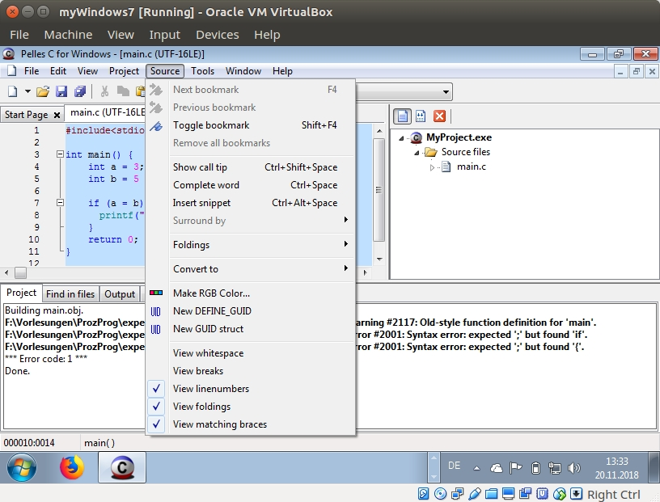
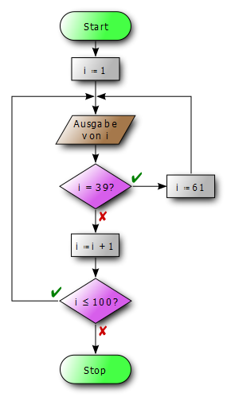

<!--

author:   Sebastian Zug & André Dietrich
email:    zug@ovgu.de   & andre.dietrich@ovgu.de
version:  0.0.1
language: de
narrator: Deutsch Female

script:   https://felixhao28.github.io/JSCPP/dist/JSCPP.es5.min.js

@JSCPP.__eval
<script>
  try {
    var output = "";
    JSCPP.run(`@0`, `@1`, {stdio: {write: s => { output += s }}});
    output;
  } catch (msg) {
    var error = new LiaError(msg, 1);
    var log = msg.match(/(.*)\nline (\d+) \(column (\d+)\):.*\n.*\n(.*)/);
    var info = log[1] + " " + log[4];

    if (info.length > 80)
      info = info.substring(0,76) + "..."

    error.add_detail(0, info, "error", log[2]-1, log[3]);

    throw error;
  }
</script>
@end


@JSCPP.eval: @JSCPP.__eval(@input, )

@JSCPP.eval_input: @JSCPP.__eval(@input,`@input(1)`)

@output: <pre class="lia-code-stdout">@0</pre>

-->

# Vorlesung V - Strukturierte Datentypen

**Fragen an die heutige Veranstaltung ...**

* Was sind *Arrays*, `struct`s und `enum`s?
* Was sind Gemeinsamkeiten und was sind Unterschiede von *Strings* und *Arrays*?
* Welche Gefahren lauern bei der Arbeit mit *Arrays*?
* Welche Indexnummer hat das erste Element eines *Arrays*?
* Erklären Sie den Unterschied zwischen Initalisierung und Zuweisung.
* Wie vergleichen Sie zwei `structs`?

---------------------------------------------------------------------
Link auf die aktuelle Vorlesung im Versionsmanagementsystem GitHub

https://github.com/liaScript/CCourse/blob/master/05_ZusammengesetzteDatentypen.md

---------------------------------------------------------------------

<!-- width="100%" -->

---------------------------------------------------------------------

**Wie weit sind wir schon gekommen?**

ANSI C (C89)/ Schlüsselwörter:

| Standard    |                |          |            |          |            |
|:------------|:---------------|:---------|:-----------|:---------|:-----------|
| **C89/C90** | auto           | `double` | `int`      | struct   | `break`    |
|             | `else`         | `long`   | `switch`   | `case`   | enum       |
|             | register       | typedef  | `char`     | extern   | return     |
|             | union          | const    | `float`    | `short`  | `unsigned` |
|             | `continue`     | `for`    | `signed`   | `void`   | `default`  |
|             | `goto`         | `sizeof` | volatile   | `do`     | `if`       |
|             | static         | `while`  |            |          |            |
| **C99**     | `_Bool`        | _Complex | _Imaginary | inline   | restrict   |
| **C11**     | _Alignas       | _Alignof | _Atomic    | _Generic | _Noreturn  |
|             |_Static\_assert | \_Thread\_local | |   |          |            |

---

Standardbibliotheken

| Name         | Bestandteil | Funktionen                           |
|:-------------|:------------|:-------------------------------------|
| `<stdio.h>`  |             | Input/output (`printf`)              |
| `<stdint.h>` | (seit C99)  | Integer Datentypen mit fester Breite |
| `<float.h>`  |             | Parameter der Floatwerte             |
| `<limits.h>` |             | Größe der Basistypen                 |
| `<fenv.h>`   |             | Verhalten bei Typumwandlungen        |

https://en.cppreference.com/w/c/header


## 0. Wiederholung

**Logische Operatoren**

```cpp                     ArrayExample.c
#include <stdio.h>

int main() {
  if (0 && 2) printf("Aussage 1 ist wahr\n");
  else printf("Aussage 1 ist falsch\n");
  if (5 & 2) printf("Aussage 2 ist wahr\n");
  else printf("Aussage 2 ist falsch\n");
  return 0;
}
```
@JSCPP.eval

| Operator | Bedeutung         | Rückgabewert  |
|:---------|:------------------|---------------|
| `&&`     | Logische *und* Operation | {0,1}  |
|          | Ganzzahlen ungleich "0" werden als *wahr* interpretiert, "0" als *falsch* |  |
| `&`      | Bitweiser *und* Operation | `int`  |
|          | Sofern eine Übereinstimmung an einer Stelle auftritt, ergibt sich die zugehörige Ganzzahl als Ergebnis. |  |


**Darstellung von Schleifen und Verzweigungen**

* Nassi-Shneiderman-Diagramme
* Flußdiagramme[^1]


<!--
style="width: 80%;
       max-width: 330px; display: block; margin-left: auto; margin-right: auto;" -->


[^1]: Nassi-Shneidermann Diagramme (Quelle:
      https://de.wikipedia.org/wiki/Programmablaufplan#/media/File:Flowchart_de.svg
      (Autor Erik Streb))

## 1. Aufzählungen

Enumerationen, kurz `enums` dienen der Definition bestimmter Sets von Elementen,
die eine Variable überhaupt annehmen kann. Wenn wir zum Beispiel die Farben
einer Ampel in einem Programm handhaben wollen sind dies lediglich "Rot", "Gelb"
und "Grün". Im Schachspiel sind nur die Figuren "Bauer", "Pferd", "Springer",
"Turm", "Dame" und "König" definiert.

Die Definition eines Aufzählungsdatentyps `enum` hat die Form

```cpp
#include <stdio.h>

int main() {
  enum { karo, herz, pik, kreuz};                // Beispiel der Farben beim Skat
  // const int kreuz=0, pik=1, karo=2, herz=3;   // Analoge Anweisung
  int karte = karo;
  printf("Wert der Karte: %d\n", karte);
  return 0;
}
```

``` bash @output
▶ ./a.out
Wert der Karte: 0
```

Möglicherweise sollen den Karten aber auch konkrete Werte zugeordnet werden,
die bestimmte Wertigkeiten reflektieren.

```cpp
#include <stdio.h>

int main() {
       // Beispiel der Farben beim Skat
  enum { karo=9, herz=10, pik=11, kreuz=12};
  int karte = karo;
  printf("Wert der Karte: %d\n", karte);
  return 0;
}
```

An dieser Stelle sind Sie aber frei, was die eigentlichen Werte angeht. Es sind
zum Beispiel Konfigurationen möglich wie

```cpp
enum { karo=9, herz=10, pik=11, kreuz=12};
enum { karo=9, herz, pik, kreuz};            // Gleiches Resultat
enum { karo=9, herz, pik=123, kreuz};        // implizit kreuz = 124
```

## 2. Arrays

Bisher umfassten unsere Variablen einzelne Skalare. Arrays erweitern das Spektrum um
Folgen von Werten, die in n-Dimensionen aufgestellt werden können. Die Deklaration
erfolgt in folgender Anweisung:

```text
Datentyp Variablenname[Anzahl_der_Elemente];
```

| `a[0]` | `a[1]` | `a[2]` | `a[3]` | `a[4]` | `a[5]` |


```text
Datentyp Variablenname[Anzahl_der_Elemente_Dim0][Anzahl_der_Elemente_Dim1];
```
| `a[0][0]` | `a[0][1]` | `a[0][2]` | `a[0][3]` | `a[0][4]` |
| `a[1][0]` | `a[1][1]` | `a[1][2]` | `a[1][3]` | `a[1][4]` |
| `a[2][0]` | `a[2][1]` | `a[2][2]` | `a[2][3]` | `a[2][4]` |


> **Achtung 1:** Im hier beschriebenen Format muss zum Zeitpunkt der Übersetzung
> die Größe des Arrays (Anzahl_der_Elemente) bekannt sein.

> **Achtung 2:** Der Variablenname steht nunmehr nicht für einen Wert sondern
> für die Speicheradresse des ersten Feldes!

### Deklaration, Definition, Initialisierung

```cpp                     ArrayExample.c
#include <stdio.h>

int main() {
  int a[3];       // Array aus 3 int Werten
  a[0] = -2;
  a[1] = 5;
  a[2] = 99;
  for (int i=0; i<3; i++)
    printf("%d ", a[i]);
  printf("\nNur zur Info %d", sizeof(a));
  printf("\nZahl der Elemente %d", sizeof(a) / sizeof(int));
  printf("\nAnwendung des Adressoperators auf das Array %d", *a);
  return 0;
  }
```
@JSCPP.eval


Wie werden arrays initialisiert?

```cpp                     ArrayExample.c
#include <stdio.h>

int main() {
  int a[] = {5, 2, 2, 5, 6};   // Alternative Form der Initialisierung
  float b[5] = {1.0};
  for (int i=0; i<5; i++){
    printf("%d  %f\n", a[i], b[i]);
  }
  return 0;
}
```
@JSCPP.eval

Und wie bestimme ich den erforderlichen Speicherbedarf bzw. die Größe des
Arrays?

```cpp                     ArrayExample.c
#include <stdio.h>

int main() {
  int a[3];
  printf("\nNur zur Speicherplatz [Byte] %d", sizeof(a));
  printf("\nZahl der Elemente %d\n", sizeof(a)/sizeof(int));
  return 0;
}
```
@JSCPP.eval

### Fehlerquelle Nummer 1

```cpp                     ArrayExample.c
#include <stdio.h>

int main() {
  int a[3];
  a[0] = -2; a[1] = 5; a[2] = 99;
  for (int i=0; i<=3; i++)
    printf("%d ", a[i]);
  return 0;
  }
```

``` bash @output
▶ gcc -O experiments.c
experiments.c: In function ‘main’:
experiments.c:9:5: warning: iteration 3u invokes undefined behavior [-Waggressive-loop-optimizations]
     printf("%d ", a[i]);}
     ^
experiments.c:8:3: note: containing loop
   for (int i=0; i<=3000; i++){
   ^
```


### Anwendung

Schreiben Sie ein Programm, dass zwei Vektoren miteinander vergleicht. Warum ist
die intuitive Lösung `a == b` nicht korrekt, wenn `a` und `b` arrays sind?

```cpp                     ArrayExample.c
#include <stdio.h>

int main() {
  int a[] = {0, 1, 2, 4, 3, 5, 6, 7, 8, 9};
  int b[10];
  for (int i=0; i<10; i++)
    b[i]=i;
  for (int i=0; i<10; i++)
    if (a[i]!=b[i])
      printf("An Stelle %d unterscheiden sich die Vektoren \n", i);
  return 0;
  }
```
@JSCPP.eval

Welche Verbesserungsmöglichkeiten sehen Sie bei dem Programm?

### Mehrdimensionale Arrays

```cpp
int Matrix[4][5];    /* Zweidimensional - 4 Zeilen x 5 Spalten */

int Matrix[4][5] = { {1,2,3,4,5},
                     {6,7,8,9,10},
                     {11,12,13,14,15},
                     {16,17,18,19,20}};

int Matrix[4][4] = { {1,},
                     {1,1},
                     {1,1,1},
                     {1,1,1,1}};

int Matrix[4][4] = {1,2,3,4,5,6,7,8};
```

### Anwendungen

Multiplikation zweier Matrizen:

https://www.codewithc.com/c-program-for-gauss-elimination-method/


### Strings/Zeichenketten

Eine besondere Form der Arrays sind die sogenannten *Strings*, die vom Datentyp
`char` sind - Damit alles sich Folgen von Zeichen repräsentieren, wobei am Ende
eine ein abschließende `\0` folgt.

```cpp                                         stringarray.c
#include <stdio.h>

int main() {
  printf("Diese Form eines Strings haben wir bereits mehrfach benutzt!\n");
  // Alternativ
  char a[50];
  a[49] = '\0';
  printf("->%s<-\n", a);
  const char b[] = { 'H', 'a', 'l', 'l', 'o', ' ',
                     'F', 'r', 'e', 'i', 'b', 'e', 'r', 'g', '\0' };
  printf("->%s<-\n", b);
  const char c[] = "Noch eine \0Moeglichkeit";
  printf("->%s<-\n", c);
  char d[] = { 80, 114, 111, 122, 80, 114, 111, 103, 32, 50, 48, 49, 56, 0  };
  printf("->%s<-\n", d);
  return 0;
}
```
@JSCPP.eval

### Anwendung

Schreiben Sie ein Programm, dass in einem Text großgeschriebene Buchstaben
durch kleingeschriebene ersetzt und umgekehrt.

```cpp                     ArrayExample.c
#include <stdio.h>

int main() {
  char a[] = "Das ist ein beispielhafter Text.";
  char b[sizeof a];
  for (int i=0; i< sizeof a; i++){
    b[i] = a[i];
    if ((a[i]>=65) && (a[i]<=90))
        b[i] = a[i] + 32;
    if ((a[i]>=97) && (a[i]<=122))
        b[i] = a[i] - 32;
  }
  printf("%s\n", a);
  printf("%s\n", b);
  return 0;
}
```
@JSCPP.eval

<!--
width="100%"
style="min-width: 600px"
-->

### Fehlerquellen

Bitte unterscheiden Sie die Initialisierungsphase von normalen Zuweisungen,
bei denen Sie nur auf einzelne Elemente zugreifen können.

```cpp                     arrayInitVsAssignment.c
#include <stdio.h>
#include <string.h>       // notwendig für strcpy

int main() {
  char a[] = "Das ist der Originaltext";
  a = "Das ist ein neuer Text";  // Compiler Error
  //strcpy(a, "Das ist ein neuer Text");
  a[0]='X';
  printf("%s\n",a);
  return 0;
}
```

```bash @output
▶ gcc experiments.c
experiments.c: In function ‘main’:
experiments.c:6:5: error: assignment to expression with array type
   a = "Das ist ein neuer Text";
     ^
```

Auf die umfangreiche Funktionssammlung der `string.h` zur Manipulation von
Strings wird in einer folgenden Vorlesung eingegangen.

## 3. `structs`

Structs fassen zusammengehörige Variablen unterschiedlicher Datentypen und
Bedeutung in einem Konstrukt zusammen. Damit wird für den Entwickler der
Zusammenhang deutlich. Die Variablen der Struktur werden als Komponenten (engl.
members) bezeichnet.

Beispiele können die Repräsentation eines Datums oder eines Datensatzes in einer
Datenbank sein.

```cpp
struct datum
{
  int tag;
  char monat[10];
  int jahr;
};


struct Student
{
  int Matrikel;
  char name[20];
  char vorname[25];
};  // <- Hier steht ein Semikolon!
```

### Deklaration, Definition, Initialisierung

Und wie erzeuge ich nun Variablen dieses erweiterten Types? Müssen immer alle

```cpp                           structExample.c
#include <stdio.h>
#include <string.h>

int main() {
  struct datum
  {
      int tag;
      char monat[10];
      int jahr;
  } geburtstag_1 = {18, "April", 1986};              // <- Initialisierung
                                                     //    Variable geburtstag_1
  struct datum geburtstag_2 = {13, "Januar", 2013};  // <- Initialisierung
                                                     //    Variable geburtstag_2
  geburtstag_2.tag = 13;                             // Zuweisungen
  geburtstag_2.jahr =1803;
  strcpy(geburtstag_2.monat, "April");

  // Unvollstaendige Initialisierung
  struct datum geburtstag_3 ={.monat = "September"}; // <- partielle Initialisierung

  printf("Person A wurde am %2d. %-10s %4d geboren.\n", geburtstag_1.tag, geburtstag_1.monat, geburtstag_1.jahr);
  printf("Person B wurde am %2d. %-10s %4d geboren.\n", geburtstag_2.tag, geburtstag_2.monat, geburtstag_2.jahr);
  printf("Person C wurde am %2d. %-10s %4d geboren.\n", geburtstag_3.tag, geburtstag_3.monat, geburtstag_3.jahr);
  return 0;
}
```

``` bash @output
▶ ./a.out
Person A wurde am 18. April 1986 geboren.
Person B wurde am 13. April 1803 geboren.
Person C wurde am  0. September  0 geboren.
```

### Vergleich von `structs`

Der C-Standard kennt keine Methodik um `struct`s in einem Rutsch auf Gleichheit
zu prüfen. Entsprechend ist es an jedem Entwickler eine eigene Funktion dafür zu
schreiben. Diese kann unterschiedliche Aspekte des `struct`s adressieren.

Im nachfolgenden Beispiel vereinfachen wir die Vergleichsoperation dadurch, dass
wir für die Repräsentation des Monats ein `enum` definieren. Damit entfällt
aufwändigerer Vergleich der Strings.

```cpp                           structExample.c
#include <stdio.h>

enum {Januar, Februar, Maerz, April, Mai};

struct datum
{
    int tag;
    char monat;
    int jahr;
};

int main() {
  struct datum person_1 = {10, Januar, 2013};
  struct datum person_2 = {10, Maerz, 1956};
  person_2.monat = Januar;

  if ((person_1.tag == person_2.tag) && (person_1.monat == person_2.monat))
      printf("Oha, der gleiche Geburtstag im Jahr!\n");
  else
      printf("Ungleiche Geburtstage!\n");
}
```

### Arrays von Strukturen

Natürlich lassen sich die beiden erweiterten Datenformate auf der Basis von
`struct` und Arrays miteinander kombinieren.

-> Live (arrayOfStructs.c)

## Beispiel des Tages

Berechnen Sie einen gleitenden Mittelwert und das Maximum aus folgender
Zahlenreihe. Geben Sie das Resultat in einem Graphen wieder.

```cpp                     magicSquare.c
#include <stdio.h>

int main(){
  int values[]={0,4,3,2,3,4,5,5,2,4,5,6,7,4,2,4,5,5,5,5};
  // Bestimmung des maximalen Wertes im Vektor
  int max_value = 0;
  const int count = sizeof(values) / sizeof(int);
  for (int i=0; i<count; i++){
    if (max_value < values[i]) max_value = values[i];
    printf("%d ", values[i]);
  }
  printf("\nMax value = %d\n\n", max_value);
  // Initialization of the matrix
  int matrix[max_value+1][count];
  for (int i=0; i <=max_value; i++){
       for (int j=0; j<count; j++){
          matrix[i][j]=0xff;
       }
  }
  // Realisierung der Werte des Vektors
  for (int i=0; i<count; i++){
    matrix[values[i]][i] = values[i];
  }
  // Ausgabe
  printf("Values\n     ^\n");
  for (int i=max_value; i>=0; i--){
       printf("%3d  |", i);
       for (int j=0; j<count; j++){
          if (matrix[i][j]!=0xff) printf("*");
          else printf(" ");
       }
       printf("\n");
  }
  printf("     ---------------------------->\n              index \n");
  return 0;
}
```
@JSCPP.eval
