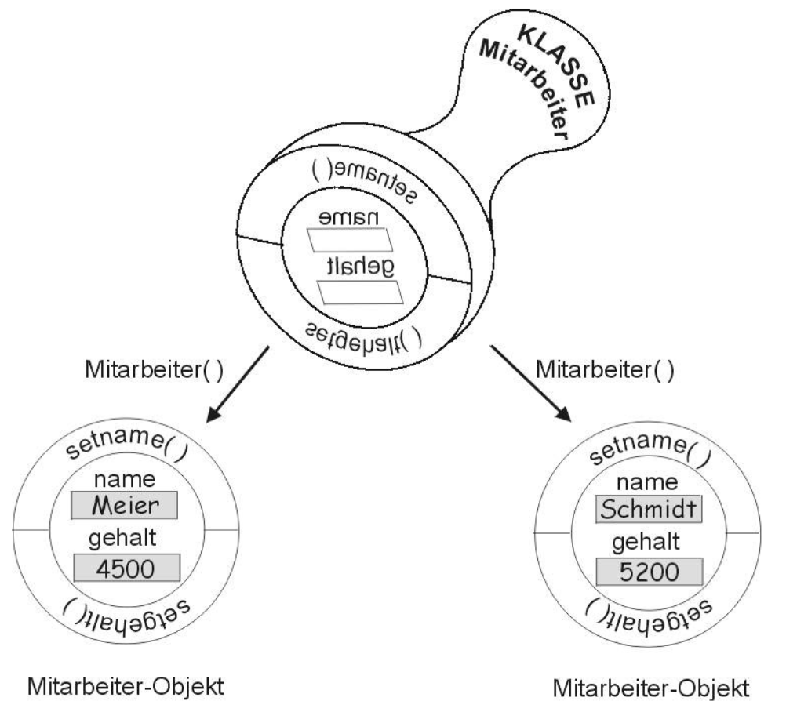

<!--

author:   Sebastian Zug & André Dietrich & Galina Rudolf
email:    sebastian.zug@informatik.tu-freiberg.de & andre.dietrich@ovgu.de & Galina.Rudolf@informatik.tu-freiberg.de
version:  1.0.3
language: de
narrator: Deutsch Female

comment: Einführung in die Programmierung für Nicht-Informatiker
logo: ./img/LogoCodeExample.png

import: https://github.com/liascript/CodeRunner
        https://github.com/LiaTemplates/AVR8js/main/README.md#10
        https://raw.githubusercontent.com/liascript-templates/plantUML/master/README.md

-->

[](https://liascript.github.io/course/?https://github.com/TUBAF-IfI-LiaScript/VL_ProzeduraleProgrammierung/blob/master/06_OOPII.md)

# Objektorientierte Programmierung mit C++

| Parameter                 | Kursinformationen                                                                                                                                                                                                                |
| ------------------------- | -------------------------------------------------------------------------------------------------------------------------------------------------------------------------------------------------------------------------------- |
| **Veranstaltung:**        | `Prozedurale Programmierung / Einführung in die Informatik`                                                                                                                                                                                           |
| **Semester**              | `Wintersemester 2022/23`                                                                                                                                                                                                         |
| **Hochschule:**           | `Technische Universität Freiberg`                                                                                                                                                                                                |
| **Inhalte:**              | `Operatorenüberladung / Vererbung`                                                                                                                                                                                               |
| **Link auf Repository: ** | [https://github.com/TUBAF-IfI-LiaScript/VL_ProzeduraleProgrammierung/blob/master/04_Funktionen.md](https://github.com/TUBAF-IfI-LiaScript/VL_ProzeduraleProgrammierung/blob/master/06_OOPII.md) |
| **Autoren**               | @author                                                                                                                                                                                                                          |


---------------------------------------------------------------------

**Fragen an die heutige Veranstaltung ...**

* Was sind Operatoren?
* Warum werden eigene Operatoren für individuelle Klassen benötigt?
* Wann spricht man von Vererbung und warum wird sie angewendet?
* Welche Zugriffsattribute kennen Sie im Zusammenhang mit der Vererbung?

---------------------------------------------------------------------

## Rückblick

> Unter einer Klasse (auch Objekttyp genannt) versteht man in der objektorientierten Programmierung ein abstraktes Modell bzw. einen Bauplan für eine Reihe von ähnlichen Objekten. 



> Und was bedeutet das angewandt auf unsere Vision mit dem Mikrocontroller Daten zu erheben?

```text @plantUML.png
@startuml
ditaa

+-------------------------------------+  +-------------------------------------+
| API Implementierung des Herstellers |  | Eigene Klassenimplementierungen     |
| * Led-Klasse                        |  | * Filter-Klasse                     |
| * Drucksensor-Klasse                |  | * System-Monitor-Klasse             |
| * Serial-Klasse                     |  | * ....                              |
| * ....                        cCCB  |  | * ....                      cBFB    |
+-------------------------------------+  +-------------------------------------+
               |                                            |
               |                                            |
               +-----------------------+--------------------+
                                       |
                                       v
                   +-------------------------------------+
                   | // Mein Programm                    |
                   | void setup{                         |
                   |   RGB_LED rgbLed(red, green, blue); |
                   | }                                   |
                   |                                     |
                   | void setup{                         |
                   |   rgbLed.setColor(255, 0, 0);       |
                   | }                      {d}cBFB      |
                   +-------------------------------------+                      
```

Für die Implementierung einer Ausgabe auf dem Display des MXCHIP Boards nutzen wir die Klassenimplementierung der API.

[Link](https://microsoft.github.io/azure-iot-developer-kit/docs/apis/display/)

## Operatorenüberladung

Motivation
-------------------

Folgendes Beispiel illustriert den erreichten Status unserer C++ Implementierungen. Unsere Klasse `Student` besteht aus:

+ 3 Membervariablen (Zeile 5-7)
+ 2 Konstruktoren (Zeile 9-10)
+ 1 Memberfunktion (Zeile 12)

Alle sind als `public` markiert.

```cpp                     example.cpp
#include <iostream>

class Student{
  public:
    std::string name;
    int alter;
    std::string ort;

    Student(std::string n);
    Student(std::string n, int a, std::string o);

    void ausgabeMethode(std::ostream& os); // Deklaration der Methode
};

Student::Student(std::string n): name(n), alter(8), ort("Freiberg"){}

Student::Student(std::string n, int a, std::string o): name(n), alter(a), ort(o) {}

void Student::ausgabeMethode(std::ostream& os){
    os << name << " " << ort << " " << alter << "\n";
}

int main()
{
  Student gustav = Student("Zeuner", 27, "Chemnitz");
  //Student gustav {"Zeuner", 27, "Chemnitz"};
  //Student gustav("Zeuner", 27, "Chemnitz");
  gustav.ausgabeMethode(std::cout);

  Student bernhard {"Cotta", 18, "Zillbach"};
  bernhard.ausgabeMethode(std::cout);

  Student nochmalBernhrd {"Cotta", 18, "Zillbach"};
}
```
@LIA.eval(`["main.cpp"]`, `g++ -Wall main.cpp -o a.out`, `./a.out`)

> **Aufgabe:** Schreiben Sie
>
>   + eine Funktion `int vergleich(Student, Student)` und
>
> + eine Methode `int Student::vergleich(Student, Student)`,
>
> die zwei Studenten miteinander vergleicht!


{{1}}
> __Frage:__ Was ist der Nachteil unserer Lösung?

### Konzept

Das Überladen von Operatoren erlaubt die flexible klassenspezifische Nutzung von Arithmetischen- und Vergleichs-Symbolen wie  `+`, `-`, `*`, `==`. Damit kann deren Bedeutung für selbstdefinierte Klassen mit einer neuen Bedeutung versehen werden. Ausnahmen bilden spezielle Operatoren, die nicht überladen werden dürfen (  ?: ,  :: ,  . ,  .* , typeid , sizeof und die Cast-Operatoren).

```
Matrix a, b;
Matrix c = a + b;    \\ hier wird mit dem Plus eine Matrixoperation ausgeführt

String a, b;
String c = a + b;    \\ hier werden mit dem Plus zwei Strings konkateniert
```

Operatorüberladung ist Funktionsüberladung, wobei die Funktionen durch eine spezielle Namensgebung gekennzeichnet sind. Diese beginnen mit dem Schlüsselwort `operator`, das von dem Token für den jeweiligen Operator gefolgt wird.

```cpp
class Matrix{
  public:
    Matrix operator+(Matrix zweiterOperand){ ... }
    Matrix operator/(Matrix zweiterOperand){ ... }
    Matrix operator*(Matrix zweiterOperand){ ... }
}

class String{
  public:
    String operator+(String zweiterString){ ... }
}
```

Operatoren können entweder als Methoden der Klasse oder als globale Funktionen überladen werden. Die Methodenbeispiele sind zuvor dargestellt, analoge Funktionen ergeben sich zu:

```cpp
class Matrix{
  public:
    ...
}

Matrix operator+(Matrix ersterOperand, Matrix zweiterOperand){ ... }
Matrix operator/(Matrix ersterOperand, Matrix zweiterOperand){ ... }
Matrix operator*(Matrix ersterOperand, Matrix zweiterOperand){ ... }
```

> **Merke:** Funktion oder Methode - welche Version sollte wann zum Einsatz kommen? Einstellige Operatoren `++` sollten Sie als Methode, zweistellige Operatoren ohne Manipulation der Operanden als Funktion implementieren. Für zweistellige Operatoren, die einen der Operanden verändern (`+=`), sollte als Methode realisiert werden.

Als Beispiel betrachten wir eine Klasse Rechteck und implementieren zwei Operatorüberladungen:

+ eine Vergleichsoperation
+ eine Additionsoperation die `A = A + B` oder abgekürzt `A+=B`

implementiert.

```cpp                     Comparison.cpp
#include <iostream>

class Rectangle {
  private:
    float width, height;
  public:
    Rectangle(int w, int h): width{w}, height{h} {}
    float area() {return width*height;}
    Rectangle operator+=(Rectangle offset) {
       float ratio = (offset.area() + this->area()) / this->area();
       this->width = ratio *  this->width;
       return *this;
    }
};

bool operator>(Rectangle a, Rectangle b){
    if (a.area() > b.area()) return 1;
    else return 0;
}

int main () {
  Rectangle rect_a(3,4);
  Rectangle rect_b(5,7);
  std::cout << "Vergleich: " << (rect_a > rect_b) << "\n";

  std::cout << "Fläche a : " << rect_a.area() << "\n";
  std::cout << "Fläche b : " << rect_b.area() << "\n";
  rect_a += rect_b;
  std::cout << "Summe    : " << rect_a.area();

  return 0;
}
```
@LIA.eval(`["main.cpp"]`, `g++ -Wall main.cpp -o a.out`, `./a.out`)

> **Merke:** Üblicherweise werden die Operanden bei der Operatorüberladung als Referenzen übergeben. Damit wird eine Kopie vermieden. In Kombination mit dem Schlüsselwort `const` kann dem Compiler angezeigt werden. dass keine Veränderung an den Daten vorgenommen wird. Sie müssen also nicht gespeichert werden.

```
bool operator>(const Rectangle& a, const Rectangle& b){
    if (a.area() > b.area()) return 1;
    else return 0;
}
```

Stellen wir die Abläufe nochmals grafisch dar:

+ Aufruf über Call-by-Value [Pythontutor](http://pythontutor.com/visualize.html#code=%23include%20%3Ciostream%3E%0A%0Aclass%20Rectangle%20%7B%0A%20%20private%3A%0A%20%20%20%20float%20width,%20height%3B%0A%20%20public%3A%0A%20%20%20%20Rectangle%28int%20w,%20int%20h%29%3A%20width%7Bw%7D,%20height%7Bh%7D%20%7B%7D%0A%20%20%20%20float%20area%28%29%20%7Breturn%20width*height%3B%7D%0A%20%20%20%20Rectangle%20operator%2B%3D%28Rectangle%20offset%29%20%7B%0A%20%20%20%20%20%20%20float%20ratio%20%3D%20%28offset.area%28%29%20%2B%20this-%3Earea%28%29%29%20/%20this-%3Earea%28%29%3B%0A%20%20%20%20%20%20%20this-%3Ewidth%20%3D%20ratio%20*%20%20this-%3Ewidth%3B%0A%20%20%20%20%20%20%20return%20*this%3B%0A%20%20%20%20%7D%0A%7D%3B%0A%0Abool%20operator%3E%28Rectangle%20a,%20Rectangle%20b%29%7B%0A%20%20%20%20if%20%28a.area%28%29%20%3E%20b.area%28%29%29%20return%201%3B%0A%20%20%20%20else%20return%200%3B%0A%7D%0A%0Aint%20main%20%28%29%20%7B%0A%20%20Rectangle%20rect_a%283,4%29%3B%0A%20%20Rectangle%20rect_b%285,7%29%3B%0A%20%20std%3A%3Acout%20%3C%3C%20%22Vergleich%3A%20%22%20%3C%3C%20%28rect_a%20%3E%20rect_b%29%20%3C%3C%20%22%5Cn%22%3B%0A%0A%20%20std%3A%3Acout%20%3C%3C%20%22Fl%C3%A4che%20a%20%3A%20%22%20%3C%3C%20rect_a.area%28%29%20%3C%3C%20%22%5Cn%22%3B%0A%20%20std%3A%3Acout%20%3C%3C%20%22Fl%C3%A4che%20b%20%3A%20%22%20%3C%3C%20rect_b.area%28%29%20%3C%3C%20%22%5Cn%22%3B%0A%20%20rect_a%20%2B%3D%20rect_b%3B%0A%20%20std%3A%3Acout%20%3C%3C%20%22Summe%20%20%20%20%3A%20%22%20%3C%3C%20rect_a.area%28%29%3B%0A%0A%20%20return%200%3B%0A%7D&cumulative=false&curInstr=0&heapPrimitives=nevernest&mode=display&origin=opt-frontend.js&py=cpp&rawInputLstJSON=%5B%5D&textReferences=false)
+ Aufruf über Referenz [Pythontutor](http://pythontutor.com/visualize.html#code=%23include%20%3Ciostream%3E%0A%0Aclass%20Rectangle%20%7B%0A%20%20private%3A%0A%20%20%20%20float%20width,%20height%3B%0A%20%20public%3A%0A%20%20%20%20Rectangle%28int%20w,%20int%20h%29%3A%20width%7Bw%7D,%20height%7Bh%7D%20%7B%7D%0A%20%20%20%20float%20area%28%29%20%7Breturn%20width*height%3B%7D%0A%7D%3B%0A%0Abool%20operator%3E%28Rectangle%26%20a,%20Rectangle%26%20b%29%7B%0A%20%20%20%20if%20%28a.area%28%29%20%3E%20b.area%28%29%29%20return%201%3B%0A%20%20%20%20else%20return%200%3B%0A%7D%0A%0Aint%20main%20%28%29%20%7B%0A%20%20Rectangle%20rect_a%283,4%29%3B%0A%20%20Rectangle%20rect_b%285,7%29%3B%0A%20%20std%3A%3Acout%20%3C%3C%20%22Vergleich%3A%20%22%20%3C%3C%20%28rect_a%20%3E%20rect_b%29%20%3C%3C%20%22%5Cn%22%3B%0A%0A%20%20return%200%3B%0A%7D&cumulative=false&curInstr=0&heapPrimitives=nevernest&mode=display&origin=opt-frontend.js&py=cpp&rawInputLstJSON=%5B%5D&textReferences=false)

### Anwendung

Im folgenden Beispiel wird der Vergleichsoperator `==` überladen. Dabei sehen
wir den Abgleich des Namens und des Alters als ausreichend an.

```cpp                     Comparison.cpp
#include <iostream>

class Student{
  public:
    std::string name;
    int alter;
    std::string ort;

    Student(std::string n);
    Student(std::string n, int a, std::string o);

    void ausgabeMethode(std::ostream& os); // Deklaration der Methode
    bool operator==(const Student&);
};

Student::Student(std::string n): name(n), alter(8), ort("Freiberg"){}

Student::Student(std::string n, int a, std::string o): name(n), alter(a), ort(o) {}

void Student::ausgabeMethode(std::ostream& os){
    os << name << " " << ort << " " << alter << "\n";
}

bool Student::operator==(const Student& other){
  if ((this->name == other.name) && (this->alter == other.alter)){
    return true;
  }else{
    return false;
  }
}

int main()
{
  Student gustav = Student("Zeuner", 27, "Chemnitz");
  gustav.ausgabeMethode(std::cout);

  Student bernhard {"Cotta", 18, "Zillbach"};
  bernhard.ausgabeMethode(std::cout);

  Student NochMalBernhard {"Cotta", 18, "Zillbach"};
  NochMalBernhard.ausgabeMethode(std::cout);

  if (bernhard == NochMalBernhard){
    std::cout << "Identische Studenten \n";
  }else{
    std::cout << "Ungleiche Identitäten \n";
  }
}
```
@LIA.eval(`["main.cpp"]`, `g++ -Wall main.cpp -o a.out`, `./a.out`)


Eine besondere Form der Operatorüberladung ist der `<<`, mit dem die Ausgabe auf ein Streamobjekt realsiert werden kann.

```cpp                     streamOperator.cpp
#include <iostream>

class Student{
  public:
    std::string name;
    int alter;
    std::string ort;

    Student(const Student&);
    Student(std::string n);
    Student(std::string n, int a, std::string o);

    void ausgabeMethode(std::ostream& os); // Deklaration der Methode

    bool operator==(const Student&);
};

Student::Student(std::string n, int a, std::string o): name{n}, alter{a}, ort{o} {}

std::ostream& operator<<(std::ostream& os, const Student& student)
{
    os << student.name << '/' << student.alter << '/' << student.ort;
    return os;
}

int main()
{
  Student gustav = Student("Zeuner", 27, "Chemnitz");
  Student bernhard = Student( "Cotta", 18, "Zillbach");
  std::cout << gustav;
}
```
@LIA.eval(`["main.cpp"]`, `g++ -Wall main.cpp -o a.out`, `./a.out`)

Eine umfangreiche Diskussion zur Operatorüberladung finden Sie unter https://www.c-plusplus.net/forum/topic/232010/%C3%BCberladung-von-operatoren-in-c-teil-1/2

## Vererbung

```cpp                     MultipleTypesOfPersons.cpp
#include <iostream>

class Student{
  public:
    std::string name;
    std::string ort;
    std::string studiengang;

    Student(std::string n, std::string o, std::string sg): name{n}, ort{o}, studiengang{sg} {};
    void printCertificate(std::ostream& os){
          os << "Studentendatensatz: "  << name << " " << ort << " " << studiengang << "\n";
    }
};

int main()
{
  Student gustav = Student("Zeuner", "Chemnitz", "Mathematik");
  gustav.printCertificate(std::cout);

  //Professor winkler = Professor("Winkler", "Freiberg");
  //winkler.printCertificate(std::cout);
}
```
@LIA.eval(`["main.cpp"]`, `g++ -Wall main.cpp -o a.out`, `./a.out`)

> **Aufgabe:** Implementieren Sie eine neue Klasse `Professor`, die aber auf die Membervariable `Studiengang` verzichtet, aber eine neue Variable `Fakultät` einführt.

### Motivation

> **Merke: ** Eine unserer Hauptmotivationen bei der "ordentlichen" Entwicklung von Code ist die Vermeidung von Codedopplungen!

In unserem Code entstehen Dopplungen, weil bestimmte Variablen oder Memberfunktionen usw. mehrfach für individuelle Klassen Implementiert werden. Dies wäre für viele Szenarien analog der Fall:

| Basisklasse | abgeleitete Klassen                 | Gemeinsamkeiten                                                  |
| ----------- | ----------------------------------- | ---------------------------------------------------------------- |
| Fahrzeug    | Flugzeug, Boot, Automobil           | Position, Geschwindigkeit, Zulassungsnummer, Führerscheinpflicht |
| Datei       | Foto, Textdokument, Datenbankauszug | Dateiname, Dateigröße, Speicherort                               |
| Nachricht   | Email, SMS, Chatmessage             | Adressat, Inhalt, Datum der Versendung                           |

> **Merke:**  Die _Vererbung_ ermöglicht die Erstellung neuer Klassen, die ein in existierenden Klassen definiertes Verhalten wieder verwenden, erweitern und ändern. Die Klasse, deren Member vererbt werden, wird Basisklasse genannt, die erbende Klasse als abgeleitete Klasse bezeichnet.

### Implementierung in C++

In C++ werden Vererbungsmechanismen folgendermaßen abgebildet:

```cpp  
class Fahrzeug{
  public:
    int aktuellePosition[2];    // lat, long Position auf der Erde
    std::string Zulassungsnummer;
    Bool Fuehrerscheinpflichtig
    ...
};

class Flugzeug: public Fahrzeug{
  public:
    int Flughoehe;
    void fliegen();
    ...
};

class Boot: public Fahrzeug{
  public:
    void schwimmen();
    ...
};
```

Die generellere Klasse `Fahrzeug` liefert einen Bauplan für die spezifischeren, die die Vorgaben weiter ergänzen. Folglich müssen wir uns die Frage stellen, welche Daten oder Funktionalität übergreifend abgebildet werden soll und welche individuell realisiert werden sollen.

Dabei können ganze Ketten von Vererbungen entstehen, wenn aus einem sehr allgemeinen Objekt über mehrere Stufen ein spezifischeres Set von Membern umgesetzt wird.

```cpp  
class Fahrzeug{
  public:
    int aktuellePosition[2];    // lat, long Position auf der Erde
    std::string Zulassungsnummer;
    Bool Fuehrerscheinpflichtig
    ...
};

class Automobil: public Fahrzeug{
  public:
    void fahren();
    int ZahlderRaeder;
    int Sitze;
    ...
};

class Hybrid: public Automobil{
  public:
    void fahreElektrisch();
    ...
};
```

Was bedeutet das für unsere Implementierung von Studenten und Professoren?

```cpp                     Inheritance.cpp
#include <iostream>

class Student{
  public:
    std::string name;
    std::string ort;
    std::string studiengang;

    Student(std::string n, std::string o, std::string sg): name{n}, ort{o}, studiengang{sg} {};
    void printCertificate(std::ostream& os){
          os << "Studentendatensatz: "  << name << " " << ort << " " << studiengang << "\n";
    }
};

int main()
{
  Student gustav = Student("Zeuner", "Chemnitz", "Mathematik");
  gustav.printCertificate(std::cout);

  //Professor winkler = Professor("Winkler", "Freiberg");
  //winkler.printCertificate(std::cout);
}
```
@LIA.eval(`["main.cpp"]`, `g++ -Wall main.cpp -o a.out`, `./a.out`)


Ein weiteres Beispiel greift den Klassiker der Einführung objektorientierter Programmierung auf, den Kanon der Haustiere :-)
Das Beispiel zeigt die Initialisierung der Membervariablen :

+ der Basisklasse beim Aufruf des Konstruktors der erbenden Klasse
+ der Member der erbenden Klasse wie gewohnt

```cpp                     Animals.cpp
#include <iostream>

class Animal {
public:
    Animal(): name{"Animal"}, weight{0.0} {};
    Animal(std::string _name, double _weight): name{_name}, weight{_weight} {};
    void sleep () {
      std::cout << name << " is sleeping!" << std::endl;
    }
    std::string name;
    double weight;
};

class Dog : public Animal {
public:
    Dog(std::string name, double weight, int id): Animal(name, weight), id{id} {};
    void bark() {
      std::cout << "woof woof" << std::endl;
    }
    double top_speed() {
      return (weight < 40) ? 15.5 : (weight < 90) ? 17.0 : 16.2;
    }
    int id;
};

int main(){
    Dog dog = Dog("Rufus", 50.0, 2342);
    dog.sleep();
    dog.bark();
    std::cout << dog.top_speed() << std::endl;
}
```
@LIA.eval(`["main.cpp"]`, `g++ -Wall main.cpp -o a.out`, `./a.out`)

### Vererbungsattribute

Die Zugriffsattribute `public` und `private` kennen Sie bereits. Damit können wir Elemente unserer Implementierung vor dem Zugriff von außen Schützen.

> **Aufgabe:** Verhindern Sie, dass die Einträge von `id` im Nachhinein geändert werden können! Welche zusätzlichen Methoden benötigen Sie dann?

```cpp                     Animals.cpp
#include <iostream>

class Animal {
public:
    std::string name;
    int id;
    Animal(std::string name, int id): name{name}, id{id} {};
};

int main(){
    Animal fish = Animal("Nemo", 234242343);
    std::cout << fish.id << std::endl;
}
```
@LIA.eval(`["main.c"]`, `g++ -Wall main.c -o a.out`, `./a.out`)

                                  {{1}}
********************************************************************************

Wie wirkt sich das Ganze aber auf die Vererbung aus? Hierbei muss neben dem individuellen Zugriffsattribut auch der Status der Vererbung beachtet werden. Damit ergibt sich dann folgendes Bild:

```c++
class A
{
public:
    int x;
protected:
    int y;
private:
    int z;
};

class B : public A
{
    // x is public
    // y is protected
    // z is not accessible from B
};

class C : protected A
{
    // x is protected
    // y is protected
    // z is not accessible from C
};

class D : private A    // 'private' is default for classes
{
    // x is private
    // y is private
    // z is not accessible from D
};
```

Das Zugriffsattribut protected spielt nur bei der Vererbung eine Rolle. Innerhalb einer Klasse ist `protected` gleichbedeuted mit `private`. In der Basisklasse ist also ein Member geschützt und nicht von außen zugreifbar. Bei der Vererbung wird der Unterschied zwischen `private` und `protected` deutlich: Während `private` Member in erbenden Klassen nicht direkt verfügbar sind, kann auf die als `protected` deklariert zugegriffen werden.

Entsprechend muss man auch die Vererbungskonstellation berücksichtigen, wenn man festlegen möchte ob ein Member gar nicht (`private`), immer (`public`) oder nur im Vererbungsverlauf verfügbar sein (`protected`) soll.

```cpp                     Animals.cpp
#include <iostream>

class Animal {
public:
    Animal(): name{"Animal"}, weight{0.0} {};
    Animal(std::string _name, double _weight): name{_name}, weight{_weight} {};
    void sleep () {
      std::cout << name << " is sleeping!" << std::endl;
    }
    std::string name;
    double weight;
};

class Dog : public Animal {
public:
    Dog(std::string name, double weight, int id): Animal(name, weight), id{id} {};
    void bark() {
      std::cout << "woof woof" << std::endl;
    }
    double top_speed() {
      return (weight < 40) ? 15.5 : (weight < 90) ? 17.0 : 16.2;
    }
    int id;
};

int main(){
    Dog dog = Dog("Rufus", 50.0, 2342);
    dog.sleep();
    dog.bark();
    std::cout << dog.top_speed() << std::endl;
}
```
@LIA.eval(`["main.cpp"]`, `g++ -Wall main.cpp -o a.out`, `./a.out`)

********************************************************************************

### Überschreiben von Methoden der Basisklasse

Die grundsätzliche Idee bezieht sich auf die Implementierung "eigener" Methoden gleicher Signatur in den abgeleiteten Klassen. Diese implementieren dann das spezifische Verhalten der jeweiligen Objekte.

```cpp                     Inheritance.cpp
#include <iostream>

class Person{
  public:
    std::string name;
    std::string ort;

    Person(std::string n, std::string o): name{n}, ort{o} {};
    void printData(std::ostream& os){
        os << "Datensatz: "  << name << " " << ort << "\n";
    }
};

class Student : public Person{
  public:
    Student(std::string n, std::string o, std::string sg): Person(n, o), studiengang{sg}{};
    std::string studiengang;
    void printCertificate(std::ostream& os){
          os << "Studentendatensatz: "  << name << " " << ort << " " << studiengang << "\n";
    }
};

class Professor : public Person{
  public:
    Professor(std::string n, std::string o, int id): Person(n, o), id{id}{};
    int id;
};

int main()
{
  Student gustav = Student("Zeuner", "Chemnitz", "Mathematik");
  gustav.printData(std::cout);

  Professor winkler = Professor("Winkler", "Freiberg", 234234);
  winkler.printData(std::cout);
}
```
@LIA.eval(`["main.cpp"]`, `g++ -Wall main.cpp -o a.out`, `./a.out`)

Die Polymorphie (griechisch "Vielgestaltigkeit") der objektorientierten Programmierung ist eine Eigenschaft, die in Zusammenhang mit Vererbung einhergeht. Eine Methode ist genau dann polymorph, wenn sie von verschiedenen Klassen unterschiedlich genutzt wird. Wenn Sie mehr darüber wissen wollen, sind Sie herzlich zur Vorlesung Softwareentwicklung im Sommersemester eingeladen!

Dabei untersuchen wir unter anderem Konzepte, wie wir die erbenden Methoden zwingen können ein bestimmte Methode zu implementieren. Mit der Notation `virtual void printData(std::ostream& os) = 0;` wird aus unserer Implementierung eine abstrakte Methode, die in jedem Fall in den erbenden Klassen implementiert sein muss.  

## Anwendungsfall

Entwerfen Sie eine Klasse, die das Verhalten einer Ampel mit den notwendigen
Zuständen modelliert. Welche Methoden sollten zusätzlich in die Klasse aufgenommen werden?

<div>
  <wokwi-led color="red" pin="13" port="B" label="13"></wokwi-led>
  <wokwi-led color="yellow" pin="12" port="B" label="12"></wokwi-led>
  <wokwi-led color="green" pin="11" port="B" label="11"></wokwi-led>
  <span id="simulation-time"></span>
</div>

```cpp       TrafficLight.cpp
class Ampel {
private:
    int redPin, yellowPin, greenPin;
    int state = 0;
	
public:
    Ampel(int red, int yellow, int green): redPin{red}, yellowPin{yellow}, greenPin{green} {
    	  pinMode(red, OUTPUT);
        pinMode(yellow, OUTPUT);
        pinMode(green, OUTPUT);
    };
    void activateRed() {
      digitalWrite(redPin, HIGH);
    }
    void startOnePeriod(int waitms) {
      digitalWrite(redPin, HIGH);
      delay(waitms);
      digitalWrite(yellowPin, HIGH);
      delay(waitms);
      digitalWrite(redPin, LOW);
      digitalWrite(yellowPin, LOW);
      digitalWrite(greenPin, HIGH);
    }
};

void setup() {
  Ampel trafficLight = Ampel(13, 12, 11);
  trafficLight.activateRed();
  trafficLight.startOnePeriod(1000);
}

void loop() {
  delay(100);
}
```
@AVR8js.sketch

# Quiz
## Operatorenüberladung
### Konzept
> Welches Schlüsselwort wird bei der Operatorüberladung verwendet?
[[operator]]

{{1}}
**************************************************************************
> Für welche Operatoren sollten Methoden und für welche Funktionen zum Einsatz kommen?
[[Methode]  [Funktion]]
[(X)        ( )       ] `++`
[( )        (X)       ] `+`
[( )        (X)       ] `*`
[( )        (X)       ] `%`
[(X)        ( )       ] `--`
[(X)        ( )       ] `+=`
**************************************************************************

{{2}}
**************************************************************************
> Wie lautet die Ausgabe dieses Programms? (Hinweise können über das Feld mit der Glühbirne angezeigt werden.)
```cpp
#include<iostream>

class Vektor {
  public:
	  int x = 0, y = 0;

    Vektor(int x, int y);
	
	  Vektor operator+(const Vektor& vek_tmp);

	  void printVektor(){
      std::cout << x << ", " << y;
      }
};

Vektor::Vektor(int x, int y): x(x), y(y) {}

Vektor Vektor::operator+(const Vektor& vek_tmp){
		  Vektor vek_loe(0, 0);
		  vek_loe.x = this->x + vek_tmp.x;
		  vek_loe.y = this->y + vek_tmp.y;
		  return vek_loe;
	  }

int main(){
	Vektor v1(4, 7), v2(10, 9);
	Vektor v3 = v1 + v2;
	v3.printVektor();
}
```
[[14, 16]]
[[?]] In diesem Beispiel sollen zwei zweidimensionale Vektoren addiert werden. Im nächsten Tipp steht eine genauere Erklärung der Operatorüberladung hier im Beispiel. 
[[?]] `this->x` und `this->y` in der Überladung sind die x- und y-Komponente des Vektors vor dem Operator in der `main`-Funktion (also `v1`). Diese müssen nicht übergeben werden. Der Vektor, der hinter dem Operator in der `main`-Funktion 27 steht (`v2`), muss übergeben werden. `vek_tmp.x` und `vek_tmp.x` sind die Komponenten des Vektors `v2` hinter dem Operator. Beide Anteile werden jeweils addiert und ein neuer Vektor `vek_loe`, der der Lösungsvektor sein soll, zurückgegeben.
**************************************************************************

### Anwendung
> Wie lautet die Ausgabe dieses Programms?
```cpp
#include <iostream>

class Ort{
  public:
    std::string name;
    std::string bundesland;
    int einwohner;

    Ort(const Ort&);
    Ort(std::string n);
    Ort(std::string n, std::string b, int e);

    void ausgabeMethode(std::ostream& os);
};

Ort::Ort(std::string n, std::string b, int e): name{n}, bundesland{b}, einwohner{e} {}

std::ostream& operator<<(std::ostream& os, const Ort& ort)
{
    os << ort.name << ", " << ort.bundesland << ", " << ort.einwohner;
    return os;
}

int main()
{
  Ort Freiberg = Ort("Freiberg", "Sachsen" , 41823);
  std::cout << Freiberg;
}
```
[[Freiberg, Sachsen, 41823]]

## Vererbung
> Erbt die erbende Klasse immer alle Attribute und Methoden der Basisklasse?
[(X)] Ja
[( )] Nein

### Implementierung in C++
> Wodurch muss `[_____]` ersetzt werden um eine Klasse `Flugzeug` zu erstellen, die von der Klasse `Fahrzeug` erbt?
```cpp
#include <iostream>

class Fahrzeug{
  public:
    int aktuellePosition[2];
    std::string Zulassungsnummer;
    bool Fuehrerscheinpflichtig;
};

[_____]{
  public:
    int Flughoehe;
    void fliegen();
};
```
[[class Flugzeug: public Fahrzeug]]
<script>
let input = "@input".trim()

input == "class Flugzeug: public Fahrzeug" || input == "class Flugzeug:public Fahrzeug"
</script>

{{1}}
**************************************************************************
> Ist es möglich Vererbungen zu verketten?
[(X)] Ja
[( )] Nein
**************************************************************************

{{2}}
**************************************************************************
> Wie lautet die Ausgabe dieses Programms?
```cpp
#include <iostream>

class Fahrzeug {
  public:
    Fahrzeug(): name{"Fahrzeug"}{};
    Fahrzeug(std::string _name): name{_name}{};
    void kaputt() {
      std::cout << name << " muss in die Werkstatt.";
    }
    std::string name;
};

class Auto: public Fahrzeug {
  public:
    Auto(std::string name, int ps): Fahrzeug(name), ps{ps} {};
    int ps = 0;
};

int main() {
  Auto auto1 = Auto("Peters Auto", 100);
  auto1.kaputt();
  return 0;
} 
```
[[Peters Auto muss in die Werkstatt.]]
**************************************************************************

### Vererbungsattribute
> Wann ist der zugriff auf welche Klassen möglich?
[[`private`]  [`protected`] [`public`]]
[( )          ( )           (X)       ] Zugriff ist immer möglich.
[(X)          ( )           ( )       ] Zugriff ist nur innerhalb der Basisklasse möglich.
[( )          (X)           ( )       ] Zugriff ist in der Basisklasse und in erbenden Klassen möglich.

### Polymorphie
> Was ist Polymorphie?
[( )] Eine Technik, die es ermöglicht, bestehende Methoden für neue Klassen zu verwenden
[(X)] Eine Technik, die es ermöglicht, bestehende Methoden zu überschreiben
[( )] Eine Technik, die es ermöglicht, bestehende Klassen zu ändern

{{1}}
**************************************************************************
> Wann ist Polymorphie sinnvoll?
[( )] Immer, wenn man neue Klassen definiert
[(X)] Wenn man bestehende Methoden für neue Klassen verwenden möchte
[( )] Wenn man Methoden der Basisklasse löschen möchte
**************************************************************************

{{2}}
**************************************************************************
> Wie lautet die Ausgabe dieses Programms?

```cpp
#include <iostream>

class Basisklasse {
  public:
    void ausgabe() {
      std::cout << "Ausgabe1";
    }
};

class Ableitungsklasse : public Basisklasse {
  public:
    void ausgabe() {
      std::cout << "Ausgabe2";
    }
};

int main() {
  Basisklasse b = Basisklasse();
  b.ausgabe();

  Ableitungsklasse a = Ableitungsklasse();
  a.ausgabe();
  return 0;
}
```
[[Ausgabe1Ausgabe2]]
**************************************************************************