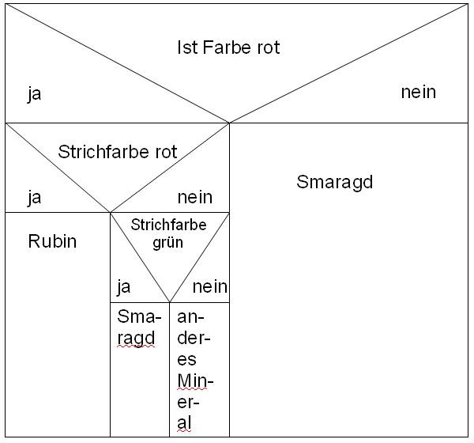

<!--

author:   Sebastian Zug & André Dietrich & Galina Rudolf
email:    sebastian.zug@informatik.tu-freiberg.de & andre.dietrich@ovgu.de & Galina.Rudolf@informatik.tu-freiberg.de
version:  1.1.2
language: de
narrator: Deutsch Female

comment: Einführung in die Programmierung für Nicht-Informatiker
logo: ./img/LogoCodeExample.png

import: https://github.com/liascript/CodeRunner
        https://github.com/LiaTemplates/AVR8js/main/README.md

-->

[](https://liascript.github.io/course/?https://github.com/TUBAF-IfI-LiaScript/VL_ProzeduraleProgrammierung/blob/master/07_Algorithmen.md)

# Standardalgorithmen in C

| Parameter                 | Kursinformationen                                                                                                                                                                                                                |
| ------------------------- | -------------------------------------------------------------------------------------------------------------------------------------------------------------------------------------------------------------------------------- |
| **Veranstaltung:**        | `Vorlesung Prozedurale Programmierung`                                                                                                                                                                                           |
| **Semester**              | `Wintersemester 2021/22`                                                                                                                                                                                                         |
| **Hochschule:**           | `Technische Universität Freiberg`                                                                                                                                                                                                |
| **Inhalte:**              | `Realisierung von Standardalgorithmen in C`                                                                                                                                                                                               |
| **Link auf Repository: ** | [https://github.com/TUBAF-IfI-LiaScript/VL_ProzeduraleProgrammierung/blob/master/07_Algorithmen.md](https://github.com/TUBAF-IfI-LiaScript/VL_ProzeduraleProgrammierung/blob/master/07_Algorithmen.md) |
| **Autoren**               | @author                                                                                                                                                                                                                          |


---------------------------------------------------------------------

**Fragen an die heutige Veranstaltung ...**

* Was ist ein Algorithmus und über welche Merkmale lässt er sich ausdrücken.
* Nennen Sie Beispiele für Algorithmen aus dem täglichen Leben.
* Wie erfolgt die Transformation des Algorithmus auf eine Programmiersprache?
* Was bedeutet der Begriff der Komplexität eines Algorithmus?
* Welchem fundamentalen Konzept der Informatik unterliegen der Quicksort Algorithmus und die binäre Suche?

---------------------------------------------------------------------

**Wie weit waren wir gekommen?**

Das folgende Beispiel wiederholt die Verwendung von `typedef` und `stuct` innerhalb eines Arrays für eine Ampelsteuerung.

<!--
style="width: 80%; max-width: 460px; display: block; margin-left: auto; margin-right: auto;"
-->
```ascii
                  .-- 3s --. .-- 1s --. .-- 3s --.
                  |        | |        | |        |
                  |        v |        v |        v
                 .-.       .-.        .-.       .-.
 Ampelzustände  ( 0 )     ( 1 )      ( 2 )     ( 3 )
                 '-'       '-'        '-'       '-'
                  ^                              |
                  |                              |
                  .------------- 1s -------------.

                 RED  RED/YELLOW     GREEN     YELLOW
````

<div>
  <wokwi-led color="red"    pin="13" port="B" label="13"></wokwi-led>
  <wokwi-led color="yellow" pin="12" port="B" label="12"></wokwi-led>
  <wokwi-led color="green"  pin="11" port="B" label="11"></wokwi-led>
  <span id="simulation-time"></span>
</div>

```cpp       TrafficLights.cpp
typedef struct {
    int state;
    int next;
    int A_red;
    int A_yellow;
    int A_green;
    int timer;
} ampel_state_t;

ampel_state_t state_table[4] = {

// state     A_red             timer
//  |   next  |  A_yellow       |
//  |    |    |   |    A_green  |
//----------------------------------------------
{   0,   1,   1,  0,    0,      3},
{   1,   2,   1,  1,    0,      1 },
{   2,   3,   0,  0,    1,      3},
{   3,   0,   0,  1,    0,      1,}
};

const int redPin = 13;
const int yellowPin = 12;
const int greenPin = 11;

int state = 0;

void setup() {
  pinMode(greenPin, OUTPUT);
  pinMode(yellowPin, OUTPUT);
  pinMode(redPin, OUTPUT);
}

void loop() {
  if (state_table[state].A_red == 1) digitalWrite(redPin, HIGH);
  else digitalWrite(redPin, LOW);
  if (state_table[state].A_yellow == 1) digitalWrite(yellowPin, HIGH);
  else digitalWrite(yellowPin, LOW);
  if (state_table[state].A_green == 1) digitalWrite(greenPin, HIGH);
  else digitalWrite(greenPin, LOW);
  delay(state_table[state].timer*1000);
  state =  state_table[state].next;
}
```
@AVR8js.sketch

## Rekursion

Die Rekursion ist ein Aufruf einer Funktionen aus sich selbst heraus. Da bei einem Aufruf sich die Funktion wieder selbst aufruft, benötigt die Funktion wie bei den Schleifen eine Abbruchbedingung, damit die Selbstaufrufe nicht endlos sind.

```cpp      Rekursion1.c
#include<stdio.h>

printLines(int x) {
	if(x > 0) {
		printf("\nZeile Nr. %d", x);
		printLines(x-1);
	}
}

int main() {
	printLines(5);
	return 0;
}
```
@LIA.eval(`["main.c"]`, `gcc -Wall main.c -o a.out`, `./a.out`)

Dieses Programm ist langsamer als eine konventionelle Darstellung in einer Schleife, weil mit dem Aufruf jeder Funktion ein eigener Speicherplatz zum Anlegen von Parametern, lokalen Variablen, Rückgabewerten und Rücksprungadressen belegt wird.

Gleichzeitig steigt aber die Lesbarkeit und Kompaktheit des Codes!

```cpp      Rekursion2.c
#include<stdio.h>

int fakultaet(int x) {
	if(x > 1) {
		return x * fakultaet(x-1);
	}else {
		return 1;
	}
}

int main() {
	int a = 6;
	printf("Fakultaet von %d ist %d\n", a, fakultaet(a));
	return 0;
}
```
@LIA.eval(`["main.c"]`, `gcc -Wall main.c -o a.out`, `./a.out`)


## Algorithmusbegriff

                   {{0-4}}
********************************************************************************

Ein Algorithmus gibt eine strukturierte Vorgehensweise vor, um ein Problem zu lösen. Er implementiert Einzelschritte zur Abbildung von Eingabedaten auf Ausgabedaten.
Algorithmen bilden die Grundlage der Programmierung und sind **unabhängig** von einer konkreten Programmiersprache. Algorithmen werden nicht nur maschinell durch einen Rechner ausgeführt sondern können auch von Menschen in „natürlicher“ Sprache formuliert und abgearbeitet werden.

********************************************************************************

                  {{1-4}}
********************************************************************************

1. Beispiel - Nassi-Shneiderman-Diagramm

<!-- width="60%" -->

[^Kubala]: Anton Kubala, https://wiki.zum.de/wiki/Hauptseite

********************************************************************************

                  {{2-4}}
********************************************************************************

 2. Beispiel - Funktionsdarstellung - Berechnung der Position

$$ s(t) = \int_{0}^{t} v(t) dt + s_0 $$

********************************************************************************

                  {{3-4}}
********************************************************************************

 3. Beispiel - Verbale Darstellung - Rezept

*"Nehmen Sie ... Schneiden Sie ... Lassen Sie alles gut abkühlen ..."*

********************************************************************************

                  {{4-5}}
********************************************************************************

Algorithmen umfassen Sequenzen (Kompositionen), Wiederholungen (Iterationen) und Verzweigungen (Selektionen) von Handlungsanweisungen.
und besitzen die folgenden charakteristischen Eigenschaften:

+ Eindeutigkeit: ein Algorithmus darf keine widersprüchliche Beschreibung haben. Diese muss eindeutig sein.
+ Ausführbarkeit: jeder Einzelschritt muss ausführbar sein.
+ Finitheit (= Endlichkeit): die Beschreibung des Algorithmus ist von endlicher Länge (statische Finitheit) und belegt zu jedem Zeitpunkt nur eine endliche Menge von Ressourcen (dynamische Finitheit).
+ Terminierung: nach endlich vielen Schritten muss der Algorithmus enden und ein Ergebnis liefern.
+ Determiniertheit: der Algorithmus muss bei gleichen Voraussetzungen stets das gleiche Ergebnis liefern.
+ Determinismus: zu jedem Zeitpunkt der Ausführung besteht höchstens eine Möglichkeit der Fortsetzung. Der Folgeschritt ist also eindeutig bestimmt.

Der erste für einen Computer gedachte Algorithmus (zur Berechnung von Bernoullizahlen) wurde 1843(!) von Ada Lovelace in ihren Notizen zu Charles Babbages Analytical Engine festgehalten. Sie gilt deshalb als die erste Programmiererin. Weil Charles Babbage seine Analytical Engine nicht vollenden konnte, wurde Ada Lovelaces Algorithmus allerdings nie darauf implementiert.

*„Die Grenzen der Arithmetik wurden in dem Augenblick überschritten, in dem die Idee zur Verwendung der [Programmier]Karten entstand, und die Analytical Engine hat keine Gemeinsamkeit mit schlichten Rechenmaschinen. Sie ist einmalig, und die Möglichkeiten, die sie andeutet, sind höchst interessant.“*

********************************************************************************

## Suche des Maximums
<!--
  comment: Compare3ValuesWithMacro.cpp
  ..............................................................................
      1. Ersetzen Sie das Makros durch eine Funktionen!
  ~~~~~~~~~~~~~~~~~~~~~~~~~~~~~~~~~~~~~~~~~~~~~~~~~~~~~~~~~~~~~~~~~~~~~~~~~~~~~~
-->

Bestimmen Sie aus drei Zahlenwerten den größten und geben Sie diesen aus $max(n_0, n_1, n_2)$.

```cpp      LargestNumber.c
#include <stdio.h>
#include <stdlib.h>

int main(void) {
  double n1, n2, n3;

  printf("Geben Sie drei Zahlenwerte ein: \n");
  scanf("%lf %lf %lf", &n1, &n2, &n3);
  printf("Eingegebene Zahlen %f %f %f \n", n1, n2, n3);

  if( n1>=n2 && n1>=n3 )
      printf("%f is the largest number.", n1);

  if( n2>=n1 && n2>=n3 )
      printf("%f is the largest number.", n2);

  if( n3>=n1 && n3>=n2 )
      printf("%f is the largest number.", n3);

    return EXIT_SUCCESS;
}
```
@LIA.eval(`["main.c"]`, `gcc -Wall main.c -o a.out`, `./a.out`)

Welche Verbesserungsmöglichkeit sehen Sie für diesen Lösungsansatz?

| Aspekt               | Kritik                                                                |
|:-------------------- |:--------------------------------------------------------------------- |
| Userinterface        | Es erfolgt keine Prüfung der Eingaben!                                |
| Design               | Die Ausgabe erfolgt in 3 sehr ähnlichen Aufrufen.                     |
| Algorithmus          | Es werden 6 Vergleichsoperationen und 3 logische Operationen genutzt. |
| Wiederverwendbarkeit | Die Funktion implementiert die Suche für genau 3 Eingaben.            |

Eine Lösung, die die ersten 3 genannten Kritikpunkte adressiert, könnte wie folgt
entworfen werden:

```cpp                       Compare3Values.c
#include <stdio.h>
#include <stdlib.h>

int main(void) {
  double n1, n2, n3;
  double result = 0;

  printf("Geben Sie drei Zahlenwerte ein: \n");
  if (scanf("%lf %lf %lf", &n1, &n2, &n3) == 3){
    printf("Eingegebene Zahlen %f %f %f \n", n1, n2, n3);
    if( n1>=n2 && n1>=n3 ){
      result = n1;
    }
    else{
      if( n2>=n3){result = n2;}
      else {result = n3;}
    }
    printf("Größter Wert ist %.1f\n", result);
  }else{
    printf("Ungültige Eingabe!");
  }
  return EXIT_SUCCESS;
}
```
@LIA.eval(`["main.c"]`, `gcc -Wall main.c -o a.out`, `./a.out`)

Ein alternativer Ansatz kann mit Hilfe von Makrooperationen umgesetzt werden,
die eine `MAX`-Methode implementieren.

```cpp                  Compare3ValuesWithMacro.c
#include <stdio.h>
#include <stdlib.h>

#define MAX(x, y) (((x) > (y)) ? (x) : (y))

int main(void) {
  double n1, n2, n3;
  double result = 0;

  printf("Geben Sie drei Zahlenwerte ein: \n");
  if (scanf("%lf %lf %lf", &n1, &n2, &n3) == 3){
    printf("Eingegebene Zahlen %f %f %f \n", n1, n2, n3);
    result = MAX(MAX(n1, n2),n3);
    printf("Größter Wert ist %.1f\n", result);
  }else{
    printf("Ungültige Eingabe!");
  }
  return EXIT_SUCCESS;
}
```
@LIA.eval(`["main.c"]`, `gcc -Wall main.c -o a.out`, `./a.out`)

Darfs auch etwas mehr sein? Wie lösen wir die gleiche Aufgabe für größere Mengen
von Zahlenwerten $max(n_0, ... n_k)$ ? Entwerfen Sie dazu folgende Funktionen:

+ `void generateRandomArray(int * ptr)`
+ `int countMaxValue(int *ptr, int n_samples)`

die zunächst gleichverteilte Werte zwischen `MAXVALUE` und `MINVALUE` befüllt
und dann die Häufigkeit des größten Wertes ermittelt.

```cpp                     FindMaxInArray.c
#include <stdio.h>
#include <stdlib.h>
#include <math.h>

#define MAXVALUE 100
#define MINVALUE 5
#define SAMPLES 50

void generateRandomArray(int * ptr){
  srand(time(NULL));
  for (int i = 0; i< SAMPLES; i++){
      ptr[i] = rand() % (MAXVALUE - MINVALUE + 1) + MINVALUE;
  }
}

int maxValue(int *ptr){
  int max = 0;
  for (int i = 0; i< SAMPLES; i++){
      if (ptr[i] > max) {
        max = ptr[i];
      }
  }
  return max;
}

void printArray(int *ptr, int maxValue){
  for (int i = 0; i< SAMPLES; i++){
    if ((i>0) && (i%10==0)) {
      printf("\n");
    }
    if (ptr[i]!=maxValue){
      printf(" %3d ", ptr[i]);
    }else{
      printf("[%3d]", ptr[i]);
    }
  }
}

int main(void){
  int samples[SAMPLES] = {0};
  generateRandomArray(samples);
  int max = maxValue(samples);
  //int count = 0;     // Aufgabenteil 2
  //int max = maxValue(samples, &count);
  printArray(samples, max);
  printf("\nIm Array wurde %d als Maximum gefunden!", max);
  return(EXIT_SUCCESS);
}
```
@LIA.eval(`["main.c"]`, `gcc -Wall main.c -o a.out`, `./a.out`)

Aufgabenteil 2: Erweitern Sie die Funktionalität von `maxValue()` um die Rückgabe
der Häufigkeit des Auftretens des maximalen Wertes. Ein Kommilitone schlägt folgende Lösung vor:

```cpp
int maxValue(int *ptr, int *count){
  int max = 0;
  for (int i = 0; i< SAMPLES; i++){
      if (ptr[i] > max) {
        max = ptr[i];
        *count = 1;
      }
      if (ptr[i] == max) {
        (*count)++;
      }
  }
  return max;
}
```

Bewerten Sie diese und entwerfen Sie ggf. eine alternative Implementierung.

Für alle, die mit dem Knobeln fertig sind, hier noch eine kurze Auflösung. Dadurch, dass beim
Auftreten eines neuen Maximums in der ersten Verzweigung max dem neuen Wert zugeordnet wird,
rutschen wir automatisch auch in die zweite Verzweigung, wodurch der Wert von max immer eins
größer sein wird, als wir wollen. Eine Lösung von vielen für diese Problematik ist folgende:

```cpp
int maxValue(int *ptr, int *count){
  int max = 0;
  for (int i = 0; i< SAMPLES; i++){
      if (ptr[i] > max) {
        max = ptr[i];
        *count = 1;
      }
      else if (ptr[i] == max) {
        (*count)++;
      }
  }
  return max;
}
```

## Sortieren

              {{0-1}}
********************************************************************************

Lassen Sie uns die Idee der Max-Funktion nutzen, um das Array insgesamt zu
sortieren. Dazu wird in einer Schleife (Zeile 42) der maximale Wert bestimmt,
wobei dessen Eintrag aus dem bestehenden Array mit einer -1 überschrieben
wird.

Welche Nachteile sehen Sie in diesem Konzept?

```cpp                     Duration.c
#include <stdio.h>
#include <stdlib.h>
#include <math.h>
#include <time.h>

#define MAXVALUE 100
#define MINVALUE 5
#define SAMPLES 1000

void generateRandomArray(int * ptr){
  srand(time(NULL));
  for (int i = 0; i< SAMPLES; i++){
      ptr[i] = rand() % (MAXVALUE - MINVALUE + 1) + MINVALUE;
  }
}

int maxValue(int *ptr){
  int max = 0;
  int max_index = 0;
  for (int i = 0; i< SAMPLES; i++){
      if (ptr[i] > max) {
        max = ptr[i];
        max_index = i;
      }
  }
  ptr[max_index] = -1;
  return max;
}

void printArray(int *ptr){
  for (int i = 0; i< SAMPLES; i++){
    if ((i>0) && (i%10==0)) {
      printf("\n");
    }
    printf(" %3d ", ptr[i]);
  }
}

int main(void){
  int samples[SAMPLES] = {0};
  generateRandomArray(samples);
  clock_t start = clock();
  int sorted[SAMPLES] = {0};
  for (int i = 0; i< SAMPLES; i++){
    sorted[i] = maxValue(samples);
  }
  clock_t end = clock();
  printArray(sorted);
  double cpu_time_used = ((double) (end - start)) / CLOCKS_PER_SEC;

  printf("Der Rechner benötigt für %d Samples %f Sekunden \n", SAMPLES,cpu_time_used);

  return(EXIT_SUCCESS);
}
```
@LIA.eval(`["main.c"]`, `gcc -Wall main.c -o a.out`, `./a.out`)

* Das Ursprungsarray wird beim Sortiervorgang zerstört, am Ende umfasst es ausschließlich -1-Einträge
* Die Ausführungsdauer wird durch `SAMPLES` x `SAMPLES` Vergleichsoperationen bestimmt.

Welche Konsequenz hat dieses Verhalten?

********************************************************************************

### BubbleSort

Die Informatik kennt eine Vielzahl von Sortierverfahren, die unterschiedliche
Eigenschaften aufweisen. Ein sehr einfacher Ansatz ist BubbleSort, der
namensgebend die größten oder kleinsten Zahlen Gasblasen gleich aufsteigen lässt.

<!-- width="40%" -->

[^Stummvoll]: Stummvoll, https://de.wikipedia.org/wiki/Bubblesort#/media/File:Bubblesort_Animation.gif

```cpp  BubbleSort.c
#include <stdio.h>
#include <stdlib.h>
#include <time.h>

#define MAXVALUE 100
#define MINVALUE 5
#define SAMPLES 20

void generateRandomArray(int *ptr) {
  srand(time(NULL));
  for (int i = 0; i< SAMPLES; i++){
      ptr[i] = rand() % (MAXVALUE - MINVALUE + 1) + MINVALUE;
  }
}

void bubble(int *array) {
  int n_samples = SAMPLES;
  int temp;
  while(n_samples--){
    for(int i = 1; i <= n_samples; i++){
     if(array[i-1] > array[i]) {
      temp=array[i];
      array[i]=array[i-1];
      array[i-1]=temp;
     }
    }
  }
}

void printArray(int *ptr){
  for (int i = 0; i< SAMPLES; i++){
    if ((i>0) && (i%10==0)) {
      printf("\n");
    }
    printf("%3d ", ptr[i]);
  }
  printf("\n");
}

int main(void) {
  int samples[SAMPLES] = {0};
  generateRandomArray(samples);
  bubble(samples);
  printArray(samples);
  return(EXIT_SUCCESS);
}
```
@LIA.eval(`["main.c"]`, `gcc -Wall main.c -o a.out`, `./a.out`)

Worin unterscheidet sich dieser Ansatz von dem vorhergehenden?

Um das erste (und größte) Element $n$ ganz nach rechts zu bewegen, werden $n − 1$
Vertauschungen vorgenommen, für das nächstfolgende $n-2$ usw. Für die Gesamtanzahl
muss also die Summe über $k$ von 1 bis n-1 gebildet werden. Mit der Summenformel
von Gauss kann gezeigt werden, dass im Falle der umgekehrt sortierten Liste werden maximal $\frac{n\cdot (n-1)}{2}$ Vertauschungen zuführen sind.

> Aufgabe: Welches Optimierungspotential sehen Sie?


                 {{1-2}}
********************************************************************************

In den Code sollte ein Abbruchkriterium integriert werden, wenn während eines
Durchlaufes keine Änderungen vollzogen werden. Im günstigsten Fall lässt sich
damit das Verfahren nach einem Durchlauf beenden.

********************************************************************************


### Quicksort

Quicksort ist ein rekursiver Sortieralgorithmus, der die zu sortierende Liste in zwei Teillisten unterteilt und alle Elemente, die kleiner sind als das Pivot-Element, in die linke Teilliste, alle anderen in die rechte Teilliste einsortiert.

Die Buchstabenfolge „einbeispiel“ soll alphabetisch sortiert werden.

Ausgangssituation nach Initialisierung von i und j, das Element rechts ("l") ist das Pivotelement:

```
  e i n b e i s p i e l
  ^                 ^
  i                 j
```

Nach der ersten Suche in den inneren Schleifen hat i auf einem Element $>= l$ und j auf einem Element $<= l$ gehalten:

```
  e i n b e i s p i e l
      ^             ^
      i             j
```

Nach dem Tauschen der Elemente bei i und j:

```
  e i e b e i s p i n l
      ^             ^
      i             j
```

Nach der nächsten Suche und Tauschen:

```
  e i e b e i i p s n l
              ^   ^
              i   j
```

Nach einer weiteren Suche sind die Indizes aneinander vorbeigelaufen:

```
  e i e b e i i p s n l
              ^ ^
              j i
```

Nach dem Tauschen von i und Pivot bezeichnet i die Trennstelle der Teillisten. Bei i steht das Pivot-Element, links davon sind nur Elemente ≤ Pivot und rechts nur solche > Pivot:

```
  e i e b e i i l s n p
                ^
                i
```
Darauf aufbauend wird der Algorithmus nun auf die beiden Teile "eiebeii" und "snp" angewand.

```cpp  QuickSort.c
#include <stdio.h>
#include <stdlib.h>
#include <time.h>

#define MAXVALUE 100
#define MINVALUE 5
#define SAMPLES 20

void generateRandomArray(int *ptr) {
  srand(time(NULL));
  for (int i = 0; i< SAMPLES; i++){
      ptr[i] = rand() % (MAXVALUE - MINVALUE + 1) + MINVALUE;
  }
}

void quicksort(int *ptr, int first, int last){
   int i, j, pivot, temp;

   if(first<last){
      pivot=first;
      i=first;
      j=last;

      while(i<j){
         while(ptr[i]<=ptr[pivot]&&i<last)
            i++;
         while(ptr[j]>ptr[pivot])
            j--;
         if(i<j){
            temp=ptr[i];
            ptr[i]=ptr[j];
            ptr[j]=temp;
         }
      }
      temp=ptr[pivot];
      ptr[pivot]=ptr[j];
      ptr[j]=temp;
      quicksort(ptr,first,j-1);
      quicksort(ptr,j+1,last);
   }
}

void printArray(int *ptr){
  for (int i = 0; i< SAMPLES; i++){
    if ((i>0) && (i%10==0)) {
      printf("\n");
    }
    printf("%3d ", ptr[i]);
  }
  printf("\n");
}

int main(void) {
  int samples[SAMPLES] = {0};
  generateRandomArray(samples);
  quicksort(samples, 0, SAMPLES);
  printArray(samples);
  return(EXIT_SUCCESS);
}
```
@LIA.eval(`["main.c"]`, `gcc -Wall main.c -o a.out`, `./a.out`)

Obwohl Quicksort im schlechtesten Fall quadratische Laufzeit hat, ist er in der Praxis einer der schnellsten Sortieralgorithmen.

Die C-Standardbibliothek umfasst in der `stdlib.h` eine Implementierung von quicksort - `qsort()` an. Sie wurde in der vorangegangenen Vorlesung besprochen. Ein Anwendungsbeispiel finden Sie im nachfolgenden Abschnitt.

## Suchen
<!--
  comment: Search.cpp
  ..............................................................................
      1. Ersetzen Sie die Konventionelle Suche durch eine rekursive Baumsuche!
      ```cpp
      int binsearch (int *ptr, int links, int rechts, int wert) {
          if (links > rechts) {
              return -1;
          }
          int mitte = (rechts+links)/2;
          if (ptr[mitte] == wert) {
              return mitte;
          }
          if (wert < ptr[mitte]) {
              return binsearch(ptr, links, mitte - 1, wert);
          } else {
              return binsearch(ptr, mitte + 1, rechts, wert);
          }
      }
      ```
  ~~~~~~~~~~~~~~~~~~~~~~~~~~~~~~~~~~~~~~~~~~~~~~~~~~~~~~~~~~~~~~~~~~~~~~~~~~~~~~
-->
Suchen beschreibt die Identifikation von bestimmten Mustern in Daten. Das Spektrum kann dabei von einzelne Zahlenwerten oder Buchstaben bis hin zu komplexen zusammengesetzten Datentypen reichen.

Wie würden Sie vorgehen, um in einer sortierten List einen bestimmten Eintrag zu
finden?

```cpp Search.c
#include <stdio.h>
#include <stdlib.h>
#include <time.h>

#define MAXVALUE 100
#define MINVALUE 5
#define SAMPLES 20


// Generieren der Zufallszahlen
void generateRandomArray(int *ptr) {
  srand(time(NULL));
  for (int i = 0; i< SAMPLES; i++){
      ptr[i] = rand() % (MAXVALUE - MINVALUE + 1) + MINVALUE;
  }
}

// Sortieren des Arrays
void bubble(int *array) {
  int n_samples = SAMPLES;
  int temp;
  while(n_samples--){
    for(int i = 1; i <= n_samples; i++){
     if(array[i-1] > array[i]) {
      temp=array[i];
      array[i]=array[i-1];
      array[i-1]=temp;
     }
    }
  }
}

// Ausgabe
void printArray(int *ptr){
  for (int i = 0; i< SAMPLES; i++){
    if ((i>0) && (i%10==0)) {
      printf("\n");
    }
    printf("%3d ", ptr[i]);
  }
  printf("\n");
}

// Konventionelle Suche über dem Array
int search (int *ptr, int pattern) {
  for (int i = 0; i< SAMPLES; i++){
    if (ptr[i] == pattern) return i;
  }
  return -1;
}

//int binsearch (int *ptr, int links, int rechts, int wert) {
//
//}

int main (void) {
  int samples[SAMPLES] = {0};
  generateRandomArray(samples);
  bubble(samples);
  printArray(samples);
  int pattern = 36;
  int index = search (samples, pattern);
  //int index = binsearch (samples, 0, SAMPLES-1, pattern);
  if (-1==index){
    printf("\nPattern %d nicht gefunden!", pattern);
  }else{
    printf("\nIndex von %d ist %d",pattern, index);
  }
  return(EXIT_SUCCESS);
}
```
@LIA.eval(`["main.c"]`, `gcc -Wall main.c -o a.out`, `./a.out`)

Die Suchtiefe kann mit $\lceil \log_2 (n+1) \rceil$ bestimmt werden.

## Implementierung in der Standardbibliothek

Die Standardbibliothek umfasst eine Suchfunktion, die es erlaubt Arrays nach
beliebigen Kriterien zu sortieren. Der Name `qsort()` deutet dabei an, dass der
Quicksort-Algorithmus zum Einsatz kommt. Die Vergleichsoperation, die vom
Anwender zu implementieren ist, akzeptiert als Übergabewerte Zeiger auf zwei
Einträge im Array und setzt diese in Beziehung. Bei einem negativen Rückgabewert ist das
erste Element kleiner, für einen positiven Wert größer als das zweite Übergabewert. Für den Wert 0 liegt
Gleichheit vor.

```c
void qsort(
   void *array,        // Anfangsadresse des Arrays
   size_t n,           // Anzahl der Elemente zum Sortieren
   size_t size,        // Größe des Datentyps, der sortiert wird
   int (*vergleich_func)(const void*, const void*)   );
```

Eine analoge Funktion steht für die Suche in sortierten Listen bereit. `bsearch()`
durchsucht diese und gibt einen Pointer zurück, der mit dem Suchkriterium
übereinstimmt.

Die binäre Suche ist in der `stdlib.h` als Funktion implementiert. Die Deklaration
erfasst folgende Parameter:

```cpp
void *bsearch(const void *key,
              const void *base,
              size_t nitems,
              size_t size,
              int (*compar)(const void *, const void *))
```
Analog zu `qsort()` wird ein Funktionspointer *compar() der den Vergleich des
`key` mit den Einträgen in `base` realisiert.

```cpp Search.c
#include <stdio.h>
#include <stdlib.h>
#include <time.h>

#define MAXVALUE 100
#define MINVALUE 85
#define SAMPLES 20

// Generieren der Zufallszahlen
void generateRandomArray(int *ptr) {
  srand(time(NULL));
  for (int i = 0; i< SAMPLES; i++){
      ptr[i] = rand() % (MAXVALUE - MINVALUE + 1) + MINVALUE;
  }
}

// Ausgabe
void printArray(int *ptr){
  for (int i = 0; i< SAMPLES; i++){
    if ((i>0) && (i%10==0)) {
      printf("\n");
    }
    printf("%3d ", ptr[i]);
  }
  printf("\n");
}

int cmpfunc (const void * a, const void * b) {
   return ( *(int*)a - *(int*)b );
}

int main (void) {
  int samples[SAMPLES] = {0};
  generateRandomArray(samples);
  qsort(samples, SAMPLES, sizeof(int), cmpfunc);
  printArray(samples);
  int pattern = 90;
  int *item;
  item = (int*) bsearch (&pattern, samples, SAMPLES, sizeof(int), cmpfunc);
  if( item != NULL ) {
    printf("%d an der Speicherstelle %p gefunden!\n", pattern, item);
    printf("Das Array beginnt im Speicher bei %p\n", samples);
    printf("Der Index von %d beträgt folglich %d\n", pattern, item - samples);
  }else{
    printf("%d nicht gefunden!", pattern);
  }
  return(EXIT_SUCCESS);
}
```
@LIA.eval(`["main.c"]`, `gcc -Wall main.c -o a.out`, `./a.out`)

`bsearch` evaluiert die Existenz eines Eintrages, dabei ist es wichtig, den Rückgabewert auf den richtigen Typ des Eintrages zu casten.

## Beispiel des Tages

Schätzen Sie die Größe der Kreiszahl $\pi$ mittels Monte-Carlo-Simulation ab.
Nutzen Sie dafür den Ansatz, dass bei der Projektion von $n$ gleichverteilten
Paaren $(x,y)$ $\pi$ über den Anteil zwischen denjenigen Paaren innerhalb eines
Quadranten unter dem Einheitskreis und denjenigen außerhalb bestimmt werden
kann.

Die Fläche des Quadrates ist $4$, der Flächenanteil des Kreises beträgt $1^2\cdot\pi$. Somit gilt

$$\pi \approx \frac{count_{in}}{count_{all}}\cdot 4$$

```cpp                          Integral.c
#include <stdio.h>
#include <stdlib.h>
#include <math.h>
#include <time.h>

double bestimmePI(unsigned int samples){
  double x, y, z;
  int count = 0;
  srand(time(NULL));
  count=0;
  for (int i=0; i<samples; i++) {
     x = rand() / (double) RAND_MAX;
     y = rand() / (double) RAND_MAX;
     z = x*x+y*y;
     if (x*x+y*y<1) count++;
     }
  return (double)count/samples*4;
}

int main(void) {
  for (int number=5; number<15000; number=number+50){
    printf("%3d, %f, %f\n", number,
                            M_PI,
                            bestimmePI(number));
  }
  return EXIT_SUCCESS;
}
```
@LIA.eval(`["main.c"]`, `gcc -Wall main.c -o a.out`, `./a.out`)

Das korrekte Ergebnis lautet $3.1415926535...$

<!--START_SKIP_IN_PDF-->
## Quizze

Rekursion und Schleifen
--------------------------------
```c
unsigned long int pow1(int num, int exponent) {
    if (exponent == 1)
        return num;
    return pow(num, exponent-1) * num;
}

unsigned long int pow2(int num, int exponent) {
    if (exponent == 0)
        return 1;
    return pow(num, exponent-1) * num;
}

unsigned long int pow3(int num, int exponent) {
    unsigned long int product = num;

    for (int i = 1; i < exponent; i++) {
        product *= num;
    }

    return product;
}
```

Mit welchen von den hier gegebenen Funktionen lässt sich eine Potenz berechnen?

- [[X]] pow1
- [[X]] pow2
- [[x]] pow3

Algorithmusbegriff
--------------------------------

```c
int task1(int num) {
    int product = 1;
    int temp = num;

    while (product <= num * num)
        product *= temp;
        temp++;

    return product;
}

int task2(int num) {
    srand((unsigned) time(NULL));
    int randomNum = rand();

    if (randomNum < 255)
        return num * num;
    else
        return num + num;
}

int task3() {
    int sum = 0;

    while (1)
        sum++;

    return sum;
}

int task4() {
    int goal = 10;
    int temp;
    int returnValue = 0;

    scanf("%d", &temp);

    do {
        printf("Number: %d\n", temp);
        if (temp < goal) {
            returnValue += temp;
            temp++;
        } else if (temp > goal) {
            returnValue += temp;
            temp--;
        }
    } while (temp != goal);

    printf("Number: %d\n", temp);

    return returnValue;
}
```

Welche der gegebenen Funktionen sind **keine** Algorithmen?

- [[ ]] task1
- [[X]] task2
- [[x]] task3
- [[ ]] task3

<!--END_SKIP_IN_PDF-->
