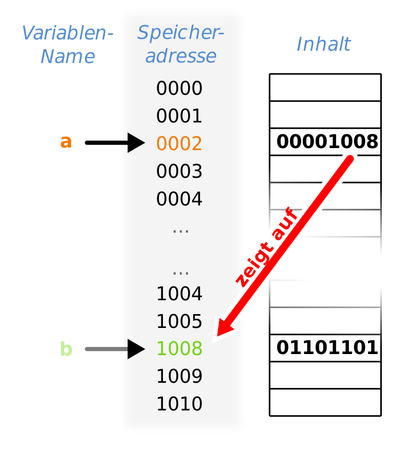

<!--

author:   Sebastian Zug & André Dietrich
email:    zug@ovgu.de   & andre.dietrich@ovgu.de
version:  0.0.1
language: de
narrator: Deutsch Female

script:   https://felixhao28.github.io/JSCPP/dist/JSCPP.es5.min.js

@JSCPP.__eval
<script>
  try {
    var output = "";
    JSCPP.run(`@0`, `@1`, {stdio: {write: s => { output += s }}});
    output;
  } catch (msg) {
    var error = new LiaError(msg, 1);

    try {
        var log = msg.match(/(.*)\nline (\d+) \(column (\d+)\):.*\n.*\n(.*)/);
        var info = log[1] + " " + log[4];

        if (info.length > 80)
          info = info.substring(0,76) + "..."

        error.add_detail(0, info, "error", log[2]-1, log[3]);
    } catch(e) {}

    throw error;
    }
</script>
@end


@JSCPP.eval: @JSCPP.__eval(@input, )

@JSCPP.eval_input: @JSCPP.__eval(@input,`@input(1)`)

@output: <pre class="lia-code-stdout">@0</pre>


script:   https://ajax.googleapis.com/ajax/libs/jquery/1.11.3/jquery.min.js

@Rextester.__eval
<script>
//var result = null;
var error  = false;

console.log = function(e){ send.lia("log", JSON.stringify(e), [], true); };

function grep_(type, output) {
  try {
    let re_s = ":(\\d+):(\\d+): "+type+": (.+)";

    let re_g = new RegExp(re_s, "g");
    let re_i = new RegExp(re_s, "i");

    let rslt = output.match(re_g);

    let i = 0;
    for(i = 0; i < rslt.length; i++) {
        let e = rslt[i].match(re_i);

        rslt[i] = { row : e[1]-1, column : e[2], text : e[3], type : type};
    }
    return [rslt];
  } catch(e) {
    return [];
  }
}

$.ajax ({
    url: "https://rextester.com/rundotnet/api",
    type: "POST",
    timeout: 10000,
    data: { LanguageChoice: @0,
            Program: `@input`,
            Input: `@1`,
            CompilerArgs : @2}
    }).done(function(data) {
        if (data.Errors == null) {
            let warnings = grep_("warning", data.Warnings);

            let stats = "\n-------Stat-------\n"+data.Stats.replace(/, /g, "\n");

            if(data.Warnings)
              stats = "\n-------Warn-------\n"+data.Warnings + stats;

            send.lia("log", data.Result+stats, warnings, true);
            send.lia("eval", "LIA: stop");

        } else {
            let errors = grep_("error", data.Errors);

            let stats = "\n-------Stat-------\n"+data.Stats.replace(/, /g, "\n");

            if(data.Warning)
              stats = data.Errors + data.Warnings + stats;
            else
              stats = data.Errors + data.Warnings + stats;

            send.lia("log", stats, errors, false);
            send.lia("eval", "LIA: stop");
        }
    }).fail(function(data, err) {
        send.lia("log", err, [], false);
        send.lia("eval", "LIA: stop");
    });

"LIA: wait"
</script>
@end


@Rextester.eval: @Rextester.__eval(6, ,"-Wall -std=gnu99 -O2 -o a.out source_file.c")

@Rextester.eval_params: @Rextester.__eval(6, ,"@0")

@Rextester.eval_input: @Rextester.__eval(6,`@input(1)`,"-Wall -std=gnu99 -O2 -o a.out source_file.c")


-->


# Vorlesung VI - Funktionen

**Fragen an die heutige Veranstaltung ...**

* Nennen Sie Vorteile prozeduraler Programmierung!
* Welche Komponenten beschreiben den Definition einer Funktion?
* Welche unterschiedlichen Bedeutungen kann das Schlüsselwort `static`
  ausfüllen?
* Beschreiben Sie Gefahren bei der impliziten Typkonvertierung.
* Erläutern Sie die Begriffe Sichtbarkeit und Lebensdauer von Variablen.
* Welche kritischen Punkte sind bei der Verwendung globaler Variablen zu
  beachten.

---------------------------------------------------------------------
Link auf die aktuelle Vorlesung im Versionsmanagementsystem GitHub

https://github.com/liaScript/CCourse/blob/master/07_Zeiger.md

---------------------------------------------------------------------

Und noch was neues ...dank rextester wird LiaScript jetzt noch leistungsfähiger

https://rextester.com/

```cpp                          nDimArray.c
#include <stdio.h>
#include <stdlib.h>

int main(void) {
  printf("Jetzt kann ich alles was die Konsole kann!\n");
  printf("Probier es aus!");
  return EXIT_SUCCESS;
}
```
@Rextester.eval

| Ausgaben              | Bedeutung                       |
|:----------------------|:--------------------------------|
| Compilation time      | Dauer der Übersetzung           |
| absolute running time | Ausführungsdauer auf dem Server |
| cpu time              |                                 |
| memory peak           |                                 |
| absolute service time |                                 |
---------------------------------------------------------------------

**Wie weit sind wir schon gekommen?**

ANSI C (C89)/ Schlüsselwörter:

| Standard    |                |          |            |          |            |
|:------------|:---------------|:---------|:-----------|:---------|:-----------|
| **C89/C90** | auto           | `double` | `int`      | `struct` | `break`    |
|             | `else`         | `long`   | `switch`   | `case`   | `enum`     |
|             | register       | typedef  | `char`     | extern   | return     |
|             | union          | const    | `float`    | `short`  | `unsigned` |
|             | `continue`     | `for`    | `signed`   | `void`   | `default`  |
|             | `goto`         | `sizeof` | volatile   | `do`     | `if`       |
|             | static         | `while`  |            |          |            |
| **C99**     | `_Bool`        | _Complex | _Imaginary | inline   | restrict   |
| **C11**     | _Alignas       | _Alignof | _Atomic    | _Generic | _Noreturn  |
|             |_Static\_assert | \_Thread\_local | |   |          |            |

---

Standardbibliotheken

| Name         | Bestandteil | Funktionen                           |
|:-------------|:------------|:-------------------------------------|
| `<stdio.h>`  |             | Input/output (`printf`)              |
| `<stdint.h>` | (seit C99)  | Integer Datentypen mit fester Breite |
| `<float.h>`  |             | Parameter der Floatwerte             |
| `<limits.h>` |             | Größe der Basistypen                 |
| `<fenv.h>`   |             | Verhalten bei Typumwandlungen        |
| `<string.h>` |             | Stringfunktionen                     |

https://en.cppreference.com/w/c/header


## 0. Wiederholung

**Arrays & Schleifen**

Realisieren Sie eine Look-Up-Table für die Berechnung des Sinus von Gradwerten.

http://www2.hs-fulda.de/~klingebiel/c-stdlib/math.htm

``` c
#include <stdio.h>
#include <math.h>

int main(void) {
  double sin_values[360] = {0};
  for(int i=0; i<360; i++) {
    sin_values[i] = sin(i*M_PI/180);
  }

  int angle = 90;
  printf("sin %d, %lf\n",angle, sin_values[angle]);
  return 0;
}
```
@Rextester.eval_params(-Wall -std=gnu99 -O2 -o a.out source_file.c -lm)

| Index  | Wert       |
|:-------|:-----------|
|  0     |   0        |
|  1     |   0.017    |
| ...    |    ...     |
| 89     |   0.999    |
| 90     |   1        |
| ...    |    ...     |


Warum ist es sinnvoll Funktionen in Look-Up-Tables abzubilden, letztendlich
kostet das Ganze doch Speicherplatz?

## 1 Zeiger als Konzept

Bisher umfassten unserer Variablen als Datencontainer Zahlen oder Buchstaben.
Das Konzept des Zeigers (englisch Pointer) erweitert das Spektrum der Inhalte
auf Adressen.

An dieser Adresse können entweder Daten, wie Variablen oder Objekte, aber auch
Programmcodes (Anweisungen) stehen. Durch Dereferenzierung des Zeigers ist es
möglich, auf die Daten oder den Code zuzugreifen.

Beispiel: Zeiger auf eine Variable [^1]

<!--
style="width: 80%; display: block; margin-left: auto; margin-right: auto;"
-->


Welche Vorteile ergeben sich aus der Nutzung von Zeigern, bzw. welche
Programmiertechniken lassen sich realiseren:

* dynamische Verwaltung von Speicherbereichen
* Übergabe von Datenobjekte an Funktionen via "call-by-reference" [^2]
* Übergabe von Funktionen als Argumente an andere Funktionen
* Umsetzung rekursiver Datenstrukturen wie Listen und Bäume


[^1]: Wikipedia Eintrag "Pointer" (Autor Sven Translation)

[^2]: Der Vollständigkeithalber sei erwähnt, dass C anders als C++ keine Referenzen
im eigentlichen Sinne kennt. Hier ist die Übergabe einer Variablen als Paramter
in Form einer Adresse gemeint und nicht das Konstrukt "Reference".

## 2 Zeiger in C

### Definition

Die Definition eines Zeigers besteht aus dem Datentyp des Zeigers und dem gewünschten Zeigernamen. Der Datentyp eines Zeigers besteht wiederum aus dem Datentyp des Werts auf den gezeigt wird sowie aus einem Asterisk. Ein Datentyp eines Zeigers wäre also z. B. `double*`.

``` c
/* kann eine Adresse aufnehmen, die auf einen Wert vom Typ Integer zeigt */
int* zeiger1;
/* das Leerzeichen kann sich vor oder nach dem Stern befinden */
float *zeiger2;
/* ebenfalls möglich */
char * zeiger3;
/* Definition von zwei Zeigern */
int *zeiger4, *zeiger5;
/* Definition eines Zeigers und einer Variablen vom Typ Integer */
int *zeiger6, ganzzahl;

printf("%p", (void*)zeiger1);
```


### Zuweisung

Die Zuweisung einer Adresse an einen Zeiger erfolgt mithilfe des Adressoperators
`&`, eines Feldes, eines weiteren Zeigers oder des Wertes von `NULL`.

``` c
#include <stdio.h>
#include <stdlib.h>

int main()
{
  int a = 0;
  int * ptr_a = &a;       /* mit Adressoperator */

  int feld[10];
  int * ptr_feld = feld;  /* mit Feld */

  int * ptr_b = ptr_a;    /* mit weiterem Zeiger */

  int * ptr_Null = NULL;          /* mit NULL */

  printf("Pointer ptr_a    %p\n", (void*)ptr_a);
  printf("Pointer ptr_feld %p\n", (void*)ptr_feld);
  printf("Pointer ptr_b    %p\n", (void*)ptr_b);
  printf("Pointer ptr_Null %p\n", (void*)ptr_Null);
  return EXIT_SUCCESS;
}
```
@Rextester.eval

Die konkrete Zuordnung einer Variablen im Speicher wird durch den Compiler und
das Betriebssystem bestimmt. Entsprechend kann die Adresse einer Variablen nicht
durch den Programmierer festgelegt werden. Ohne Manipulationen ist die Adresse
einer Variablen über die gesamte Laufzeit des Programms unveränderlich, ist aber
bei mehrmaligen Programmstarts unterschiedlich.

Ausgaben von Pointer erfolgen mit `printf("%p", ptr)`, es wird dann eine
hexadezimale Adresse ausgegeben. Der Pointer muss dafür als `(void *)` gekastet
werden.


Zeiger können mit dem "Wert" `NULL` als ungültig markiert werden. Eine
Dereferenzierung führt dann meistens zu einem Laufzeitfehler nebst
Programmabbruch. `NULL` ist ein Macro und wird in mehreren Header-Dateien
definiert (mindestens in `stddef.h`). Die Definition ist vom Standard
implementierungsabhängig vorgegeben und vom Compilerhersteller passend
implementiert, z. B.

``` c
#define NULL 0
#define NULL 0L
#define NULL (void *) 0
```

Und umgekehrt, wie erhalten wir den Wert, auf den der Pointer zeigt? Hierfür
benötigen wir den _Inhaltsoperator_ `*`.

``` c
#include <stdio.h>
#include <stdlib.h>

int main()
{
  int a = 15;
  int * ptr_a = &a;
  printf("Wert von a                     %d\n", a);
  printf("Pointer ptr_a                  %p\n", (void*)ptr_a);
  printf("Wert hinter dem Pointer ptr_a  %d\n", *ptr_a);
  *ptr_a = 10;
  printf("Wert von a                     %d\n", a);
  printf("Wert hinter dem Pointer ptr_a  %d\n", *ptr_a);
  return EXIT_SUCCESS;
}
```
@Rextester.eval

### Fehlerquellen

Fehlender Adressopertor bei der Zuweisung

``` c
#include <stdio.h>
#include <stdlib.h>

int main()
{
  int a = 5;
  int * ptr_a;
  ptr_a = a;
  printf("Pointer ptr_a                  %p\n", (void*)ptr_a);
  printf("Wert hinter dem Pointer ptr_a  %d\n", *ptr_a);
  return EXIT_SUCCESS;
}
```
@Rextester.eval

Fehlender Dereferenzierungsoperator beim Zugriff

``` c
#include <stdio.h>
#include <stdlib.h>

int main()
{
  int a = 5;
  int * ptr_a = &a;
  printf("Pointer ptr_a                  %p\n", (void*)ptr_a);
  printf("Wert hinter dem Pointer ptr_a  %d\n", ptr_a);
  return EXIT_SUCCESS;
}
```
@Rextester.eval

Uninitialierte Pointer zeigen "irgendwo ins nirgendwo"!

``` c
#include <stdio.h>
#include <stdlib.h>

int main()
{
  int * ptr_a;
  *ptr_a = 10;
  // korrekte Initalisierung
  // int * ptr_a = NULL;
  // Prüfung auf gültige Adresse
  // if (ptr_a != NULL) *ptr_a = 10;
  printf("Pointer ptr_a                  %p\n", (void*)ptr_a);
  printf("Wert hinter dem Pointer ptr_a  %d\n", *ptr_a);
  return EXIT_SUCCESS;
}
```
@Rextester.eval

### Zeigerarithmetik

Zeiger können manipuliert werden, um variabel auf Inhalte im Speicher zuzugreifen.
Wie groß ist aber eigentlich ein Zeiger und warum muss er typisiert werden?

```c
#include <stdio.h>
#include <stdlib.h>

int main(void) {
  char   *v;
  int    *w;
  float  *x;
  double *y;
  void   *z;

  printf("char\t int\t float\t double\t void\n");
  printf("%lu\t %lu\t %lu\t %lu\t %lu \n",
      sizeof(v),sizeof(w), sizeof(x), sizeof(y), sizeof(z));
  printf("%lu\t %lu\t %lu\t %lu\t %lu \n",
      sizeof(*v),sizeof(*w), sizeof(*x), sizeof(*y), sizeof(*z));
   return EXIT_SUCCESS;
}
```
@Rextester.eval

Die Zeigerarithmetik erlaubt:

* Ganzzahl-Additionen
* Ganzzahl-Substraktionen
* Inkrementierungen `ptr_i--;`
* Dekrementierungen `ptr_i++;`

Der Compiler wertet
dabei den Typ der Variablen aus und inkrementiert bzw. dekrementiert die
Adresse entsprechend.

``` c
#include <stdio.h>
#include <stdlib.h>

int main()
{
  int a[] = {0,1,2,3,4,5};
  int *ptr_a = a;
  printf("Pointer ptr_a             %p\n", (void*)ptr_a);
  int *ptr_b;
  ptr_b = ptr_a + 1;
  ptr_b ++;
  printf("Pointer ptr_b             %p\n", (void*)ptr_b);
  printf("Differenz ptr_b - ptr_a   %ld\n", (long)(ptr_b - ptr_a));
  printf("Differenz ptr_b - ptr_a   %ld\n", (long)ptr_b - (long)ptr_a);

  printf("Wert hinter Pointer ptr_b '%d'\n", *ptr_b);

  return EXIT_SUCCESS;
}
```
@Rextester.eval

Was bedeutet das im Umkehrschluss? Eine falsche Deklaration bewirkt ein
falsches "Bewegungsmuster" über dem Speicher.

``` c
#include <stdio.h>
#include <stdlib.h>

int main()
{
  int a[] = {6,7,8,9};
  char * ptr_a = a;
  for (int i=0; i<sizeof(a)/sizeof(int)*4; i++){
      printf("ptr_a %p -> ", (void*)ptr_a);
      printf("%d\n", *ptr_a);
      ptr_a++;
  }
  return EXIT_SUCCESS;
}
```
@Rextester.eval


### Vergleiche von Zeigern

### Zeiger auf Felder

### Zeiger für die Parameterübergrabe

``` c
#include <stdio.h>
#include <stdlib.h>
#include <math.h>

double sinussatz(double *lookup_sin, int angle, double opositeSide){
  printf("Größe des Arrays %ld\n", sizeof(*lookup_sin));
  return opositeSide*lookup_sin[angle];
}

int main(void) {
  double sin_values[360] = {0};
  for(int i=0; i<360; i++) {
    sin_values[i] = sin(i*M_PI/180);
  }
  printf("Größe des Arrays %ld\n", sizeof(sin_values));
  printf("Result =  %lf \n",sinussatz(sin_values, 30, 20));
  return EXIT_SUCCESS;
}
```
@Rextester.eval_params(-Wall -std=gnu99 -O2 -o a.out source_file.c -lm)

### Zeiger als Rückgabewerte

Analog zur Bereitstellung von Parametern entsprechend dem "call-by-reference"
Konzept können auch Rückgabewerte an eine Speicherstelle, die zuvor übergeben
wurden abgespeichert werden.

``` c
#include <stdio.h>
#include <stdlib.h>
#include <math.h>

void cumsum(int *wert) {
  static int counter = 0;
  counter++;
  *wert += counter;
  // Hier steht kein return !
}

int main(void) {
  int wert = 0;
  cumsum(&wert);
  cumsum(&wert);
  cumsum(&wert);
  printf("Der Zählerwert ist : %d\n", wert);
  cumsum(&wert);
  printf("Der Zählerwert ist : %d\n", wert);
  return EXIT_SUCCESS;
}
```
@Rextester.eval_params(-Wall -std=gnu99 -O2 -o a.out source_file.c -lm)


## 3. Beispiel der Woche

```c
#include <stdio.h>

int main(void)
{
  int a,b,c;

  printf("Bitte Länge des Quaders eingeben:\n");
  scanf("%d",&a);
  printf("Bitte Breite des Quaders eingeben:\n");
  scanf("%d",&b);
  printf("Bitte Höhe des Quaders eingeben:\n");
  scanf("%d",&c);
  printf("Quaderoberfläche:\n%d\n", 2 * (a * b + a * c + b * c));
  return 0;
}
```
``` bash stdin
2
3
4
```
@Rextester.eval_input
