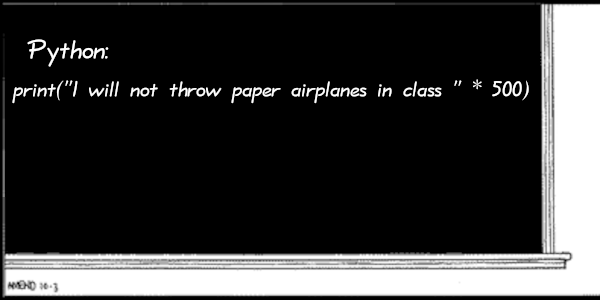
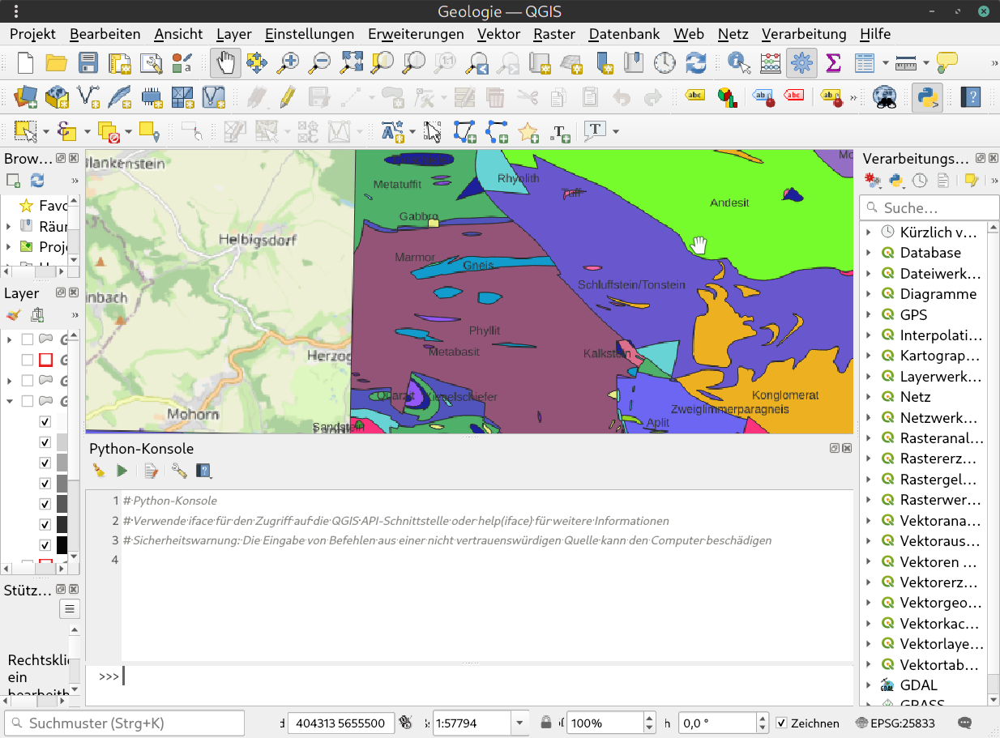

<!--

author:   Sebastian Zug & André Dietrich & Galina Rudolf & Florian Richter
email:    sebastian.zug@informatik.tu-freiberg.de & andre.dietrich@ovgu.de & Galina.Rudolf@informatik.tu-freiberg.de & Flo.Richter@informatik.tu-freiberg.de
version:  1.0.5
language: de
narrator: Deutsch Female

comment: Einführung in die Programmierung für Nicht-Informatiker
logo: ./img/LogoCodeExample.png

import: https://github.com/liascript/CodeRunner

-->

[](https://liascript.github.io/course/?https://github.com/TUBAF-IfI-LiaScript/VL_ProzeduraleProgrammierung/blob/master/08_PythonGrundlagen.md)

# Python Grundlagen

| Parameter                | Kursinformationen                                                                                                                                                                              |
|--------------------------|------------------------------------------------------------------------------------------------------------------------------------------------------------------------------------------------|
| **Veranstaltung:**       | `Prozedurale Programmierung / Einführung in die Informatik`                                                                                                                                    |
| **Semester**             | `Wintersemester 2022/23`                                                                                                                                                                       |
| **Hochschule:**          | `Technische Universität Freiberg`                                                                                                                                                              |
| **Inhalte:**             | `Grundlagen der Programmiersprache Python`                                                                                                                                                    |
| **Link auf Repository:** | [https://github.com/TUBAF-IfI-LiaScript/VL_ProzeduraleProgrammierung/blob/master/08_PythonGrundlagen.md](https://github.com/TUBAF-IfI-LiaScript/VL_ProzeduraleProgrammierung/blob/master/08_PythonGrundlagen.md) |
| **Autoren**              | @author                                                                                                                                                                                        |


--------------------------------------------------------------------


**Fragen an die heutige Veranstaltung ...**

* Warum sollte man andere Programmiersprachen als C++ in Betracht ziehen?
* Welche Vorteile hat die Sprache **Python**?
* Wie unterscheidet sich der Syntax von C++?

**Beispiel-Literatur:**

 * [Schnellstart Python - Ein Einstieg ins Programmieren für MINT-Studierende](https://link.springer.com/book/10.1007/978-3-658-26133-7) (kostenloses E-Book für TUBAF-Studenten)
 * [Python 3 - Das umfassende Handbuch](https://openbook.rheinwerk-verlag.de/python/)

---------------------------------------------------------------------

## Motivation

> __Aufgabe__: Bestimmen Sie die maximalen Tages- und Nachttemperaturen pro Tag, Woche und Monat mit unserem Mikrocontroller über einem Jahr. Wie gehen Sie vor?

<!--
style="width: 100%; min-width: 620px; max-width: 920px;"
-->
```ascii 
                            Datenlogger
                            +------------------------------------------------+
                            |                             Arbeitsspeicher    |
                       +    |         +-----------+      +--------------+    |
       Umgebung-       |\   | Sensor- | Controll- |      | ...          |\   |         
       phänomene       | +--|-------->| Software  |--+-->| 12:30 Temp 12+-+  |
                       |/   | signale |           |      | 12:40 Temp 13  |  |
                       +    |         +-----------+      +----------------+  |
                            |                                     |          | 
                            |               +---------------------+          |
                            |               |    .----.                      |  +-> Serielle Schnittstelle
                            |               v    |    | täglich,             |  |            max    min
                            |         +-----------+   | wöchtentlich,        |  |   1.3.     10.5     -3.5
                            |         | Min/Max   |<--. monatlich            |  |   2.3.     11.0     -3.8
                            |         | Algo-     |                          |  |   ...
                            |         | rithmus   |--------------------------|--+   KW 9      9.2      1.3
                            |         +-----------+                          |      ...     
                            +------------------------------------------------+      März     12.3      2.7
```

> __Frage__: Welche Nachteile sehen Sie in dem Vorgehen?

{{1}}
+ Unser Controller hat keinen "festen Speicher" - die Daten würden im Arbeitsspeicher liegen und wären damit im Fall einer Stromunterbrechung verloren 

+ Eine Messung pro 10 Minuten bedeutet, dass pro Tag $6 \cdot 24 = 144$ Datensätze entstehen. Im Monat sind das etwa $30 \cdot 144 = 4320$. Wenn wir davon ausgehen, dass wir die Daten als 4 Byte breite Float Werte abbilden, würde dies für eienn Monat 17.280 Byte (16.8 kB) und für ein Jahr 210.240 Byte (205 kB) Speicherbedarf bedeuten. Unser Controller verfügt über 256 kB Arbeitsspeicher.

+ Die lokale Verarbeitung ist energieaufwändig. Wenn wir davon ausgehen, dass der Controller in einem Feldversuch möglichst lange mit einer Batterie betrieben werden soll, so müssen wir den Berechnungsaufwand reduzieren.

> __Lösungsansatz__: Wir kommunizieren die Rohdaten in eine Cloud und verarbeiten diese separat.

<!--
style="width: 100%; min-width: 620px; max-width: 920px;"
-->
```ascii 
                            Datenlogger                    Speichermedium         Auswertung
                            +------------------------+
                            |                        |     +---------------+
                       +    |         +-----------+  |  +->| Speicherkarte |      +-------------------+ 
       Umgebung-       |\   | Sensor- | Controll- |  |  |  +---------------+      | Einlesen          |  
       phänomene       | +--|-------->| Software  |--|--+                         | Analyse           |
                       |/   | signale |           |  |  |  +---------------+      | Diagrammerzeugung |
                       +    |         +-----------+  |  +->| Datenserver   |      | ...               |   
                            |                        |     +---------------+      +-------------------+
                            |                        |                             ^ 
                            +------------------------+     +--------------+        |          .....
                                                           | ...          |\       | .... ....     .
                                                           | 12:30 Temp 12+-+      |.    .
                                                           | 12:40 Temp 13  |      |
                                                           +----------------+      +------------------>
                                                                          
```

> Wir entkoppeln damit die Datenerzeugung und Auswertung! Welche Programmiersprache benutzen wir aber für die Auswertung? Warum nicht einfach weiter C++?

{{2}}
Python erleichtert die schnelle Entwicklung von Scripten zur Datenauswertung.

- Schnelles Ausprobieren durch:

  - Einfache Syntax, kurze Programme
  - Interpreter statt Compiler
  - Interaktivmodus
  - Keine Deklarierung von Datentypen
  - Automatisches Speichermanagement

- Plattformunabhängigkeit (Linux, Windows, MacOS und auch Mikrocontroller)
- Einfache Erweiterbarkeit, große Standardbibliothek und viele weitere frei verfügbare Module

            {{3}}
************************************




************************************

### Python Historie 

* *relativ* jung Sprache, Entwicklung 1990 in Amsterdam (vgl. C 1972, C++ 1979)
* Ziel sollte eine Sprache sein, die auch von Programmieranfängern einfach erlernt werden kann
* 2008 erschien Version 3.0 mit einer Komplettüberarbeitung und vielen Verbesserungen
* Aktuell sollte **mindestens Version 3.7** oder neuer verwendet werden (**3.11** ist die neueste Version)

  * Anaconda nutzt derzeit Version 3.9

> Achten Sie bei Ihren Recherchen auf das Alter Ihrer Quellen, bzw. die verwendete Python-Version. Man findet noch viele Anleitungen zu Python 2.7. Diese sind häufig jedoch **nicht mehr kompatibel** zu Python 3.

### Beispiele für den Einsatz von Python
Typische Einsatzszenarien sind z.B.:

* Kleine Server-Programme
* Schnelles entiwckeln von Scripten zur Datenauswertung
* Konvertierung / Formatierung von Dateien bzw. großen Datenmengen
* Numerische Berechnungen und Generierung von Diagrammen
* **Maschinelles Lernen** dank Bibliotheken, wie TensorFlow, scikit-learn oder PyTorch
* Python als Scriptsprache für Erweiterungen (z.B. **ParaView**, **QGIS**, Blender, Gimp)
* Programmierung auf dem RaspberryPi
* Etwas spezieller: Programmierung von Robotern mit ROS (Robot Operating System)
* ...

{{1}}



### Entwicklungsumgebungen

**Wie installiere ich bei mir Python?**

Unter Linux und MacOS kann Python z.B. über die Kommandozeile bzw. Paketmanager installiert werden. Für Windows empfiehlt sich die Installation der Anaconda Distribution (auch für Linux und Mac verfügbar).

> Für Python gibt es viele verschiedene Entwicklungsumgebungen. In den Übungen nutzen wir aber weiterhin Visual Studio Code.

Anaconda nutzt als Standard-Editor **Spyder** (**S**cientific **PY**thon **D**evelopment **E**nvi**R**onment). Beliebt sind auch interaktive **Jupyter**-Dokumente (Notebooks).


## Elemente der Programmiersprache 
Welche Programmierparadigmen unterstützt Python?

* Imperativ?
* Prozedural?
* Objektorientiert?

```python
for i in range(10):
  print("Hallo Welt", i)
```
@LIA.eval(`["main.py"]`, `none`, `python3 main.py`)

{{1}}
************************************
Welche Programmierparadigmen unterstützt Python? -> **Alle 3** :-P

* Imperativ ✔️
* Prozedural ✔️
* Objektorientiert ✔️

```python
for i in range(10):
  print("Hallo Welt", i)
```

```python
def hallo():
     for i in range(10):
          print("Hallo Welt", i)
```

```python
class Hallo:
     def __init__(self):
          for i in range(10):
               print("Hallo Welt", i)
```
************************************

### Zuweisungen und Datentypen
> Python nutzt eine dynamische Typisierung, d.h. eine Variable wird erst zur Laufzeit mit Typ des
zugewiesenen Werts assoziiert. Sie kann auch mit einem beliebigen neuen Datentypen überschrieben werden.

```python
a = 1
a += 3
type(a)

a = "hello"
type(a)

# Python kann ohne Hilfsvariable, 2 Variablen tauschen:
x, y = 3.0, -2.0
x, y = y, x
print(x, y)

# a = b
```
@LIA.eval(`["main.py"]`, `none`, `python3 main.py`)

### Standard Datentypen
> Die Standard-Datentypen von Python bringen neben elementaren Datentypen wie **int**, **float** und **bool** auch komplexere Datentypen mit, die uns bei der schnellen Implementierung von mathematischen Formeln oder großen Datenstrukturen helfen.

|||
|Numerisch | int, float, complex |
|Text | str |
|Sequenz | list, tuple, range |
|Weitere | z.B. bool, dict, set, bytearray |
|NoneType | None |

### Namenswahl für Variablen
> Namen von Variablen, Funktionen, Klassen,... bestehen aus Buchstaben, Ziffern, Underscore (_)

- Ziffer darf nicht am Anfang stehen
- Ab Python 3 sind auch Buchstaben außerhalb des ASCII-Bereichs erlaubt

  - Buchstaben aus Alphabeten fast aller Sprachen, z.B. ä, ö, ü, θ, π, ラ
  - nicht erlaubt sind Sonderzeichen wie €, $, @,§ sowie Emojis
  - guter Stil ist aber, trotzdem nur Zeichen aus ASCII-Bereich zu verwenden!

- lesbare aber nicht zu lange Namen

  - z.B. sum, value

- Hilfsvariablen, die man nur über kurze Strecken braucht, eher kurz:

  - z.B. i, j, x 

- mit Kleinbuchstaben beginnen, Worttrennung durch "_" oder Großbuchstaben, z.B.

  - input_text („Snake Case“), empfohlen in Style Guide for Python Code
  - inputText („Camel Case“)

- Variablen, die man im ganzen Programm braucht, eher länger:

  - z.B. input_text

Reservierte Bezeichner:
=======================
||||||
| False | await | else | import | pass |
| None | break | except | in | raise |
| True | class | finally | is | return |
| and | continue | for | lambda | try |
| as | def | from | nonlocal | while |
| assert | del | global | not | with |
| async | elif | if | or | yield |

Siehe auch Python Tutorial zum Thema Coding Style:

* https://docs.python.org/3/tutorial/controlflow.html#intermezzo-coding-style
* https://peps.python.org/pep-0008/

### Ausgabe
> Die **print**-Funktion ist unser Äquivalent zu std::cout aus C++. Beliebig viele Konstanten und Variablen können als Parameter übergeben werden. Die uns bereits bekannten Sonderzeichen **\\t** (Tabulator) und **\\n** (Neue Zeile) können wie gewohnt eingebaut werden.

```python
x = 3.141
y = x**2
print("5 * 5 =", 25)
print("x \t=\t", x, "\nx² \t=\t", y)
```
@LIA.eval(`["main.py"]`, `none`, `python3 main.py`)

Die erweiterte Formatierung von Ausgaben ist Teil der nächsten Vorlesung.

### Eingabe
> Ergebnis der **input**-Funktion ist immer ein **String**. Für die Verarbeitung als Zahl ist daher immer eine **Typenkonvertierung** erforderlich. Eine Eingabeaufforderung kann optional als Parameter übergeben werden.

**Falsch:**<!-- style="color:red" -->

```python
""" 
Liefert einen Fehler, da x ein String ist
"""
x = input("x eingeben:")
y = x**2
print("y = ", y)
```
@LIA.eval(`["main.py"]`, `none`, `python3 main.py`)

**Richtig:**<!-- style="color:darkgreen" -->

```python
x = float( input("x eingeben:") )
y = x**2
print("y = ", y)
```
@LIA.eval(`["main.py"]`, `none`, `python3 main.py`)

### Zusätzliche Module einbinden
> Mit **import** lassen sich Module einbinden. Ähnlich zu den Standard C++ Headern sind die Bestandteile der Python Module in einen Namensraum gekapselt.

```cpp
#include <cmath>

x = std::sin(M_PI)
std::cout << x;
```

```python
import math

x = math.sin(math.pi)
print(x)

#---- Formatiertes Beispiel:
print(f"{x:.5f}")
```
@LIA.eval(`["main.py"]`, `none`, `python3 main.py`)

Bei Bedarf lassen sich alle oder einzelne Komponenten in den eigenen Namensraum importieren:

```python
from math import *       # Einfach, aber sollte wenn möglich vermieden werden
from math import sin,cos
```

Eine Umbennung ist alternativ auch möglich:

```python
import math as m
print(m.pi)
```

### Listen
> **In Python ist alles ein Objekt!** Z.B. auch elementare Datentypen, wie **Integer**. Komplexere Datentypen, wie Listen verfügen über Methoden zu deren Manipulation.

Der Aufruf von Methoden funktioniert wie in C++. Der Datentyp **list** verfügt über mehrere spezielle Methoden:

* reverse(), sort(), extend(), append(), remove(), ...

```python
liste = [4,2,3,1]
liste.reverse()
print(liste)

liste.sort()
print(liste)

liste.extend([5,6])
print(liste)

liste.remove(3)
print(liste)

print( len(liste) )
```
@LIA.eval(`["main.py"]`, `none`, `python3 main.py`)

## Konstrollstrukturen
### Selektion mit if
> Auch in Python sind innerhalb einer Selektion mehrere Alternativen möglich. Eine **if**-Anweisung kann von beliebig vielen **elif** Zweigen gefolgt werden. Am Ende darf **höchstens** ein **else**-Zweig stehen.

<!--
style="width: 50%;"
-->
```ascii
             |
             v
             +
            / \
     +-----+ B +-----+
  ja |      \ /      | nein
     |       +       |
     v               v
  +-----+         +-----+
  | A 1 |         | A 2 |  
  +--+--+         +--+--+ 
     |               |
     +-------+-------+
             |
             v
          +-----+
          | A 3 |         
          +-----+             
```

Aufbau:
=======

- **if** – Schlüsselwort
- Bedingung -> kann zu True oder False evaluiert werden

  - auch komplexe Bedingungen, z.B. verknüpft mit **and** oder **or**
  - *if a > 5 and a < 10 :*

- Doppelpunkt ':'
- Anweisungen, die ausgeführt werden, falls Bedingung gilt (**eingerückt**)
- optionaler **else**-Zweig

```python
if Bedingung:
  Anweisung1
else:
  Anweisung2

Anweisung3
```

```python
if x == y:
  print("x and y are equal")
elif x < y:
  print("x is less than y")
else:
  print("x is greater than y")
```

> Achten Sie in Python immer auf eine korrekte und möglichst konsistente **Einrückung**!

### Kleines Beispiel

```python
a = int( input("Erste Zahl:") )
b = int( input("Zweite Zahl:") )

if a%2 == 0 and b%2 == 0:
  print("Beide Zahlen sind gerade!")
elif a%2 == 0:
  print("Nur die erste Zahl", a, "ist gerade!")
elif b%2 == 0:
  print("Nur die zweite Zahl", b, "ist gerade!")
else:
  print("Keine Zahl ist gerade!")
```
@LIA.eval(`["main.py"]`, `none`, `python3 main.py`)

Erinnerung: Der **Modulo**-Operator **%** liefert den Rest einer ganzzahligen Division.

### Verschachtelte If-Anweisungen
> If-Anweisungen lassen sich beliebig verschachteln. Dabei ist wieder ganz besonders auf eine korrekte **Einrückung** zu achten!

**Beispiel: Tiere raten**

<!--style="width: 20%; float:left;"-->
```ascii
         .-----------------.
         |   can it fly?   |
         '--------+--------'
         n        |        y
         +--------+--------+   
         |                 |
         v                 v
.-----------------.     +--+---+
|  does it bark?  |     | bird |
'--------+--------'     +------+
   n     |     y
   +-----+-----+   
   |           |
   v           v
+--+--+     +--+--+
| cat |     | dog |
+--+--+     +--+--+
```
<!--style="margin-left:20%; width: 30%;"-->


```python
if input("can it fly? ") == 'y':
  print("bird")
else:
  if input("does it bark? ") == 'y':
    print("dog")
  else:
    print("cat")
```
@LIA.eval(`["main.py"]`, `none`, `python3 main.py`)

### While-Schleife
> In Python gibt es zwei Arten von Schleifen: **for** und **while** (abweisende Schleifen)

<!--style="width: 30%;"-->
```ascii
             |
     +------>+
     |       |
     |       v
     |       +
     |      / \
     |     + B +-----+
     |      \ /      | nein
     |       +       v
     |       | ja
     |       v
     |     +---+
     |     | A |
     |     +-+-+
     +-------+
```

```python
while <bedingung>:
  <anweisungen>
```

Beispiel: Fibonacci-Zahlen < 100
================================

```python
a, b = 0, 1
while b < 100:
  print(b, end='|')
  a, b = b, a+b
```
@LIA.eval(`["main.py"]`, `none`, `python3 main.py`)

### For-Schleife
```python
for <variable> in <sequenz>:
  <anweisungen>
```

Sequenz = Liste, String, Tupel oder **range**

### Die range()-Funktion

### Und do-while???

## Eigene Funktionen

### Parameterübergabe

### Return

## Beispiel der Woche
