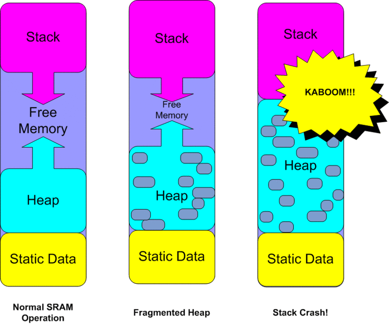

<!--

author:   Sebastian Zug & André Dietrich & Galina Rudolf
email:    sebastian.zug@informatik.tu-freiberg.de & andre.dietrich@ovgu.de & Galina.Rudolf@informatik.tu-freiberg.de
version:  0.0.1
language: de
narrator: Deutsch Female

import: https://raw.githubusercontent.com/liaScript/rextester_template/master/README.md
-->

# Vorlesung IX - Dynamische Speicherverwaltung

**Fragen an die heutige Veranstaltung ...**

* Welche Nachteile bringen Arrays mit variablen Größen (C99) mit sich?
* Was bedeutet der Begriff "dynamische" Speicherverwaltung?
* In welchem Bereich werden die dynmische angeforderten Variablen angelegt?
* Warum ist die Freigabe des allokierten Speichers mit `free` notwendig?


---------------------------------------------------------------------
Link auf die aktuelle Vorlesung im Versionsmanagementsystem GitHub

[https://github.com/SebastianZug/CCourse/blob/master/09_DynamischeSpeicherverwaltung.md](https://github.com/SebastianZug/CCourse/blob/master/09_DynamischeSpeicherverwaltung.md)

---------------------------------------------------------------------

**Wie weit sind wir schon gekommen?**

ANSI C (C89)/ Schlüsselwörter:

| Standard    |                |          |            |          |            |
|:------------|:---------------|:---------|:-----------|:---------|:-----------|
| **C89/C90** | `auto`         | `double` | `int`      | `struct` | `break`    |
|             | `else`         | `long`   | `switch`   | `case`   | `enum`     |
|             | `register`     | `typedef`| `char`     | `extern` | `return`   |
|             | union          | `const`  | `float`    | `short`  | `unsigned` |
|             | `continue`     | `for`    | `signed`   | `void`   | `default`  |
|             | `goto`         | `sizeof` | `volatile` | `do`     | `if`       |
|             | `static`       | `while`  |            |          |            |
| **C99**     | `_Bool`        | _Complex | _Imaginary | `inline` | restrict   |
| **C11**     | _Alignas       | _Alignof | _Atomic    | _Generic | _Noreturn  |
|             |_Static\_assert | \_Thread\_local | |   |          |            |

---

{{1}}
Standardbibliotheken

{{1}}
| Name         | Bestandteil | Funktionen                              |
|:-------------|:------------|:----------------------------------------|
| `<stdio.h>`  |             | Input/output                            |
| `<stdint.h>` | (seit C99)  | Integer Datentypen mit fester Breite    |
| `<float.h>`  |             | Parameter der Floatwerte                |
| `<limits.h>` |             | Größe der Basistypen                    |
| `<fenv.h>`   |             | Verhalten bei Typumwandlungen           |
| `<string.h>` |             | Stringfunktionen                        |
| `<math.h>`   |             | Mathematische Funktionen und Konstanten |

{{1}}
[C standard library header files](https://en.cppreference.com/w/c/header)


## Fehler (Wiederholung)

Fehler in C Programmen lassen sich in 5 Gruppen aufteilen:

 1. **Lexikalische-Fehler** - bezeichnen falsch geschriebene Worte im Programmcode.

 Indikatoren: Compiler-Fehler "was not declared in this scope" oder Linker-Fehler  "undefined reference to"

```cpp                    LexicalischeFehler.c
#include <stdio.h>
#include <stdlib.h>

int Main(void) {
  int x = 10, y=10;
  printf("%d", myfunction(x,y));
  return EXIT_SUCCESS;
}

int myFunction(int x, int y){
  return x+y;
}
```
@Rextester.C

{{1}}
 2. **Syntax-Fehler** - (englisch syntax error) im Allgemeinen sind Verstöße gegen die  Satzbauregeln einer Sprache. Programme mit Syntaxfehlern werden von einem  Compiler oder Interpreter zurückgewiesen.

{{1}}
Häufigste Typen: fehlende Semikolon, Klammern, Definitionen

{{1}}
```cpp
#include <stdio.h>
#include <stdlib.h>

int main(void) {
  int x = 10
  y = 15;
  printf("%d", x+y);
  return EXIT_SUCCESS;
```
@Rextester.C

{{2}}
 3. **Semantische-Fehler** - (englisch semantic errors) umfassen falsche Deklarationen, die aber keinen syntaktischen Fehler begründen.

{{2}}
Vorkommen: Verwechslung von Operatoren, inkorrekte Annahmen zur Bedeutung von Variablen

{{2}}
```cpp
#include <stdio.h>
#include <stdlib.h>

int main(void) {
  int i = 5;
  if (i = 6){
  	printf("Wert gleich 6!");
  }else{
  	printf("Wert ungleich 6");
  }
  return EXIT_SUCCESS;
}
```
@Rextester.C

{{3}}
 4. **Laufzeit-Fehler** - (englisch runtime error) sind Fehler, die während der Laufzeit eines Computerprogramms auftreten. Laufzeitfehler führen zum Absturz des ausgeführten Programms, zu falschen Ergebnissen oder zu nicht vorhersehbarem Verhalten des Programms, z. B. wenn durch falsche/inkonsistente Daten Variablen überschrieben oder mit ungültigen Werten gefüllt werden.

{{3}}
Beispiele: Division durch null, Adressierung von Speicherbereichen außerhalb
eines Arrays, Endlosschleifen

{{3}}
```cpp
#include <stdio.h>
#include <stdlib.h>

int main(void) {
  for (int i = 5; i>=0; i--){
      printf("Ergebnis %d\n", 100/i );
  }
  return EXIT_SUCCESS;
}
```
@Rextester.C

{{4}}
 5. **Logische-Fehler** - Das Programm arbeitet in jedem Fall ohne Abbruch, realisiert aber nicht die gewünschte Funktionalität.

{{4}}
```cpp                     LogischerFehler.c
#include <stdio.h>
#include <stdlib.h>

int main(void) {
  int values [] = {0,1,2,3,4,5,6,7,8,9,10};
  float sum = 0.;
  int i;
  for (i = 0; i < 10; i++){
      sum += values[i];
  }
  printf("%f", sum/i );
  return EXIT_SUCCESS;
}
```
@Rextester.C

## Arrays als statisches Speicherelement (Wiederholung)
<!--
comment: Beispielcode um Schleife ergänzen, zum Beispiel Multiplikation aller Elemente
-->

```cpp                          nDimArray.c
#include <stdio.h>
#include <stdlib.h>

int main(void) {
  int myArray[] = {0, 10, 20, 30};
  printf("%d %d = Inhalt des ersten und zweiten Eintrages", myArray[0], myArray[1]);
  printf("Pointer auf den ersten Eintrag %p", myArray);
  return EXIT_SUCCESS;
}
```
@Rextester.C

<!--
style="width: 70%; max-width: 460px; display: block; margin-left: auto; margin-right: auto;"
-->
````
 Speicherauszug

 index    int-Breite

          ┣━━━━━━━━━┫
   0      ┃       0 ┃  <- myArray
          ┣━━━━━━━━━┫
   1      ┃      10 ┃
          ┣━━━━━━━━━┫
   2      ┃      20 ┃
          ┣━━━━━━━━━┫
   3      ┃      30 ┃
          ┣━━━━━━━━━┫
````

{{1}}
Entwickeln Sie einen Algorithmus für einen Parkautomaten, der Münzen wechselt

{{1}}
```cpp
#include <stdio.h>
#include <stdlib.h>

int main(void)
{
  unsigned int gebuehr, zahlung, rueckgabe;
  printf("Bitte die Parkgebühr in Cent angeben:\n");
  scanf("%d",&gebuehr);
  printf("Bitte den eingezahlten Betrag in Cent angeben:\n");
  scanf("%d",&zahlung);
  rueckgabe = zahlung - gebuehr;
  printf("Resultierende Ausgabe %d Cent\n\n", rueckgabe);

  int muenzen [] = {1, 2, 5, 10, 20, 50, 100};
  int anteil = 0;

  for (int i = 0; i < 7; i++){
    anteil = rueckgabe / muenzen[i];
    if (anteil){
      rueckgabe = rueckgabe - anteil;
    }
    printf("%3i Cent %3d mal\n", muenzen[i], anteil);
  }
  return EXIT_SUCCESS;
}
```
``` text                  stdin
382 500
```
@Rextester.C(false,`@input(1)`)

{{2}}
Was ist an dieser Lösung unbefriedigend und welche Änderungen sollten vollzogen
werden?

{{2}}
| Problem                             | Lösungsansatz                             |
|:------------------------------------|:------------------------------------------|
| Offenbar werden alle Beträge in 1 Cent Münzen ausgezahlt. | Denkfehler im Algorithmus? |
| Die Anzahl der Münznominale ist explizit im Programmcode enthalten. | Spezifikation der Array-Größe als Variable |
| Die Ausgabe erfolgt lediglich in der Konsole, eine Speicherung ist nicht vorgesehen. | Variable für die Rückgabe anlegen |
| Das Programm ist monolitisch aufgebaut. | Kapselung der Methode in einer Funktion |

{{3}}
Lösungsvorlage

{{3}}
```cpp
#include <stdio.h>
#include <stdlib.h>

// Funktion "Restgeld" einfügen
//
// Eingabeparameter: gebuehr, zahlung, muenzen (aufsteigende Reihung!)
// Ausgabeparameter: anzahl


int main(void)
{
  unsigned int gebuehr, eingabe;
  printf("Bitte die Parkgebühr in Cent angeben:\n");
  scanf("%d",&gebuehr);
  printf("Bitte den eingezahlten Betrag in Cent angeben:\n");
  scanf("%d",&eingabe);

  unsigned int muenzen [] = {1, 2, 5, 10, 20, 50, 100, 200};
  unsigned int anzahl []  = {0, 0, 0, 0, 0, 0, 0};
  unsigned char n = sizeof(muenzen) / sizeof(int);

  Restgeld(gebuehr, eingabe, muenzen, anzahl, n);

  for (int i = 0; i < n; i++){
    if (anzahl[i]){
      printf("%3d Cent - %3d x\n", muenzen[i], anzahl[i]);
    }
  }
  return EXIT_SUCCESS;
}
```

{{3}}
<!--
```cpp
#include <stdio.h>
void Restgeld(unsigned int gebuehr, unsigned int zahlung,
              unsigned int * muenzen,
              unsigned int * anzahl,
              unsigned char elemente ){

  unsigned int rueckgabe = zahlung - gebuehr;
  unsigned int anteil = 0;
  printf("Resultierende Ausgabe %d Cent\n\n", rueckgabe);
  for (int i = elemente - 1; i >= 0; i--){
    anteil = rueckgabe / muenzen[i];
    if (anteil){
       rueckgabe = rueckgabe - anteil * muenzen[i];
       anzahl[i] = anteil;
    }
  }
}
```
-->

{{4}}
Allerdings ist die Lösung im Hinblick auf die Veränderung der Münzeinteilung
immer noch unbefriedigend. Eine Anpassung der Münznominale muss immer auch eine
Adaption des Rückgabewertes einschließen. Hier wäre eine dynamische Lösung
wünschenswert.

## Arrays variabler Länge (VLA)

Im Gegensatz zu  den statischen Arrays, deren Größen zum Zeitpunkt der Übersetzung
festgelegt werden, führt der C99-Standard das Konzept variabler Array-Größen ein.
Bei der Definition eines Feldes kann dessen Größe durch einen beliebigen
ganzzahligen Ausdruck bestimmt werden, kann danach aber nicht mehr verändert
werden. Bei C11-konformen Compilern wird die Verfügbarkeit von VLA über die
Definition von `__STDC_NO_VLA__` geregelt.

```cpp
int funktion(int n) {    
  double   Flexibel[n];  
}
```

Nachteile von VLA:

* VLAs können nicht initialisiert werden und werden auf dem Stack abgelegt
* die Größe kann nur einmalig bei der Definition festgelegt werden
* VLAs können nur innerhalb von Blocken (Funktionen) angelegt werden (außerhalb von Funktionen müssen Feldgrößen auch in C99 zum Zeitpunkt der Übersetzung bekannt sein)
* VLAs dürfen weder global, noch statisch sein, noch dürfen sie innerhalb von Strukturen definiert  werden
* VLAs bieten kein Mechanismus zur Prüfung der Größe des verfügbaren Speichers. Das Verhalten für Arrays, die größer als der noch verfügbare Stack sind ist unbestimmt!

> *USING VLA'S IS ACTIVELY STUPID! It generates much more code, and much *
> *_slower_ code (and more fragile code), than just using a fixed key size would*
> *have done.*
>
> [Linus Torvalds](https://lkml.org/lkml/2018/3/7/621)

> *With the in-development Linux 4.20 kernel, Linux kernel is effectively *
> * VLA-free *
>
> [https://www.phoronix.com/scan.php?page=news_item&px=Linux-Kills-The-VLA](https://www.phoronix.com/scan.php?page=news_item&px=Linux-Kills-The-VLA)


Wirklich dynamisch sind die mit `malloc()` zur Laufzeit angelegten  Arrays.

<!--
```cpp
#include <stdio.h>
#include <stdlib.h>
#include <string.h>

char* reverse_string(char* in_out){
  unsigned int len = strlen(in_out);
  char tmp[len + 1]; // VLA für String und Nullterminierung
  strcpy(tmp, in_out);
  for (int i = 0; i < len; i++)
    in_out[i] = tmp[len - i - 1];
  return in_out;
}

int main(void){
  char tmp[] = "Das ist ein Test fuer VLA";
  printf("%s\n", reverse_string(tmp));
  	return 0;
}
```
-->

##  Dynamische Speicherallokation

Die Mechanismen der Memory Allocation erlauben eine variable Anforderung UND Freigabe von
Speicherplatz zur Laufzeit. Im Unterschied zu den lokalen Variablen von Funktionen (Stack) oder  globalen Variablen (Datensegment) werden diese im Heap-Speicher abgelegt.

<!-- width="90%" -->

Quelle: [Memory Layout of C Programs (Autor: Narendra Kangralkar)](https://www.geeksforgeeks.org/memory-layout-of-c-program/)

Ein Programm besteht aus den vier Speicherbereichen:
* Code (text) - enthält Programmcode. Von hier aus werden die Befehle in den Prozessor geschoben.
* Daten (initialized und uninitialized data) - beinhaltet statische und globale Variablen, die entweder durch Programmierer oder durch Systemkern (uninitialized data segment) initialisiert werden.
* Stack - enthält Funktionsaufrufe mit ihren lokalen Variablen und wächst bzw. schrumpft automatisch je nach Bedarf. Einzelne Datenblöcke bleiben solange bestehen wie die jeweiligen Funktionen laufen.  
* Heap - wird für dynamische Speicherreservierung (z.B. mit `malloc()`) benötigt. Heap-Bereich erhöht sich bei einer Speicheranforderung und verringert sich, wenn der  Speicherplatz frei gegeben wird.


### Anforderung von Speicher

Speicher auf dem Heap wird unter anderem mit `malloc` angefordert. Dazu wird die
Größe des Speicherbereiches als Parameter übergeben. Rückgabewert ist ein `void`-Pointer.
Dieser liefert einen NULL-Zeiger für den Fall, dass kein freier Speicher entsprechender
Größe zur Verfügung steht.

```cpp
void *malloc(size_t size);
```

| Aufrufformat                     | Bedeutung / Schwierigkeiten              |
|:---------------------------------|:-----------------------------------------|
| `int*p; p = malloc(2);`          | Bereitstellung von 2 Byte                |
| `int*p; p = malloc(sizeof(int));`| Bereitstellung eines Speicherplatzes für einen `int`-Wert|
| `int*p; p = malloc(n * sizeof(int));`| Bereitstellung des Speicherplatzes für n `int`-Werte|
| `int*p; p = malloc(sizeof(*p));` | gängige Notation um nur einmalig den Datentypen zu benennen |


Bei erfolgreichem Aufruf liefert die Funktion `malloc()` die Anfangsadresse mit der Größe size Bytes vom Heap zurück.

```cpp
#include <stdio.h>
#include <stdlib.h>
#include <string.h>

int main(void) {
  char *msg = malloc (4);
  strcpy (msg, "Hello World!");
  printf ("%s\n", msg);
  return EXIT_SUCCESS;
}
```
@Rextester.C

### Nachträgliches Vergrößern

```cpp
void* realloc (void* ptr, size_t size);
```

`realloc()` versucht zuerst, die Größe des Blocks zu erhöhen, auf den der
Zeiger ptr zeigt. Ist eine Erweiterung nicht möglich erfolgt stattdessen eine Kopieroperation
in einen neuen Block und der alte Block wird freigeben.

```cpp
#include <stdio.h>
#include <stdlib.h>
#include <string.h>

int main(void) {
  char *str;

  str = (char *) malloc(15);
  strcpy(str, "01234567890123");
  printf("Address = %p\n", str);

  /* Reallocating memory */
  str = (char *) realloc(str, 2);  // <-- Was passiert, wenn wir diesen Wert
  strcat(str, "!");                //     vergrößern?
  printf("Address = %p,  String = %s\n", str, str);

  return EXIT_SUCCESS;
}
```
@Rextester.C

Lassen Sie uns anhand des Codebeispiels einige Experimente durchführen.
Was passiert zum Beispiel mit `str` wenn `realloc` ein neuer Pointer zugewiesen
wird?


### Freigabe von Speicher

Speicherreservierungen auf dem Heap müssen explizit freigegeben werden, wenn sie
nicht mehr benötig werden. Wird regelmäßig Speicher reserviert, ohne ihn wieder freizugeben, bringt man eventuell die Kapazitäten zum Erschöpfen. Ist dadurch der Speicher komplett belegt, werden die Daten auf die Festplatte ausgelagert, was viel Zeit in Anspruch nimmt.

```cpp
void free(void *ptr);
```

Frage: Warum muss ich beim Variablen auf dem Stack keine explizite Freigabe aufrufen?

Welche Probleme sehen Sie in folgendem Code?

```cpp
#include <stdio.h>
#include <stdlib.h>
#include <string.h>

int main(void) {
  char *str_1;
  char *str_2;

  str_1 = (char *) malloc(15);
  strcpy(str_1, "01234567890123");
  str_2 = (char *) malloc(15);
  strcpy(str_2, "ABCDEFGAHCABCD");

  // some magic code is exectuted here.

  str_1 = str_2;

  // and again ...

  free(str_1);
  free(str_2);

  return EXIT_SUCCESS;
}
```
@Rextester.C

### Was passiert bei der Allokation eigentlich?

Die optimale Nutzung des Heaps ist eine aufwändiges Problem, dessen spezifische
Lösung von verschiedenen Parametern abhängt.

<!-- width="90%" -->

Quelle (Adafruit): [Optimizing SRAM](https://learn.adafruit.com/memories-of-an-arduino/optimizing-sram)

Lösungsansätze: Paging  vs. Segmentierung

Herausforderung Fragmentierung ...  kann zum Fehlschlagen einer
Speicheranforderung führen obwohl ggf. die Summe der Größen aller ungenutzten
Fragmente so groß ist wie der zu allozierende Bereich ist. Es gibt also
Speicherfragmente, die nicht nutzbar sind, obwohl sie nicht in Verwendung
sind.

Interne vs. Externe Fragmentierung


### Wie sieht es mit potentiellen Fehlern aus?

> **Achung:** Adressierung von Speicherbereichen außerhalb des allokierten
> Bereiches führt zu undefiniertem Verhalten.

```cpp
#include <stdio.h>
#include <stdlib.h>

int main(void) {
  int * array_1 = malloc(5 * sizeof(array_1));
  for (int i = 0; i < 5; i++){
    array_1[i] = i;
  }
  printf ("%d\n", array_1[2]);
  return EXIT_SUCCESS;
}
```
@Rextester.C

```cpp
#include <stdio.h>
#include <stdlib.h>

int main(void) {
  int * array_1 = malloc(5 * sizeof(array_1));
  int * array_2 = malloc(5 * sizeof(array_2));
  for (int i = 0; i < 50; i++){
    array_1[i] = i;
  }
  printf ("%d\n", array_2[16]);
  return EXIT_SUCCESS;
}
```
@Rextester.C

### Heap und Stack - Wo liegt der Unterschied

```cpp
#include <stdio.h>
#include <stdlib.h>

int * getConstant_Stack(){
  int *a, b=5;
  a=&b;
  return a;
}

int * getConstant_Heap(){
  int *a, b=5;
  a = malloc(sizeof(*a));
  *a=b;      // SEHEN SIE DEN UNTERSCHIED BEI DER WERTZUWEISUNG?
  return a;
}

int main(void) {
  int * x;
  x = getConstant_Stack();
  printf("%d\n", *x);
  x = getConstant_Heap();
  printf("%d\n", *x);
  free(x);
  return EXIT_SUCCESS;
}
```
@Rextester.C

### Anwendung

Berechnen Sie die kummulative Summe aufsteigender Zahlenfolge, die Sie in einem
Array aufgestellt haben. Nutzen Sie zur Kontrolle die Gaußsche Summenformel.

```cpp
#include <stdio.h>
#include <stdlib.h>

int *iarray(unsigned int n);

int *iarray(unsigned int n){
  int *iptr = malloc(n * sizeof(*iptr));
  // int *iptr = malloc(n * sizeof(int)); //äquivalent
  if (iptr != NULL){
    for (int i = 0; i<n; i++){
      iptr[i] = i+1;
    }
  }else{
    printf("Allocation fehlgeschlagen!");
  }
  return iptr;
}

int main(void)
{
  unsigned int size;
  printf("Bitte die Größe des Arrays an:\n");
  scanf("%d",&size);
  int *array = iarray(size);
  for (int i = 1; i<size; i++){
    array[i] = array[i-1] + array[i];
  }
  printf("Summe der Werte von 1-%d = %d\n", size, array[size-1]);
  free(array);
  return EXIT_SUCCESS;
}
```
``` text                  stdin
12
```
@Rextester.C(false,`@input(1)`)

## Beispiel der Woche

Analog zur Auswertung der Babynamen aus der vergangenen Woche wollen wir nunmehr
die Namen ermitteln, die sowohl für Jungen als auch für Mädchen vergeben wurden.

Wiederum wird die Liste mit über 250.000 Einträgen durchlaufen und zunächst eine
Aufstellung aller Namen der Jungen erstellt. Dazu wird ein dynamisch erweitertes
Array genutzt, dessen Einträge im Nachgang mit den vorkommenden Namen der Mädchen
verglichen werden.

```cpp
#include <stdio.h>
#include <stdlib.h>
#include <string.h>
#define FILENAME "./data/baby-names.csv"
#define INITIALSIZE 100
#define STEPWIDTH 20

unsigned int max_datensaetze = INITIALSIZE;

struct datensatz{
  unsigned int year;
  char name[24];
  char girlsname;
};

int main(int argc, char *argv[])
{
  FILE *in = fopen(FILENAME,"r");
  if(in==NULL){
    perror("File open error");
    exit(EXIT_FAILURE);
  }

  struct datensatz * names;
  names = malloc(max_datensaetze * sizeof(*names));

  unsigned int year;
  int count = 0;
  char name[24];
  float prob;
  char sex[7];
  char not_found = 0;
  do{
    if (fscanf(in,"%d,%[^,],%f,%s", &year, name, &prob, sex) == 4) {
      if (0 == strcmp(sex, "\"boy\"")){
        // neuer Name?
        not_found = 1;
        for (int i=0; i<count; i++){
          if (0 == strcmp(names[i].name, name)) {
            not_found = 0;
            break;
          }
        }
        if (not_found){
          // Hinreichend Speicher im array?
          if (count >= max_datensaetze){
            max_datensaetze += STEPWIDTH;
            names = realloc(names, max_datensaetze * sizeof(*names));
          }
          strcpy(names[count].name, name);
          count++;
        }
      }else{
        for (int i=0; i<count; i++){
          if (0 == strcmp(names[i].name, name)) {
            names[i].girlsname = 1;

            break;
          }
        }
      }
    }
  } while (!feof(in));

  for (int i=0; i<count; i++){
    if (1 == names[i].girlsname){
      printf("%s ", names[i].name);
    }
  }
  free(names);
  fclose(in);
  return 0;
}
```

```bash @output_
▶ ./a.out
"John" "William" "James" "Charles" "George" "Frank" "Joseph" "Thomas" ...
"Kamari" "Jaidyn" "Teagan" "Camryn" "Santana" "Lyric" "Kamryn" "Marley" "Eden"
258000 Datensätze gelesen
```
Interessanterweise tauchen in dieser Reihe sehr spezifische Jungennamen auf.
Laut dem Datensatz taucht beispielsweise im Jahr 1887 bei einem von 2777 Mädchen der Name "John" auf der Geburtsurkunde auf.
