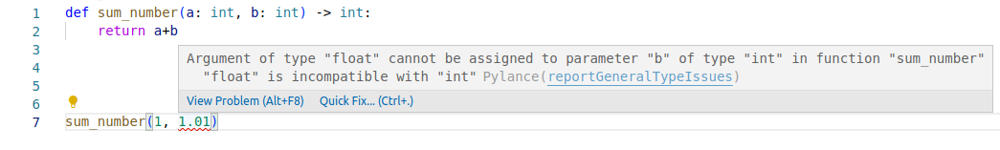

<!--

author:   Sebastian Zug & André Dietrich & Galina Rudolf
email:    sebastian.zug@informatik.tu-freiberg.de & andre.dietrich@ovgu.de & Galina.Rudolf@informatik.tu-freiberg.de
version:  1.0.3
language: de
narrator: Deutsch Female

comment: Einführung in die Programmierung für Nicht-Informatiker
logo: ./img/LogoCodeExample.png

import: https://github.com/liascript/CodeRunner
        https://raw.githubusercontent.com/TUBAF-IfI-LiaScript/VL_EAVD/master/config.md

-->

[](https://liascript.github.io/course/?https://github.com/TUBAF-IfI-LiaScript/VL_ProzeduraleProgrammierung/blob/master/09_PythonVertiefung.md)

# Objektorientierung in Python

| Parameter                | Kursinformationen                                                                                                                                                      |
| ------------------------ | ---------------------------------------------------------------------------------------------------------------------------------------------------------------------- |
| **Veranstaltung:**       | @config.lecture                                                                                                                                                        |
| **Semester**             | @config.semester                                                                                                                                                       |
| **Hochschule:**          | `Technische Universität Freiberg`                                                                                                                                      |
| **Inhalte:**             | `Erweiterte Konzepte der Programmiersprache Python`                                                                                                                    |
| **Link auf Repository:** | [https://github.com/TUBAF-IfI-LiaScript/VL_EAVD/blob/master/09_PythonVertiefung.md](https://github.com/TUBAF-IfI-LiaScript/VL_EAVD/blob/master/09_PythonVertiefung.md) |
| **Autoren**              | @author                                                                                                                                                                |


--------------------------------------------------------------------


**Fragen an die heutige Veranstaltung ...**

+ Welche Standarddatentypen exisiteren in Python über die Liste hinaus?
+ In welchen Anwendungsfällen kommen diese zum Einsatz?
+ Wie lassen sich Funktionen mit Python realsieren und welche Unterschiede existieren im Vergleich zu C++?

---------------------------------------------------------------------

## Weitere Datentypen 

Sie haben bereits Listen (`list`), `range` Objekte und Text (`string`) als Datenstruktur kennengelernt - im Weiteren existieren daneben vier weitere Sequenzdatentypen: byte sequences (`bytes` objects), byte arrays (`bytearray` objects) und `tuples`.
Dazu kommen `dictionaries` und `sets` als Containertypen. 

| Datentyp    | Besonderheit                                    | Syntax                  |
|-------------|-------------------------------------------------|-------------------------|
| `list`      | veränderliche Sequenz von (beliebigen) Daten    | `l = ["grün", 1, True]` |
|             |                                                 | `l[0] = 4`              |
| `strings`   | Darstellung von Zeichenketten                   | `s="Hello World"`       |
| `bytes`     | Unveränderbare Folge von Elementen              | `t1 = (1, 2, 3)`        |
| `bytearray` | Unveränderbare Folge von Elementen              | `t1 = (1, 2, 3)`        |
| `tupel`     | Unveränderbare Folge von Elementen              | `t1 = (1, 2, 3)`        |
| `range`     | iterierbare, unveränderbare Folge von Elementen | `r = range(3, 20, 2)`   |

### Tupel oder Liste?

Warum ein Tupel anstelle einer Liste verwenden?

+ Die Programmausführung ist beim Iterieren eines Tupels schneller als bei der entsprechenden Liste - Dies wird wahrscheinlich nicht auffallen, wenn die Liste oder das Tupel klein ist.

+ Der Speicherbedarf eines Tupels fällt in der Regel geringer aus, als bei einer Listendarstellung ein und des selben Inhaltes.

+ Manchmal sollen Daten unveränderlich gehalten werden - Tupel schützen die Informationen vor versehentlichen Änderungen.

```python  size.py
import sys

a_list = []
a_tuple = ()
a_list = ["Hello", "TU", "Freiberg"]
a_tuple = ("Hello", "TU", "Freiberg")
print("List data size : " + str(sys.getsizeof(a_list)))
print("Tupel data size: " + str(sys.getsizeof(a_tuple)))
```
@LIA.eval(`["main.py"]`, `none`, `python3 main.py`)

```python  duration.py
import time

l=list(range(10000001))
t=tuple(range(10000001))

start = time.time_ns()
for i in range(len(t)):
    a = t[i]
end = time.time_ns()
print("Tuple duration: ", end - start)

start = time.time_ns()
for i in range(len(l)):
    a = l[i]
end = time.time_ns()
print("List duration : ", end - start)
```
@LIA.eval(`["main.py"]`, `none`, `python3 main.py`)

### Dictionaries

                            {{0-1}}
********************************************************************

Dictionaries werden zur Speicherung von Schlüssel Werte Paaren genutzt. Ein dictionary ist eine Sammlung von geordneten (entsprechend der Reihenfolge der "Einlagerung"), veränderlichen Einträgen, für die Schlüssel werden keine Dublikate zugelassen.

> Ein Telefonbuch ist das traditionelle Beispiel für eine Implementierung des Dictonaries. Anhand der Namen werden die Telefonnummern zugeordnet.

<!--style="width: 70%;"-->
```ascii
   
 Listen                                     Dictonary

 Index                                      Schlüssel
 +---------------+     +---------+          +---------------+     +---------+
 |       0       |---->| `Hello` |          | `erstes Wort` |---->| `Hello` |
 +---------------+     +---------+          +---------------+     +---------+

 +---------------+     +---------+          +---------------+     +---------+
 |       1       |---->| `World` |          | `zweites Wort`|---->| `World` |
 +---------------+     +---------+          +---------------+     +---------+

 +---------------+     +---------+          +---------------+     +---------+  
 |       2       |---->| ...     |          | `drittes Wort`|---->| ...     |
 +---------------+     +---------+          +---------------+     +---------+

       ....                                      ....
```

********************************************************************

                            {{1-2}}
********************************************************************

```python  dictonary.py
capital_city = {"France": "Paris",
                "Italy": "Rome",
                "England": "London"}

print(capital_city)
print("England" in capital_city)

capital_city["Germany"] = "Berlin"  # add a single value

examples = {"Belgium": "Bruessels",
            "Poland": "Warsaw"}

capital_city.update(examples)       # add a single or multiple new entries 
                                    # contained in a dictionary
print(capital_city)

```
@LIA.eval(`["main.py"]`, `none`, `python3 main.py`)

```python  wrongdictonary.py
oldtimer =	{"brand": "VW",
             "model": "Käfer",
             "year": 1964,
             "year": 2020
}
print(oldtimer)
```
@LIA.eval(`["main.py"]`, `none`, `python3 main.py`)

********************************************************************

                            {{2-3}}
********************************************************************

> Nehmen wir an, Sie entwerfen ein Verzeichnis der Studierenden aus Freiberg. Sie wollen die Paarung Studierendenname zu Matrikel als Dictornary umsetzen. Einer Ihrer Kommilitonen schlägt vor, dafür zwei Listen zu verwenden und die Verknüpfung über den Index zu realsieren. Was meinen Sie dazu? 

```python  goodSolution.py
students = {"von Cotta": 12, "Humboldt": 17, "Zeuner": 233}

student = "von Cotta"
print(f"Student  {student} ({students[student]})")
```
@LIA.eval(`["main.py"]`, `none`, `python3 main.py`)

```python  badSolution.py
names = ["von Cotta", "Humboldt", "Zeuner"]
matrikel = [12, 17, 233]

i = 1
print(f"Student  {names[i]} ({matrikel[i]})")
```
@LIA.eval(`["main.py"]`, `none`, `python3 main.py`)


********************************************************************

### Sets

Ein Set ist eine Sammlung, die ungeordnet, unveränderlich (in Bezug auf exisiterende Einträge) und nicht indiziert ist. Kernelement der Idee ist das Verbot von Dublikaten. 

```python  set.py
fruits = {"apple", "banana", "cherry", "apple", "apple"}

print(fruits)
```
@LIA.eval(`["main.py"]`, `none`, `python3 main.py`)

Die Leistungsfähigkeit von Sets resultiert aus den zugehörigen Mengenoperationen.

```python  set.py
a = {1,2,3,4,5,6}
b = {2,4,6,7,8,9}
even = {2,4,6,8,}

print(8 in a)
print(even < b)   # ist even eine Teilmenge von b?
print(a | b)      # Vereinigung von a und b
print(a & b)      # Schnittmenge von a und b
print(b - a)      # welche Einträge existieren in b die nicht in a präsent sind
```
@LIA.eval(`["main.py"]`, `none`, `python3 main.py`)


### Zusammenfassung 

                            {{0-1}}
********************************************************************

```python     DataTypeExample.py
for i in ['a','b','c']:     # Liste
  print(i, end=",")
print()

for i in "abc":             # String
  print(i, end=",")
print()

for i in ('a','b','c'):     # Tupel
  print(i, end=",")
print()

for i in {0:"a", 1:"b"}:    # Dictonary
  print(i, end=",")
print()
  
for i in {'a','b','c','c'}: # Set
  print(i, end=",")
```
@LIA.eval(`["main.py"]`, `none`, `python3 main.py`)


********************************************************************

                            {{1-2}}
********************************************************************

Gegeben sei eine Liste der Studiengangsbezeichnungen für die Studierenden dieser Vorlesung. Leiten Sie aus der Liste ab

1. Wie viele Studierende eingeschrieben sind?
2. Wie viele Studiengänge in der Veranstaltung präsent sind?
3. Wie viele Studierende zu den Studiengängen gehören?

```python
# Angabe der Studiengänge der eingeschriebenen Teilnehmer in der 
# Veranstaltung
topics = [
  "S-UWE", "S-WIW", "S-GÖ", "S-VT", "S-GÖ", "S-BAF", "S-VT",
  "S-WWT", "S-NT", "S-WIW", "S-ET", "S-WWT", "S-MB", "S-WIW",
  "S-FWK", "F1-INF", "S-WIW", "S-BWL", "S-WIW", "S-MAG",
  "F2-ANCH", "S-MAG", "S-WWT", "S-NT", "S-ACW", "S-GTB",
  "S-WIW", "F2-ANCH", "S-GTB", "S-GÖ", "S-GBG", "S-GM",
  "S-MAG", "S-GTB", "S-WIW", "S-WIW", "S-FWK", "S-WIW",
  "S-MAG", "S-GBG", "S-GÖ", "S-BAF", "S-BAF", "S-NT", "S-GÖ",
  "S-WWT", "S-GBG", "S-WWT", "S-GBG", "S-ERW", "S-WWT",
  "S-WIW", "S-NT", "S-WIW", "S-GÖ", "S-WIW", "S-GM",
  "S-GBG", "F1-INF", "S-WIW", "S-WWT", "S-ACW", "S-WIW",
  "S-WWT", "S-ACW", "S-INA", "S-FWK", "S-GTB", "S-WIW",
  "S-MORE", "S-WIW", "S-GÖ", "S-BWL", "S-CH", "S-WIW",
  "F2-ANCH", "S-WIW", "S-ACW", "S-ET", "S-ET", "S-GÖ",
  "S-GÖ"
]

# zu 1
print(len(topics))                          # Länge der Liste

# zu 2
print(len(set(topics)))                     # Anzahl individueller Einträge
                                            # als Größe des Sets

# zu 3
print({i:topics.count(i) for i in topics})  # Auftretenshäufigkeit als 
                                            # "List" Comprehension
                                            # Dictonary der Einträge
```
@LIA.eval(`["main.py"]`, `none`, `python3 main.py`)


********************************************************************

## Eigene Funktionen

> Das kennen wir schon ... aber noch  mal zur Sicherheit 

_Funktionen sind Unterprogramme, die ein Ausgangsproblem in kleine, möglicherweise wiederverwendbare Codeelemente zerlegen._

**Bessere Lesbarkeit**

Der Quellcode eines Programms kann schnell mehrere tausend Zeilen umfassen. Beim
Linux Kernel sind es sogar über 15 Millionen Zeilen und Windows, das ebenfalls
zum Großteil in C geschrieben wurde, umfasst schätzungsweise auch mehrere
Millionen Zeilen. Um dennoch die Lesbarkeit des Programms zu gewährleisten, ist
die Modularisierung unerlässlich.

**Wiederverwendbarkeit**

In fast jedem Programm tauchen die gleichen Problemstellungen mehrmals auf. Oft
gilt dies auch für unterschiedliche Applikationen. Da nur Parameter und
Rückgabetyp für die Benutzung einer Funktion bekannt sein müssen, erleichtert
dies die Wiederverwendbarkeit. Um die Implementierungsdetails muss sich der
Entwickler dann nicht mehr kümmern.

**Wartbarkeit**

Fehler lassen sich durch die Modularisierung leichter finden und beheben.
Darüber hinaus ist es leichter, weitere Funktionalitäten hinzuzufügen oder zu
ändern.

In allen 3 Aspekten ist der Vorteil in der Kapselung der Funktionalität zu
suchen.


### Syntax:

> Funktionsdefinition starten immer mit dem Schlüsselwort **def**. Typen für Parameter oder Rückgabewerte müssen nicht angegeben werden! Es gelten die üblichen Einrückungsregeln.

```python
def funktionsname(arg1, arg2, ...):
  <anweisungen>
```

```python
import math

def print_pi():
  print(math.pi) 
```
@LIA.eval(`["main.py"]`, `none`, `python3 main.py`)


### Parameterübergabe

```python
def halbiere(zahl):
  zahl = zahl / 2
  print(zahl)

zahl = 5
print( halbiere(zahl) )
```
@LIA.eval(`["main.py"]`, `none`, `python3 main.py`)

> Python erlaubt analog zu C++ die Vergabe von Standardparametern beim Funktionsaufruf.

### Returnwerte

> Mit **return** kann **ein** Rückgabewert festgelegt und die Funktion beendet werden. Der Rückgabewert kann auch ein Tupel, eine Liste oder ein beliebiges anderes Objekt sein. Tupel können später wieder in einzelne Variablen augetrennt werden.

```python
def halbiere(zahl):
  zahl = zahl / 2
  return zahl

zahl = 5
print(halbiere(zahl))
print(zahl)
```
@LIA.eval(`["main.py"]`, `none`, `python3 main.py`)

Der Parameter `zahl` wird als _Call-by-Value_ übergeben. Die Zuweisung eines neuen Wertes ändert nicht die gleichnamige Variable außerhalb der Funktion! 

`return` erlaubt lediglich einen Rückgabewert. Wie handhaben wir dann die Situation, wenn es mehrere sind?

```python
def sumAndMultiplyTo(n):
  sum = 0
  prod = 1
  for i in range(1,n+1):
    sum = sum + i
    prod = prod * i
  return sum,prod

result = sumAndMultiplyTo(10)
print( type(result) )
print(result)

x,y = sumAndMultiplyTo(10)
print(x)
print(y)
```
@LIA.eval(`["main.py"]`, `none`, `python3 main.py`)

## Typ-Hinweise für Variablen

Demo



## Beispiel der Woche

Wir nutzen das Newton-Verfahren zur näherungsweisen Berechnung einer Nullstelle. Gesucht wird die Quadratwurzel einer Zahl *a*.

Funktion $f(x) = x^2 - a$, so dass für die Nullstelle gilt: $x^2 = a$

1. In jedem Schritt berechnen wir $x_{n+1} = x_n - f(x_n)/f'(x_n)$.
2. Für unseren Fall: $x_{n+1} = \frac{1}{2} (x_n + \frac{a}{x_n})$
3. Wir beenden die Iteration, wenn $|x_{n+1} - x_n| < \varepsilon$

```python
def square_root(a, output=False, eps=0.00000001):
  xn = a
  while True:
    if output: print(xn)

    # x = xn - (xn**2 - a) / (2*xn)
    # oder:
    x = (xn + a/xn) / 2

    if abs(x-xn) < eps:
      break
    xn = x

  return x

if __name__ == "__main__":
  x = float( input("Enter value for x:") )
  output = input("Show all outputs (y/n)?")

  result = square_root(x, output=='y')
  print("sqrt(",x,") =", result)

```
@LIA.eval(`["main.py"]`, `none`, `python3 main.py`)

# Quiz
## Weitere Datentypen
### Tupel oder Liste?
> Welche Vorteile hat der Datentyp `Tupel` gegenüber dem Datentyp `Liste`?
[[ ]] `Tupel` sind einfacher zu erstellen.
[[X]] Iterationen über `Tupel` sind schneller als Iterationen über `Listen`
[[ ]] `Tupel` können mehr Elemente enthalten
[[X]] `Tupel`benötigen weniger Speicherbedarf

{{1}}
********************************************************************
> Wie lautet die Ausgabe dieses Programms?
```python
a = (9, 2)
print(a[0])
```
[(X)] 9
[( )] 2
[( )] Das Programm endet mit einem Error
********************************************************************

{{2}}
********************************************************************
> Wie lautet die Ausgabe dieses Programms?
```python
a = (9, 2)
a[0] = 7
print(a[0])
```
[( )] 9
[( )] 7
[( )] 2
[(X)] Das Programm endet mit einem Error
********************************************************************

### Dictionaries
> Wie lautet die Ausgabe dieses Programms?
```python
# Hier werden Noten gespeichert
grades = {"Peter": 1.0,
          "Franz": 3.0,
          "Max": 1.7,
          "Jonas": 2.3}

examples = {"Kurt": 1.3,
            "Bernd": 3.3}

examples["Michi"] = 2.0

grades.update(examples)
print(grades["Michi"])

```
[(X)] 2.0
[( )] Das Programm endet mit einem Error

### Sets
> Wie viele Elemente befinden sich im Set `st`?
```python
st = {"Franz", "Peter", "Franz", "Michi", "Peter"}
print(st)
```
[[3]]

{{1}}
********************************************************************
> Wie lautet die Ausgabe dieser Funktion? (Bitte geben Sie die Antwort ohne geschweifte Klammern an)
```python
a = {1,2,3,4}
b = {7,4,6,7}

print(b - a)
```
[[6, 7]]
<script>
let input = "@input"

input == "6, 7" || input == "6,7"
</script>
********************************************************************

{{2}}
********************************************************************
> Wie lautet die Ausgabe dieser Funktion? (Bitte geben Sie die Antwort ohne geschweifte Klammern an)
```python
a = {1,2,3,4}
b = {7,4,6,7}

print(b & a)
```
[[4]]
********************************************************************

{{3}}
********************************************************************
> Wie lautet die Ausgabe dieser Funktion? (Bitte geben Sie die Antwort ohne geschweifte Klammern an)
```python
a = {1,2,3,4}
b = {7,4,6,7}

print(b < a)
```
[( )] True
[(X)] False
********************************************************************

{{4}}
********************************************************************
> Wie lautet die Ausgabe dieser Funktion? (Bitte geben Sie die Antwort ohne geschweifte Klammern oder Leerzeichen an)
```python
a = {1,2,3,4}
b = {7,4,6,7}

print(b | a)
```
[[1,2,3,4,6,7]]
********************************************************************

## Eigene Funktionen
### Syntax
> Mit welchem Schlüsselwort starten Funktionsdefinitionen in Python?
[[def]]

### Parameterübergabe
> Wie lautet die Ausgabe dieses Programms auf 2 Nachkommastellen gerundet?
```python
from math import pi

def to_rad(num):
  rad = num * (pi / 180)
  return rad

deg = 90
print(to_rad(deg))
```
[[1.57]]

### Returnwerte
> Wie lautet die Ausgabe dieses Programms? Bitte geben Sie die Antwort ohne Klammern an.
```python
def get_min_max(a):
    return (min(a), max(a))

a = (10, 47, 18, 1, 33, 20)
result = get_min_max(a)
print(result)
```
[[1, 47]]
<script>
let input = "@input"

input == "1, 47" || input == "1,47"
</script>

{{1}}
********************************************************************
> Wie lautet die Ausgabe dieses Programms?
```python
def modify_number(a):
    a = -1
    return

a = 42
modify_number(a)
print(a)
```
[[42]]
********************************************************************

