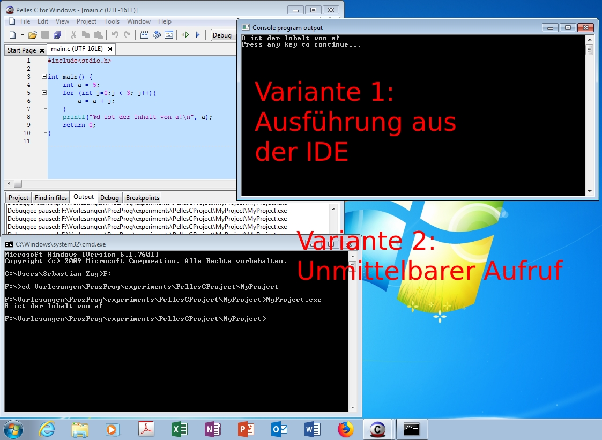
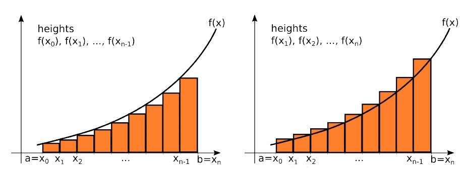

<!--

author:   Sebastian Zug & André Dietrich
email:    zug@ovgu.de   & andre.dietrich@ovgu.de
version:  0.0.1
language: de
narrator: Deutsch Female


script:  https://cdnjs.cloudflare.com/ajax/libs/echarts/4.1.0/echarts-en.min.js

script:   https://felixhao28.github.io/JSCPP/dist/JSCPP.es5.min.js


@JSCPP.__eval
<script>
  try {
    var output = "";
    JSCPP.run(`@0`, `@1`, {stdio: {write: s => { output += s }}});
    output;
  } catch (msg) {
    var error = new LiaError(msg, 1);

    try {
        var log = msg.match(/(.*)\nline (\d+) \(column (\d+)\):.*\n.*\n(.*)/);
        var info = log[1] + " " + log[4];

        if (info.length > 80)
          info = info.substring(0,76) + "..."

        error.add_detail(0, info, "error", log[2]-1, log[3]);
    } catch(e) {}

    throw error;
    }
</script>
@end


@JSCPP.eval: @JSCPP.__eval(@input, )

@JSCPP.eval_input: @JSCPP.__eval(@input,`@input(1)`)

@output: <pre class="lia-code-stdout">@0</pre>

@output_: <pre class="lia-code-stdout" hidden="true">@0</pre>


script:   https://ajax.googleapis.com/ajax/libs/jquery/1.11.3/jquery.min.js

@Rextester.__eval
<script>
//var result = null;
var error  = false;

console.log = function(e){ send.lia("log", JSON.stringify(e), [], true); };

function grep_(type, output) {
  try {
    let re_s = ":(\\d+):(\\d+): "+type+": (.+)";

    let re_g = new RegExp(re_s, "g");
    let re_i = new RegExp(re_s, "i");

    let rslt = output.match(re_g);

    let i = 0;
    for(i = 0; i < rslt.length; i++) {
        let e = rslt[i].match(re_i);

        rslt[i] = { row : e[1]-1, column : e[2], text : e[3], type : type};
    }
    return [rslt];
  } catch(e) {
    return [];
  }
}

$.ajax ({
    url: "https://rextester.com/rundotnet/api",
    type: "POST",
    timeout: 10000,
    data: { LanguageChoice: @0,
            Program: `@input`,
            Input: `@1`,
            CompilerArgs : @2}
    }).done(function(data) {
        if (data.Errors == null) {
            let warnings = grep_("warning", data.Warnings);

            let stats = "\n-------Stat-------\n"+data.Stats.replace(/, /g, "\n");

            if(data.Warnings)
              stats = "\n-------Warn-------\n"+data.Warnings + stats;

            send.lia("log", data.Result+stats, warnings, true);
            send.lia("eval", "LIA: stop");

        } else {
            let errors = grep_("error", data.Errors);

            let stats = "\n-------Stat-------\n"+data.Stats.replace(/, /g, "\n");

            if(data.Warning)
              stats = data.Errors + data.Warnings + stats;
            else
              stats = data.Errors + data.Warnings + stats;

            send.lia("log", stats, errors, false);
            send.lia("eval", "LIA: stop");
        }
    }).fail(function(data, err) {
        send.lia("log", err, [], false);
        send.lia("eval", "LIA: stop");
    });

"LIA: wait"
</script>
@end


@Rextester.eval: @Rextester.__eval(6, ,"-Wall -std=gnu99 -O2 -o a.out source_file.c")

@Rextester.eval_params: @Rextester.__eval(6, ,"@0")

@Rextester.eval_input: @Rextester.__eval(6,`@input(1)`,"-Wall -std=gnu99 -O2 -o a.out source_file.c")


@Rextester.pipe
<script>
//var result = null;
var error  = false;

console.log = function(e){ send.lia("log", JSON.stringify(e), [], true); };

function grep_(type, output) {
  try {
    let re_s = ":(\\d+):(\\d+): "+type+": (.+)";

    let re_g = new RegExp(re_s, "g");
    let re_i = new RegExp(re_s, "i");

    let rslt = output.match(re_g);

    let i = 0;
    for(i = 0; i < rslt.length; i++) {
        let e = rslt[i].match(re_i);

        rslt[i] = { row : e[1]-1, column : e[2], text : e[3], type : type};
    }
    return [rslt];
  } catch(e) {
    return [];
  }
}

$.ajax ({
    url: "https://rextester.com/rundotnet/api",
    type: "POST",
    timeout: 10000,
    data: { LanguageChoice: 6,
            Program: `@input(0)`,
            Input: `@1`,
            CompilerArgs : "-Wall -std=gnu99 -O2 -o a.out source_file.c"}
    }).done(function(data) {
        if (data.Errors == null) {
            let warnings = grep_("warning", data.Warnings);

            let stats = "\n-------Stat-------\n"+data.Stats.replace(/, /g, "\n");

            if(data.Warnings)
              stats = "\n-------Warn-------\n"+data.Warnings + stats;

            send.lia("log", data.Result+stats, warnings, true);

            @input(1)

            send.lia("eval", "LIA: stop");

        } else {
            let errors = grep_("error", data.Errors);

            let stats = "\n-------Stat-------\n"+data.Stats.replace(/, /g, "\n");

            if(data.Warning)
              stats = data.Errors + data.Warnings + stats;
            else
              stats = data.Errors + data.Warnings + stats;

            send.lia("log", stats, errors, false);
            send.lia("eval", "LIA: stop");
        }
    }).fail(function(data, err) {
        send.lia("log", err, [], false);
        send.lia("eval", "LIA: stop");
    });

"LIA: wait"
</script>
@end

script:   https://cdn.rawgit.com/davidedc/Algebrite/master/dist/algebrite.bundle-for-browser.js

@algebrite.eval:    <script> Algebrite.run(`@input`) </script>
-->

# Vorlesung X - Kommandozeilenparameter und Makros

**Fragen an die heutige Veranstaltung ...**

* Welche Bedeutung haben Kommandozeilenargumente für die Ausführung einer Anwendung?
* Nennen Sie beispielhafte Kommandozeilenargumente für einen Compiler.
* Wie lassen sich Kommandozeilenparameter erfassen, welche Prüfungen sollten
umgesetzt werden?
* Welche Chancen eröffnet der Präcompiler?
* Welche Gefahren bestehen bei der Realisierung von Präcompiler Makros?


---------------------------------------------------------------------
Link auf die aktuelle Vorlesung im Versionsmanagementsystem GitHub

https://github.com/liaScript/CCourse/blob/master/10_MakrosKommandozeilenparameter.md

---------------------------------------------------------------------

**Wie weit sind wir schon gekommen?**

ANSI C (C89)/ Schlüsselwörter:

| Standard    |                |          |            |          |            |
|:------------|:---------------|:---------|:-----------|:---------|:-----------|
| **C89/C90** | auto           | `double` | `int`      | `struct` | `break`    |
|             | `else`         | `long`   | `switch`   | `case`   | `enum`     |
|             | register       | typedef  | `char`     | extern   | return     |
|             | union          | const    | `float`    | `short`  | `unsigned` |
|             | `continue`     | `for`    | `signed`   | `void`   | `default`  |
|             | `goto`         | `sizeof` | volatile   | `do`     | `if`       |
|             | static         | `while`  |            |          |            |
| **C99**     | `_Bool`        | _Complex | _Imaginary | inline   | restrict   |
| **C11**     | _Alignas       | _Alignof | _Atomic    | _Generic | _Noreturn  |
|             |_Static\_assert | \_Thread\_local | |   |          |            |

---

Standardbibliotheken

| Name         | Bestandteil | Funktionen                              |
|:-------------|:------------|:----------------------------------------|
| `<stdio.h>`  |             | Input/output (`printf`)                 |
| `<stdint.h>` | (seit C99)  | Integer Datentypen mit fester Breite    |
| `<float.h>`  |             | Parameter der Floatwerte                |
| `<limits.h>` |             | Größe der Basistypen                    |
| `<fenv.h>`   |             | Verhalten bei Typumwandlungen           |
| `<string.h>` |             | Stringfunktionen                        |
| `<math.h>`   |             | Mathematische Funktionen und Konstanten |

https://en.cppreference.com/w/c/header


## 0. Wiederholung

### Debugging mit PellesC

https://forum.pellesc.de/index.php?topic=4194.0

Debugging mit PellesC

### Aufruf eines Programms

Bei der Verwendung von PellesC klicken Sie in der Regel auf einen Button, um
das Programm auszuführen. Sie können dies aber natürlich genauso auf der Kommandozeile
realisieren.

<!-- width="90%" -->[^1]

## 1. Kommandozeilenargumente

In vielen Fällen genügt es aber nicht, lediglich ein Programm zu starten, häufig
wollen Sie zusätzliche Parameter übergeben, die das Verhalten der Ausführung
bestimmen.

Beispiele:

+ Parameter für Berechnungen - Sie legen die Randbedingungen oder Startwerte einer Integralberechnung fest.
+ Filterkriterien - Sie suchen in unserem Namensdatenbank nach einer spezifischen Konfiguration von Datensätzen ("Alle weiblichen Vornamen, deren Träger zwischen 1955 und 1965 gebohren und mit G beginnen.")
+ Name der Datei, in die die Ausgaben geschrieben werden

Anwendungsfall gcc (C-Compiler)

Das Programm kennt eine Vielzahl von Eingabeparametern, die sich teilweise
gegenseitig bedingen.

1. Aufruf ohne Parameter - Fehler
``` bash @output
▶ gcc
gcc: fatal error: no input files
compilation terminated.
```

2. Abfordern der Versions- und Parameterkonfiguration
``` bash @output
▶ gcc -v
Using built-in specs.
COLLECT_GCC=gcc
COLLECT_LTO_WRAPPER=/usr/lib/gcc/x86_64-linux-gnu/5/lto-wrapper
Target: x86_64-linux-gnu
Configured with: ../src/configure -v --with-pkgversion='Ubuntu 5.4.0-6ubuntu1~16.04.10' ...
Thread model: posix
gcc version 5.4.0 20160609 (Ubuntu 5.4.0-6ubuntu1~16.04.10)
```

3. Aufruf der Hilfe
``` bash @output
▶ gcc --help
Usage: gcc [options] file...
Options:
  -pass-exit-codes         Exit with highest error code from a phase
  --help                   Display this information
  --target-help            Display target specific command line options
  --help={common|optimizers|params|target|warnings|[^]{joined|separate|undocumented}}[,...]
                           Display specific types of command line options
  (Use '-v --help' to display command line options of sub-processes)
  --version                Display compiler version information
  -dumpspecs               Display all of the built in spec strings
  -dumpversion             Display the version of the compiler
...
```
Das Verhalten des Programmes verändert sich in Abhänigkeit von der Wahl der
Kommandozeilenparameter.

``` bash @output
▶ gcc main.c
▶ gcc main.c -o main.out
```

### Methodik

```c
int main(int argc, char *argv[]) { /* ... */ } // anstatt
int main{void}
```

Dei zwei Parameter mit den Namen argc und argv. Die Namen dieser Parameter sind
NICHT vorgeschrieben und können beliebig angepasst werden. Allerdings sind
diese in vielen Programmiersprachen üblich, so dass der Lesefluss dadurch ggf.
gestört werden würde.

Die einzelnen Argumente, die dem Programm übergeben werden, müssen immer durch mindestens ein Leerzeichen getrennt sein.

| Name      | Datentyp                       | Inhalt                |
|:----------|:-------------------------------|:----------------------|
| argc      | integer                        | Zähler der Argumente  |
| acgv      | Pointer auf array von Pointern | Parameter             |


```cpp         InputArgs.c
#include <stdio.h>
#include <stdlib.h>

int main(int argc, char *argv[]) {
   int i;

   printf("%d Parameter eingelesen\n", argc);

   for(i=0; i < argc; i++) {
      printf("argv[%d] = %s ", i, argv[i]);
      printf("\n");
   }
   return EXIT_SUCCESS;
}
```
``` bash @output
▶ ./a.out das ist ein Test
5 Parameter eingelesen
argv[0] = ./a.out
argv[1] = das
argv[2] = ist
argv[3] = ein
argv[4] = Test
▶
▶ ./a.out Leerzeichen als Trenner 4 5 6
7 Parameter eingelesen
argv[0] = ./a.out
argv[1] = Leerzeichen
argv[2] = als
argv[3] = Trenner
argv[4] = 4
argv[5] = 5
argv[6] = 6
```

### Anwendung 1 - Text to File

Welches Verbesserungspotential sehen Sie bei folgendem Programm, dass zwei
Strings von der Kommandozeile übernimmt und diese als Dateinamen bzw. als zu
schreibenden Inhalt interpretiert. Denkbare Eingabe für das Programm wären


|               | ohne Dateiname   | mit Dateiname    |
| mit Text      | Fehlermeldung    | alles korrekt    |
| ohne Text     | Fehlermeldung    | Fehlermeldung (?) |


1. Entwurf ...

```c                                   writeTextToFile.c
#include <stdio.h>
#include <stdlib.h>

int write2File(const char *filename, const char *text){
  FILE *f = fopen(filename, "w");
  if (f == NULL)
  {
      printf("Error opening file!\n");
      return -1;
  }
  int count = fprintf(f, "%s\n", text);
  fclose(f);
  return count;
}

int main( int argc, char *argv[] )  {
  if( argc != 3 ) {
    printf("False Parameter Anzahl!.\n");
    showHelp();
    return EXIT_FAILURE;
  }
  else {
    printf("Korrekte Parameteranzahl!\n");
    //write2File("text.txt", "Hossa!");
    return EXIT_SUCCESS;
  }
}
```

Lediglich die Zahl der Argumente wird bisher abgrprüft, welche Funktionalitäten sollten
noch integriert werden?

+ Ausgabe der möglichen Parameter (gekürzte Anwenderinformation)
+ Hinweis auf die Anwendungsvarianten des Programms
+ mögliche Konfigurationen der Eingaben

Wie lösen wir das Problem möglicher Vertauschungen der Parameter?

```
 writeTextToFile File.txt Dasasdfkjasldfjasölfjasö
 writeTextToFile Dasasdfkjasldfjasölfjasö File.txt
```

Lösung in der Datei ./codeExamples/writeTextToFile.c

### Anwendung 2 - Taschenrechner

```
Taschenrechner 5 + 4 - 8 * 2
```

```c                                   Taschenrechner.c

/* Beispiel aus dem Lehrbuch des Rheinwerk-Verlages "C von A bis Z"
   Jürgen Wolf, 2017
   penbook.rheinwerk-verlag.de/c_von_a_bis_z/013_c_kommandozeilenargumente_001.htm
*/

#include <stdio.h>
#include <stdlib.h>
#include <string.h>

int main(int argc, char *argv[]) {
   int i, j ;
   long y, erg;

   if(argc < 4) {
      printf("Benötige mindestens 4 Argumente!\n");
      printf("Aufruf: %s <zahl><op><zahl> ...\n", *argv);
      return EXIT_FAILURE;
   }
   /* 1.Zahl in einen Integer konvertieren*/
   erg = strtol(argv[1], NULL, 10);
   if( erg == 0 ) {
      printf("Keine gültige Ganzzahl ... \n");
      return EXIT_FAILURE;
   }

   for(i = 1; i < argc-1; i += 2) {
      for(j=i+1; j < i+2; j++) {
         y = strtol(argv[i+2], NULL, 10);
         if( y == 0 ) {
            printf("Keine gültige Ganzzahl ... \n");
            printf("argc: %d (%s)?!\n", i+2, argv[i+2]);
            return EXIT_FAILURE;
         }
         if(strcmp(argv[j],"+") == 0)
            erg += y;
         else if(strcmp(argv[j],"-") == 0)
            erg -= y;
          else if(strcmp(argv[j], "x") == 0)
             erg *= y;
          else if(strcmp(argv[j],"/") == 0)
             erg/=y;
          else {
             printf("Ungültiger Operand: %s\n", argv[j]);
             return EXIT_FAILURE;
          }
      }
   }
   printf("%ld\n",erg);
   return EXIT_SUCCESS;
}
```

Wie können wir die Funktionalität auf Klammerausdrücke ausdehnen? Welche
zusätzlichen Prüfungen werden dann notwendig?

## 2. Präprozessor-Direktiven

Ein Präprozessor (seltener auch Präcompiler) ist ein Computerprogramm, das Eingabedaten vorbereitet und zur weiteren Bearbeitung an ein anderes Programm weitergibt. Der Präprozessor wird häufig von Compilern oder Interpretern dazu verwendet, einen Eingabetext zu konvertieren und das Ergebnis im eigentlichen Programm weiter zu verarbeiten.

Da sich der C-Präprozessor nicht auf die Beschreibung der Sprache C stützt, sondern ausschließlich seine ihm bekannten Anweisungen erkennt und bearbeitet, kann er auch als reiner Textersetzer für andere Zwecke verwendet werden.

<!-- width="100%" -->

Der C-Präprozessor realisiert dabei die

+ Zusammenfassung von Strings
+ Löcschung von Zeilenumbrüchen und Kommentaren (Ersetzung durch Leerzeichen)
+ Whitespace-Zeichen zwischen Tokens werden gelöscht.
+ Kopieren der Header- und Quelldateien in den Quelltext kopieren (`#include`)
+ Einbinden von Konstanten (`#define`)
+ Extrahieren von Codebereichen mit einer bedingten Kompilierung (`#ifdef`, `#elseif`, ...)

Letztgeannten 3 Abläufe werden durch den Entwickler spezifiziert. Dazu bedient er
sich sogenannter Direktiven. Sie beginnen mit # und müssen nicht mit einem Semikolon abgeschlossen werden. Eventuell vorkommende Sonderzeichen in den Parametern müssen nicht escaped werden.

```c
#Direktive Parameter
```

### #include

Include-Direktiven kennen Sie bereits aus unseren Beispielprogrammen. Damit binden
wir Standardbibliotheken oder eigenen Source-Datei ein.
Es gibt zwei Arten der #include-Direktive, nämlich

```c
#include <Datei.h>
#include "Datei.h"
```

Die erste Anweisung sucht die Datei im Standard-Includeverzeichnis des Compilers, die zweite Anweisung sucht die Datei zuerst im Verzeichnis, in der sich die aktuelle Sourcedatei befindet; sollte dort keine Datei mit diesem Namen vorhanden sein, sucht sie ebenfalls im Standard-Includeverzeichnis.

Mit dem Präprozessoraufruf werden die Inhalte der Header-Files in unseren Code
kopiert. Dieser wird dadurch um ein vielfaches größer, umfasst nun aber alle
Funktionsdeklarationen, die genutzt werden sollen.

```c
#include <stdio.h>
#include <stdlib.h>

int main(void) {
  printf("Präprozessorkrams \n")
  return EXIT_SUCCESS;
}
```

``` bash @output
▶ gcc experiments.c -E -o experiments_pre.txt
```

```c
...
# 1 "/usr/include/x86_64-linux-gnu/bits/types.h" 1 3 4
# 27 "/usr/include/x86_64-linux-gnu/bits/types.h" 3 4
# 1 "/usr/include/x86_64-linux-gnu/bits/wordsize.h" 1 3 4
# 28 "/usr/include/x86_64-linux-gnu/bits/types.h" 2 3 4

typedef unsigned char __u_char;
typedef unsigned short int __u_short;
typedef unsigned int __u_int;
typedef unsigned long int __u_long;
...

# 4 "experiments.c"
int main(void) {
  printf("Präprozessorkrams \n")
  return
# 6 "experiments.c" 3 4
        0
# 6 "experiments.c"
                    ;
}
```

Warum muss vermieden werden, dass headerfiles kreuzweise eingebunden werden?

### #define

`#define` kann in drei verschiedenen Arten genutzt werden, um ein Symbol überhaupt
zu definieren, einen konkreten Wert zuzuordnen oder aber

```c
#define SYMBOL
#define KONSTANTE Wert
#define ERDBESCHLEUNIGUNG (9.80665)
#define MAKRO(Parameter ...) Ausdruck
```

```cpp
#include <stdio.h>
#include <stdlib.h>

#define MATH_PI 3.14
#define VOLLKREIS MATH_PI*2
#define HALBIEREN(wert) ((wert) / 2)
#define MAX_VALUE(a,b) ((a >= b) ? (a) : (b))

int main(void)
{
  float r=5;
  printf("Kreisfläche %f\n", r * r * MATH_PI);
  printf("Kreisumfang %f\n", r * VOLLKREIS);
  printf("Halber Wert von Pi %f\n", HALBIEREN(MATH_PI));
  printf("Vergleich %f\n", MAX_VALUE(MATH_PI, r));
  return EXIT_SUCCESS;
}
```
@Rextester.eval

In allen Fällen erfolgt lediglich eine Textersetzung im Programmcode! Dies kann
auch auf weitergehende Codefragmente ausgedehnt werden.

```cpp
#include <stdio.h>
#include <stdlib.h>

#define TAUSCHE(a, b, typ) { typ temp; temp=b; b=a; a=temp; }

int main(void) {
	int zahla=4, zahlb=7;
	printf("zahl A: %d\nzahl B: %d\n", zahla, zahlb);
 	TAUSCHE(zahla, zahlb, int);
	printf("zahl A: %d\nzahl B: %d\n", zahla, zahlb);
  return EXIT_SUCCESS;
}
```
@Rextester.eval

Im Standard-C müssen bereits einige Makros im Präprozessor vordefiniert sein. Die Namen der vordefinierten Makros beginnen und enden jeweils mit zwei Unterstrichen. Die wichtigsten vordefinierten Makros sind in der folgenden Tabelle aufgelistet.

| Define    | Bedeutung                                         |
|:----------|:--------------------------------------------------|
|`__LINE__` 	| Zeilennummer innerhalb der aktuellen Quellcodedatei |
|`__FILE__` 	|Name der aktuellen Quellcodedatei  |
|`__DATE__` 	|Datum, wann das Programm compiliert wurde (als Zeichenkette)|
|`__STDC__` 	|Liefert eine 1, wenn sich der Compiler nach dem Standard-C richtet. |
|`__STDC_VERSION__` | 	Liefert die Zahl 199409L, wenn sich der Compiler nach dem  C95-Standard richtet; die Zahl 199901L, wenn sich der Compiler nach dem C99-Standard richtet. Ansonsten ist dieses Makro nicht definiert.|

Daneben gibt es weitere vordefinierte Makros, die das Betriebssystem zurückgeben.

```c
#include <stdio.h>
#include <stdlib.h>

#define TAUSCHE(a, b, typ) { typ temp; temp=b; b=a; a=temp; }

int main(void) {
  printf("Programm wurde compiliert am ");
  printf("%s um %s.\n", __DATE__, __TIME__);

  printf("Diese Programmzeile steht in Zeile ");
  printf("%d in der Datei %s.\n", __LINE__, __FILE__);

  #ifdef __STDC__
  printf("Standard-C-Compiler!\n");
  #else
  printf("Kein Standard-C-Compiler!\n");
  #endif
  return EXIT_SUCCESS;
}
```
@Rextester.eval

### #if

Mit #if kann ähnlich wie mit #ifdef eine bedingte Übersetzung eingeleitet werden, jedoch können hier konstante Ausdrücke ausgewertet werden.

```cpp
#include <stdio.h>
#include <stdlib.h>

#define TEST

int main(void) {
  int a = 3, b = 5, c;
  c = a * b;
  #ifdef TEST
    printf("Variableninhalte:\n");
    printf("a = %i\nb = %i\nc = %i\n", a, b, c);
  #else
    printf("Ergebnis von %i mal %i ist %i\n", a, b, c);
  #endif
  return EXIT_SUCCESS;
}
```
@Rextester.eval

```cpp                         DeleteMonitor.c
/* Beispiel aus dem Lehrbuch des Rheinwerk-Verlages "C von A bis Z"
   Jürgen Wolf, 2017
*/
#include <stdio.h>
#include <stdlib.h>
#ifdef __unix__
   #define clrscr() printf("\x1B[2J")
#elif __BORLANDC__ && __MSDOS__
   #include <conio.h>
#elif __WIN32__ || _MSC_VER
   #define clrscr() system("cls")
#else
   #define clrscr() printf("clrscr() - Fehler!!\n")
#endif

int main(void) {
   /* universale Routine zum Löschen des Bildschirms */
   clrscr();
   return EXIT_SUCCESS;
}
```

### #error

Zur expliziten Abbildung von Fehlern ist `#error` vorgesehen. Damit ist es möglich
bestimmte Aspekte zu prüfen und die Kompilierung abzubrechen.

```cpp
#include<stdio.h>
#ifndef __MATH_H
#error First include then compile
#else
int main(void){
    float a,b=25;
    a=sqrt(b);
    printf("%f",a);
    return 0;
}
#endif
```
@Rextester.eval


## 3. Beispiel der Woche

Der folgende Code implementiert unterschiedliche Formen der numerische
Integration für Funktionen mit einer veränderlichen. Im Beispiel wurde

$$
f(x) = 2x^2 - 14
$$

gewählt und das bestimmte Integral in den Grenzen von 1 bis 10 für variierende
Schrittweiten bestimmt. Die exakte Lösung lässt sich mit Hilfe eines
Algebra-Systemes mittels des Befehls `defint` bestimmen.

Die Lösung umfasst sowohl das linksseitige als auch das rechtsseitige
Integral.

<!-- width="90%" -->[^1]

[^1]: Bilder aus den Vorlesungsunterlagen von Lia Vas, University of the Sciences, Philadelphia

```Maxima
f=2*x^2-14
defint(f,x,1,10)
```
@algebrite.eval

```cpp                          Integral.c
#include <stdio.h>
#include <stdlib.h>
#include <math.h>

struct samples{
  double x;
  double y;
};

double myFunction(double x){
  return 2 * x * x - 14;
}

struct samples * generateValues(double from, double to, int number){
  struct samples * values;
  values = malloc((number + 1) * sizeof(*values));
  double resolution = (to - from)/ number;
  for (int i=0; i <= number; i++){
      values[i].x = from + i * resolution;
      values[i].y = myFunction(values[i].x);
  }
  return values;
}

double int_leftrect(struct samples * values, int number){
   double resolution = (values[number].x - values[0].x)/ number;
   double sum = 0;
   for (int i=0; i < number; i++){
      //printf("%f %f\n", values[i].x, values[i].x);
       sum = sum + values[i].y * resolution;
   }
   return sum;
}

double int_rightrect(struct samples * values, int number){
   double resolution = (values[number].x - values[0].x)/ number;
   double sum = 0;
   for (int i=1; i <=number; i++){
       sum = sum + values[i].y * resolution;
   }
   return sum;
}

double int_trapez(struct samples * values, int number){
   // Hier fehlt Ihr Beitrag! 
   return 0;
}

int main(void) {
  struct samples * values;
  double from = 1;
  double to = 10;
  for (int number=3; number<150; number=number+5){
    values = generateValues(from, to, number);
    printf("n = %3d - Integral = %f, %f, %f\n", number,
                                       int_leftrect(values, number),
                                       int_rightrect(values, number),
                                       int_trapez(values, number));
  }
  return EXIT_SUCCESS;
}
```
``` javascript -Analyse.js
let samples = data.Result.match(/[0-9.]+/g);

let label;
let series_1 = [];
let series_2 = [];
let series_3 = [];

for(let i=0; i<samples.length; i++) {
  //samples[i] = parseFloat(samples[i]);
  let value = parseFloat(samples[i]);
  switch (i % 4)
  {
    case 0:  label = value; break;
    case 1:  series_1.push([label, value]); break;
    case 2:  series_2.push([label, value]); break;
    case 3:  series_3.push([label, value]);
  }
}

let chart = echarts.init(document.getElementById('pipe_chart'));


let option = {
  title : {
    text: 'Numerische Integration',
    subtext: 'Einfluss der Schrittweite n'
  },
  toolbox: {
    show : true,
    feature : {
      mark : {show: true},
      dataZoom : {show: true},
      dataView : {show: true, readOnly: false},
      restore : {show: true},
      saveAsImage : {show: true}
    }
  },
  legend: {
      data:['left_Integral','right_Integral','trapezoidal_Integral']
  },
  xAxis : [{
    type : 'value',
    scale: true,
    axisLabel : { formatter: '{value}' }
  }],
  yAxis : [{
    type : 'value',
    scale: true,
    axisLabel : { formatter: '{value}'}
  }],
  series : [{
    name: 'left_Integral',
    type: 'line',
    data: series_1,
  }, {
    name: 'right_Integral',
    type: 'line',
    data: series_2,
  },
  {
    name: 'trapezoidal_Integral',
    type: 'line',
    data: series_3,
  }]
};


chart.setOption(option);
```
@Rextester.pipe

<div class="persistent" id="pipe_chart" style="position: relative; width:100%; height:400px;"></div>
