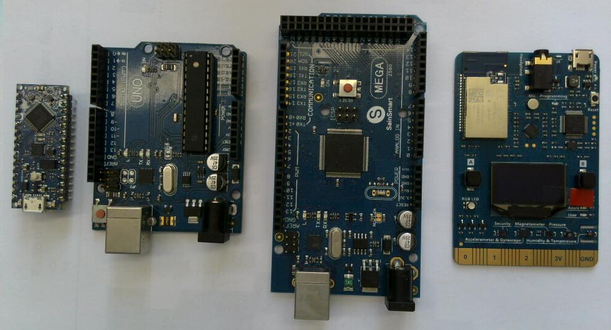
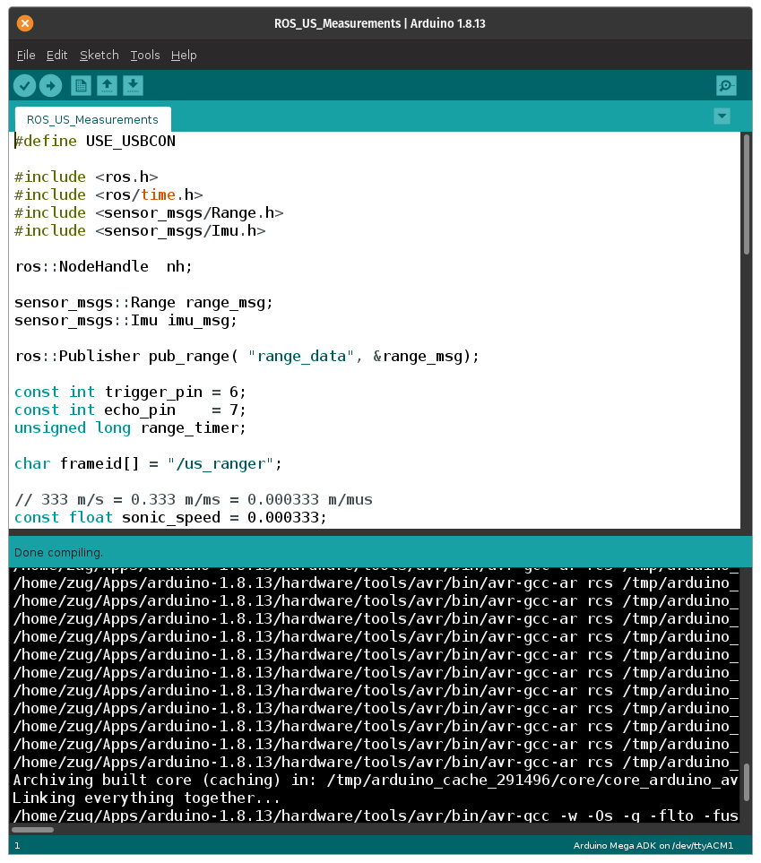
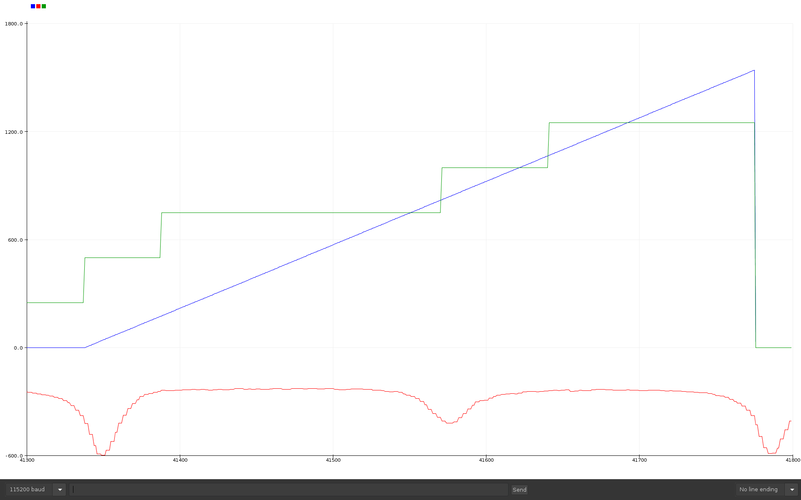

<!--

author:   Sebastian Zug & André Dietrich & Galina Rudolf
email:    sebastian.zug@informatik.tu-freiberg.de & andre.dietrich@ovgu.de & Galina.Rudolf@informatik.tu-freiberg.de
version:  1.0.4
language: de
narrator: Deutsch Female

comment: Einführung in die Programmierung für Nicht-Informatiker
logo: ./img/LogoCodeExample.png

import: https://github.com/liascript/CodeRunner
        https://github.com/LiaTemplates/AVR8js/main/README.md#10
        https://raw.githubusercontent.com/liascript-templates/plantUML/master/README.md

-->

[](https://liascript.github.io/course/?https://github.com/TUBAF-IfI-LiaScript/VL_ProzeduraleProgrammierung/blob/master/11_Arduino.md)

# Softwareentwicklung mit Arduino

| Parameter                 | Kursinformationen                                                                                                                                                                                                                |
| ------------------------- | -------------------------------------------------------------------------------------------------------------------------------------------------------------------------------------------------------------------------------- |
| **Veranstaltung:**        | `Vorlesung Prozedurale Programmierung`                                                                                                                                                                                           |
| **Semester**              | `Wintersemester 2021/22`                                                                                                                                                                                                         |
| **Hochschule:**           | `Technische Universität Freiberg`                                                                                                                                                                                                |
| **Inhalte:**              | `Grundzüge der Vererbung in C++`                                                                                                                                                                                               |
| **Link auf Repository: ** | [https://github.com/TUBAF-IfI-LiaScript/VL_ProzeduraleProgrammierung/blob/master/11_Arduino.md](https://github.com/TUBAF-IfI-LiaScript/VL_ProzeduraleProgrammierung/blob/master/11_Arduino.md) |
| **Autoren**               | @author                                                                                                                                                                                                                          |


--------------------------------------------------------------------

**Wie weit waren wir gekommen?**

* Grundlagen der Programmierung mit C und C++
* Verständnis für den Aufbau und die Modellierung von Klassen  

**Inhalt der heutigen Veranstaltung**

* Ergänzende Anmerkungen zu C++
* Übertragung der Inhalte auf die Programmierung des Mikrocontrollers
* Grundlegende Abläufe bei der Programmierung und Nutzung der Sensordaten

**Fragen an die heutige Veranstaltung ...**

* Unterscheiden Sie zwischen der "erstmaligen Belegung" mittels Initialisierungsliste und Zuweisungen im Konstruktor!
* In welchem Speicherbereich werden die dynamisch erzeugten Objekte angelegt?
* Was unterscheidet die Verwendung von Variablen auf dem Stack und dem Heap?
* Warum braucht man ohnehin dynamische Objekte?

---------------------------------------------------------------------

## Ergänzende Anmerkungen - Dynamisch erzeugte Objekte

Jede Variable bzw. jedes Objekt bekommt im Speicher eine Adresse zugewiesen.
Die Zugehörigkeit einer Variable einem Speicherbereich ist entscheidend für ihre Gültigkeit.
Die Entscheidung darüber trifft der Programmierer in dem er im Quellcode die Variable am
bestimmten Ort bzw. mit dem bestimmen Schlüsselwort definiert.

+ Wenn eine Variable innerhalb einer Funktion (Methode) definiert wird, ist sie nur ab dem Zeitpunkt der Definition bis zum Ende der Funktion gültig:

+ Die Klassenmembers sind innerhalb des gesamten Klassenbereich gültig und ihre Lebensdauer entspricht der Lebensdauer eines Objektes, in dem sie enthalten sind.

Die Ausnahme bilden
die static-Member. Sie sind innerhalb aller Objekte der Klasse gültig (und nur einmal vorhanden).

Globale Variablen werden außerhalb jeglicher Funktion definiert. Jede Funktion kann darauf
zugreifen und deren Inhalt verändern. Sie existieren bis zum Programmende.

Dynamisch erzeugte Variablen (Objekte) sind ebenfalls über die Grenzen einer Funktion
verfügbar. Sie werden mit  `new`-Operator angelegt und mit `delete` wieder gelöscht,
spätestens am Programmende.

Der Vorteil von dynamisch erzeugten Variablen besteht in der effizienten Speichernutzung.
Neben der Möglichkeit eines rechtzeitigen Löschens kann EIN
mit `new`-Operator angelegtes Objekt in mehreren Objekten einer anderen Klasse enthalten sein.

```cpp
class Droide
{
  public:
    Droide(){}

};

class Sternjaeger{
  private:
    Droide *droide;
  public:
    Sternjaeger(Droide *_droide):droide(_droide){}
};

int main()
{
  Droide *d=new Droide();
  Sternjaeger jaeger1(d), jaeger2(d);
  //beide Sternjaeger teilen sich einen Droiden
  //darum wird er nur einmal geloescht
  //und zwar hier, nicht in der Klasse Sternjaeger
  delete d;
}
```

Dynamische Speicherverwaltung bedeutet aber auch einen zusätzlichen Programmieraufwand und
eine Fehlerquelle. Dynamisch erzeugte Variablen können versehentlich überschrieben werden und dadurch
nicht mehr freigegeben werden (Speicherleck) oder es können Zeiger ohne Speicherbereich
entstehen (hängende Zeiger).

## Arduino Konzept

Das Arduino-Projekt wurde am _Interaction Design Institute Ivrea_ (IDII) in Ivrea, Italien, ins Leben gerufen. Ausgangspunkt war die Suche nach einem preiswerten, einfach zu handhabenen Mikrocontroller der insbesondere für die Ausbildung von Nicht-Informatikern geeignet ist. Das anfängliche Arduino-Kernteam bestand aus Massimo Banzi, David Cuartielles, Tom Igoe, Gianluca Martino und David Mellis.

Nach der Fertigstellung der Plattform wurden leichtere und preiswertere Versionen in der Open-Source-Community verbreitet. Mitte 2011 wurde geschätzt, dass über 300.000 offizielle Arduinos kommerziell produziert worden waren, zwischenzeitlich wurden mehrere Millionen produziert.

### Hardware

Das Arduino Projekt hat eine Vielzahl von unterschiedlichen Boards hervorgebracht, die eine unterschiedliche Leistungsfähigkeit und Ausstattung kennzeichnen.
Das Spektrum reicht von einfachen 8-Bit Controllern bis hin zu leistungsstarken ARM Controllern, die ein eingebettetes Linux ausführen.

> **Merke:** Es gibt nicht **den** Arduino Controller, sondern eine Vielzahl von verschiedenen Boards.

<!-- style="width: 75%; max-width: 1000px" -->

Unser Controller, ein 32 Bit System, auf den im nachfolgenden eingegangen wird, liegt im mittleren Segment der Leistungsfähigkeit.

Erweitert werden die Boards durch zusätzliche `Shields`, die den Funktionsumfang erweitern.

### Software

Die Entwicklungsumgebung fasst grundsätzliche Entwicklungswerkzeuge zusammen und richtet sich an Einsteiger.

<!-- style="width: 75%; max-width: 1000px" -->

Wichtige Grundeinstellungen:

+ Richtigen Port für den Programmiervorgang auswählen (`Tools` -> `Port`)
+ Richtigen Controller auswählen (`Tools` -> `Board`)
+ Richtige Baudrate für die Serielle Schnittstellen

Eine Beschreibung der Konfiguration für den spezifischen Controller folgt in den Übungen.

#### Grundaufbau eines Programmes

Jedes Arduino-Programm umfasst zwei zentrale Funktionen - `setup` und `loop`. Erstgenannte wird einmalig ausgeführt und dient der Konfiguration, die zweite wird kontinuierlich umgesetzt.

<div>
  <wokwi-led color="red" pin="13" port="B" label="13"></wokwi-led>
  <span id="simulation-time"></span>
</div>
```cpp       HelloWorld.cpp
# define LED_PIN 13                 // Pin number attached to LED.
//const int led_pin_red = 13;

void setup() {
    pinMode(LED_PIN, OUTPUT);       // Configure pin 13 to be a digital output.
}

void loop() {
    digitalWrite(LED_PIN, HIGH);    // Turn on the LED.
    delay(1000);                    // Wait 1 second (1000 milliseconds).
    digitalWrite(LED_PIN, LOW);     // Turn off the LED.
    delay(1000);                    // Wait 1 second.
}
```
@AVR8js.sketch

| Befehl                       | Bedeutung                                                                      |
| ---------------------------- | ------------------------------------------------------------------------------ |
| `pinMode(pin_id, direction)` | Festlegung der Konfiguration eines Pins als Input / Output (`INPUT`, `OUTPUT`) |
| `digitalWrite(pin_id, state)`                             |                              Schreiben eines Pins, daraufhin liegen entweder (ungefähr) 3.3 V `HIGH` oder 0V `LOW` an                                                |

> **Aufgabe:** Schreiben Sie ein Programm, dass ein Lauflicht aus LEDs realisiert.

<div>
  <wokwi-led color="yellow" pin="12" port="B" label="12"></wokwi-led>
  <wokwi-led color="green" pin="11" port="B" label="11"></wokwi-led>
  <wokwi-led color="blue" pin="10" port="B" label="10"></wokwi-led>
  <wokwi-led color="red" pin="8" port="B" label="8"></wokwi-led>
  <span id="simulation-time"></span>
</div>
```cpp       HelloWorld.cpp

void setup() {
    pinMode(LED_PIN, OUTPUT);       
}

void loop() {
  // Hier fehlt jetzt Ihr Code
}
```
@AVR8js.sketch


| Befehl                       | Bedeutung                                                                      |
| ---------------------------- | ------------------------------------------------------------------------------ |
| `state = digitalRead(pin_id)`                             |                              Lesen des Pegels an einem Pin - 3.3 V `HIGH` oder 0V `LOW` an                                                |

Im Beispiel ist der grüne Button an Pin 3, der rote an Pin 2 angeschlossen.

<div>
  <wokwi-pushbutton color="green"   pin="3"  port="D"></wokwi-pushbutton>
  <wokwi-pushbutton color="red"   pin="2"  port="D"></wokwi-pushbutton>
  <wokwi-led color="red"   pin="8" port="B" label="8"></wokwi-led>
</div>

```cpp       ButtonLogic.cpp

void setup() {
  Serial.begin(115200);
  pinMode(2, INPUT);
  pinMode(3, INPUT);
  pinMode(4, INPUT);
  pinMode(13, OUTPUT);
}

void loop() {
  int button = digitalRead(3);

  if (button) {
    digitalWrite(13, HIGH);
  }
  delay(250);
}
```
@AVR8js.sketch

> **Aufgabe:** Passen Sie das Programm nun so an, dass die Led nach dem Drücken des roten Buttons für 3 Sekunden und nach dem Drücken des grünen Buttons für 1 Sekunde leuchtet.

Eine Allgemeine Übersicht zu den Arduinobefehlen finden Sie unter folgendem [Link](https://www.arduino.cc/reference/en/).

#### Ablauf der Programmiervorganges

Der Programmiervorgang für einen Mikrocontroller unterscheidet sich in einem Punkt signifikant von Ihren bisherigen C/C++ Aufgaben - die erstellten Programme sind auf dem Entwicklungssystem nicht ausführbar. Wir tauschen also den Compiler mit der Hardware aus. Dadurch "versteht" der Entwicklungsrechner die Anweisungen aber auch nicht.

```text @plantUML.png
@startuml
ditaa

+-----------------------------------------------------------------------------------------+
:  C/C++ Programmierung                        Assemblerprogrammierung                    |
|  +---------------+     +---------------+     +---------------+                          |            
|  |c88F C/C++{o}  |---> |c8F8 arm-gcc   |---> |c88F *.asm{o}  |                          |            
|  +---------------+     +---------------+     +---------------+                          |           
|                                                      |                                  |
|                         Spezifischer                 v                                  |
|                         Compiler             +---------------+                          |         
|                                              |c8F8 avr-as    |                          |         
|                                              +---------------+                          |         
|                                                      |                                  |
|                                                      v                                  |
|                                              +---------------+                          |         
|                                              |      *.o{o}   |                          |         
|                                              +---------------+                          |         
|                                                      |                                  |
|                                                      v                                  |
|             +---------------+                +---------------+      +---------------+   |                                
|             |c8F8 objcopy   |<-------+       |c8F8 avr-ld    | <----|    Library{o} |   |                                
|             +---------------+        |       +---------------+      +---------------+   |                                
|                      |               |               |                                  |
|         +------------+-----------+   +---------------+                                  |
|         |                        |                   |                                  |                
|         v                        v                   v                                  |
|  +---------------+       +---------------+   +---------------+                          |         
|  |      *.hex{o} |  ...  |    *.bin{o}   |   |    *.elf{o}   |                          |         
|  +---------------+       +---------------+   +---------------+                          |  
|         |                        |                   |                                  |
|         +------------------------+-------------------+                                  |
|                                  |                                                      |
|                                  v                                                      |
|                          +---------------+                                              |
|                          |c8F8 Programmer|                                              |
|                          +---------------+                                              |     
+-----------------------------------------------------------------------------------------+
                                   |
                                   +-------------------------+  
                                   |                         |
                                   v                         v        
+-----------------------------------------------------------------------------------------+
: +---------------+        +---------------+         +---------------+                    |
| |c2F8 SRAM      |<------ |c2F8 Flash     |         |c2F8 EEPROM    |                    |
| +---------------+        +---------------+         +---------------+                    |    
| Mikrocontroller                                                                         |
+-----------------------------------------------------------------------------------------+
@enduml
```

Dabei zeigt sich aber auch der Vorteil der Hochsprachen C und C++, die grundsätzlichen Sprachinhalte sind prozessorunabhängig!

## "Unser" Controller

| Kategorie  | Features laut Webseite                  | Bedeutung                                                |
| ---------- | --------------------------------------- | -------------------------------------------------------- |
| Controller | _EMW3166 Wifi module_                   | Eingebetteter Controller mit WLAN Schnittstelle          |
| Peripherie | _Audio codec chip_                      | Hardware Audioverarbeitungseinheit                       |
|            | _Security encryption chip_              | Verschlüsselungsfeatures in einem separaten Controller   |
|            | _2 user button_                         |                                                          |
| Aktoren    | _1 RGB light_                           |                                                          |
|            | _3 working status indicator_            | _WiFi_, _Azure_, _User_ Leds auf der rechten Seite       |
|            | _Infrared emitter_                      | Infrarot Sender für die Nutzung als Fernbedienung        |
|            | _OLED,128×64_                           | Display mit einer Auflösung von 128 x 64 Pixeln          |
| Sensoren   | _Motion sensor_                         | Interialmessystem aus Beschleunigungssensor und Gyroskop |
|            | _Magnetometer sensor_                   |                                                          |
|            | _Atmospheric pressure sensor_           |                                                          |
|            | _Temperature and humidity sensor_       |                                                          |
|            | _Microphone_                            |                                                          |
| Anschlüsse | _Connecting finger extension interface_ |                                                          |

<!-- style="width: 55%; max-width: 1000px" -->[^3]

[^3]: Produktwebseite Firma MXChip, AZ3166 Procuct Details [Link](https://en.mxchip.com/az3166)

Worin unterscheidet sich der Controller von einem willkürlich ausgewählten Laptop?

| Parameter        | AZ3166                            | Laptop                           |
| ---------------- | --------------------------------- | -------------------------------- |
| Bandbreite       | 32Bit                             | 64Bit                            |
| Taktrate         | 100Mhz                            | 3.5Ghz                           |
| Arbeitsspeicher  | 256kBytes                         | 8 GBytes                         |
| Programmspeicher | 1 MByte                           |                                  |
| Energieaufnahme  | 0.x Watt                          | 100 Watt                         |
| Kosten           | $40$ Euro                           | $>500$ Euro                        |
| Einsatz          | Spezifisches eingebettetes System | Vielfältige Einsatzmöglichkeiten |

Zum Vergleich, eine Schreibmaschinenseite umfasst etwa 2KBytes.

Die Dokumentation der zugehörige _Application Programming Interface_ (API) finden Sie unter [Link](https://microsoft.github.io/azure-iot-developer-kit/docs/apis/led/).
Hier stehen Klassen bereit, die Einbettung der Sensoren, LEDs, des Displays kapseln und die Verwendung vereinfachen.

## Allgemeines Vorgehen für das Erfassen von Messdaten

Bestimmen Sie die Periodendauer eines Fadenpendels bzw. die Erdbeschleunigung bei einer bekannten Fadenlänge!

$$
T_0= 2\pi\sqrt{\frac{l}{g}}
$$

> **Frage:** Welche Sensoren können wir dafür nutzen?

<iframe width="560" height="315" src="https://www.youtube.com/embed/q3_m1JW1ttQ" frameborder="0" allow="accelerometer; autoplay; clipboard-write; encrypted-media; gyroscope; picture-in-picture" allowfullscreen></iframe>

Unser Ansatz unterscheidet sich davon, wir nutzen den Magnetkompass unseres Boards, der auf die Präsenz von magnetoresistiven Materialien in der Umgebung reagiert [Link](https://microsoft.github.io/azure-iot-developer-kit/docs/apis/lis2mdl/#init).

Der Sensor ist über den I2C Bus an unser Board angeknüpft. Dieser überträgt die Messdaten serialisiert an den Controller. Wir müssen also, um die Daten nutzen zu können sowohl eine Instanz der Sensorklasse `LIS2MDLSensor` als auch eine Instanz der Busklasse `DevI2C` erzeugen. Dem Sensor wird dabei das erzeugte Busobjekt im Konstruktor übergeben.

```cpp   ReadingMagdnetometerValues.ino
#include "LIS2MDLSensor.h"

DevI2C ext_i2c(D14,D15);
LIS2MDLSensor lis2mdl(ext_i2c);

int axes[3];

void setup(){
    lis2mdl.init(NULL);
    Serial.begin(115200);
}

void loop(){
    lis2mdl.getMAxes(axes);
    Serial.printf("%d, %d, %d\n", axes[0], axes[1], axes[2]);
    delay(10);
}
```

Bringen wir einen magnetorresistives Objekt in die Nähe des Sensors, so kann er dessen Auswirkung auf das Magnetfeld der Erde messen.

<!-- style="width: 55%; max-width: 1000px" -->

Für unser Pendel sieht der Verlauf dann entsprechend wie folgt aus:

<!-- style="width: 55%; max-width: 1000px" -->

Eine Lösung für die Extraktion der Periodendauer finden Sie in unserem Vorlesungsverzeichnis [Link](https://github.com/SebastianZug/VL_ProzeduraleProgrammierung/blob/master/examples/11_Arduino/MagnetometerPendel/MagnetometerPendel.ino). Gelingt es Ihnen eine bessere Lösung zu entwickeln?

```python
import numpy as np
import matplotlib.pyplot as plt

periods = np.array([1524, 1541, 1541, 1541, 1541, 1541, 1531, 1541, 1541, 1541, 1541, 1537, 1531, 1541, 1541, 1541, 1541, 1531, 1530, 1530, 1541, 1541, 1542, 1537, 1531, 1541, 1541, 1531, 1541, 1531, 1541, 1531, 1541, 1531, 1542, 1531, 1542, 1541, 1531, 1537, 1531, 1542, 1531, 1541, 1531, 1531, 1542, 1541, 1531, 1541, 1531, 1531, 1531, 1531, 1531, 1541, 1535, 1531, 1541, 1531, 1545, 1541, 1541, 1541, 1541, 1541, 1541, 1541, 1541, 1537, 1541, 1541, 1541, 1531, 1541, 1542, 1541, 1541, 1541, 1541, 1531, 1542, 1541, 1541, 1541, 1541, 1531, 1541, 1541, 1542, 1541, 1541, 1542, 1531, 1541, 1541, 1531, 1538, 1530, 1531, 1530, 1541, 1530, 1541, 1534, 1541, 1531, 1531, 1541, 1541, 1530, 1541, 1531, 1542, 1531, 1541, 1531, 1534, 1541, 1531, 1541, 1534, 1541, 1542, 1531, 1541, 1531, 1541, 1541, 1541, 1541, 1531, 1531, 1530, 1541, 1531, 1530, 1532, 1531, 1541, 1541, 1541, 1534, 1545, 1541, 1531, 1531, 1541, 1542, 1541, 1534, 1530, 1542, 1531, 1531, 1542, 1531, 1541, 1541, 1530, 1535, 1541, 1541])

periods = periods / 1000  # ms -> s
length = (periods / ( 2 * np.pi))**2 * 9.81  # vgl. Gleichung Fadenpendel

fig, ax = plt.subplots()
ax.hist(length)
plt.title("Gaussian Histogram")
plt.xlabel("Periodendauer in ms")
plt.ylabel("Häufigkeit")
plt.show()

plot(fig) # <- this is required to plot the fig also on the LiaScript canvas
```
@Pyodide.eval
