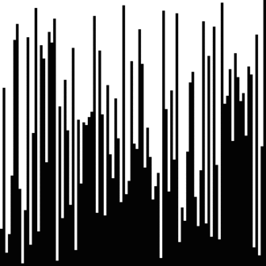

<!--

author:   Sebastian Zug & André Dietrich
email:    zug@ovgu.de   & andre.dietrich@ovgu.de
version:  0.0.1
language: de
narrator: Deutsch Female


script: https://cdn.jsdelivr.net/chartist.js/latest/chartist.min.js

link:   https://cdn.jsdelivr.net/chartist.js/latest/chartist.min.css

script:  https://cdnjs.cloudflare.com/ajax/libs/echarts/4.1.0/echarts-en.min.js

script:   https://felixhao28.github.io/JSCPP/dist/JSCPP.es5.min.js


@JSCPP.__eval
<script>
  try {
    var output = "";
    JSCPP.run(`@0`, `@1`, {stdio: {write: s => { output += s }}});
    output;
  } catch (msg) {
    var error = new LiaError(msg, 1);

    try {
        var log = msg.match(/(.*)\nline (\d+) \(column (\d+)\):.*\n.*\n(.*)/);
        var info = log[1] + " " + log[4];

        if (info.length > 80)
          info = info.substring(0,76) + "..."

        error.add_detail(0, info, "error", log[2]-1, log[3]);
    } catch(e) {}

    throw error;
    }
</script>
@end


@JSCPP.eval: @JSCPP.__eval(@input, )

@JSCPP.eval_input: @JSCPP.__eval(@input,`@input(1)`)

@output: <pre class="lia-code-stdout">@0</pre>

@output_: <pre class="lia-code-stdout" hidden="true">@0</pre>


script:   https://ajax.googleapis.com/ajax/libs/jquery/1.11.3/jquery.min.js

@Rextester.__eval
<script>
//var result = null;
var error  = false;

console.log = function(e){ send.lia("log", JSON.stringify(e), [], true); };

function grep_(type, output) {
  try {
    let re_s = ":(\\d+):(\\d+): "+type+": (.+)";

    let re_g = new RegExp(re_s, "g");
    let re_i = new RegExp(re_s, "i");

    let rslt = output.match(re_g);

    let i = 0;
    for(i = 0; i < rslt.length; i++) {
        let e = rslt[i].match(re_i);

        rslt[i] = { row : e[1]-1, column : e[2], text : e[3], type : type};
    }
    return [rslt];
  } catch(e) {
    return [];
  }
}

$.ajax ({
    url: "https://rextester.com/rundotnet/api",
    type: "POST",
    timeout: 10000,
    data: { LanguageChoice: @0,
            Program: `@input`,
            Input: `@1`,
            CompilerArgs : @2}
    }).done(function(data) {
        if (data.Errors == null) {
            let warnings = grep_("warning", data.Warnings);

            let stats = "\n-------Stat-------\n"+data.Stats.replace(/, /g, "\n");

            if(data.Warnings)
              stats = "\n-------Warn-------\n"+data.Warnings + stats;

            send.lia("log", data.Result+stats, warnings, true);
            send.lia("eval", "LIA: stop");

        } else {
            let errors = grep_("error", data.Errors);

            let stats = "\n-------Stat-------\n"+data.Stats.replace(/, /g, "\n");

            if(data.Warning)
              stats = data.Errors + data.Warnings + stats;
            else
              stats = data.Errors + data.Warnings + stats;

            send.lia("log", stats, errors, false);
            send.lia("eval", "LIA: stop");
        }
    }).fail(function(data, err) {
        send.lia("log", err, [], false);
        send.lia("eval", "LIA: stop");
    });

"LIA: wait"
</script>
@end


@Rextester.eval: @Rextester.__eval(6, ,"-Wall -std=gnu99 -O2 -o a.out source_file.c")

@Rextester.eval_params: @Rextester.__eval(6, ,"@0")

@Rextester.eval_input: @Rextester.__eval(6,`@input(1)`,"-Wall -std=gnu99 -O2 -o a.out source_file.c")


@Rextester.pipe
<script>
//var result = null;
var error  = false;

console.log = function(e){ send.lia("log", JSON.stringify(e), [], true); };

function grep_(type, output) {
  try {
    let re_s = ":(\\d+):(\\d+): "+type+": (.+)";

    let re_g = new RegExp(re_s, "g");
    let re_i = new RegExp(re_s, "i");

    let rslt = output.match(re_g);

    let i = 0;
    for(i = 0; i < rslt.length; i++) {
        let e = rslt[i].match(re_i);

        rslt[i] = { row : e[1]-1, column : e[2], text : e[3], type : type};
    }
    return [rslt];
  } catch(e) {
    return [];
  }
}

$.ajax ({
    url: "https://rextester.com/rundotnet/api",
    type: "POST",
    timeout: 10000,
    data: { LanguageChoice: 6,
            Program: `@input(0)`,
            Input: `@1`,
            CompilerArgs : "-Wall -std=gnu99 -O2 -o a.out source_file.c"}
    }).done(function(data) {
        if (data.Errors == null) {
            let warnings = grep_("warning", data.Warnings);

            let stats = "\n-------Stat-------\n"+data.Stats.replace(/, /g, "\n");

            if(data.Warnings)
              stats = "\n-------Warn-------\n"+data.Warnings + stats;

            send.lia("log", data.Result+stats, warnings, true);

            @input(1)

            send.lia("eval", "LIA: stop");

        } else {
            let errors = grep_("error", data.Errors);

            let stats = "\n-------Stat-------\n"+data.Stats.replace(/, /g, "\n");

            if(data.Warning)
              stats = data.Errors + data.Warnings + stats;
            else
              stats = data.Errors + data.Warnings + stats;

            send.lia("log", stats, errors, false);
            send.lia("eval", "LIA: stop");
        }
    }).fail(function(data, err) {
        send.lia("log", err, [], false);
        send.lia("eval", "LIA: stop");
    });

"LIA: wait"
</script>
@end

script:   https://cdn.rawgit.com/davidedc/Algebrite/master/dist/algebrite.bundle-for-browser.js

@algebrite.eval:    <script> Algebrite.run(`@input`) </script>

-->

# Vorlesung XI - Anwendung auf abstrakte Algorithmen

**Fragen an die heutige Veranstaltung ...**

* Was ist ein Algorithmus und über welche Merkmale lässt er sich ausdrücken.
* Nennen Sie Beispiele für Algorithmen aus dem täglichen Leben.
* Wie erfolgt die Transformation des Algorithmus auf eine Programmiersprache?
* Was bedeutet der Begriff der Komplexität eines Algorithmus?
* Welchem fundamentalen Konzept der Informatik unterliegen der Quicksort Algorithmus und die binäre Suche?
* Ich habe eine gute Idee

---------------------------------------------------------------------
Link auf die aktuelle Vorlesung im Versionsmanagementsystem GitHub

https://github.com/liaScript/CCourse/blob/master/12_Algorithmen.md

---------------------------------------------------------------------

**Wie weit sind wir schon gekommen?**

ANSI C (C89)/ Schlüsselwörter:

| Standard    |                |          |            |          |            |
|:------------|:---------------|:---------|:-----------|:---------|:-----------|
| **C89/C90** | auto           | `double` | `int`      | `struct` | `break`    |
|             | `else`         | `long`   | `switch`   | `case`   | `enum`     |
|             | register       | typedef  | `char`     | extern   | return     |
|             | union          | const    | `float`    | `short`  | `unsigned` |
|             | `continue`     | `for`    | `signed`   | `void`   | `default`  |
|             | `goto`         | `sizeof` | volatile   | `do`     | `if`       |
|             | static         | `while`  |            |          |            |
| **C99**     | `_Bool`        | _Complex | _Imaginary | inline   | restrict   |
| **C11**     | _Alignas       | _Alignof | _Atomic    | _Generic | _Noreturn  |
|             |_Static\_assert | \_Thread\_local | |   |          |            |

---

Standardbibliotheken

| Name         | Bestandteil | Funktionen                              |
|:-------------|:------------|:----------------------------------------|
| `<stdio.h>`  |             | Input/output (`printf`)                 |
| `<stdint.h>` | (seit C99)  | Integer Datentypen mit fester Breite    |
| `<float.h>`  |             | Parameter der Floatwerte                |
| `<limits.h>` |             | Größe der Basistypen                    |
| `<fenv.h>`   |             | Verhalten bei Typumwandlungen           |
| `<string.h>` |             | Stringfunktionen                        |
| `<math.h>`   |             | Mathematische Funktionen und Konstanten |

https://en.cppreference.com/w/c/header

## 0. Hinweise zur Klausur

Typen von Aufgaben:

+ Schreiben Sie eine C-Funktion, die ...

  + die Inhalte eines Arrays formatiert ausgibt
  + Den Mittelwert über einem Array bestimmt.
  + Adressdaten in einem Array aus `struct` ausliest und filtert.
  + Daten einem Muster entsprechend in eine Datei schreibt.


+ Interpretieren Sie den in Listing 1 enthaltenen Code. Wie oft wird die Schleife
  aus Zeile X durchlaufen, welchen Wert hat die Variable am Ende der Ausführung?
  Auf welche Variable zeigt der Zeiger X?

+ Multiple Choice :

  + Der Divisionsoperator '/' hat für unterschiedliche Datentypen eine andere Funktion
  + Präprozessordirektiven beschreiben die Anpassung der Codes vor der Komplierung
  + Algorithmen sind programmiersprachenunabhänigige Vorgehensbeschreibungen zu Lösung eines Problems
  + ...


+ Bringen Sie folgende Elemente der Erzeugung eines ausführbaren Programmes aus einem C Code in die richtige Reihenfolge: Compilierung, Präprozessorlauf, Assemblierung, Linken

Sie dürfen in der Prüfung alle schriftlichen Unterlagen benutzen. Elektronische Geräte sind nicht
erlaubt.

## 1. Algorithmusbegriff

Ein Algorithmus gibt eine strukturierte Vorgehensweise vor, um ein Problem zu lösen. Er implmentiert Einzelschritte zur Abbildung von Eingabedaten auf Ausgabedaten.
Algorithmen bilden die Grundlage der Programmierung und sind **unabhängig** von einer konkreten Programmiersprache. Algorithmen werden nicht nur maschinell durch einen Rechner ausgeführt sondern können auch von Menschen in „natürlicher“ Sprache formuliert und abgearbeitet werden.

 1. Beispiel - Nassi-Shneiderman-Diagramm - Prüfung von Mineralen

<!-- width="60%" -->[^1]

[^1]: Anton Kubala, https://wiki.zum.de/wiki/Hauptseite

 2. Beispiel - Funktionsdarstellung - Berechnung der Position

$$ s(t) = \int_{0}^{t} v(t) dt + s_0 $$

 3. Beispiel - Verbale Darstellung - Rezept

*"Nehmen Sie ... Schneiden Sie ... Lassen Sie alles gut abkühlen ..."*

Algorithmen umfassen Sequenzen (Kompositionen), Wiederholungen (Iterationen) und Verzweigungen (Selektionen) von Handlungsanweisungen.
und besitzen die folgenden charakteristischen Eigenschaften:

+ Eindeutigkeit: ein Algorithmus darf keine widersprüchliche Beschreibung haben. Diese muss eindeutig sein.
+ Ausführbarkeit: jeder Einzelschritt muss ausführbar sein.
+ Finitheit (= Endlichkeit): die Beschreibung des Algorithmus ist von endlicher Länge (statische Finitheit) und belegt zu jedem Zeitpunkt nur eine endliche Menge von Ressourcen (dynamische Finitheit).
+ Terminierung: nach endlich vielen Schritten muss der Algorithmus enden und ein Ergebnis liefern.
+ Determiniertheit: der Algorithmus muss bei gleichen Voraussetzungen stets das gleiche Ergebnis liefern.
+ Determinismus: zu jedem Zeitpunkt der Ausführung besteht höchstens eine Möglichkeit der Fortsetzung. Der Folgeschritt ist also eindeutig bestimmt.

Der erste für einen Computer gedachte Algorithmus (zur Berechnung von Bernoullizahlen) wurde 1843 von Ada Lovelace in ihren Notizen zu Charles Babbages Analytical Engine festgehalten. Sie gilt deshalb als die erste Programmiererin. Weil Charles Babbage seine Analytical Engine nicht vollenden konnte, wurde Ada Lovelaces Algorithmus allerdings nie darauf implementiert.

## 2. Beispiele

### 1.Suche des Maximums

Bestimmen Sie aus drei Zahlenwerten den größten und geben Sie diesen aus $max(n_0, n_1, n_2)$.

```cpp
#include <stdio.h>
#include <stdlib.h>

int main(void) {
  double n1, n2, n3;

  printf("Geben Sie drei Zahlenwerte ein: \n");
  scanf("%lf %lf %lf", &n1, &n2, &n3);
  printf("Eingegebene Zahlen %f %f %f \n", n1, n2, n3);

  if( n1>=n2 && n1>=n3 )
      printf("%f is the largest number.", n1);

  if( n2>=n1 && n2>=n3 )
      printf("%f is the largest number.", n2);

  if( n3>=n1 && n3>=n2 )
      printf("%f is the largest number.", n3);

  return EXIT_SUCCESS;
}
```
``` bash stdin
11 5 23
```
@Rextester.eval_input

Welche Verbesserungsmöglichkeit sehen Sie für diesen Lösungsansatz?

| Aspekt                 | Kritik                                       |
|:-----------------------|:---------------------------------------------|
| Userinterface          | Es erfolgt keine Prüfung der Eingaben!       |
| Userinterface          | Das Ausgabeformat ist "unschön".             |
| Design                 | Die Ausgabe erfolgt in 3 sehr ähnlichen Aufrufen. |
| Algorithmus            | Es werden 6 Vergleichsoperationen und 3 logische Operationen genutzt. |

Eine Lösung, die die genannten Kritikpunkte adressiert könnte wie folgt
entworfen werden:

```cpp                       Compare3Values.c
#include <stdio.h>
#include <stdlib.h>

int main(void) {
  double n1, n2, n3;
  double result = 0;

  printf("Geben Sie drei Zahlenwerte ein: \n");
  if (scanf("%lf %lf %lf", &n1, &n2, &n3) == 3){
    printf("Eingegebene Zahlen %f %f %f \n", n1, n2, n3);
    if( n1>=n2 && n1>=n3 ){
      result = n1;
    }
    else{
      if( n2>=n3){result = n2;}
      else {result = n3;}
    }
    printf("Größter Wert ist %.1f\n", result);
  }else{
    printf("Ungültige Eingabe!");
  }
  return EXIT_SUCCESS;
}
```
``` bash stdin
11 5 A
```
@Rextester.eval_input

Ein alternativer Ansatz kann mit Hilfe von Makrooperationen umgesetzt werden,
die eine `MAX`-Methode implementieren.

```cpp
#include <stdio.h>
#include <stdlib.h>

#define MAX(x, y) (((x) > (y)) ? (x) : (y))

int main(void) {
  double n1, n2, n3;
  double result = 0;

  printf("Geben Sie drei Zahlenwerte ein: \n");
  if (scanf("%lf %lf %lf", &n1, &n2, &n3) == 3){
    printf("Eingegebene Zahlen %f %f %f \n", n1, n2, n3);
    result = MAX(MAX(n1, n2),n3);
    printf("Größter Wert ist %.1f\n", result);
  }else{
    printf("Ungültige Eingabe!");
  }
  return EXIT_SUCCESS;
}
```
``` bash stdin
11 5 50
```
@Rextester.eval_input

Darfs auch etwas mehr sein? Wie lösen wir die gleiche Aufgabe für größere Mengen
von Zahlenwerten $max(n_0, ... n_k)$ ? Entwerfen Sie dazu folgende Funktionen:

+ `int * generateRandomArray(int n_samples)`
+ `int countMaxValue(int *ptr, int n_samples)`

die zunächst gleichverteilte Werte zwischen `MAXVALUE` und `MINVALUE` befüllt
und dann die Häufigkeit des größten Wertes ermittelt.

```cpp                     FindMaxInArray.c
#include <stdio.h>
#include <stdlib.h>
#include <math.h>

#define MAXVALUE 100
#define MINVALUE 5
#define SAMPLES 50

int * generateRandomArray(int n_samples){
  int * ptr;
  //TODO
  return ptr;
}

int maxValue(int *ptr, int n_samples, int *count){
  int max = 0;
  //TODO
  return max;
}

void printArray(int *ptr, int n_samples, int maxValue){
  for (int i = 0; i< n_samples; i++){
    if (ptr[i]!=maxValue){
      printf(" %3d ", ptr[i]);
    }else{
      printf("[%3d]", ptr[i]);
    }
  }
}

int main(void){
  int * samples;
  samples = generateRandomArray(SAMPLES);
  int max = maxValue(samples, SAMPLES);
  //int count = 0;
  //int max = maxValue(samples, SAMPLES, &count);
  printArray(samples, SAMPLES, max);
  //printf("\nIm Array wurde %d %d-mal gefunden", max, count);
  return(EXIT_SUCCESS);
}
```
@Rextester.eval_params(-Wall -std=gnu11 -o a.out source_file.c -lm)

Aufgabenteil 2: Erweitern Sie die Funktionalität von `maxValue()` um die Rückgabe
der Häufigkeit des Auftretens des maximalen Wertes.

Mögliche Lösungen könnten wie folgt implmentiert werden:

```cpp
int * generateRandomArray(int n_samples){
  int * ptr;
  ptr = calloc(n_samples, sizeof(*ptr));
  for (int i = 0; i< n_samples; i++){
      ptr[i] = rand() % (MAXVALUE - MINVALUE + 1) + MINVALUE;
  }
  return ptr;
}

int maxValue(int *ptr, int n_samples, int *count){
  int max = 0;
  for (int i = 0; i< n_samples; i++){
      if (ptr[i] > max) {
        max = ptr[i];
        *count = 0;
      }
      if (ptr[i] == max) {
        (*count)++;
      }
  }
  return max;
}
```

### 2. Sortieren

Lassen Sie uns die Idee der Max-Funktion nutzen, um das Array insgesammt zu
sortieren. Dazu wird in einer Schleife (Zeile 42) der maximale Wert bestimmt,
wobei dessen Eintrag aus dem bestehenden Array mit einer -1 überschrieben
wird.

Welche Nachteile sehen Sie in diesem Konzept?

```cpp                     mathOperations.c
#include <stdio.h>
#include <stdlib.h>
#include <math.h>
#include <time.h>

#define MAXVALUE 100
#define MINVALUE 5
#define SAMPLES 1000

int * generateRandomArray(int n_samples){
  int * ptr;
  ptr = calloc(n_samples, sizeof(*ptr));
  for (int i = 0; i< n_samples; i++){
      ptr[i] = rand() % (MAXVALUE - MINVALUE + 1) + MINVALUE;
  }
  return ptr;
}

int maxValue(int *ptr, int n_samples){
  int max = 0;
  int max_index = 0;
  for (int i = 0; i< n_samples; i++){
      if (ptr[i] > max) {
        max = ptr[i];
        max_index = i;
      }
  }
  ptr[max_index] = -1;
  return max;
}

void printArray(int *ptr, int n_samples){
  for (int i = 0; i< n_samples; i++){
    printf("%d ", ptr[i]);
  }
  printf("\n");
}

int main(void){
  int * samples;
  int max = 0;
  samples = generateRandomArray(SAMPLES);
  //printArray(samples, SAMPLES);
  clock_t start = clock();
  for (int i = 0; i< SAMPLES; i++){
    max = maxValue(samples, SAMPLES);
    //printf("%d ", max );
  }
  clock_t end = clock();
  double cpu_time_used = ((double) (end - start)) / CLOCKS_PER_SEC;

  printf("Der Rechner benötigt für %d Samples %f Sekunden \n", SAMPLES,cpu_time_used);

  return(EXIT_SUCCESS);
}
```
@Rextester.eval

* Das Ursprungsarray wird beim Sortiervorgang zerstört, am Ende umfasst es ausschließlich -1-Einträge
* Die Ausführungsdauer wird durch `SAMPLES` x `SAMPLES` Vergleichsoperationen bestimmt.

Welche Konsequenz hat dieses Verhalten?

<div class="ct-chart ct-golden-section" id="chart">
</div>

<script>
  $.getScript("https://cdn.jsdelivr.net/chartist.js/latest/chartist.min.js", function(){
    let chart = new Chartist.Line('#chart', {
      labels: [500, 5000, 50000],
      series: [[0.0003, 0.03, 2.5]]
  })});
</script>

**BubbleSort**

Die Informatik kennt eine Vielzahl von Sortierverfahren, die unterschiedliche
Eigenschaften aufweisen. Ein sehr einfacher Ansatz ist BubbleSort, der
namensgebend die größten oder kleinsten Zahlen Gasblasen gleich aufsteigen lässt.

<!-- width="60%" -->[^1]

[^1]: Stummvoll, https://de.wikipedia.org/wiki/Bubblesort#/media/File:Bubblesort_Animation.gif

```cpp  BubbleSort.c
#include <stdio.h>
#include <stdlib.h>

#define MAXVALUE 100
#define MINVALUE 5
#define SAMPLES 20

int * generateRandomArray(int n_samples){
  int * ptr;
  ptr = calloc(n_samples, sizeof(*ptr));
  srand(time(NULL));
  for (int i = 0; i< n_samples; i++){
      ptr[i] = rand() % (MAXVALUE - MINVALUE + 1) + MINVALUE;
  }
  return ptr;
}

void bubble(int *array, int n_samples) {
  int temp;
  while(n_samples--){
    for(int i = 1; i <= n_samples; i++){
     if(array[i-1] > array[i]) {
      temp=array[i];
      array[i]=array[i-1];
      array[i-1]=temp;
     }
    }
  }
}

void printArray(int *ptr, int n_samples){
  for (int i = 0; i< n_samples; i++){
    printf("%d ", ptr[i]);
  }
  printf("\n");
}

int main(void) {
  int * samples;
  int max = 0;
  samples = generateRandomArray(SAMPLES);

  bubble(samples, SAMPLES);
  printArray(samples, SAMPLES);

  return(EXIT_SUCCESS);
}
```@Rextester.eval

Worin unterscheidet sich dieser Ansatz von dem vorhergehenden?

Um das erste (und größte) Element $n$ ganz nach rechts zu bewegen, werden n − 1
Vertauschungen vorgenommen, für das nächstfolgende n-2 usw. Für die Gesamtanzahl
muss also die Summe über k von 1 bis n-1 gebildet werden. Mit der Summenformel
von Gauss kann gezeigt werden, dass im Falle der umgekehrt sortierten Liste werden maximal $\frac{n\cdot (n-1)}{2}$ Vertauschungen zuführen sind.

Welches Optimierungspotential sehen Sie?

In den Code sollte ein Abbruchkriterium integriert werden, wenn während eines
Durchlaufes keine Änderungen vollzogen werden. Im günstigsten Fall lässt sich
damit das Verfahren nach einem Durchlauf beenden.

**Quicksort**

Quicksort ist ein rekursiver Sortieralgorithmus, der die zu sortierende Liste in zwei Teillisten unterteilt und alle Elemente, die kleiner sind als das Pivot-Element, in die linke Teilliste, alle anderen in die rechte Teilliste einsortiert.

Die Buchstabenfolge „einbeispiel“ soll alphabetisch sortiert werden.

Ausgangssituation nach Initialisierung von i und j, das Element rechts (l) ist das Pivotelement:

```
  e i n b e i s p i e l
  ^                 ^
  i                 j
```

Nach der ersten Suche in den inneren Schleifen hat i auf einem Element >= l und j auf einem Element <= l gehalten:

```
  e i n b e i s p i e l
      ^             ^
      i             j
```

Nach dem Tauschen der Elemente bei i und j:

```
  e i e b e i s p i n l
      ^             ^
      i             j
```

Nach der nächsten Suche und Tauschen:

```
  e i e b e i i p s n l
              ^   ^
              i   j
```

Nach einer weiteren Suche sind die Indizes aneinander vorbeigelaufen:

```
  e i e b e i i p s n l
              ^ ^
              j i
```

Nach dem Tauschen von i und Pivot bezeichnet i die Trennstelle der Teillisten. Bei i steht das Pivot-Element, links davon sind nur Elemente ≤ Pivot und rechts nur solche > Pivot:

```
  e i e b e i i l s n p
                ^
                i
```
Darauf aufbauend wird der Algorithmus nun auf die beiden Teile "eiebeii" und "snp" angewand.

```cpp  QuickSort.c
#include <stdio.h>
#include <stdlib.h>
#include <time.h>

#define MAXVALUE 100
#define MINVALUE 5
#define SAMPLES 20

int * generateRandomArray(int n_samples){
  int * ptr;
  ptr = calloc(n_samples, sizeof(*ptr));
  srand(time(NULL));
  for (int i = 0; i< n_samples; i++){
      ptr[i] = rand() % (MAXVALUE - MINVALUE + 1) + MINVALUE;
  }
  return ptr;
}

void quicksort(int *ptr, int first, int last){
   int i, j, pivot, temp;

   if(first<last){
      pivot=first;
      i=first;
      j=last;

      while(i<j){
         while(ptr[i]<=ptr[pivot]&&i<last)
            i++;
         while(ptr[j]>ptr[pivot])
            j--;
         if(i<j){
            temp=ptr[i];
            ptr[i]=ptr[j];
            ptr[j]=temp;
         }
      }
      temp=ptr[pivot];
      ptr[pivot]=ptr[j];
      ptr[j]=temp;
      quicksort(ptr,first,j-1);
      quicksort(ptr,j+1,last);
   }
}

void printArray(int *ptr, int n_samples){
  for (int i = 0; i< n_samples; i++){
    printf("%d ", ptr[i]);
  }
  printf("\n");
}

int main(void) {
  int * samples;
  samples = generateRandomArray(SAMPLES);
  quicksort(samples, 0, SAMPLES);
  printArray(samples, SAMPLES);
  return(EXIT_SUCCESS);
}
```@Rextester.eval

Obwohl Quicksort im schlechtesten Fall quadratische Laufzeit hat, ist er in der Praxis einer der schnellsten Sortieralgorithmen
Die C-Standardbibliothek umfassst in der `stdlib.h` eine Implementierung von quicksort - `qsort()` an. Sie wurde in der vorangegangenen Vorlesung besprochen. Ein Anwendungsbeispiel finden Sie
im nachfolgenden Abschnitt.

### 3. Suchen

Suchen beschreibt die Identifikation von bestimmten Mustern in Daten. Das Spektrum kann dabei von einzelne Zahlenwerten oder Buchstaben bis hin zu komplexen zusammengesetzten Datentypen reichen.

Wie würden Sie vorgehen, um in einer sortierten List einen bestimmten Eintrag zu
finden?

```cpp
#include <stdio.h>
#include <stdlib.h>
#include <time.h>

#define MAXVALUE 100
#define MINVALUE 5
#define SAMPLES 20

int * generateRandomArray(int n_samples){
  int * ptr;
  ptr = calloc(n_samples, sizeof(*ptr));
  for (int i = 0; i< n_samples; i++){
      ptr[i] = rand() % (MAXVALUE - MINVALUE + 1) + MINVALUE;
  }
  return ptr;
}

int cmpfunc (const void * a, const void * b) {
   return ( *(int*)a - *(int*)b );
}

void printArray(int *ptr, int n_samples){
  for (int i = 0; i< n_samples; i++){
    printf("%d ", ptr[i]);
  }
  printf("\n");
}

int binsearch (int *ptr, int links, int rechts, int wert) {
    if (links > rechts) {
        return -1;
    }
    int mitte = (rechts+links)/2;
    if (ptr[mitte] == wert) {
        return mitte;
    }
    if (wert < ptr[mitte]) {
        return binsearch(ptr, links, mitte - 1, wert);
    } else {
        return binsearch(ptr, mitte + 1, rechts, wert);
    }
}

int main (void) {
   int * samples;
   samples = generateRandomArray(SAMPLES);
   qsort(samples, SAMPLES, sizeof(int), cmpfunc);
   printArray(samples, SAMPLES);
   int pattern = 36;
   int index = binsearch (samples, 0, SAMPLES-1, pattern);
   if (-1==index){
     printf("Nicht gefunden!");
   }else{
     printf("Index von %d ist %d",pattern, index);
   }
   return(EXIT_SUCCESS);
}
```@Rextester.eval

Die Suchtiefe kann mit $\lceil \log_2 (n+1) \rceil$ bestimmt werden.

Die binäre Suche ist in der `stdlib.h` als Funktion implementiert. Die Deklaration
erfasst folgende Parameter:

```cpp
void *bsearch(const void *key,
              const void *base,
              size_t nitems,
              size_t size,
              int (*compar)(const void *, const void *))
```
Analog zu `qsort()` wird ein Funktionspointer *compar() der den Vergleich des
`key` mit den Einträgen in `base` realisiert.

## 3. Beispiel der Woche

Schätzen Sie die Größe der Kreiszahl $\pi$ mittels Monte-Carlo-Simulation ab.
Nutzen Sie dafür den Ansatz, dass bei der projektion von $n$ gleichverteilten
Paaren $(x,y)$ $\pi$ über den Anteil zwischen denjenigen Paaren innerhalb eines
Quadranten unter dem Einheitskreis und denjenigen außerhalb bestimmt werden
kann.

Die Fläche des Quadrates ist $4$, der Flächenanteil des Kreises beträgt $1^2\cdot\pi$. Somit gilt

$$\pi \approx \frac{count_{in}}{count_{out}}\cdot 4$$

```cpp                          Integral.c
#include <stdio.h>
#include <stdlib.h>
#include <math.h>
#include <time.h>

double bestimmePI(unsigned int samples){
  // ToDo
  return (double)rand()/RAND_MAX;;
}

int main(void) {
  for (int number=5; number<150; number=number+5){
    printf("n = %3d - Ergebnis = %f, %f\n", number,
                                       M_PI,
                                       bestimmePI(number));
  }
  return EXIT_SUCCESS;
}
```
``` javascript -Analyse.js
let samples = data.Result.match(/[0-9.]+/g);

let label;
let series_1 = [];
let series_2 = [];

for(let i=0; i<samples.length; i++) {
  //samples[i] = parseFloat(samples[i]);
  let value = parseFloat(samples[i]);
  switch (i % 3)
  {
    case 0:  label = value; break;
    case 1:  series_1.push([label, value]); break;
    case 2:  series_2.push([label, value]);
  }
}

let chart = echarts.init(document.getElementById('pipe_chart'));

let option = {
  title : {
    text: 'Abschätzung von pi',
    subtext: 'Einfluss der SampleZahl n'
  },
  toolbox: {
    show : true,
    feature : {
      mark : {show: true},
      dataZoom : {show: true},
      dataView : {show: true, readOnly: false},
      restore : {show: true},
      saveAsImage : {show: true}
    }
  },
  legend: {
      data:['MC-Simulation','Pi']
  },
  xAxis : [{
    type : 'value',
    scale: true,
    axisLabel : { formatter: '{value}' }
  }],
  yAxis : [{
    type : 'value',
    scale: true,
    axisLabel : { formatter: '{value}'}
  }],
  series : [{
    name: 'MC-Simulatio',
    type: 'line',
    data: series_1,
  }, {
    name: 'Pi',
    type: 'line',
    data: series_2,
  }]
};


chart.setOption(option);
```
@Rextester.pipe

<div class="persistent" id="pipe_chart" style="position: relative; width:100%; height:400px;"></div>

Eine mögliche Lösung könnte sich wie folgt darstellen:

```cpp
double bestimmePI(unsigned int samples){
  double x, y, z;
  int count = 0;
  srand(time(NULL));
  count=0;
  for (int i=0; i<samples; i++) {
     x = (double)rand()/RAND_MAX;
     y = (double)rand()/RAND_MAX;
     z = x*x+y*y;
     if (z<=1) count++;
     }
  return (double)count/samples*4;
}
```
