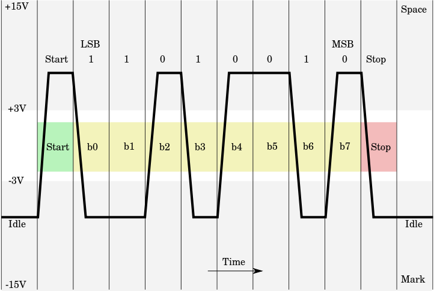
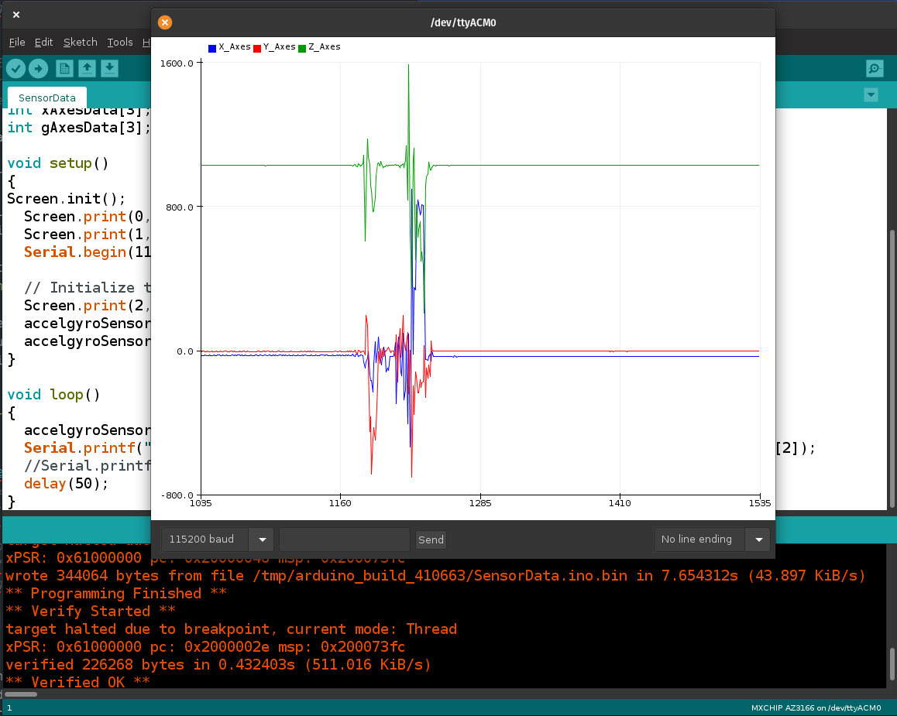

<!--

author:   Sebastian Zug & André Dietrich & Galina Rudolf
email:    sebastian.zug@informatik.tu-freiberg.de & andre.dietrich@ovgu.de & Galina.Rudolf@informatik.tu-freiberg.de
version:  1.0.2
language: de
narrator: Deutsch Female

comment: Einführung in die Programmierung für Nicht-Informatiker
logo: ./img/LogoCodeExample.png

import: https://github.com/liascript/CodeRunner
        https://github.com/LiaTemplates/AVR8js/main/README.md#10
        https://raw.githubusercontent.com/liascript-templates/plantUML/master/README.md

-->

# Serielle Schnittstelle

Die interaktive Version des Kurses ist unter diesem [Link](https://liascript.github.io/course/?https://raw.githubusercontent.com/SebastianZug/VL_ProzeduraleProgrammierung/master/12_SerielleSchnittstelle.md#1) zu finden.

**Wie weit waren wir gekommen?**

```cpp       uart.cpp

int thisByte = 33;

void setup() {
  Serial.begin(9600); // opens serial port, sets data rate to 9600 bps
  Serial.println("Hello World");
}

void loop() {
}
```
@AVR8js.sketch

**Inhalt der heutigen Veranstaltung**

* Verständnis für die Funktionsweise der seriellen Kommunikation auf dem Mikrocontroller
* Wiederholung und Vertiefung der Nutzung von `char` Arrays
* Diskussion der Klasse `string`

**Fragen an die heutige Veranstaltung ...**

* Worin liegen die Unterschiede zwischen der Behandlung von Zeichenketten mit `char`-Arrays und spezifischen `String`-Klassen?
* Warum ist die Konfiguration der Baud-Rate beim Seriellen Datenaustausch mit dem Mikrocontroller so wichtig?
* Wie kann die Formatierung von Zeichenketten effektiv umgesetzt werden?
* Wie können wir die Daten im Nachgang weiter verarbeiten?

## Grundlagen

Die serielle Schnittstelle ist eine umgangssprachliche Bezeichnung für eine Übertragungsmechanismus zur Datenübertragung zwischen zwei Geräten, bei denen einzelne Bits zeitlich nacheinander ausgetauscht werden. Die Bezeichnung bezieht sich in der umgangsprachlichen Verwendung:

+ das Wirkprinzip generell, das dann verschiedenste Kommunikationsprotokoll meinen kann (CAN, I2C, usw.) oder
+ die als EIA-RS-232 bezeichnete Schnittstellendefinition.

Für Mikrocontroller werden die zugehörigen Bauteile als _Universal Asynchronous Receiver Transmitter_ (UART) bezeichnet.

Auf der PC Seite sind RS-232 oder RS-485 jedoch durch die universellere USB-Schnittstelle ersetzt worden. Die USB-Schnittstelle arbeitet zwar ebenfalls seriell, ist aber umgangssprachlich meist nicht gemeint, wenn man von "der seriellen Schnittstelle" redet. Zwischen USB und RS-232 existieren entsprechende Adapter.

Serielle Schnittstellen unterscheiden durch:

+ den verwendeten Steckverbinder
+ die elektrischen Übertragungsparameter,
+ die Methoden zur Übertragungssteuerung und Datenflusskontrolle sowi
+ die Synchronisationstechnik.

<!--
style=" width: 80%;
        max-width: 600px;
        min-width: 400px;
        display: block;
        margin-left: auto;
        margin-right: auto;"
--> [^1]

[^1]: [Wikimedia RS232](http://www.chip.de/webapps/ASCII-Tabelle_50073950.html) Autor Ktnbn, Diagram of RS232 signalling as seen when probed by an Oscilloscope for an uppercase ASCII "K" character (0x4b) with 1 start bit, 8 data bits, 1 stop bit

Die Datenrate wird in _Bit pro Sekunde_ (bps) bzw. Baud (nach dem französischen Ingenieur und Erfinder [Jean Maurice Émile Baudot](https://de.wikipedia.org/wiki/%C3%89mile_Baudot)) angegeben. Dabei werden alle Bits (auch Start- und Stoppbit) gezählt und Lücken zwischen den Bytetransfers ignoriert. Dabei sind die folgenden Datenraten üblich:

150, 300, 1200, 2400, 4800, 9600, 19200, 38400, 57600 und 115200 Baud

> **Merke:** Die Kommunikation über das RS232 Protokoll verfügt über keine Synchronisation zwischen Sender und Empfänger. Vielmehr muss die Datenrate manuell eingestellt und stabil gehalten werden.

<!--
style=" width: 80%;
        max-width: 600px;
        min-width: 400px;
        display: block;
        margin-left: auto;
        margin-right: auto;"
-->
Quelle: [ASCII-Tabelle](http://www.chip.de/webapps/ASCII-Tabelle_50073950.html)

```cpp       avrlibc.cpp

int thisByte = 33;

void setup() {
  Serial.begin(9600); // opens serial port, sets data rate to 9600 bps
  Serial.println("ASCII Table ~ Character Map");
}

void loop() {
  Serial.write(thisByte);
  Serial.print(", dec: ");
  Serial.print(thisByte);

  Serial.print(", bin: ");
  Serial.println(thisByte, BIN);

  // if printed last visible character '~' or 126, stop:
  if (thisByte == 126) {  
    while (true) {
      continue;
    }
  }
  thisByte++;
}
```
@AVR8js.sketch

## Serielle Schnittstelle in der Arduino API

Die Serielle Kommunikation kann sowohl mittels "echter" Hardwareimplementierungen vorgenommen werden als auch in Software emuliert werden. In diesem Fall spricht man von "SoftSerial"-Verbindungen.

Unser MXChip hat insgesamt 2 Serielle Schnittellen in Hardware implementiert. Ein davon nutzen wir für die Kommunikation mit dem Controller, die andere steht zur freien Verfügung.

Die Klasse `HardwareSerial.h` umfasst für einfache Controller folgende Member:

```c++  HardwareSerial.h
#define SERIAL_5N1 0x00
#define SERIAL_6N1 0x02
#define SERIAL_7N1 0x04
#define SERIAL_8N1 0x06
#define SERIAL_5N2 0x08
#define SERIAL_6N2 0x0A
#define SERIAL_7N2 0x0C

class HardwareSerial : public Stream
{
  protected:
    ...
    unsigned char _rx_buffer[SERIAL_RX_BUFFER_SIZE];
    unsigned char _tx_buffer[SERIAL_TX_BUFFER_SIZE];

  public:
    inline HardwareSerial(...);
    void begin(unsigned long baud) { begin(baud, SERIAL_8N1); }
    void begin(unsigned long, uint8_t);
    void end();
    virtual int available(void);
    ...
    virtual void flush(void);
    operator bool() { return true; }
}

#if defined(UBRRH) || defined(UBRR0H)
  extern HardwareSerial Serial;
  #define HAVE_HWSERIAL0
#endif
```

Damit ergeben sich die API der Schnittstelle:

https://www.arduino.cc/reference/en/language/functions/communication/serial/

| Memberfunktionen    | Bedeutung                                                                                                                          |
| ------------------- | ---------------------------------------------------------------------------------------------------------------------------------- |
| `if(Serial)`        | Wurde die Schnittstelle ordnungsgemäß initialisiert?                                                                               |
| `available()`       | Rückgabe der Zahl der verfügbaren Bytes im Lesespeicher                                                                            |
| `begin()`           | Definition der Baudrate und des Datenformates.                                                                                     |
| `end()`             | Schließen der Schnittstelle                                                                                                        |
| `flush()`           |                                                                                                                                    |
| `parseFloat()`      | Erfassen eines Gleitkommazahlenwertes (4.23423) aus den Daten der Schnittstelle                                                    |
| `parseInt()`        |                                                                                                                                    |
| `print()`           |                                                                                                                                    |
| `println()`         |                                                                                                                                    |
| `read()`            |      Lesen eines einzelnen Zeichens                                                                                                                              |
| `readBytes()`       |                                                                                                                                    |
| `readBytesUntil()`  |                                                                                                                                    |
| `readString()`      |                                                                                                                                    |
| `readStringUntil()` | Lesen einer Folge von `char` bis zu einem Terminatorzeichen, dass als Parameter übergeben wird `\n` - neue Zeile, `\t` - Tabulator |
| `write()`           | Schreiben eines einzelnen Zeichens                                                                                                 |


Für die Nutzung der seriellen Kommunikation ist die Arbeit mit Strings oder char-Arrays unumgänglich. An dieser Stelle wollen wir diese nochmals wiederholen.

> **Merke:** Das `std::cout` Konzept wurde für die Arduino-Bibliotheken nicht implementiert.

**Zeichenkette - Variante 1 - char Arrays**

```cpp       avrlibc.cpp

void setup() {
  Serial.begin(9600); // opens serial port, sets data rate to 9600 bps
  char a[] = "Ich bin ein char Array!";  // Der Compiler fügt das \0 automatisch ein!
  if (a[23] == '\0'){
    Serial.println("char Array Abschluss in a gefunden!");
  }

  Serial.println(a);
  const char b[] = { 'H', 'a', 'l', 'l', 'o', ' ',
                     'F', 'r', 'e', 'i', 'b', 'e', 'r', 'g', '\0' };
  Serial.println(b);
  const char c[] = "Noch eine \0Moeglichkeit";
  Serial.println(c);
  char d[] = { 80, 114, 111, 122, 80, 114, 111, 103, 32, 50, 48,  50, 48,  0  };
  Serial.println(d);

  // Kopierfunktionen
  char e[] = "012345678901234567890123456789";
  strcpy(e, "Das ist ein neuer Text");
  Serial.println(e);
}

void loop() {
}
```
@AVR8js.sketch

Eine gute Übersicht zur Arbeit mit C-Strings im Kontext des Arduino ist unter [Link](https://www.tutorialspoint.com/arduino/arduino_strings.htm) zu finden.

**Zeichenkette - Variante 2 - string Klasse**

Die Dokumentation der abgespeckten Version der C++ String Klasse für Arduino findet sich unter [Link](https://arduinogetstarted.com/de/reference/arduino-string-object).

```cpp       string.cpp

void setup() {
  Serial.begin(9600); // opens serial port, sets data rate to 9600 bps

  String wochentag = "Dienstag";
  int tag = 26;
  int monat = 1;
  int jahr = 2021;
  String zeile = "Heute ist " + wochentag + " der " + String(tag,DEC) + "." + String(monat,DEC) + "." + String(jahr,DEC) + "\n";
  Serial.println(zeile);
}

void loop() {
}
```
@AVR8js.sketch

> **Merke:** Die Möglichkeit dynamisch Speicher für die Darstellung der Zeichenketten anzufordern ist auf kleinen Controllern sehr aufwändig zu realisieren! In der Regel ist insbesondere bei den 8Bit Controllern davon abzuraten!

**printf mit dem Arduino**

Mit der Funktion `sprintf` kann man eine Zeichenkette in einem char-Array formatiert ablegen. Zuvor muss man jedoch ein entsprechendes Array mit der maximalen Anzahl von Zeichen reservieren. Darauf lassen sich dann die Formatierungsvorgaben, die wir im C-Kontext kennengelernt haben anwenden.

> **Achtung:** Die Funktionalität durch unseren Simulator ist etwas beschränkt und nur einzelne Platzhalter wie %d werden unterstützt. Evaluieren Sie Ihren Code lieber in einer realen Entwicklungsumgebung.

```cpp       avrlibc.cpp
void setup() {
  Serial.begin(9600); // opens serial port, sets data rate to 9600 bps

  char buffer[30];
  //formatieren des Textes und ablegen in dem Array
  sprintf(buffer, "Der Wert der Variable ist %d", 5);
  Serial.println(buffer);
}

void loop() {
}
```
@AVR8js.sketch

Der Funktion `snprintf` wird zusätzlich die Länge des Ziel Arrays übergeben, dieses sorgt für mehr Sicherheit beim Schreiben der Daten.


### Schreiben mit der Seriellen Schnittstelle

Für das Schreiben auf der Seriellen Schnittstelle stehen drei Funktionen bereit `println`, `print` und `write`. Diese können mit zusätzlichen Parametern versehen werden, um eine eingeschränkte Formatierung vorzunehmen.

```cpp       UARTWrite.cpp
void setup() {
  Serial.begin(9600);
  Serial.println("Los geht's!");
  Serial.println(5);
  Serial.println(5, BIN);
  Serial.println(5.34543, 2);
  Serial.println("Fertig!");
}

void loop() {
}
```
@AVR8js.sketch

### Lesen von der Seriellen Schnittstelle

Die Umkehr der Kommunikationsrichtung ermöglicht es, Daten an den Mikrocontroller zu senden und damit bestimmte Einstellungen vorzunehmen.

<div>
  <wokwi-led color="red" pin="13" port="B" label="13"></wokwi-led>
  <span id="simulation-time"></span>
</div>
```cpp       ControlLED.cpp
int incomingByte = 0; // for incoming serial data

void setup() {
  Serial.begin(9600);
  pinMode(13, OUTPUT);   // LED Pin als Output
}

void loop() {
  // any data received?
  if (Serial.available() > 0) {
    // read the incoming byte:
    incomingByte = Serial.read();

    // say what you got:
    Serial.print("I received: ");
    Serial.println(incomingByte, DEC);
  }
}
```
@AVR8js.sketch

> **Aufgabe:** Schalten Sie die LED die mit Pin 13 Verbunden ist mit einem `A` an und mit einem `B` aus. Dabei soll die LED mindestens 3s angeschaltet bleiben.

> **Aufgabe:** Erweitern Sie das Programm, so dass mit 'AN' und 'AUS' die Aktivierung umgesetzt werden kann. Gehen Sie davon aus, dass der Nutzer auch kleine Buchstaben verwenden kann. (Hilfen [String Klasse](https://www.arduino.cc/reference/de/language/variables/data-types/stringobject/), [Arduino Reference](https://arduinogetstarted.com/de/reference/serial-readstringuntil))

## Anwendung der Seriellen Schnittstelle

Mögliche Anwendungen des UART:

+ Debug-Schnittstelle
+ Mensch-Maschine Schnittstelle - Konfiguration eines Parameters, Statusabfragen
+ Übertragen von gespeicherten Werten für ein Langzeit-Logging von Daten
+ Anschluss von Geräten - Sensoren, GNSS-Empfängern, Funkmodems
+ Implementierung von "Feldbusse" auf RS485/RS422-Basis

Einige AVR-Controller haben ein bis zwei vollduplexfähige UART (Universal Asynchronous Receiver and Transmitter) schon eingebaut ("Hardware-UART"). Vollduplex bedeutet, dass der Baustein gleichzeitig senden und empfangen kann.

### Seriellen Daten in der Arduino IDE

Der in der Arduino IDE eingebettete Serial Monitor ist eine Möglichkeit die über die Serielle Schnittstelle empfangenen Daten auszulesen. Mit der richtigen Konfiguration von

+ USB Port (in der Entwicklungsumgebung selbst) und
+ Baudrate (im unteren Teil des Monitors)

werden die Texte sichtbar. Sie können die Informationen speichern, indem Sie diese Markieren und in eine Datei kopieren. Sofern Sie auf eine gleiche Zahl von Einträgen pro Zeile achten, können die Daten dann als [csv](https://de.wikipedia.org/wiki/CSV_(Dateiformat)) (_Comma-separated values_) Datei zum Beispiel mit Tabellenkalkulationsprogrammen geöffnet werden.

<!--
style=" width: 80%;
        max-width: 600px;
        min-width: 400px;
        display: block;
        margin-left: auto;
        margin-right: auto;"
-->

> **Merke:** Die Einblendung des Zeitstempels garantiert die Zuordenbarkeit der kommunizierten Daten. Der Zeitstempel wird dabei vom Entwicklungsrechner generiert.

Die Eingabe von Daten, die an den erfolgt in der Zeile unter dem Ausgabefeld. Erst mit dem Betätigen von Enter, werden die Daten tatsächlich übertragen.

Der Plotter ermöglicht die unmittelbare grafische Darstellung der Daten, die über die serielle Schnittstelle ausgetauscht werden.

Ein Datensatz besteht aus einer einzelnen Zeile, die durch einen Zeilenumbruch (`\n` oder `Serial.println`) begrenzt wird.

Neben dem einfachen plotten von Zahlen können diese auch beschriftet werden. Beschriftungen können entweder einmalig im Setup gesetzt werden ODER sie können mit jeder Zeile übergeben werden.

```
Sensor1:30, Sensor2:45\n.
```

<!--
style=" width: 80%;
        max-width: 600px;
        min-width: 400px;
        display: block;
        margin-left: auto;
        margin-right: auto;"
-->

Anmerkungen:

1. Unser Board generiert automatisch eine Ausgabe zur Version, Hersteller usw., die den Plotter "irritiert". Entsprechend zeigte sich die Darstellung der Legende in der zeilenbasierten Darstellung als stabiler.
2. Wenn Sie die zeilenbasierten Beschriftungen verwenden, fügen Sie kein Leerzeichen nach dem ":" ein!

> **Merke:** Die Serielle Schnittstelle kann aus allen Programmiersprachen heraus genutzt werden. Sie können also in C, C++, Python usw. eigene Programme für das Auslesen und die Interpretation der Daten schreiben.

### Debugging

Die Serielle Ausgabe ist für die Verwendung bei eingebetteten Systemen für die Untersuchung von Programmcodes von großer Bedeutung. Insbesondere beim Fehlen eines echten Debug-Interfaces, dass eine Untersuchung von Speicherinhalten vom Entwicklungsrechner erlaubt, werden Zustände (Variablen oder das Erreichen einer bestimmten Position im Code) über Serielle Nachrichten kommuniziert.

In der Regel möchte man diesen Datenaustausch aber deaktivieren, wenn eine Software ausgeliefert wird. Gegen manuelle Löschen der möglicherweise sehr großen Zahl von Debug-Ausgaben spricht, dass  

+ diese möglicherweise noch mal verwendet werden müssen und
+ der Prozess arbeitsaufwändig manuell gelöst werden muss.

Den ersten Punkt kann das Auskommentieren lösen, den zweiten nicht. Entsprechend wünschen wir uns, dass mit dem Umlegen eines Schalters alle Entwicklerausgaben verschwinden und nur noch die Nutzerrelevanten Nachrichten versand werden.

Diese Aufgabe übernimmt der Präprozessor für uns.

```cpp       DebuggingI.cpp
#define DEBUG_MODE //Comment out in order to turn off debug mode.

void doDebugThing() {
	#ifdef DEBUG_MODE
	Serial.println("DEBUG MODE! - Diese Zeile wird nur im Debug Mode angezeigt!");
	#endif //DEBUG_MODE
}

void setup() {
  Serial.begin(9600);
  Serial.println("Das ist eine normale Ausgabe, die in jedem Fall angezeigt wird");
  //Serial.println("Auskommentieren einer Ausgabefunktion");
  doDebugThing();
}

void loop() {
}
```
@AVR8js.sketch

In realistischen Projekten ergibt sich eine Flut von Debug-Nachrichten mit unterschiedlicher Kritikalität. Dafür kann man Klassen von Nachrichten einführen und diese entsprechend filtern.

```cpp       DebuggingII.cpp
#ifndef DEBUGMESSAGES_H
#define DEBUGMESSAGES_H

  #ifdef _DEBUG
		#define DEBUG_PRINT(val) Serial.print("DEBUG: " + String(val))
		#define DEBUG_PRINTLN(val) Serial.println("DEBUG: " + String(val))
	#else
		// Empty macros bodies if debugging is not needed
		#define DEBUG_PRINT(val)
		#define DEBUG_PRINTLN(val)
	#endif
  #ifdef _INFO
		#define INFO_PRINT(val) Serial.print("DEBUG: " + String(val))
		#define INFO_PRINTLN(val) Serial.println("DEBUG: " + String(val))
	#else
		// Empty macros bodies if debugging is not needed
		#define INFO_PRINT(val)
		#define INFO_PRINTLN(val)
	#endif
#endif

void setup() {
  Serial.begin(9600);
  DEBUG_PRINTLN("This is an error message");
  INFO_PRINTLN("The state of pin 5 is ");
  Serial.println("This is standard program output");
}

void loop() {
}
```
@AVR8js.sketch


### Mensch-Maschine Interaktion

Sie Programmieren eine neue Fitness-Armbanduhr und wollen die Nutzerdaten für die Bestimmung der Performance-Evaluation erfassen. Der Nutzer gibt diese am Rechner ein und sendet sie an den Controller. Dabei soll das Geschlecht, der Geburtsmonat und das Geburtsjahr sowie der Name (für das Anfeuern) eingegeben werden. Als Format haben Sie sich überlegt:

```
{'M', 'W', 'D'} + " " + {0..9}{0..9} + "." + "{0..9}{0..9}{0..9}{0..9} + " " + {A..Z, a..z}
```

Sie gehen davon aus, dass einige Nutzer Schwierigkeiten haben dieses Eingabemuster umzusetzen. Wie prüfen Sie die Gültigkeit der Eingaben

| Test                                               |
| -------------------------------------------------- |
| Befinden sich mindestens zwei Leerzeichen im Text? |
| Ist das erste Zeichen ein `M`, `W` oder `D`?        |
| Ist das sechste Zeichen ein "."?                   |
| Sind alle Zeichen nach dem Jahr Buchstaben?        |

```cpp       ControlLED.cpp
void setup() {
  Serial.begin(9600);
  pinMode(13, OUTPUT);   // LED Pin als Output

  Serial.println("Bitte geben Sie Ihr Geschlecht (M/W) den Geburtsmonat und Jahr (MM.JJJJ) und Ihren Namen getrennt durch Leerzeichen ein!");
  while (Serial.available() == 0);
  String rawString = Serial.readStringUntil('\n');
  Serial.print("Ich habe folgende Eingabe verstanden: \n   ");
  Serial.println(rawString);

  // Löschen der überragenden Leerzeichen
  rawString.trim();
  // Löschen doppelter Leerzeichen im Text
  // todo

  // ist das 2. Feld ein Leerzeichen?
  if (isWhitespace(rawString[1])) Serial.println("Gültiges Format!");
  else Serial.println("Ungültiges Format!");

  // ist das 4. Feld ein Punkt?
  if (rawString[4] == '.') Serial.println("Gültiges Format!");
  else Serial.println("Ungültiges Format!");

  if ((rawString[0] == 'M') || (rawString[0] == 'M') || (rawString[0] == 'M')) Serial.println("Gültige Geschlechtsangabe!");
  else Serial.println("Ungültige Geschlechtsangabe!");

  // sind all Monatszeichen Zahlenwerte?
  String month = rawString.substring(2,4);
  if (isDigit(month[0]) && isDigit(month[1])) Serial.println("Gültiger Monat!");
  else Serial.println("Gültiger Monat!");
}

void loop() {
}
```
@AVR8js.sketch

Wie können wir hier etwas strukturieren, so dass eine bessere Wiederverwendbarkeit gegeben ist? Welche Funktionen sind für die Überprüfung denn erforderlich?

Lassen Sie uns eine Parser-Klasse entwerfen, die alle notwendigen Funktionen umfasst, die wir für die Analyse eines Textes brauchen.

|     | Name                                                  | Bedeutung                                                            |
| --- | ----------------------------------------------------- | -------------------------------------------------------------------- |
| 1.  | testSingleSignOnWhiteSpace(index)                     | Existiert ein Leerzeichen an der vorgegebenen Stelle?                |
| 2.  | testSingleSignOnNumber(index)                         | Existiert ein Zahlenwert ...                                         |
| 3.  | testSingleSignOnAlpha(index)                          | Existiert ein Buchstabe ...                                          |
| 4.  | compareSingleSign(index, sign)                        | Ist das Zeichen an der Stelle `index` gleich `sign`?                 |
| 5.  | compareSingleSignWithArray(index, signs, sizeofsigns) | Gehört das Zeichen an der Stelle von `index` zum Array von  `signs`? |
| 6.  | testSubstringOnNumber(start, end)                     | Beinhaltet der Substring von `start` bis `end` nur Zahlen?           |
| 7.  | testSubstringOnAlpha(start, end)                      | einhaltet der Substring von `start` bis `end` nur Buchstaben?        |
| 8.    |  ...                                                      |                                                                      |

Lassen Sie uns zwei Klassen entwerfen, die eine `Parser` umfasst generisch die zuvor genannten Methoden, die andere `FitnessParser` ist spezifisch auf unsere Fragestellung zugeschnitten. Damit kapseln wir die Daten und Methoden in einer wiederverwendbaren Klasse und erhöhen die Lesbarkeit des Codes.

Im Beispiel sind nur die Tests 1,2 und 5 implementiert. Ergänzen Sie die Implementierung um weitere Methoden zu Übungszwecken. Welche "verworrenen" Eingaben sind von den Tests nicht abgedeckt?

```cpp       ClassParser.cpp
class Parser{
  protected:
    String rawString;
    bool evaluationResults[99];
    int evaluationCount;
  public:
    Parser(String string, int evaluations): rawString{string}, evaluationCount{evaluations} {
      for (int i = 0; i < evaluationCount; i++) evaluationResults[i] = false;
      Serial.print("Ich habe folgende Eingabe verstanden: \n   ");
      Serial.println(rawString);
    };

    // Test 1
    bool testSingleSignOnWhiteSpace(int index){
      return isWhitespace(this->rawString[index]);
    }

    // Test 2
    bool compareSingleSign(int index, char sign){
      return (this->rawString[index] == sign);
    }  

    // Test 5
    bool compareSingleSignWithArray(int index, char signs[], int size){
      bool result = false;
      for (int i = 0; i < size; i++)
        if (compareSingleSign(0, signs[i])) result=true;
      return result;
    }

    virtual void evaluate() = 0;
    virtual void printResults() = 0;
};

class FitnessParser: public Parser {
  public:
    FitnessParser(String string, int evaluations): Parser(string, evaluations) {};

    void evaluate() {
      evaluationResults[0] = testSingleSignOnWhiteSpace(1);

      char gender []= {'M', 'W', 'D'};
      int size = (int)( sizeof(gender) / sizeof(gender[0]));
      evaluationResults[1] = compareSingleSignWithArray(0, gender, size);
    }

    void printResults(){
      for (int i = 0; i < evaluationCount; i++) {
        Serial.print("Test ");
        Serial.print(i);
        if (evaluationResults[i]) Serial.println(" bestanden!");
        else Serial.println(" nicht bestanden!");
      }
    }
};

void setup() {
  Serial.begin(9600);

  Serial.println("Bitte geben Sie Ihr Geschlecht (M/W) den Geburtsmonat und Jahr (MM.JJJJ) und Ihren Namen getrennt durch Leerzeichen ein!");
  while (Serial.available() == 0);
  String rawString = Serial.readStringUntil('\n');

  FitnessParser myParser(rawString, 2);
  myParser.evaluate();
  myParser.printResults();
  Serial.println("Evaluation abgeschlossen!");
}

void loop() {
}
```
@AVR8js.sketch
