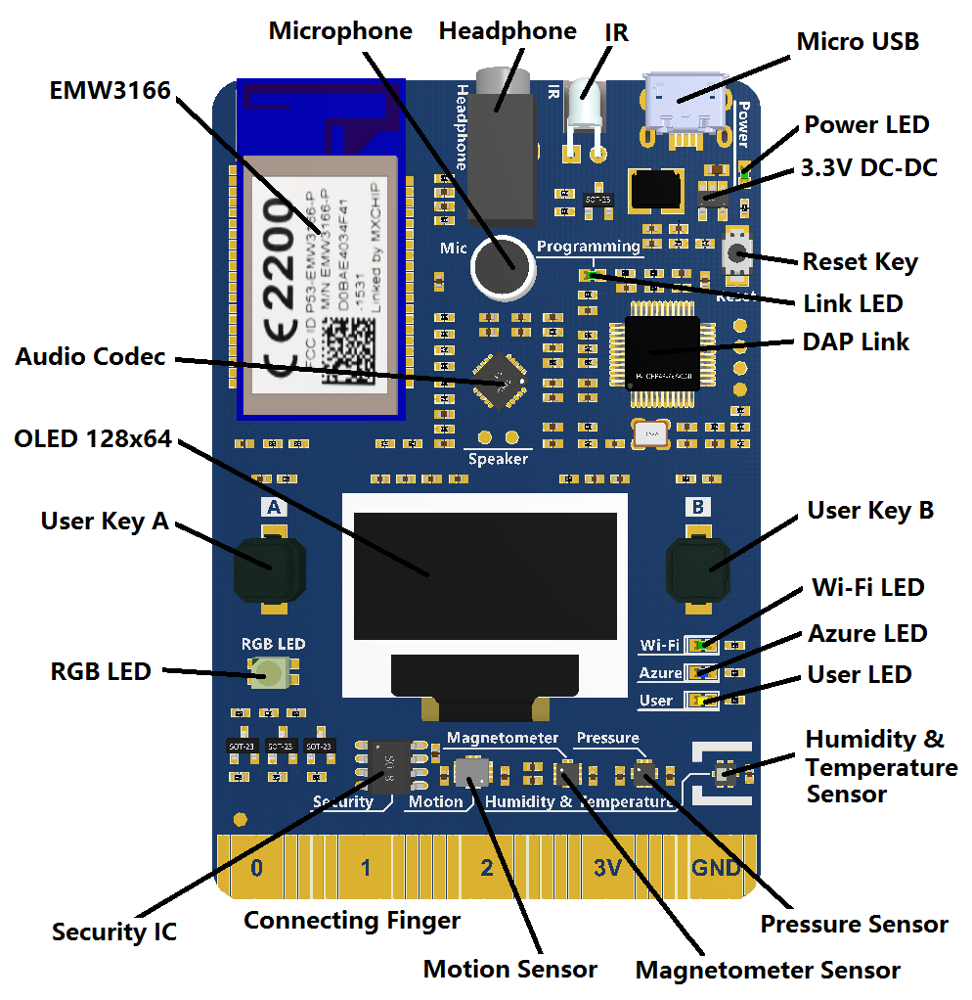

<!--

author:   Sebastian Zug & André Dietrich & Galina Rudolf
email:    sebastian.zug@informatik.tu-freiberg.de & andre.dietrich@ovgu.de & Galina.Rudolf@informatik.tu-freiberg.de
version:  1.0.2
language: de
narrator: Deutsch Female

comment: Einführung in die Programmierung für Nicht-Informatiker
logo: ./img/LogoCodeExample.png

import: https://github.com/liascript/CodeRunner
        https://github.com/LiaTemplates/AVR8js/main/README.md#10
        https://raw.githubusercontent.com/liascript-templates/plantUML/master/README.md

-->

# Zeitverhalten und Interrupts

Die interaktive Version des Kurses ist unter diesem [Link](https://liascript.github.io/course/?https://raw.githubusercontent.com/SebastianZug/VL_ProzeduraleProgrammierung/master/13_Arduino_Interrupts.md#1) zu finden.

**Wie weit waren wir gekommen?**

Schauen wir noch mal auf die Unterschiede unserer beiden Ausführungsumgebungen im Vergleich an:

1. Simulation in den Vorlesungsmaterialen

```cpp       uart.cpp
int thisByte = 33;

void setup() {
  Serial.begin(9600);
  Serial.println("Hello World");
}

void loop() {
}
```
@AVR8js.sketch

2. Realer Controller in den praktischen Anwendungen der Vorlesung / Übungen

<!-- style="width: 55%; max-width: 1000px" -->[^3]

[^3]: Produktwebseite Firma MXChip, AZ3166 Procuct Details [Link](https://en.mxchip.com/az3166)

|                | Simulator                                                        | MXChip Board                                     |
| -------------- | ---------------------------------------------------------------- | ------------------------------------------------ |
| Chip           | Arduino Uno als Basis                                            | MXChip mit 32Bit Controller                      |
| Programmierung | Subset der Arduino Funktionalität                                | Subset der Arduino Befehle und eigene Bibliothek (LED, Display, usw.) |
| Beschränkungen | Analog/Digital Wandler, Externe Interrupts noch nicht integriert |                                                  |


**Inhalt der heutigen Veranstaltung**

* Erfassung von Zeitabläufen im Mikrocontroller
* Konzept und Verwendung von Interrupts
* Praktische Realisierung von Interrupt Service Routinen auf der Basis der Arduino-Bibliothek
* "Stolpersteine" der Nutzung von Interrupts

**Fragen an die heutige Veranstaltung ...**

* Wie beeinflusst das Auftreten eines Interrupts das Hauptprogramm?
* Was bedeutet das Schlüsselwort `volatile` und warum ist es im Zusammenhang mit der Nutzung von Interrupts bedeutsam?
* Welche Annahmen lassen sich über die Laufzeiten in einem rein sequentiellen Programm und einem, dass Interrupts nutzt treffen?

## Steuerung des Zeitverhaltens

Wie können wir die zeitliche Abarbeitung eines Programmes festlegen?

Die `delay()` Methode unterbricht das Programm für die als Parameter angegebene Zeit (in Millisekunden). Dazwischen wird die weitere Ausführung blockiert!

<div>
  <wokwi-led color="red"   pin="13" port="B" label="13"></wokwi-led>
</div>

```cpp       HelloWorld.cpp
const int led_pin = 13;


void setup() {
  Serial.begin(9600);
  pinMode(led_pin, OUTPUT);
}

void loop() {
   digitalWrite(led_pin, HIGH);
   delay(1000);
   digitalWrite(led_pin, LOW);  
   delay(1000);
}
```
@AVR8js.sketch

Einen flexibleren Weg eröffnet die `millis()` Methode. Sie gibt die Anzahl von Millisekunden zurück, seit das Arduino-Board das aktuelle Programm gestartet hat. Diese Zahl läuft nach etwa 50 Tagen über (geht auf Null zurück).

```cpp       millis.cpp
void setup() {
  Serial.begin(9600);
}

void loop() {
   Serial.println(millis());
   delay(1000);
}
```
@AVR8js.sketch

Damit lassen sich zeitlich gesteuerte Abläufe sehr feingranular aktivieren.

<div>
  <wokwi-led color="green"   pin="10" port="B" label="10"></wokwi-led>
  <wokwi-led color="yellow"  pin="11" port="B" label="11"></wokwi-led>
  <wokwi-led color="red"     pin="12" port="B" label="12"></wokwi-led>
  <span id="simulation-time"></span>
</div>

```cpp       ButtonLogic.cpp
void setup() {
  pinMode(10, OUTPUT);
  pinMode(11, OUTPUT);
  pinMode(12, OUTPUT);
  Serial.begin(9600);
}

void loop() {
  if (millis() > 2000) digitalWrite(10, HIGH);
  if (millis() > 5000) digitalWrite(11, HIGH);
  if (millis() > 10000) digitalWrite(12, HIGH);
  //Serial.println(millis());
  delay(100);   // <- Die Delay funktion reduziert den Berechnungsaufwand
                // in der Simulation und wird im realen Programm auf dem
                // Controller entfernt.
}
```
@AVR8js.sketch

Wir vergleichen den aktuellen `millis()` Rückgabewert mit einer statischen Größe.
Natürlich können wir diesen Vergleichswert auch dynamisch anpassen und damit
Zeitablauf für MEHRERE Vorgänge variable steuern. Wir bestimmen dabei jeweils den
Ablaufhorizont für unsere

<div>
  <wokwi-pushbutton color="yellow"   pin="2"  port="D"></wokwi-pushbutton>
  <wokwi-led color="yellow"   pin="8" port="B" label="8"></wokwi-led>
  <wokwi-pushbutton color="green"   pin="3"  port="D"></wokwi-pushbutton>
  <wokwi-led color="green"   pin="9" port="B" label="9"></wokwi-led>
   <span id="simulation-time"></span>
</div>

```cpp       ButtonLogic.cpp
// die Buttons sind mit Pin 2 (Gelb) und Pin 3 (Grün) verknüpft
int button_Y = 0;
int button_G = 0;
unsigned long start_Y;
unsigned long start_G;
const int period = 2000;

void setup() {
  pinMode(2, INPUT);
  pinMode(3, INPUT);
  pinMode(8, OUTPUT);
  pinMode(9, OUTPUT);
}

void loop() {
  button_Y = digitalRead(2);
  button_G = digitalRead(3);
  if (button_Y) {
     start_Y = millis();
  }
  if (button_G) {
     start_G = millis();
  }
  if (millis() > start_Y + period) digitalWrite(8, LOW);
  else digitalWrite(8, HIGH);
  if (millis() > start_G + period) digitalWrite(9, LOW);
  else digitalWrite(9, HIGH);
  delay(50);
}
```
@AVR8js.sketch

Eine gute Darstellung zur Verwendung der `milli()` Funktion findet sich in dem Video der _Programming Electronics Academy_

<iframe width="560" height="315" src="https://www.youtube.com/embed/BYKQ9rk0FEQ" frameborder="0" allow="accelerometer; autoplay; clipboard-write; encrypted-media; gyroscope; picture-in-picture" allowfullscreen></iframe>

## Interrupts

Ein Interrupt beschreibt die kurzfristige Unterbrechung der normalen Programmausführung, um einen, in der Regel kurzen, aber zeitlich kritischen, Vorgang abzuarbeiten.

```text @plantUML.png
@startuml
ditaa
                         Hauptprogramm              Interrupt-Routine
                       +---------------+        
                       : ...           |              
                       +---------------+                                                             
                       : Instruktion 1 |      +-------------+                                         
                       +---------------+      |             |                        
Interrupt tritt auf -> : Instruktion 2 |      |             v                                       
                       +---------------+      |     +---------------+                             
                               |              |     : Instruktion A |                             
                               +--------------+     +---------------+                   
                                                    : Instruktion B |
                               +--------------+     +---------------+
                               |              |     : Instruktion C |
                               v              |     +---------------+
                      +---------------+       |             |
                      : Instruktion 3 |       +-------------+
                      +---------------+
                      : Instruktion 4 |
                      +---------------+
                      : ...           |
                      +---------------+
@enduml
```

Beispiele

| Trigger                     | Beispiel                                               |
| --------------------------- | ------------------------------------------------------ |
| Pin Zustandswechsel         | Drücken des Notausbuttons                              |
| Kommunikationsschnittstelle | Eintreffen eines Bytes über die serielle Schnittstelle |
| Analog Comperator           | Resultat einer Analog-Comperator Auswertung            |
| Analog-Digital-Wandler      | Abschluss einer Wandlung                               |
| Timer                       | Übereinstimmung von Vergleichswert und Zählerwert      |


{{1}}
|     | Polling (zyklisches Abfragen)                                                                        | Interrupts                                                                                        |
| --- | ---------------------------------------------------------------------------------------------------- | ------------------------------------------------------------------------------------------------- |
|     | <!-- style="width: 75%; max-width: 1000px" --> [^1] | <!-- style="width: 75%; max-width: 1000px" --> [^1] |
| Vorteile    | <ul> <li>Kein zusätzlicher Hardwareaufwand</li>
<li>Deterministisches Zeitverhalten</li>
</ul>                                                                                                 |         <ul>
<li>Effiziente Abarbeitung bezogen auf die Auftretenshäufigkeit </li>
</ul>                                                                                                    |
| Nachteile    | <ul> <li>Auslastung des Prozessors</li>
<li>Verzögerung der Reaktion durch periodisches Abarbeitungskonzept</li>
</ul>                                                                                                 |         <ul>
<li> Zusätzlicher Hardwareaufwand </li>
</ul>                                                                                                   |

[^1]: Firma Intel, Manual Intel 8259, Seite 3, [Link](https://pdos.csail.mit.edu/6.828/2011/readings/hardware/8259A.pdf)  

### Ablauf

| Schritt      | Beschreibung                                                                                                                                                                                                                                                                                                                                                                       |
| ------------ | ---------------------------------------------------------------------------------------------------------------------------------------------------------------------------------------------------------------------------------------------------------------------------------------------------------------------------------------------------------------------------------- |
|              | Normale Programmabarbeitung ...                                                                                                                                                                                                                                                                                                                                                    |
| Vorbereitung | <ul> <li>Beenden der aktuelle Instruktion </li> <li>(Deaktivieren der   Interrupts)</li><li>Sichern des Registersatzes auf dem Stack </li> </ul>                                                                                                                                                                                                                                    |
| Ausführung   | <ul> <li>Realisierung der Interrupt-Einsprung-Routine </li> <li>Sprung über die Interrupt-Einsprungtabelle zur Interrupt-Behandlungs-Routine </li><li>Ausführung der Interrupt-Behandlungs-Routine </li></ul> |
| Rücksprung             | <ul><li>Wiederherstellen des Prozessorzustandes und des Speichers vom Stack </li><li>Sprung in den Programmspeicher mit dem zurückgelesenen PC </li></ul>                                                                                                                                                                                                                                        |
|              | Fortsetzung des Hauptprogrammes ...                                                                                                                                                                                                                                                                                                                                                |


> **Merke** ISRs sollten das Hauptprogramm nur kurz unterbrechen! Ein blockierendes Warten ist nicht empfehlenswert! Zudem darf die Abarbeitungsdauer nicht länger sein als die höchste Wiederauftretensfrequenz des Ereignisses.

### Interrupts in der Arduino Welt

> **Merke: Die Interruptwelt kann durch die Abstraktion der Arduino-Bibliotheken nur teilweise abgebildet werden. Dafür unterscheiden sich die Prozessoren zu stark.**

Dies hat drei Konsequenzen:

+ die Pins, die mit den externen Interrupts verbunden sind, variieren bei den verschiedenen Boards und müssen bei der Übertragung von Codes angepasst werden.

+ von der Vielzahl der Interruptquellen sind nur die externen Interrupts durch die Standardbibliothek abgedeckt. Das macht selbst für den kleinen Arduino Uno nur 2 von 26 möglichen Interruptquellen.

+ viele individuellen Konfigurationsmöglichkeiten, die die jeweiligen Controller Architekturen bieten, können nur durch die Programmierung auf den Registern.

> **Bei Interesse sollten Sie die Vorlesung "Eingebettete Systeme" besuchen, die hier in die Tiefe geht.**

Üblich ist bei der Aktivierung der Interrupts folgendes Vorgehen:

+ Aktivieren der generellen Interruptverarbeitung
+ Konfiguration der Parameter des spezifischen Interrupttyps
+ Aktivieren des individuellen Interrupts

> **Merke:** Die Arduino-Implementierung fasst die drei Schritte in einem Befehl zusammenzusammen.

| Befehl                                                   | Bedeutung                               | Link                                                                                                |
| -------------------------------------------------------- | --------------------------------------- | --------------------------------------------------------------------------------------------------- |
| `attachInterrupt(INTERRUPT_ID, INTERRUPT_METHODE, MODE)` | "Einhängen" des Interrupts              | [Link](https://www.arduino.cc/reference/en/language/functions/external-interrupts/attachinterrupt/) |
| `detachInterrupt(INTERRUPT_ID)`                          | "Aushängen" oder stoppen des Interrupts | [Link](https://www.arduino.cc/reference/en/language/functions/external-interrupts/detachinterrupt/) |
|       `interrupts() `                                                   |  Aktivieren der Interrupts                                       |                                                                                                     |
| `noInterrupts() `                                                        | Deaktivieren der Interrupts                                        |                                                                                                     |

Dabei können 3 Parameter beim Aufruf von `attachInterrupt(INTERRUPT_ID, INTERRUPT_METHODE, MODE)` übergeben werden:

1. der Interrupt Pin

   Hier macht uns die Bandbreite der Architekturen zu schaffen.

2. die aufzurufende Interrupt-Methode (oder Interrupt Service Routine ISR):

   + darf keine Rückgabe oder Parameter enthalten
   + ist möglichst schnell wieder zu verlassen
   + darf selbst keine Interrupts zuordnen
   + sollte keine serielle Kommunikation integrieren

3. der Modus des Triggerns

| Mode-Spezifizierer | Bedeutung                                 |
| ------------------ | ----------------------------------------- |
| `LOW`              | Pin hat einen Low oder Gnd Wert (nahe 0V) |
| `CHANGE`           | beliebiger Statuswechsel                  |
| `RISING `          | Statuswechsel von `LOW` zu `HIGH`         |
| `FALLING `         | Statuswechsel von `HIGH` zu `LOW`         |


### Praktische Interruptprogrammierung

**Atomarer Datenzugriff**

> **Merke:** Das Hauptprogramm kann grundsätzlich an jeder beliebigen Stelle unterbrochen werden, sofern die Interrupts aktiv sind.

Das bedeutet, dass entsprechende Variablen und Register, die sowohl im Hauptprogramm als auch in Interrupts verwendet werden, mit Sorgfalt zu behandeln sind.

Dies ist umso bedeutsamer, als das ein C Aufruf

```
digitalWrite(2, !digitalRead(2));
```

in drei Assemblerdirektiven übersetzt wird. An welcher Stelle wäre ein Interrupt kritisch?

```asm
  IN  r16, port
  ORI r16, 0x03
  OUT port, r16
```

```c
noInterrupts();     // Interrupts abschalten
digitalWrite(2, !digitalRead(2));
interrupts();       // Interrupts wieder einschalten
```

Mit Blick auf die Wiederverwendbarkeit des Codes sollte geprüft werden, ob die globalen Interrupts überhaupt aktiviert waren! Die avr-libc hält dafür die Methode ` ATOMIC_BLOCK(ATOMIC_RESTORESTATE)` bereit.

**Volatile Variablen**

`volatile` Variablen untersagen dem Compiler Annahmen zu deren Datenfluss zu treffen. Mit

```c      volatile.c
volatile uint8_t i;

ISR( INT0_vect ){
  i++;
}

int main(){
  ...
  i = 0;
  while( 1 ) {
     Serial.println(i);
  }
}
```

### Einführungsbeispiele

**Beispiel 1**

Lassen Sie uns die LED unseres Controllers durch einen Interrupt steuern. Wir ändern die Farbe der Mehrfarben LED wenn der zum Button B gehörende Interrupt aktiviert wurde.

```c      externalInterrupts.ino
#include "RGB_LED.h"
RGB_LED rgbLed;

void alarm(){
  rgbLed.setColor(255, 0, 0);
}

void setup() {
  attachInterrupt(USER_BUTTON_B, alarm, FALLING);
  Serial.begin(9600);
}

void loop() {
  rgbLed.setColor(0, 255, 255);
  Serial.println("Ich rechne ganz fleißig vor mich hin!");
  delay(2000);
}
```

Die Lösung ist nicht besonders schön. Unsere LED leuchtet offensichtlich unterschiedliche lang rot? Wie kann das sein?

```ascii

  |   Tasten
  |   druck      
  |      |    Leuchten             Leuchten
  |      |<------------->         |<------>     
  |      |                        |
  |    t v             "t+2s"     v     "t+4s"
  |....|.................|................|.......  
  +------------------------------------------------------>
                                                        Zeit
```

Wie können wir eine Periodendauer des Leuchtens von 2s erreichen?

```c     externalInterrupts_millis.ino
#include "RGB_LED.h"
RGB_LED rgbLed;

volatile unsigned long start;
const int period = 2000;

void alarm(){
  start = millis();
}

void setup() {
  attachInterrupt(USER_BUTTON_B, alarm, FALLING);
  Serial.begin(9600);
}

void loop() {
  if (millis() < start + period) rgbLed.setColor(255, 0, 0);
  else rgbLed.setColor(0, 255, 255);
}
```

Die Zeitvorgabe erfolgt nun im Hauptprogramm anhand einer Taktung, die durch die Interruptroutine vorgegeben wird.

```ascii

  |   Tasten
  |   druck      
  |      |  2s Leuchten              2s Leuchten
  |      |<------------->         |<------------->   
  |      |                        |                  
  |    t v             "t+2s"     v     "t+4s"
  |....|.................|................|.......  
  +------------------------------------------------------>
                                                        Zeit
```

> **Frage:** Wie können Sie den zweiten Interrupt nutzen, um die Leuchtphase vorzeitig abzubrechen?

**Beispiel 2**

Wir wollen die Häufigkeit zählen, mit der ein Taster gedrückt wurde

```c  externalInterrupts_count.ino
volatile int counter = 0;
volatile bool newstate = false;

void count(){
  counter++;
  newstate = true;
}

void setup() {
  Serial.begin(9600);
  attachInterrupt(USER_BUTTON_B, count, FALLING);
}

void loop() {
  if (newstate){
    char buffer[30];
    sprintf(buffer, "Der Button wurde %3d mal gedrückt", counter);
    Serial.println(buffer);
    newstate = false;
  }

  // Hier passiert irgendwas

  delay(10);
}
```

Für das Zählen von Events bestehen in Controllern spezifische Komponenten, die sogenannten Timer/Counter. Diese lösen die Aufgabe unter Umständen ganz ohne den Einsatz von Interrupts.

**Beispiel 3**

Lassen Sie uns einen Reaktionstester implementieren, der die Dauer zwischen zwei Tastendrücken auf dem Display anzeigt. Nach dem ersten Druck auf Button A wird die Zeit bis zum drücken von Button B gemessen.

```c  externalInterrupts_game.ino
#include <OledDisplay.h>
volatile long int startTime = 0;
volatile long int endTime = 0;
volatile bool result = false;

void start(){
  startTime = millis();
  Screen.clean();
}

void finished(){
  endTime = millis();
  result = true;
}

void setup() {
  Serial.begin(9600);
  Screen.init();
  attachInterrupt(USER_BUTTON_A, start, RISING);
  attachInterrupt(USER_BUTTON_B, finished, RISING);
  Serial.println("Das Spiel beginnt");
}

void loop() {
  if (result){
    char buffer[30];
    sprintf(buffer, "Delay %d [ms]", endTime-startTime);
    Serial.println(buffer);
    result = false;
    Screen.print(buffer);
  }

  // Hier passiert irgendwas

  delay(10);
}
```
