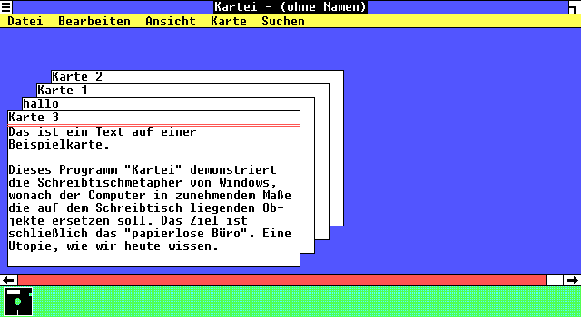
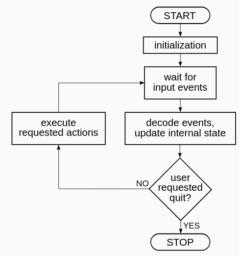
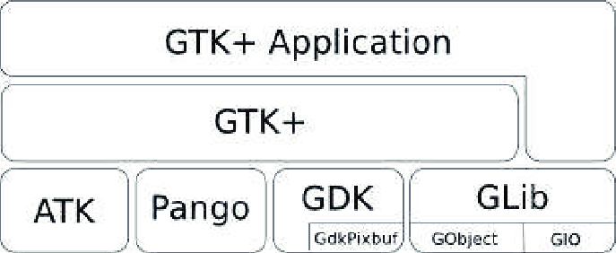
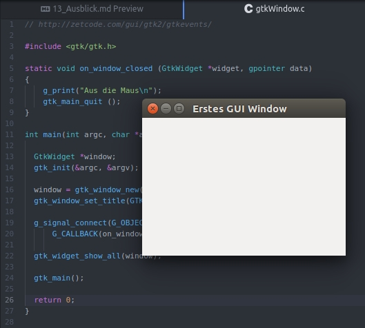
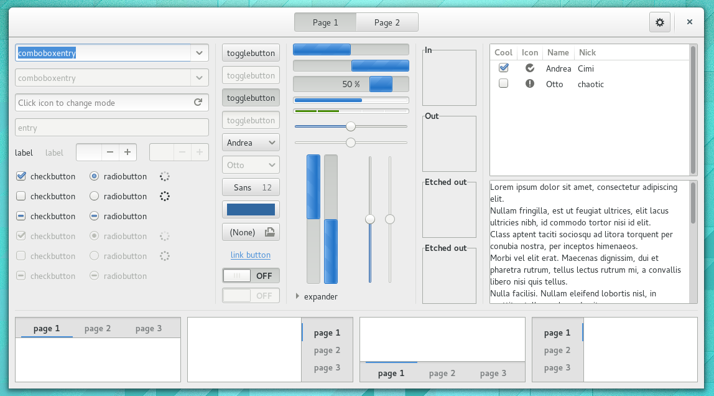
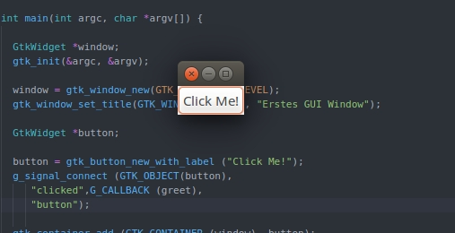
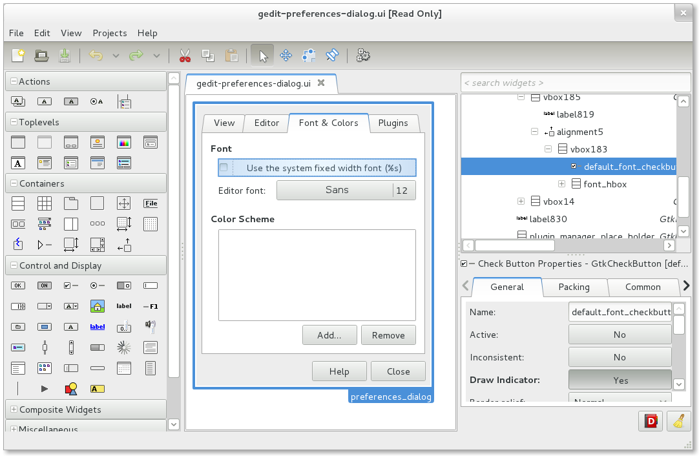

<!--

author:   Sebastian Zug & André Dietrich & Galina Rudolf
email:    sebastian.zug@informatik.tu-freiberg.de & andre.dietrich@ovgu.de & Galina.Rudolf@informatik.tu-freiberg.de
version:  1.0.4
language: de
narrator: Deutsch Female

import: https://raw.githubusercontent.com/liaScript/rextester_template/master/README.md

script:   https://cdn.plot.ly/plotly-latest.min.js

-->

# Vorlesung XIII - Ausblick und Diskussion

**Fragen an die heutige Veranstaltung ...**

* ... wie geht es weiter?

---------------------------------------------------------------------
Link auf die aktuelle Vorlesung im Versionsmanagementsystem GitHub

https://github.com/liaScript/CCourse/blob/master/13_Ausblick.md

---------------------------------------------------------------------

**Wie weit sind wir schon gekommen?**

ANSI C (C89)/ Schlüsselwörter:

| Standard    |                |          |            |          |            |
|:------------|:---------------|:---------|:-----------|:---------|:-----------|
| **C89/C90** | auto           | `double` | `int`      | `struct` | `break`    |
|             | `else`         | `long`   | `switch`   | `case`   | `enum`     |
|             | register       | typedef  | `char`     | extern   | return     |
|             | union          | const    | `float`    | `short`  | `unsigned` |
|             | `continue`     | `for`    | `signed`   | `void`   | `default`  |
|             | `goto`         | `sizeof` | volatile   | `do`     | `if`       |
|             | static         | `while`  |            |          |            |
| **C99**     | `_Bool`        | _Complex | _Imaginary | inline   | restrict   |
| **C11**     | _Alignas       | _Alignof | _Atomic    | _Generic | _Noreturn  |
|             |_Static\_assert | \_Thread\_local | |   |          |            |

---

Standardbibliotheken

| Name         | Bestandteil | Funktionen                              |
|:-------------|:------------|:----------------------------------------|
| `<stdio.h>`  |             | Input/output (`printf`)                 |
| `<stdint.h>` | (seit C99)  | Integer Datentypen mit fester Breite    |
| `<float.h>`  |             | Parameter der Floatwerte                |
| `<limits.h>` |             | Größe der Basistypen                    |
| `<fenv.h>`   |             | Verhalten bei Typumwandlungen           |
| `<string.h>` |             | Stringfunktionen                        |
| `<math.h>`   |             | Mathematische Funktionen und Konstanten |

https://en.cppreference.com/w/c/header

## 0. Eine Datei ...

... ist manchmal nicht genug. Um die Wiederverwendbarkeit des Codes zu steigern sollten generische Funktionen und spezifische Implementierungen getrennt
werden.

Die drei folgenden Dateien umfassen zum einen die Anwendungssimplementierung in
der main.c und zum anderen eine allgemeinverwendbare Funktion `Sum()` die
in verschiedenen Projekten zum Einsatz kommen kann.

```cpp    functions.h
#ifndef FUNCTIONS_H_INCLUDED
#define FUNCTIONS_H_INCLUDED
/* ^^ these are the include guards */

/* Prototypes for the functions */
int Sum(int a, int b);

#endif
```

```cpp    functions.c
#include "Functions.h"

int Sum(int a, int b){
    return a+b;
}
```

```cpp    main.c
#include <stdio.h>
#include "Functions.h"

int main(void)
{
    int a, b;
    printf("Insert two numbers: ");
    if(scanf("%d %d", &a, &b)!=2)
    {
        fputs("Invalid input", stderr);
        return 1;
    }
    printf("%d + %d = %d", a, b, Sum(a, b));
    return 0;
}
```

**Schritt 1 - Kompilieren**

```bash
gcc main.c -o main.o -c
gcc functions.c -o functions.o -c
```

**Schritt 2 - Linken**

```bash
gcc -o myprog main.o module.o
```

Üblicherweise werden sogenannte Makesysteme wie das Programm Make, qmake oder Scons für die automatisierte Ausführung von Kompilation und Linken genutzt.

## 1. Grafische Benutzerinterfaces

Worin unterscheidet sich der Programmablauf hinter einem Graphical User Interface (GUI) von den bisher besprochenen Abläufen?

<!-- width="80%" -->[^1]

[^1]: PellesC IDE Dokumentation

<!-- width="80%" -->[^2]

[^2]: Wikipedia, Autor unbekannt, https://de.wikipedia.org/wiki/Datei:Schreibtischmetapher_Windows_1.x.png

Was bedeutet die Idee der eventgesteuerten Programmabarbeitung?

<!-- width="70%" -->[^3]

[^3]: http://krashan.ppa.pl/mph/event-driven-programming-notifications


Realisiert werden GUI mit Hilfe aufwändiger GUI-Toolkits, Programmbibliotheken, die zur Programmierung der Darstellung und Interaktion in grafischen Benutzeroberflächen dienen. Dafür stellt ein GUI-Toolkit einen Satz an Steuerelementen (Widgets) zur Verfügung.

Beispiele für plattformübergreifende Toolkits sind GTK+, Qt, wxWidgets, daneben
gibt es weitere, die auf bestimmten Betriebssysteme zugeschnitten sind oder in
spezifischen Einsatzfeldern Anwendung finden.


GTK+ (GIMP-Toolkit) ist ein freies GUI-Toolkit unter der LGPL. GTK+ enthält viele Steuerelemente, mit denen sich grafische Benutzeroberflächen (GUI) für Software erstellen lassen.

Die Bibliothek wurde anfangs von Peter Mattis, Spencer Kimball und Josh MacDonald entwickelt, um abseits von Motif eine Benutzeroberfläche für das Grafikprogramm GIMP zu schaffen. Mittlerweile wird GTK+ von den Desktop-Umgebungen Gnome, Xfce, LXDE, Cinnamon und Pantheon sowie von einer Vielzahl weiterer Anwendungen verwendet und ist somit, neben Qt, eines der erfolgreichsten GUI-Toolkits für das X Window System.

<!-- width="50%" -->[^1]

[^1]: GTK Dokumentation


+ GLib - Bibliothek, die die Basis von GTK + bildet. Es bietet Datenstrukturhandling für C, Portability-Wrapper und Schnittstellen für Laufzeitfunktionen wie Ereignisschleife, Threads, dynamisches Laden und ein Objektsystem
+ Pango - Bibliothek zum Layout und Rendern von Text mit dem Schwerpunkt Internationalisierung. Es bildet den Kern der Text- und Schriftverarbeitung für GTK+.
+ Cairo - Bibliothek für 2D-Grafiken mit Unterstützung für mehrere Ausgabegeräte (einschließlich X Window System, Win32), während auf allen Medien eine konsistente Ausgabe erzeugt wird, während die verfügbare Hardwarebeschleunigung genutzt wird.
+ ATK - Bibliothek für eine Reihe von Schnittstellen, die den Zugriff ermöglichen. Durch die Unterstützung der ATK-Schnittstellen kann eine Anwendung oder ein Toolkit mit Tools wie Bildschirmlesegeräten, Lupen und alternativen Eingabegeräten verwendet werden.

### Einführungsbeispiele mit GTK+

Die Beispiele und Texte sind zum überwiegenden Teil aus den Tutorials

http://zetcode.com/gui/gtk2/gtkevents/

https://de.wikibooks.org/wiki/GTK_mit_Builder:_Erste_Schritte

entlehnt.

**Hello World - Beispiel**

```cpp    gtkWindow.c
#include <gtk/gtk.h>

static void on_window_closed (GtkWidget *widget, gpointer data)
{
    g_print("Aus die Maus\n");
    gtk_main_quit ();
}

int main(int argc, char *argv[]) {
  GtkWidget *window;
  gtk_init(&argc, &argv);

  window = gtk_window_new(GTK_WINDOW_TOPLEVEL);
  gtk_window_set_title(GTK_WINDOW(window), "Erstes GUI Window");

  g_signal_connect(G_OBJECT(window), "destroy",
      G_CALLBACK(on_window_closed), NULL);

  gtk_widget_show_all(window);

  gtk_main();

  return 0;
}
```

``` bash @output
▶ gcc gtkWindow.c -Wall `pkg-config --libs --cflags gtk+-2.0`
```

<!-- width="80%" -->

Ein GTK+-Programm wird am Anfang mit der Funktion `gtk_init()` initialisiert. Diese Funktion hat die Aufgabe, Standardargumente aus einer eventuell bereitgestellten Menge an Programmparametern zu filtern, wie auch das eigentliche Toolkit zu initialisieren. Wenn keine Kommunikation mit dem Fenstermanager möglich ist, dann sorgt diese Funktion dafür, dass das Programm sofort terminiert. Das Hauptfenster wird mit der Funktion gtk_window_new() erzeugt.

In diesem Beispiel wird zunächst nur ein Event definiert. _destroy_ beendet
die Ausführung des Programmes durch einen Klick auf das entsprechende Symbol
auf der Fensterleister. Mit Hilfe der Funktion `g_signal_connect()` wird
das entsprechende Signal mit einer Funktion verknüpft, die aufgerufen wird, wenn das Ereignis eintritt. In unserem Fall heißt die zu verknüpfende Funktion `on_window_closed()`.

**Widgets**

<!-- width="80%" -->[^1]

[^1]: https://en.wikipedia.org/wiki/File:GTK%2B3-widget-factory-3-12.png

Wir erweitern das Programm um einen Button als Interaktionselement. Natürlich muss auch diesem ein Event zugeordnet werden. Nachfolgendes Codefragment generiert wiederum eine Ausgabe, wenn das Event ausgelöst wurde.

```cpp
static int counter = 0;

void greet( GtkWidget *widget, gpointer data ){
   g_print ("%s clicked %d times\n",
      (char*)data, ++counter);
}

int main(int argc, char *argv[]) {
  ...
  GtkWidget *button;
  button = gtk_button_new_with_label ("Click Me!");
  g_signal_connect (GTK_OBJECT(button),
     "clicked",G_CALLBACK (greet),
     "button");

  gtk_container_add (GTK_CONTAINER (window), button);
  ...
}
```

Erweitern Sie den Code aus gtkWindow.c um die Implementierung eines Buttons. Was missfällt Ihnen am Ergebnis, wenn Sie dafür einfach das obrige Fragment verwenden?


<!-- width="80%" -->

**Anordnung im Fenster**

Offenbar müssen wir uns auch Gedanken hinsichtlich der Anordnung der Elemente unserer GUI machen. Dazu können verschiedene Koordinatensysteme definiert werden, innerhalb derer die Buttons, Lables usw. angeordnet werden.

```cpp    gtkWindow.c
#include <gtk/gtk.h>

static int counter = 0;

void greet( GtkWidget *widget, gpointer data ){
   g_print ("Hi there! Welcome to GTK\n");
   g_print ("%s clicked %d times\n",
      (char*)data, ++counter);
}

static void on_window_closed (GtkWidget *widget, gpointer data){
    g_print("Aus die Maus\n");
    gtk_main_quit ();
}

int main(int argc, char *argv[]) {

  GtkWidget *window;
  gtk_init(&argc, &argv);

  window = gtk_window_new(GTK_WINDOW_TOPLEVEL);
  gtk_window_set_title(GTK_WINDOW(window), "Erstes GUI Window");
  gtk_window_set_default_size(GTK_WINDOW(window), 300, 200);
  gtk_container_set_border_width(GTK_CONTAINER(window), 15);

  GtkWidget *halign;
  halign = gtk_alignment_new(0, 0, 0, 0);

  GtkWidget *button;
  button = gtk_button_new_with_label ("Click Me!");
  g_signal_connect (GTK_OBJECT(button),
     "clicked",G_CALLBACK (greet),
     "button");

  gtk_container_add(GTK_CONTAINER(halign), button);
  gtk_container_add(GTK_CONTAINER(window), halign);

  g_signal_connect(G_OBJECT(window), "destroy",
      G_CALLBACK(on_window_closed), NULL);

  gtk_widget_show_all(window);

  gtk_main();

  return 0;
}
```

### Grafische Erstellung von GUIs

... am Beispiel von Glade. Es gibt eine große Zahl weiterer GUI Editoren, einzelne
Funktionalitäten sind auch Bestandteil von PellesC.

Glade ist eine freie visuelle Programmierumgebung zum intuitiven Erstellen von GTK+-Benutzeroberflächen (GUI). Glade ist unabhängig von der verwendeten Programmiersprache!

Es erzeugt keinen Programmcode für Ereignisse, sondern eine XML-Datei und – falls erwünscht – eine oder mehrere C-Dateien, in die der Programmierer seinen Programmcode einsetzt. Glade ist in zweierlei Versionen erhältlich – eine für GTK+ 2 und eine für Version 3.

<!-- width="80%" -->[^1]

[^1]: Glade developers - Glade's official website https://glade.gnome.org/

## 2. C und C++, dass klingt doch sehr ähnlich

```cpp  HelloWorld.cpp
#include <iostream>
using namespace std;

int main()
{
    cout << "That's our first C++ Programm!";
    return 0;
}
```
@Rextester.CPP

Was ist jetzt das besondere? Im Beispiel ändert sich lediglich die API der Ausgaben und die _includes_ haben kein ".h" mehr?

Analog zu C ist C++ eine von der ISO genormte Programmiersprache. Sie wurde ab 1979 von Bjarne Stroustrup  bei AT&T als Erweiterung der Programmiersprache C entwickelt.
C++ erweitert die Abstraktionsmöglichkeiten erlaubt aber trotzdem eine
maschinennahe Programmierung. Der Standard definiert auch eine Standardbibliothek, zu der wiederum verschiedene Implementierungen existieren.

| Jahr | Entwicklung                                         |
|:-----|:----------------------------------------------------|
| 1979 | „C with Classes“ -  Klassenkonzept mit Datenkapselung, abgeleitete Klassen, ein strenges Typsystem, Inline-Funktionen und Standard-Argumente |
| 1983 | "C++" - Überladen von Funktionsnamen und Operatoren, virtuelle Funktionen, Referenzen, Konstanten, eine änderbare Freispeicherverwaltung |
| 1985 | Referenzversion                                     |
| 1989 | Version 2.0 - Mehrfachvererbung, abstrakte Klassen, statische Elementfunktionen, konstante Elementfunktionen|
| 1998  | ISO/IEC 14882:1998 oder C++98                      |
| ...   | Kontinuierliche Erweiterungen C++11, C++17, ...    |

Oft geäußerte Kritik an der Sprache umfasst beispielsweise:

+ C++ sei zu low-level-mäßig aufgebaut
+ C++ ist sehr komplex
+ Geschwindigkeitsvorteil als fehlendes Argument für Anwendungsentwickler

> “In C++ it’s harder to shoot yourself in the foot, but when you do, you blow off your whole leg.” \[Bjarne Stroustrup\]


### Objektorientierte Programmierung

Wo sind wir? C erlaubt es abstrakte Datentypen für einen spezifischen Anwendungsfall zu entwickeln, diese mit ener dosierten Lebensdauer und Geltungsbereich zu versehen.

```cpp  classes.cpp
#include <stdio.h>
#include <stdlib.h>
#include <string.h>

struct Students {
   char  name[50];
   int   matrikel;
} student;

void printEntry(struct Students student){
  printf("Der Student %s hat die Matrikel %d", student.name, student.matrikel);
}

int main(void) {
  struct Students student1;
  strcpy(student1.name,"Humboldt");
  student1.matrikel = 12345;
  printEntry(student1);
  return EXIT_SUCCESS;
}
```
@Rextester.CPP

Was wollen wir gern erreichen:

+ Kapselung - Strukturierung eines Programms in mehrere voneinander unabhängig operierenden Objekten, die "ihre" Daten bündeln
+ Geheimnisprinzip - die internen Daten eines Objekts sollen dem Benutzer verborgen werden. Sofern notwendig gibt es aber Funktionen, die notwendige Zugriffe lenken
+ Vererbung - Wiederverwendung von Code soll durch die Übernahme von Objektkonfigurationen realisiert werden. Vererbung ermöglicht die  Erweiterung bestehender Objekt um speziellere Funktionalität aber auch die Weitergabe entlang einer Hierarchie von Oberklassen
+ Polymorphie - Durch Subtyping kann anstelle eines Basistyps eine beliebige davon abgeleitete Klasse verwendet werden. Hierdurch wird es einfach einmal geschriebene Algorithmen auf neue Objekte mit passender Schnittstelle anzuwenden, ohne die bestehende Implementierung anzupassen.
+ Überladung - Da Objektklassen auf Oberklassen implizit konvertiert werden, wird Überladung besonders nützlich. Diese erlaubt mehrere sematisch ähnliche Funktionen mit unterschiedlicher Signatur unter einen Namen zu gruppieren. Die Auswahl der konkret aufgerufenen Funktion wird zur Compilezeit durch die Typen der Parametervariablen getroffen.

### Elemente Objektorientierter Programmierung im Beispiel

Klassen erweitern das Konzept der `structs` und verschmelzen Daten und Methoden
in einem "Objekt" und deklarieren den individuellen Zugriff. Die wichtigste Eigenschaft einer Klasse ist, dass es sich um einen Typ handelt!

```cpp
class class_name {
  access_specifier_1:
    member1;
  access_specifier_2:
    member2;
  ...
}object_name;

class_name instance_name;
```
Wenn `class_name`  ein gültiger Bezeichner für die Klasse ist, ist `object_name` eine optionale Liste von Namen für Objekte dieser Klasse. Der Hauptteil der Deklaration kann _member_ enthalten, die entweder Daten- oder Funktionsdeklarationen sein können und jeweils einem Zugriffsbezeichner `access_spefier`.

Ein Zugriffsbezeichner ist eines der folgenden drei Schlüsselwörter: `private`, `public` oder `protected`. Diese Bezeichner ändern die Zugriffsrechte für die *member*, die ihnen nachfolgen:

+ `private` *member* einer Klasse sind nur von anderen *members* derselben Klasse (oder von ihren "Freunden") aus zugänglich.
+ `protected`  *member*  sind von anderen  *member*  derselben Klasse (oder von ihren "Freunden") aus zugänglich, aber auch von Mitgliedern ihrer abgeleiteten Klassen.
+ `public` *member*  sind öffentliche  *member*  von überall her zugänglich, wo das Objekt sichtbar ist.

**Einführungsbeispiel**

```cpp    Rectangle.cpp
#include <iostream>
using namespace std;

class Rectangle {
  private:     
    int width, height;
  public:
    void set_values (int,int);          // Deklaration
    int area() {return width*height;}   // Deklaration und Defintion
};

void Rectangle::set_values (int x, int y) {
  width = x;
  height = y;
}

int main () {
  Rectangle rect;
  rect.set_values (3,4);
  cout << "area: " << rect.area();
  return 0;
}
```
@Rextester.CPP

Folgender Code zeigt eine beispielhafte Implementierung einer Klasse "Rectangle".
Die einzigen  *member* von rect, auf die von außerhalb der Klasse nicht zugegriffen werden kann, sind _width_ und _height_, da sie über einen privaten Zugriff verfügen und nur von anderen Mitgliedern derselben Klasse aus referenziert werden können.

In diesem Beispiel wird der Bereichsoperator (`::` zwei Doppelpunkte) eingeführt. Hier wird es bei der Definition der Funktion _set_values_ ​​verwendet, um ein Member einer Klasse außerhalb der Klasse selbst zu definieren.

Lassen Sie uns einige Experimente machen:

+ Legen Sie eine weitere Instanz der Klasse `Rectangle` an!
+ Versuchen Sie aus der `main()` Funktion heraus auf die `private` Variablen width oder height zuzugreifen.
+ Implementieren Sie eine weitere Funktion, die feststellt, ob es sich um ein Quadrat handelt.
+ Was passiert, wenn Sie die Flächenberechnung aufrufen, bevor Sie width and height initialisiert haben?

**Konstruktoren**

Das Verhalten ist unbestimmt! Wir müssen also dafür sorgen, dass vor der Verwendung
einer Klasseninstanz alle notwendigen Membervariablen ein Wert zugewiesen wurde.
Diese Aufgabe übernehmen sogenannte Konstruktoren.

```cpp
class_name::class_name(parameter){
    // initalisiert die Variablen
}
```

Diese Konstruktorfunktion wird wie eine reguläre Memberfunktion deklariert,
jedoch mit einem Namen, der mit dem Klassennamen übereinstimmt. Die Parameterliste
wird bei der Deklaration einer Instanz übergeben. Es gibt keinen
Rückgabewert!

Ändern Sie das nachfolgende Beispiel ab, so dass wir statt `set_values` einen
Konstruktor benutzen!

```cpp     Constructor.cpp
#include <iostream>
using namespace std;

class Rectangle {
  private:     
    int width, height;
  public:
    void set_values (int,int);          // Deklaration
    int area() {return width*height;}   // Deklaration und Defintion
};

void Rectangle::set_values (int x, int y) {
  width = x;
  height = y;
}

int main () {
  Rectangle rect;
  rect.set_values (3,4);
  cout << "area: " << rect.area();
  return 0;
}
```
@Rextester.CPP

Reicht uns aber eine Initialisierungsfunktion? Braucht unser Programm möglicherweise
auch Default-Initalisierungswerte, falls height und width zunächst unbekannt sind?
Folglich brauchen wir mehrere Konstruktoren, die in Abhängigkeit von der Konfiguration
der Definition aktiviert werden. Diese Funktionalität setzt man mit dem "Überladen
einer Funktion" um, die hier beispielhaft für Konstruktoren gezeigt wird, aber auf
beliebige Anwendung finden kann.

```cpp    OverloadingConstructor.cpp
#include <iostream>
using namespace std;

class Rectangle {
  private:     
    int width, height;
  public:
    Rectangle (int,int);
    Rectangle ();
    int area() {return width*height;}
};

Rectangle::Rectangle (int x, int y) {
  width = x;
  height = y;
}

Rectangle::Rectangle () {
  width = 0;
  height = 0;
}

int main () {
  Rectangle rect_1(3,4);
  Rectangle rect_2;
  cout << "area: " << rect_1.area() << endl;
  cout << "area: " << rect_2.area();
  return 0;
}
```
@Rextester.CPP


**Überladen von Operatoren**

Klassen repräsentieren abstrakte Repräsentationen. Wie sind Operatoren wie
`+`, `<` oder `!` in diesem Fall zu interpretieren? Da die Antwort auf diese
Fragen abhängig vom Kontext der Klasse sind, muss sich der Entwickler entsprechend
darum kümmern.

```cpp
class_name class_name::operator+ (const class_name& param) {
  class_name temp;
  // addiere die relevanten member von param zur
  return temp;
}
```

```cpp   OverloadingPlus.cpp
#include <iostream>
using namespace std;

class Rectangle {
  private:     // nicht nötig, default Konfiguration
    int width, height;
  public:
    Rectangle (int,int);
    Rectangle ();
    int area() {return width*height;}
    Rectangle operator + (const Rectangle&);
};

Rectangle::Rectangle (int x, int y) {
  width = x;
  height = y;
}

Rectangle::Rectangle () {
  width = 0;
  height = 0;
}

Rectangle Rectangle::operator+ (const Rectangle &param) {
  Rectangle temp;
  temp.width = (double)(width + param.width)/2;
  temp.height = (double)(height + param.height)/2;
  return temp;
}

int main () {
  Rectangle rect_1 (3,4);
  Rectangle rect_2 (5,9);
  Rectangle rect_3 ;
  rect_3 = rect_1 + rect_2;
  cout << "area: " << rect_3.area();
  return 0;
}
```
@Rextester.CPP

Der Funktionsoperator `+` der Klasse `Rectangle` überladen den Additionsoperator (+) für diesen Typ. Nach der Deklaration kann diese Funktion entweder implizit mit dem Operator oder explizit mit ihrem Funktionsnamen aufgerufen werden:

```cpp
c = a + b;
c = a.operator+(b)
```

**Vererbung**

Auf der Basis der Kapselung von Funktionen, Daten und Operatoren können
nun sogenannte Vererbungen realisiert werden. Dabei werden die Eigenschaften
eines Objekttypes an hierachisch darunterliegende weitergegeben.

```cpp     Inheritance.cpp
#include <iostream>
using namespace std;

class Polygon {
  protected:
    int width, height;
  public:
    void set_values (int a, int b)
      { width=a; height=b;}
 };

class Rectangle: public Polygon {
  public:
    int area ()
      { return width * height; }
 };

class Triangle: public Polygon {
  public:
    int area ()
      { return width * height / 2; }
  };

int main () {
  Rectangle rect;
  Triangle trgl;
  rect.set_values (4,5);
  trgl.set_values (4,5);
  cout << rect.area() << '\n';
  cout << trgl.area() << '\n';
  return 0;
}
```
@Rextester.CPP

Welche Probleme sehen Sie bei der Vererbung?

## 3. Beispiel der Woche

<!--
style="width: 80%; max-width: 460px; display: block; margin-left: auto; margin-right: auto;"
-->
```ascii
                  .- 100s -. .-- 2s --. .- 100s -.
                  |        | |        | |        |
                  |        v |        v |        v
                 .-.       .-.        .-.       .-.
 Ampelzustände  ( 0 )     ( 1 )      ( 2 )     ( 3 )
                 '-'       '-'        '-'       '-'
                  ^                              |
                  |                              |
                  .------------- 2s -------------.

                 RED  RED/YELLOW     GREEN     YELLOW
````

Implementierung in C für einen Arduino Uno (Atmega 328 Controller)

```cpp
typedef struct {
    int state;
    int next;
    int A_red;
    int A_yellow;
    int A_green;
    int timer;
} ampel_state_t;

ampel_state_t state_table[4] = {

// state     A_red             timer
//  |   next  |  A_yellow       |
//  |    |    |   |    A_green  |
//----------------------------------------------
{   0,   1,   1,  0,    0,      10},
{   1,   2,   1,  1,    0,      2 },
{   2,   3,   0,  0,    1,      10},
{   3,   0,   0,  1,    0,      2,}
};

const int greenPin = A0;
const int yellowPin = 11;
const int redPin = 13;
int state = 0;

void setup() {
  pinMode(greenPin, OUTPUT);
  pinMode(yellowPin, OUTPUT);
  pinMode(redPin, OUTPUT);
}

void loop() {
  if (state_table[state].A_red == 1) digitalWrite(redPin, HIGH);
  else digitalWrite(redPin, LOW);
  if (state_table[state].A_yellow == 1) digitalWrite(yellowPin, HIGH);
  else digitalWrite(yellowPin, LOW);
  if (state_table[state].A_green == 1) digitalWrite(greenPin, HIGH);
  else digitalWrite(greenPin, LOW);
  delay(state_table[state].timer*1000);
  state =  state_table[state].next;
}
```

<!-- width="50%" -->

## That's all!

Vielen Dank für Ihre Teilnahme an der Veranstaltung! Viel Erfolg bei der Klausur!
