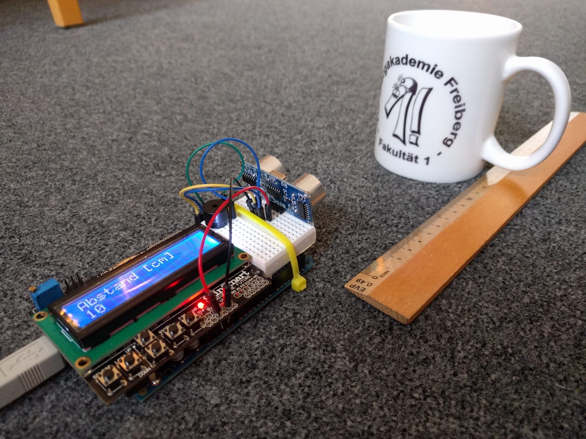

<!--

author:   Sebastian Zug & André Dietrich
email:    zug@ovgu.de   & andre.dietrich@ovgu.de
version:  0.0.1
language: de
narrator: Deutsch Female

script:   https://felixhao28.github.io/JSCPP/dist/JSCPP.es5.min.js

@JSCPP.__eval
<script>
  try {
    var output = "";
    JSCPP.run(`@0`, `@1`, {stdio: {write: s => { output += s }}});
    output;
  } catch (msg) {
    var error = new LiaError(msg, 1);

    try {
        var log = msg.match(/(.*)\nline (\d+) \(column (\d+)\):.*\n.*\n(.*)/);
        var info = log[1] + " " + log[4];

        if (info.length > 80)
          info = info.substring(0,76) + "..."

        error.add_detail(0, info, "error", log[2]-1, log[3]);
    } catch(e) {}

    throw error;
    }
</script>
@end


@JSCPP.eval: @JSCPP.__eval(@input, )

@JSCPP.eval_input: @JSCPP.__eval(@input,`@input(1)`)

@output: <pre class="lia-code-stdout">@0</pre>

-->

# C-Kurs


See the interactive version at
[https://LiaScript.github.io](https://LiaScript.github.io/course/?https://raw.githubusercontent.com/liaScript/CCourse/master/README.md)

Der vorliegende C-Kurs wurde für das Semester 2018/19 an der TU Bergakademie
Freiberg vorbereitet und auf der Basis von LiaScript realisiert. Die
Veranstaltung richtet sich an Nicht-Informatiker aus verschiedenen
ingenieurwissenschaftlichen Disziplinen mit keinen oder geringen
Programmierkenntnissen. Kern der Lösung ist die Möglichkeit Code direkt in der
Webseite auszuführen und auch Änderungen vorzunehmen, die dann in einem
"Versionssystem light" verfügbar sind.

Ausführbarer C Code sieht wie folgt aus, der Titel kann weggelassen werden.

```cpp                     HelloWorld.c
#include <stdio.h>

int main() {
	printf("Hello World\n");
	return 0;
}
```
@JSCPP.eval

Das folgende Beispiel illustriert die Übergabe von Argumenten über die "Commandozeile".

```cpp                     GetChar.c
#include <stdio.h>

int main(){
	char c;
	printf("Mit welchem Buchstaben beginnt ihr Vorname? ");
	c = getchar();
	printf("\nIch weiss jetzt, dass Ihr Vorname mit '%c' beginnt.\n", c);
	return 0;
}
```
``` text                  stdin
T
```
@JSCPP.eval_input

Fehlerausgaben werden entsprechend der Compilerimplementierung wie folgt generiert:

```cpp                     ErroneousHelloWorld.c
#include <stdio.h>

int main() {
	printf("Hello World\n")
	return 0;
}
```
@JSCPP.eval

# Prozedurale Programmierung (WS 2018/19)

**Dozenten**

| Name             | Email                                      |
|:-----------------|:-------------------------------------------|
| Sebastian Zug    | sebastian.zug@informatik.tu-freiberg.de    |
| Georg Jäger      | georg.jaeger@informatik.tu-freiberg.de     |
| Galina Rudolf    | galina.rudolf@informatik.tu-freiberg.de    |
| Jonas Treumer    | jonas.treumer@informatik.tu-freiberg.de    |
| Ben Lorenz       | ben.lorenz@informatik.tu-freiberg.de       |
| Martin Reinhardt | martin.reinhardt@informatik.tu-freiberg.de |
| Tobias Bräuer    | tobias.braeuer@informatik.tu-freiberg.de   |

**Zielstellung der Veranstaltung**

* Grundlegendes Verständnis von (hardwarenaher) Programmierung
* Elementare Fähigkeiten in der Programmiersprache C
* Anwendung von Programmiertools im Entwicklungsprozess
* Systematischer Entwurf von Algorithmen

**Zeitaufwand und Engagement**

Der Zeitaufwand beträgt 180h und setzt sich zusammen aus 60h Präsenzzeit und
120h Selbststudium. Letzteres umfasst die Vor- und Nachbereitung der
Lehrveranstaltungen, die eigenständige Lösung von Übungsaufgaben sowie die
Prüfungsvorbereitung.

# Literaturempfehlungen

**Online Kurse**

* [The GNU C Reference Manual](https://www.gnu.org/software/gnu-c-manual/gnu-c-manual.html)
* Wolf, J., _"C von A bis Z"_, Rheinwerk Verlag
  [Link](http://openbook.rheinwerk-verlag.de/c_von_a_bis_z/000_c_vorwort_001.htm#mj764cb3fd439d3b95d1843e7c7d17f235)
* C Kurs Universität Chemnitz,
  [Link](https://www.tu-chemnitz.de/urz/archiv/kursunterlagen/C/index.htm)

**Videotutorials**

* Vorlesung Prof. Dr. Justus Piater, Universität Insbruck 2014
  [YouTube](https://www.youtube.com/watch?v=7P7dSOKAonM)
* Reihe von Tutorials zu verschiedenen Veranstaltungen der Goethe Universität
  Frankfurt [YouTube](https://www.youtube.com/watch?v=CeEfTlRFEA0&t=210s)

**Bücher**

* Kernighan B.W., Ritchie D.M., _"Programmieren in C"_, Hanser Verlag
* Prinz P., Crawford T., _"C in a Nutshell"_, O'Reilly
* Wolf J., _"Grundkurs C"_, Rheinwerk Computing

# Vorlesungsinhalte

| Datum      | Inhalt                                |
|:-----------|---------------------------------------|
| 23.10.2018 | [1.  Einführung](https://LiaScript.github.io/course/?https://raw.githubusercontent.com/liaScript/CCourse/master/01_Einfuehrung.md)    |
| 30.10.2018 | [2. Variablen und Datentypen, Ein- und Ausgabe](https://liascript.github.io/course/?https://raw.githubusercontent.com/liaScript/CCourse/master/02_Grundlagen.md#1)  |
| 06.11.2018 | [3. Operatoren](https://liascript.github.io/course/?https://raw.githubusercontent.com/liaScript/CCourse/master/03_Operatoren.md#1)              |
| 13.11.2018 | [4. Kontrollstrukturen](https://liascript.github.io/course/?https://raw.githubusercontent.com/liaScript/CCourse/master/04_Kontrollstrukturen.md#1)              |
| 20.11.2018 | [5. Komplexe Datentypen](https://liascript.github.io/course/?https://raw.githubusercontent.com/liaScript/CCourse/master/05_ZusammengesetzteDatentypen.md#1)          |
| 30.11.2018 | [6. Funktionen](https://liascript.github.io/course/?https://raw.githubusercontent.com/liaScript/CCourse/master/06_Funktionen.md#1)          |
| 04.12.2018 |[7. Zeiger](https://liascript.github.io/course/?https://raw.githubusercontent.com/liaScript/CCourse/master/06_Zeiger.md#1)          |
| 11.12.2018 |              |
| 18.12.2018 |              |

# ... und wozu brauche ich das?

**Antwort A:**
Das Studium vermittelt ein Weltbild und keine eng zugeschnitte Sicht.

**Antwort B:**
Die Fähigkeit in Algorithmen zu denken ist eine Grundlage wissenschaftlichen
Arbeitens.

**Antwort C:**
Am Ende steht Ihnen das Rüstzeug zur Verfügung kleine eingebettete C-Projekte
selbst anzugehen.

<!--
style="width: 50%; display: block; margin-left: auto; margin-right: auto;" -->

# "C ist schwierig zu erlernen"

> Viele haben bei uns wegen dem Info-Grundlagenmodul gewechselt. Allerdings
> hängt das auch von dir und deinem Talent ab. Das Tempo ist rasant. Jede Art
> von Vorerfahrung hilft dir eigentlich sehr. Also wenn du noch Zeit hast vorm
> Studienbeginn, schnapp dir ein gutes Buch zur gelehrten Sprache, und fange
> schonmal bissl an kleine Sachen zu programmieren." _(Foreneintrag)_
>
> Ich habe es grade irgendwie selbst gelöst, aber keine Ahnung warum es
> funktioniert hat. _(Foreneintrag)_

Herausforderungen:

* Abstrakte Denkweise
* Penible Beachtung der Syntax
* Ungewohnte Arbeitsmittel

# Wie können Sie zum Gelingen der Veranstaltung beitragen?

* Stellen Sie Fragen, seinen Sie kommunikativ!
* Organisieren Sie sich in Arbeitsgruppen!
* Experimentieren Sie mit verschiedenen Entwicklungsumgebung um "Ihren Editor"
  zu finden
* Machen Sie Verbesserungsvorschläge für die Vorlesungsfolien!

<!-- width="100%" -->

Link auf den GitHub: https://github.com/liaScript/CCourse

# Und wenn Sie dann immer noch programmieren wollen ...

<!--
style="width: 80%; display: block; margin-left: auto; margin-right: auto;" -->

# Autorenliste

Sebastian Zug, Georg Jäger, André Dietrich, Tobias Bräuer
