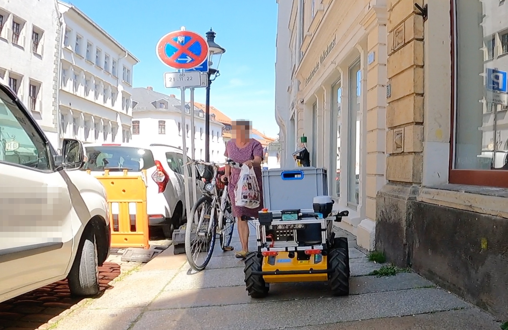

<!-- 

author:   Sebastian Zug & André Dietrich & Galina Rudolf
email:    sebastian.zug@informatik.tu-freiberg.de & andre.dietrich@ovgu.de & Galina.Rudolf@informatik.tu-freiberg.de
version:  1.0.6
language: de
narrator: Deutsch Female

comment: Einführung in die Programmierung für Nicht-Informatiker
logo: ./img/LogoCodeExample.png

import: https://github.com/liascript/CodeRunner
        https://github.com/LiaTemplates/AVR8js/main/README.md#10
        https://raw.githubusercontent.com/liaScript/mermaid_template/master/README.md

@style
@media screen and (min-width: 700px) {
    .left {
        float:left;
        width: 48%;
    }

    .right {
        float: right;
        width: 30%;
        height: 70vh !important;
        padding-left: 1.5rem;
        padding-right: 1.5rem;
    }

}
@end

-->

[](https://liascript.github.io/course/?https://github.com/TUBAF-IfI-LiaScript/VL_EAVD/blob/master/README.md)


# Herzlich willkommen!

-------------------------------------------------------------------------------

> <font size="5"> ___Erhebung, Analyse und Visualisierung digitaler Daten (EAVD)___</font>
>
> (_Prozedurale Programmierung_  / _Einführung in die Informatik_)


-------------------------------------------------------------------------------

<font size="5"> Prof. Dr. Sebastian Zug</font>

TU Bergakademie Freiberg, Wintersemester 2024/25

-------------------------------------------------------------------------------


# Organisatorische Einordnung / Motivation

Das vorliegende Material bedient die bisherigen Veranstaltungen 

+ _Prozedurale Programmierung_ und 
+ _Einführung in die Informatik_

und firmiert diese als neukonzeptionierte übergreifenden Vorlesung _Erhebung, Analyse und Visualisierung digitaler Daten_. 

> Die Veranstaltung richtet sich an Nicht-Informatiker aus verschiedenen ingenieurwissenschaftlichen Disziplinen mit keinen oder geringen Programmierkenntnissen.

## Worum geht es?

<!--style="width: 100%; max-width: 80vh;"-->

### Modulhandbuch 

         {{0-1}}
******************************************

__Qualifikationsziele / Kompetenzen:__

Mit der erfolgreichen Teilnahme an der Veranstaltung sollen die Studierenden:

* verstehen, was Algorithmen sind und wie konkrete wissenschaftliche Aufgaben algorithmisch abgebildet werden können,
* Konzepte der prozeduralen und objektorientiertenProgrammierung in Python und C++ anzuwenden
* in der Lage sein, praktische Herausforderungen der Datenaggregation und Verarbeitung zu identifizieren und Umsetzungen zu realisieren
* Werkzeuge der Programmierung einordnen und nutzen zu können 
* Datenstrukturen und algorithmische Konzepte anwenden zu können und über Wissen ausgewählter Standardalgorithmen verfügen.

******************************************

         {{1-2}}
******************************************

__Lernziele der Vorlesung__

| Einordnung | Studierende ...                                         |
| ---------- | ------------------------------------------------------- |
| Erschaffen | -                                                       |
| Bewerten   | <ul class="lia-list--unordered" style="margin-left: 0"> 
<li> ... können die Unterschiede der behandelten Programmiersprachen mit Bezug auf Ausführungskontex, Performance usw. beurteilen . </li>
<li> ... beurteilen die Qualität eines Codes anhand grundlegender Metriken. </li> 
</ul>          |  
| Analysieren    | <ul class="lia-list--unordered" style="margin-left: 0">
<li> ... können einen einfachen, fremden Code systematisch erschließen. </li>
</ul>          |   
| Anwenden       | <ul class="lia-list--unordered" style="margin-left: 0">
<li> ... realisieren kleiner Beispiele zur Datenerfassung bzw. -analysepipeline. </li> 
<li> ... sind in der Lage eine wissenschaftliche Fragestellung auf eine Datenerfassungs- und Analysepipeline abzubilden. </li>
<li> ... wenden die Basis-Techniken der Codeentwicklung, des Debuggings und der Dokumentation an. </li>
</ul>          |
| Verstehen      | <ul class="lia-list--unordered" style="margin-left: 0">
<li> ... erklären Basiskonzepte objektorientierter Programmierung (Vererbung, Kapselung). </li> 
<li> ... können die Elemente prozeduraler Programmierung (Schleife, Verzweigung, Sprung, Funktion) beschreiben. </li>
</ul>           |
| Erinnern       | <ul class="lia-list--unordered" style="margin-left: 0">
<li> ... kennen die grundlegende Syntaxelemente der behandelten Programmiersprachen. </li> 
<li> ... beschreiben Grundkonzepte der Informatik wie Algorithmus, Sprache, Speicher usw. </li> 
</ul>                     |


******************************************

### Unsere Motivation 

+ __Anwendungssicht__

  _Wir möchten Sie in die Lage versetzen einfache Messaufgaben (mit einem Mikrocontroller) zu entwerfen und die Daten auszuwerten._

+ __Algorithmische Perspektive__

  _Wir möchten Sie dazu ertüchtigen den Algorithmusbegriff der Informatik zu durchdringen und anwenden zu können._

+ __Konzeptionelle Perspektive__

  _Sie erlernen grundlegende Elemente der prozeduralen und der objektorientierten Programmierung._

+ __Umsetzungssicht__

  _Wir vermitteln Grundkenntnisse in den Programmiersprachen C++ und Python._

{{1-3}}
> Wir sind kein "Programmierkurs" sondern vermitteln die Konzepte und Grundlagen der Softwareentwicklung sowohl abstrakt als auch praktisch.

                      {{2-3}}
*****************************************************************************

|                      | Phase 1              | Phase 2                 |
| -------------------- | -------------------- | ----------------------- |
| Programmiersprache   | C++                  | Python                  |
| Framework / Packages | "Messrechner"        | pandas/numpy/matplotlib |
| Ziel                 | Datenerhebung        | Datenauswertung         |
| Plattform            | PC / Mikrocontroller | PC                      |

*****************************************************************************

## Anwendungsszenarien

                             {{0-1}}
********************************************************************************

1. Erstellen einer Hypothese                                                  
2. Entwurf eines Vorgehens für die systematische Untersuchung der Fragestellung 
3. Vorbereitung des Experimentes                                                    
4. Durchführung
5. Analyse UND Bewertung der erlangten Daten                                                    

********************************************************************************

                             {{1-4}}
********************************************************************************

Beispiel 
-------------


> **1. Hypothese:** Am Wochenende scheint die Sonne häufiger als unter der Woche.

> **2. Konzeption eines Experimentes:**  ...

********************************************************************************


                             {{1-2}}
********************************************************************************

> **Frage:** Wie würden Sie vorgehen?

********************************************************************************

                             {{2-4}}
*******************************************************************************

> **3. Vorbereitung/4. Durchführung des Experimentes**

<!-- width="70%" -->

*******************************************************************************

                             {{3-4}}
*******************************************************************************

>  **5.  Analyse UND Bewertung**

Das Diagramm zeigt die Darstellung der Lichtintensität über den Stunden eines Tages für eine Woche. Blau sind die Wochentage markiert, rot der Samstag und der Sonntag.

<!-- width="70%" -->

> **Frage:** Welche Kritik sehen Sie an dieser Methodik?

*******************************************************************************


                             {{4-5}}
*******************************************************************************

Weitere Beispiele:

+ Erfassen und Analysieren Sie das Insektenaufkommen auf dem Campus der TU Freiberg!
+ In welchem Zusammenhang steht der Energieverbrauch der Gebäude der Bergakademie mit der Außentemperatur?
+ An welchen Stellen in Freiberg muss unser Roboter häufiger stoppen, um Passantinnen queren zu lassen?


<!-- width="70%" -->

> **Merke:** Wissenschaftliches Arbeiten ist im Bereich der Natur- und Ingenieurwissenschaften ohne den Rechner (fast) nicht denkbar.

*******************************************************************************


## Keine Angst vor Code!

--{{0}}--
Das Beispiel zeigt ein "Hello World" Beispiel für die C++ Implementierung auf dem Mikrocontroller. Um das einfachste Beispiel darzustellen, lesen wir keinen Sensor ein, sondern lassen eine kleine [LED](https://de.wikipedia.org/wiki/Leuchtdiode) blinken. 

                                     {{0-1}}
*******************************************************************************

**Hello World - Beispiele Phase 1**


```cpp main.cpp
#include <iostream>
using namespace std;

int main (){
	int i = 0;
	int max = 0;

	cout << "How many hellos: ";
	cin >> max;

  for(i=0; i<max; i++)
    cout << "Hello, world " << i << endl;

	return 0;
}
```
@LIA.eval(`["main.cpp"]`, `g++ main.cpp -o a.out`, `./a.out`)


Auf der Basis von C++ lassen sich einfache Mess- und Regelungstechnikaufgaben
sehr einfach automatisieren. Ein Startpunkt dafür ist das Arduino Projekt, dass sowohl eine
entsprechende Hardware, wie auch eine Programmierumgebung bereitstellt.

<div>
<wokwi-led color="red" pin="13" port="B"></wokwi-led>
</div>

```cpp helloWorldinArduino.cpp
void setup() {
  pinMode(LED_BUILTIN, OUTPUT);
}

void loop() {
  digitalWrite(LED_BUILTIN, HIGH);
  delay(1000);
  digitalWrite(LED_BUILTIN, LOW);
  delay(1000);
}
```
@AVR8js.sketch

*******************************************************************************

--{{1}}--
Die Programmiersprache Python offeriert eine Vielzahl von Paketen für unterschiedlichste Zwecke. Wir werden uns auf die Visualisierung und Datenauswertung konzentrieren.

                                     {{1-2}}
*******************************************************************************

**Hello World - Beispiele Phase 2**


```text -data.csv 
A,B,C
0,0.1,3
1,0.3,5
2,0.4,2
```
```python readCSV.py
import pandas as pd
import matplotlib.pyplot as plt

df = pd.read_csv('data.csv', header = 0)  
df.plot.scatter(x='A', y='B')
plt.savefig('temp.png')
```
@LIA.eval(`["data.csv", "main.py"]`, `none`, `python3 main.py`, `*`)

*******************************************************************************

### "Python ist ja nett, aber C++ ist ..."

Foreneinträge aus Veranstaltungen anderer Hochschulen:

> _"Viele haben bei uns wegen dem Info-Grundlagenmodul gewechselt. Allerdings_
> _hängt das auch von dir und deinem Talent ab. Das Tempo ist rasant. Jede Art_
> _von Vorerfahrung hilft dir eigentlich sehr. Also wenn du noch Zeit hast vorm_
> _Studienbeginn, schnapp dir ein gutes Buch zur gelehrten Sprache, und fange_
> _schonmal bissl an kleine Sachen zu programmieren."_ 
>
> _"Ich habe es gerade irgendwie selbst gelöst, aber keine Ahnung warum es_
> _funktioniert hat."_

> **Frage:** Was sind die besonderen Herausforderungen bei der Programmierarbeit?

                                 {{1-2}}
*******************************************************************************

* Abstrakte Denkweise
* Penible Beachtung der Syntax
* Ungewohnte Arbeitsmittel

<div>
<wokwi-led color="red" pin="13" port="B"></wokwi-led>
</div>

```cpp BuggyCode.cpp
void setup() {
  pinMode(LED_BUILTIN, OUTPUT)
}

void loop() {
  digitalWrite(LED_BUILTIN, HIGH);
  delay(1000);
  digitalwrite(LED_BUILTIN, LOW);
  delay(1000.);

```
@AVR8js.sketch

*******************************************************************************

### Wo stehen Sie?

> Wer von Ihnen hat bereits Programmiererfahrung? Was würden Sie auf die Frage antworten, wie viele Codezeilen Sie bereits geschrieben haben?

- [(keine)] Keine einzige Zeile
- [(20 Zeilen)] 20 Zeilen in der Schule
- [(n Zeilen )] n Zeilen in eigenen Programmierprojekten
- [(sehr viele)] sehr viele Zeilen in Open Source Projekten

## Organisatorisches

Wer sind _wir_?

| Name                    | Email                                   | Rolle                                    |
| :---------------------- | :-------------------------------------- | ---------------------------------------- |
| Prof. Dr. Sebastian Zug | sebastian.zug@informatik.tu-freiberg.de | Vorlesungen                              |
| Dr. Galina Rudolf       | galina.rudolf@informatik.tu-freiberg.de | Vorlesungen und Koordination der Übungen |
| Florian Richter         | flo.richter@informatik.tu-freiberg.de   |                                          |
| Robert Lösch            | robert.loesch@informatik.tu-freiberg.de |                                          |
| Adrian Köppen           | adrian.koeppen@student.tu-freiberg.de   | Tutor                                    |

### Strukurierung der Veranstaltung

| Nr. | Datum      |        | Inhalt                                       |
| :-- | ---------- | ------ | -------------------------------------------- |
| 0   | 21.10.2024 |        | Motivation, Organisation                     |
| 1   | 28.10.2024 | C++    | C++ Programmstrukturen / Entwicklungsprozess |
| 2   | 04.10.2024 | C++    | Datentypen / Ein- und Ausgabe                |
| 3   | 11.11.2024 | C++    | Kontrollstrukturen                           |
| 4   | 18.11.2024 | C++    | Zeiger und Arrays                            |
| 5   | 25.11.2024 | C++    | Funktionen                                   |
| 6   | 02.12.2024 | C++    | Objekte                                      |
| 7   | 09.12.2024 | C++    | Vererbung                                    |
| 8   | 16.12.2024 | C++    | Anwendungen                                  |
| 9   | 06.01.2025 | Python | Python Grundlagen                            |
| 10  | 13.01.2025 | Python | Python Grundlagen                            |
| 11  | 15.01.2025 | Python | Objekte                                      |
| 12  | 20.01.2025 | Python | Visualisierung                               |
| 13  | 27.01.2025 | Python | Datenanalyse                                 |
| 14  | 03.02.2025 | Python | Übergreifende Anwendungen                    |

> **Achtung:** C++ wird ohne die spezifische Verwendung des Mikrocontrollers verwendet. Vielmehr erfolgt die Programmierung auf dem Desktoprechner. In freiwilligen Tutorien haben Sie Gelegenheit die Hardware auszuwechseln und mit dem Mikrocontroller zu arbeiten.

### Übungen

Die Übungen vertiefen das erlernte anhand praktischer Programmieraufgaben:

... haben wir hier noch mal ein Beispiel?

> **Frage:** Ist jemand noch nicht für die Übungen eingeschrieben?

> **Empfehlung:** Für die Arbeit am Programmcode empfehlen wir den freien Editor Visual Studio Code. Dieser kann sowohl für die Arbeit mit den C++ als auch Python Programmbeispielen genutzt werden.

### Mikrocontroller Tutorials

Die Tutorials werden im Dezember erstmalig angeboten. Sie dienen interessierten Studierenden der weiteren Vertiefung ihrer Kenntnisse.

> Mikrocontrollerbezogene Inhalte sind nicht Gegenstand der Prüfungen!

### Vorlesungsmaterialien

Die Vorlesungsunterlagen selbst sind unter

https://github.com/SebastianZug/VL_EAVD

verfügbar. Diese können entweder in der Markdown-Syntax oder als interaktives Dokument betrachtet werden.

> Achtung! Es handelt sich um "lebende" Materialien.
>
> + der Inhalt wird sich ggf. anhand Ihrer Verbesserungsvorschläge verändern
> + die Dokumente enthalten eine Vielzahl von ausführbarem Code.


## Erwartungen 

Der Zeitaufwand beträgt 180h und setzt sich zusammen aus 60h Präsenzzeit und
120h Selbststudium. Letzteres umfasst die Vor- und Nachbereitung der
Lehrveranstaltungen, die eigenständige Lösung von Übungsaufgaben sowie die
Prüfungsvorbereitung.

Sie müssen, insbesondere wenn Sie noch keine Programmiererfahrung haben, ggf. deutlich mehr Zeit in den Kurs investieren. Dies macht gemeinsam mehr Spaß als allein!

## Prüfungsinhalte 

Die Prüfung besteht aus einer Klausur und ggf. einer praktischen Arbeit (Einführung in die Informatik).

+ _Entwickeln Sie ein Programm, das ...!_
+ _Beschreiben Sie die Funktionsweise des folgenden Programms ...!_
+ _Welchen Wert gibt das folgende Programm in Zeile x aus?_
+ _Finden Sie alle syntaktischen und logischen Fehler im nachfolgenden Code_
+ _Bewerten Sie folgenden Aussagen: ..._

### Wie können Sie zum Gelingen der Veranstaltung beitragen?

* Stellen Sie Fragen, seinen Sie kommunikativ!

> Hinweis auf OPAL Forum!

* Organisieren Sie sich in Arbeitsgruppen!

> Hinweis auf Repl.it

* Machen Sie Verbesserungsvorschläge für die Vorlesungsfolien!

* Sprechen Sie uns gern wegen "Bastelbedarf" für ein eigenes Projekt an!

* Kommentieren Sie die Vorlesungsunterlagen

> SHRIMP LINK einfügen

## Beispiel der Woche

__Aufgabe:__ Wir Gestenbasiertes Schreibtischlicht realisieren - Auf eine Bewegung der Hand nach links hin soll sich das Licht einschalten und nach einer gewissen Zeit (1s) wieder ausschalten.

Grundlage für die Umsetzung ist ein Microcontroller mit einem [APDS-9960](https://www.sparkfun.com/datasheets/Components/General/APDS-9960.pdf) Sensor. Dieser Sensor kann einfache Gesten erkennen.


{{1-6}}
> Welche "Bausteine" brauchen wir dafür?

{{2-6}}
> Wie müssen diese miteinander verknüpft werden?

{{3-6}}
> Wie kann ich diese Information abstrakt darstellen?

{{4-5}}
``` mermaind @mermaid
flowchart TD
    A(Configure Sensor) --> B(Configure LED Pin)
    B --> C{Meas.\n available?}
    C -->|Yes| D(Read Gesture Sensor)
    C -->|No| C
    D --> E{Left swipe?}
    E -->|Yes| F(Activate LED)
    F --> G(Wait 1s)
    G --> H(Deactivate LED)
    E -->|No| C
    H --> C
```

                                     {{5-6}}
*******************************************************************************

> Wie sieht die C++ Lösung dafür aus?

<div class="left">

```cpp
// Einbinden der Bibliothek für den Sensor
#include <Arduino_APDS9960.h>

// Konfiguration (wird einmalig durchlaufen)
void setup() {
  // Sensor initialisieren
  APDS.begin();
  // LED aktivieren
  pinMode(LED_BUILTIN, OUTPUT); 
}

// Endlosschleife
void loop() {
  // Liegt eine Geste vor?
  if (APDS.gestureAvailable()) {
    // Einlesen der Geste
    int gesture = APDS.readGesture();
    // Haben wir es mit einem Links-Wish zu tuen?
    if (gesture == GESTURE_LEFT)
    {
        // Wenn ja dann Leuchte einmalig für 1s
        digitalWrite(LED_BUILTIN, HIGH);
        delay(1000);
        digitalWrite(LED_BUILTIN, LOW);
    }
  }
}
```

</div>

<!-- class="right" -->
``` mermaind @mermaid
flowchart TD
    A(Configure Sensor) --> B(Configure LED Pin)
    B --> C{Meas.\n available?}
    C -->|Yes| D(Read Gesture Sensor)
    C -->|No| C
    D --> E{Left swipe?}
    E -->|Yes| F(Activate LED)
    F --> G(Wait 1s)
    G --> H(Deactivate LED)
    E -->|No| C
    H --> C
```

*******************************************************************************