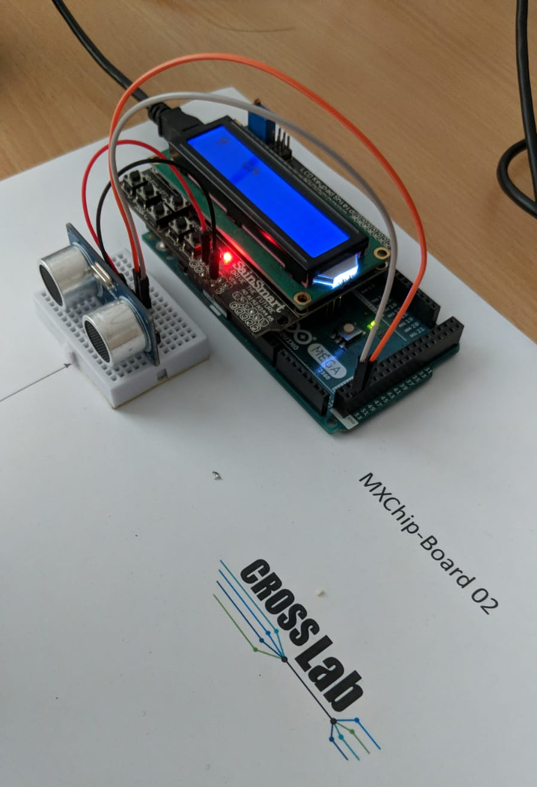

<!-- 

author:   Sebastian Zug & André Dietrich & Galina Rudolf
email:    sebastian.zug@informatik.tu-freiberg.de & andre.dietrich@ovgu.de & Galina.Rudolf@informatik.tu-freiberg.de
version:  1.0.5
language: de
narrator: Deutsch Female

comment: Einführung in die Programmierung für Nicht-Informatiker
logo: ./img/LogoCodeExample.png

import: https://github.com/LiaTemplates/AVR8js/main/README.md#10
        https://raw.githubusercontent.com/liaTemplates/AVR8js/main/README.md

-->

# Inhalt der Übungsbeschreibung 4 - OOP

<!--style="max-height: 60vh;"-->

## Ablauf

Die Studierenden setzen eine Anwendung um, die zwei existierende Klassen für die Verwendung von peripheren Bauteilen - Ultraschallsensor und LCD-Display - um. Im Ergebnis steht eine Applikation die kontinuierlich die Distanz zu einem Hindernis vermisst. Die Daten werden zudem über die Serielle Schnittstelle ausgegeben und analysiert.

> Für die Implementierung haben Sie 14 Tage, bis zum XX.XX.2023 Zeit.

## Vorgehen 

<details>

<summary>**0 - Erarbeitung der physikalische Grundlagen des Sensors**</summary>

Erarbeiten Sie sich die physikalischen Grundlagen des Ultraschallsensors [HC-SR04](https://www.mikrocontroller.net/attachment/218122/HC-SR04_ultraschallmodul_beschreibung_3.pdf)

</details>

<details>

<summary>**1 - Inbetriebnahme des Ultraschallsensors**</summary>

Erschließen Sie die Dokumentation des [NewPing](https://bitbucket.org/teckel12/arduino-new-ping/wiki/Home). Betten Sie den Aufruf des Konstruktors und der Ausgabe der Distanzmessung ein. Das nachfolgende Video unterstützt Sie bei dieser Aufgabe.


!?[Auswertung Ultraschallsensor](https://www.youtube.com/watch?v=chPyOf231zE)

    __Hilfestellung:__ Der Trigger des Sensors ist mit dem Mikrocontroller-Pin 51 verbunden. Das Echo-Signal wird an Pin 53 eingelesen.

    __Hilfestellung:__ Das Hindernis findet sich im Abstand von 9cm.

</details>

<details>

<summary>**2 - Ausgabe über Serielle Schnittstelle**</summary>

Geben Sie das Ergebnis Distanzmessung über die Serielle Schnittstelle aus. Das Format sollte zeilenweise folgendes Format haben `57 102cm` wobei 57 die inkrementierende Zählvariable ist.

</details>

<details>

<summary>**3 - Inbetriebnahme des Displays**</summary>

Arbeiten Sie Dokumentation des LCD [Implementierung](https://www.arduino.cc/reference/en/libraries/liquidcrystal/) durch und ergänzen Sie den [Konstruktor](https://www.arduino.cc/reference/en/libraries/liquidcrystal/liquidcrystal/), sowie die notwendigen Methoden ('lcd.init()' usw.) in Ihrem Code.

!?[Arduino mit 16x2 Anzeige](https://www.youtube.com/watch?v=_C0TewvJ5z0)

    __Hilfestellung__: LCDs können unterschiedlich aufgebaut werden in unserem Fall kombiniert das Anzeigeelement eine zwei mal sechzehn Zeichen Darstellung. 

    __Hilfestellung__: Das LCD ist über eine "4 Bit" oder vier elektrische Leiter mit dem Controller verbunden. Gegenüber dem "8 Bit" Modus reduziert dies die notwendige Zahl der Verbindungen. Dafür müssen alle Daten nacheinander übertragen werden. Im vorliegenden Fall sind die `LiquidCrystal(rs, enable, d4, d5, d6, d7)` 

> Nutzen Sie die Vorübung, um sich mit der Verwendung vertraut zu machen.

</details>

<details>

<summary>**4 - Ausgaben auf dem Display**</summary>

Geben Sie Ihre Ultraschallmessdaten und die Zählvariable auf dem Display aus. Achten Sie dabei darauf, dass die Zahlendarstellung rechtsbündig erfolgt.

</details>

<details>

<summary>**5 - Kommentieren Sie Ihren Code**</summary>

Ergänzen Sie im Kopf der Implementierung eine kurze Beschreibung des Codebeispiels. Beschreiben Sie dabei insbesondere die Anschlüsse der Bauteile.

</details>

<details>

<summary>**6 - Bewertung der Lösung**</summary>

Welche Einschränkung bringt die Lösung mit sich. Wie würden Sie für eine Erweiterung vorgehen?

</details>

## Code-Vorlage für die Lösung

```cpp Vorlage_04.cpp
#include <LiquidCrystal.h>   // Bibliothek für die 16x2 Displays
#include <NewPing.h>         // Bibliothek für Ultraschallsensoren

int count = 0;

// Anlegen des Display Objektes

// Anlegen des Ultraschallobjektes

void setup() 
{ 
  Serial.begin(9600);
  Serial.println("Los geht's");

  // Initalisierung des Displays
}

void loop() 
{ 
  int distance = 0;

  // Einlesen des Sensorwertes
  // distance = ...

  // Ausgeben des Sensorwertes und des Zählers über die Serielle Schnittstelle "1023 - 234 cm"
  Serial.print(distance);

  // Ausgeben des Sensorwertes und des Zählers auf dem Display 

}
```

## Vorübung

Erweitern Sie das Beispiel um die inkrementierende Counter-Variable. Dessen Stand soll sich pro Sekunde um 1 erhöhen. 

<wokwi-lcd1602></wokwi-lcd1602>

```cpp  Vorlage.cpp
#include <LiquidCrystal_I2C.h>

#define I2C_ADDR    0x27
#define LCD_COLUMNS 20
#define LCD_LINES   4

// Hier wird eine I2C Implementierung
LiquidCrystal_I2C lcd(I2C_ADDR, LCD_COLUMNS, LCD_LINES);

void setup() {
  // Init
  lcd.init();
  lcd.backlight();

  // Print something
  lcd.setCursor(0, 0);
  lcd.print("Hello, world!");
  lcd.setCursor(0, 1);
  lcd.print("0...");
}

void loop() {
}
```
@AVR8js.sketch


## Lernziele

| Einordnung und Klassifikation | Studierende ...                                                                                                                                                                                                                                            |
| -------------- | ------------------------------------------------------------------------------------------------------------------------------------------------------------------------------------------------------------------------------------------------ |
| Erinnern       | <ul class="lia-list--unordered" style="margin-left: 0">
<li> ... nutzen die Beispiele aus der Vorlesung, um die grundlegenden Muster der Mikrocontroller-Programmierung umzusetzen.</li> 
<li> ... reproduzieren die Anwendung der seriellen Schnittstelle aus dem Arduino Framework. </li> 
</ul>                     |
| Verstehen      | <ul class="lia-list--unordered" style="margin-left: 0">
<li> ... bilden die Aufgabe - Ausgabe von Daten auf einem Display - auf einen Algorithmus ab.  </li>
<li> ... das Vorgehensmodell bei der Verknüpfung von periphären Geräten mit dem Controller. </li>
</ul>           |
| Anwenden       | <ul class="lia-list--unordered" style="margin-left: 0">
<li> ... wenden die Basis-Techniken der Codeentwicklung, des Debuggings und der Dokumentation an. </li>
<li> ... trainieren den Umgang mit der Dokumentation fremder Implementierungen. </li> 
</ul>          |
| Analysieren    | <ul class="lia-list--unordered" style="margin-left: 0">
<li> ... durchdringen der Aufbau der existierenden Klassen für die Verwendung der Geräte. </li>
<li> ... analysieren den eigenen Code bei der Fehlersuche und systematisieren die Methodik dabei. </li>
</ul>          |                                                                                                                        
| Bewerten       | <ul class="lia-list--unordered" style="margin-left: 0">
<li> ... charakterisieren die Beschränkungen des Setups in Bezug auf die Auflösung des Ergebnisses und das Rausschverhalten. </li>
</ul>          |    
| Erschaffen     |   -                                                                                                                                                                                                                                               |

## Kontrollmöglichkeiten

- [ ] Der Code kompiliert fehler- und hinweisfrei.
- [ ] Der Distanzwert von 9 cm wird kontinuierlich angezeigt.
- [ ] Das Display gibt den Wert wieder ohne "Flackern" wieder.
- [ ] In der Console werden die Werte der Distanzen ausgegeben.
- [ ] Der Code umfasst eine grundlegende Dokumentation, die das Setup und die Funktionalität erläutert.

## Lösung

```cpp 
#include <LiquidCrystal.h>
#include <NewPing.h>

const int triggerPin = 51;   
const int echoPin = 53;     
const int maxDistance = 400;
const int ledPin =  13;

NewPing sonar(triggerPin, echoPin, maxDistance);

LiquidCrystal lcd(8, 9, 4, 5, 6, 7); 

void setup() 
{ 
  lcd.begin(16, 2);
}

void loop() 
{ 
  lcd.clear();
  lcd.setCursor(0, 0);
  lcd.print(sonar.ping_cm());
  lcd.setCursor(4, 0);
  lcd.print("cm");
  delay(200);
}
```